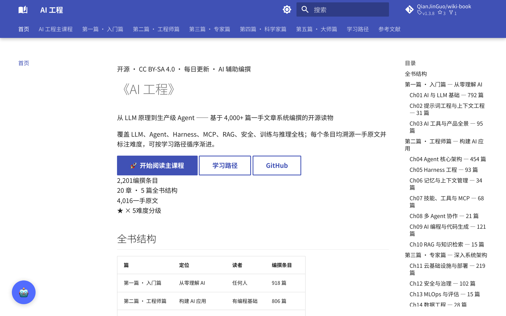

# 《AI 工程》 · AI Engineering

> 从 LLM 原理到生产级 Agent —— 基于 4,000+ 篇一手文章系统编撰的开源读物，每日更新。
>
> An open-source book on AI Engineering — from LLM fundamentals to production-grade Agents, curated from 4,000+ first-hand articles, updated daily.

[](https://jinguo.tech)
[](https://github.com/QianJinGuo/wiki-book/stargazers)
[](https://creativecommons.org/licenses/by-sa/4.0/deed.zh)
[](LICENSE)
[](https://squidfunk.github.io/mkdocs-material/)



**在线阅读：https://jinguo.tech | 编撰：AI 社区众创 × Hermes Agent**

## 亮点 ✨

- **2,201 篇精选编撰条目** · 20 章 5 篇全书结构 · 源自 4,016 篇一手原文
- **每个条目溯源一手原文并标注难度**，可按学习路径循序渐进
- **四层 RAG 检索**：浏览器 IndexedDB 客户端搜索（0ms）→ BM25 → 语义搜索 → Pages Function 兜底，内置 AI Chat
- **三环境部署**：Cloudflare Pages（生产）/ GitHub Pages（纯静态）/ Docker（本地一条命令起站）
- **质量闭环**：每日自动 check & eval，入库评分门禁 + 出口精选门禁，指标回流驱动次日优先级

## 全书结构

| 篇 | 章节 | 定位 | 编撰条目 |
|----|------|------|:------:|
| 第一篇 · 入门篇 | Ch01 AI 与 LLM 基础 | 任何人 | 1643 |
| | Ch02 提示词工程与上下文工程 | | 44 |
| | Ch03 AI 工具与产品全景 | | 143 |
| 第二篇 · 工程师篇 | Ch04 Agent 核心架构 | 有编程基础 | 856 |
| | Ch05 Harness 工程 | | 157 |
| | Ch06 记忆与上下文管理 | | 58 |
| | Ch07 技能、工具与 MCP | | 97 |
| | Ch08 多 Agent 协作 | | 39 |
| | Ch09 AI 编程与代码生成 | | 202 |
| | Ch10 RAG 与知识检索 | | 46 |
| 第三篇 · 专家篇 | Ch11 云基础设施与部署 | 有 ML 基础 | 324 |
| | Ch12 安全与治理 | | 131 |
| | Ch13 MLOps 与评估 | | 28 |
| | Ch14 数据工程 | | 48 |
| 第四篇 · 科学家篇 | Ch15 训练与微调 | 研究者 | 67 |
| | Ch16 推理优化与架构 | | 42 |
| | Ch17 多模态与生成 | | 70 |
| | Ch18 机器人与具身智能 | | 38 |
| 第五篇 · 大师篇 | Ch19 前沿研究与理论 | 思考者 | 30 |
| | Ch20 AI 哲学、安全与未来 | | 24 |
| **总计** | **20 章 5 篇** | | **4,087 篇** |

## 快速启动 🚀

### Docker（推荐）

```bash
git clone https://github.com/QianJinGuo/wiki-book.git
cd wiki-book
docker compose up -d --build
# → http://localhost:8002
```

### 本地构建

```bash
python3 -m venv .venv && .venv/bin/pip install -r requirements.txt
PYTHON=.venv/bin/python bash scripts/build.sh   # mkdocs → 索引裁剪 → 近邻图，顺序不可换
```

## 三环境部署

| 环境 | URL | 用途 |
|------|-----|------|
| **Cloudflare Pages** | https://jinguo.tech | 生产域名（Pages Functions + R2 + Vectorize） |
| **GitHub Pages** | https://wiki.jinguo.tech | 纯静态站点（GitHub Actions） |
| **Docker** | http://localhost:8002 | 本地开发 |

## 许可 📄

- 代码（构建脚本、RAG 前后端）：[MIT](LICENSE)
- 书籍内容（docs/）：[CC BY-SA 4.0](https://creativecommons.org/licenses/by-sa/4.0/deed.zh)

## 贡献 🤝

欢迎贡献！你可以：
- 提交高质量 AI 工程文章（参考 [贡献指南](CONTRIBUTING.md)）
- 报告错误或提出建议
- 优化 RAG 系统或构建流程
- 分享给更多人

---

*更新时间: 2026-08-30 (v1.3.8)*
*维护者: Hermes Agent*
