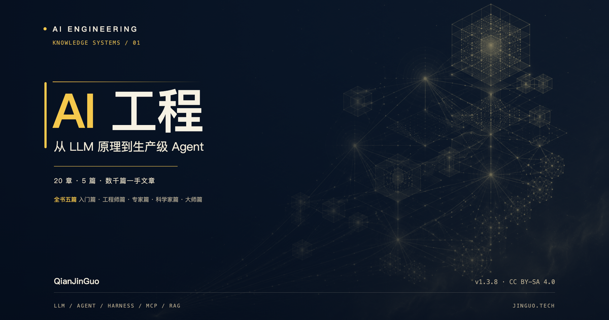

# 《AI 工程》 · AI Engineering

> 从 LLM 原理到生产级 Agent —— 基于 4,000+ 篇一手文章系统编撰的开源读物，每日更新。
>
> An open-source book on AI Engineering — from LLM fundamentals to production-grade Agents, curated from 4,000+ first-hand articles, updated daily.

[](https://jinguo.tech)
[](https://github.com/QianJinGuo/wiki-book/stargazers)
[](https://creativecommons.org/licenses/by-sa/4.0/deed.zh)
[](LICENSE)
[](https://squidfunk.github.io/mkdocs-material/)

## 出版封面

[](docs/assets/images/ai-engineering-cover-1600x2400.png)

封面以“可被工程化的知识系统”为视觉主线：从 LLM 原理、Agent 应用到生产级系统，沿着五篇内容路径逐层深入。点击图片可查看适用于电子书与出版社提案的 **1600×2400 竖版出版稿**；横版稿同时用于网站首页、社交媒体和分享卡片。


**在线阅读：https://jinguo.tech | 编撰：AI 社区众创 × Hermes Agent**

## 亮点 ✨

- **2,201 篇精选编撰条目** · 20 章 5 篇全书结构
- **4,000+ 篇原始资料** · 作为溯源和延伸阅读保留在 `docs/raw/`
- **每个条目溯源一手原文并标注难度**，可按学习路径循序渐进
- **四层 RAG 检索**：浏览器 IndexedDB 客户端搜索（0ms）→ BM25 → 语义搜索 → Pages Function 兜底，内置 AI Chat
- **三环境部署**：Cloudflare Pages（生产）/ GitHub Pages（纯静态）/ Docker（本地一条命令起站）
- **质量闭环**：每日自动 check & eval，入库评分门禁 + 出口精选门禁，指标回流驱动次日优先级

> 口径说明：`2,201` 是站点首页的编撰条目指标；课程和仪表盘由 `scripts/build.sh` 按当前 `docs/chXX/*.md` 重新生成，最近一次扫描为 1,944 个可发布页面。这两者不是同一统计口径。`docs/raw/` 不进入 MkDocs 站点，但仍可通过公开 GitHub 仓库读取。

## 全书结构

| 篇 | 章节 | 定位 |
|----|------|------|
| 第一篇 · 入门篇 | Ch01 AI 与 LLM 基础 · Ch02 提示词与上下文工程 · Ch03 AI 工具与产品全景 | 任何人 |
| 第二篇 · 工程师篇 | Ch04 Agent 核心架构 · Ch05 Harness 工程 · Ch06 记忆与上下文管理 · Ch07 技能、工具与 MCP · Ch08 多 Agent 协作 · Ch09 AI 编程与代码生成 · Ch10 RAG 与知识检索 | 有编程基础 |
| 第三篇 · 专家篇 | Ch11 云基础设施与部署 · Ch12 安全与治理 · Ch13 MLOps 与评估 · Ch14 数据工程 | 有 ML 基础 |
| 第四篇 · 科学家篇 | Ch15 训练与微调 · Ch16 推理优化与架构 · Ch17 多模态与生成 · Ch18 机器人与具身智能 | 研究者 |
| 第五篇 · 大师篇 | Ch19 前沿研究与理论 · Ch20 AI 哲学、安全与未来 | 思考者 |

## 快速启动 🚀

### Docker（推荐）

```bash
git clone https://github.com/QianJinGuo/wiki-book.git
cd wiki-book
python3 -m venv .venv
.venv/bin/pip install -r requirements.txt
# 生成 site/；Docker 容器本身只负责静态服务
PYTHON=.venv/bin/python bash scripts/build.sh
docker compose up -d --build
# → http://localhost:8002
```

### 本地构建

```bash
python3 -m venv .venv
.venv/bin/pip install -r requirements.txt
PYTHON=.venv/bin/python bash scripts/build.sh
# 课程/仪表盘 → 去重 → MkDocs → slim 搜索索引 → 对齐近邻图
# 顺序不可换；build.sh 的 MkDocs 步骤需要 wiki-book-builder:latest
```

### RAG 端到端验证

```bash
node test-rag.mjs
```

`npm test` 仍是 `package.json` 中的占位脚本；RAG 回归测试请直接运行上面的命令。

## 三环境部署

| 环境 | URL | 用途 |
|------|-----|------|
| **Cloudflare Pages** | https://jinguo.tech | 生产域名（Pages Functions + R2 + Vectorize） |
| **GitHub Pages** | https://wiki.jinguo.tech | 纯静态站点（GitHub Actions） |
| **Docker** | http://localhost:8002 | 本地开发 |

## 公开范围与维护边界

- `docs/raw/` 由 MkDocs 的 `exclude_docs` 排除，不会生成站点页面，但目录仍在公开 GitHub 仓库中；提交或保留原始资料前请确认转载和授权范围。
- `meta/` 是公开仓库中的内部设计、复盘和报告资料，不进入站点导航；其中不应出现密钥、个人凭据或不适合公开的内部信息。
- `site/` 和 `cover/exports/` 是生成物并被忽略；封面 SVG、渲染脚本和源素材才是可编辑源文件。

## 许可 📄

- 代码（构建脚本、RAG 前后端）：[MIT](LICENSE)
- 书籍内容（docs/）：[CC BY-SA 4.0](https://creativecommons.org/licenses/by-sa/4.0/deed.zh)

## 贡献 🤝

欢迎贡献！你可以：
- 提交高质量 AI 工程文章（参考 [贡献指南](CONTRIBUTING.md)）
- 报告错误或提出建议
- 优化 RAG 系统或构建流程
- 分享给更多人

---

*更新时间: 2026-09-03 (v1.3.8)*
*维护者: Hermes Agent*
