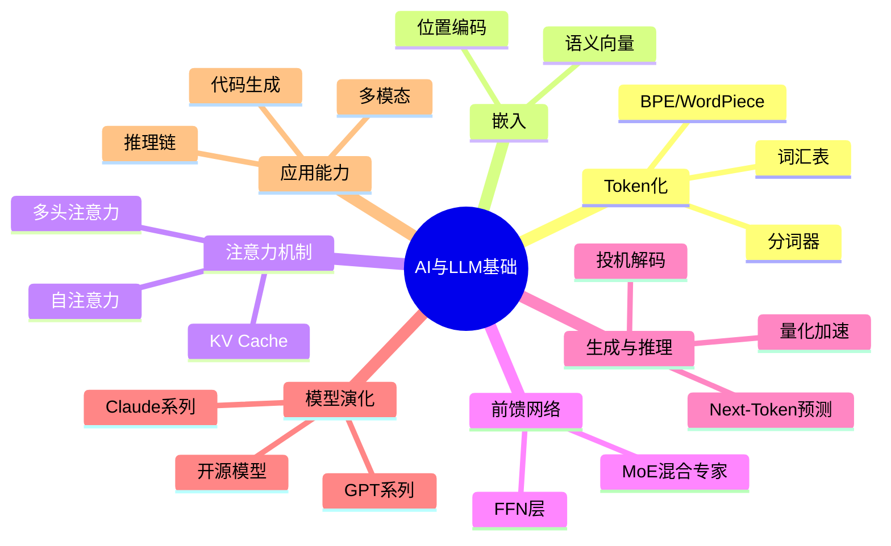
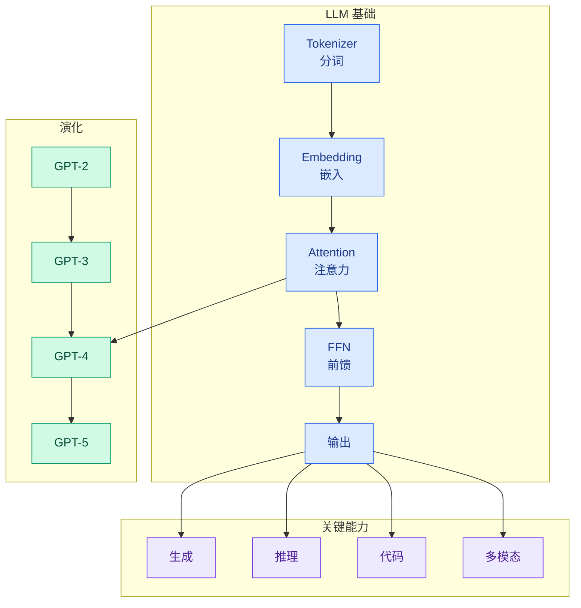

# Ch01 AI 与 LLM 基础

> 理解大语言模型的内部机制：从 Token 到 Transformer，从预训练到推理

> 本章收录 **1362 篇**实体，按深度递增排列。

---

## 概念全景

## 本章导航

| Level | 含义 | 篇数 |
|-------|------|------|
| ⭐ 入门 | 零基础可读 | 187 |
| ⭐⭐ 工程师 | 需编程基础 | 1026 |
| ⭐⭐⭐ 专家 | 需ML基础 | 112 |
| ⭐⭐⭐⭐ 科学家 | 需研究背景 | 20 |
| ⭐⭐⭐⭐⭐ 大师 | 前沿/哲学 | 17 |

---

## 导读

你每天都在用 ChatGPT、Claude、Gemini，但你知道它内部发生了什么吗？

本章从最基础的概念开始：文字如何变成数字（Tokenization），数字如何获得语义（Embedding），模型如何理解上下文（Attention），以及它为什么能生成看似"智能"的回答（Next-Token Prediction）。

你不需要懂数学，但读完本章后，你应该能回答一个关键问题：当模型给出糟糕的回答时，是"齿轮坏了"还是"你喂错了原料"？

本章还涵盖训练动力学（模型在预训练中并非稳定进化，而是频繁跳跃）、推理优化（投机解码让吞吐提升 4 倍）、以及混合架构（Transformer 不是唯一的答案）。

这是全书的地基——后面讲 Agent、Harness、RAG 时，你会反复回到这里。

---

---

## 本章内容

- [001. 2026年最值得关注的15款开发者工具深度解读](ch01/001-2026-15)
- [002. 🧠 The Token Economy pt2: The Intelligence Company Gets Built](ch01/002-the-token-economy-pt2-the-intelligence-company-gets-built)
- [003. The Google Capital Company](ch01/003-the-google-capital-company)
- [004. 2028: Two scenarios for global AI leadership](ch01/004-2028-two-scenarios-for-global-ai-leadership)
- [005. Backpressure is all you need](ch01/005-backpressure-is-all-you-need)
- [006. Karpathy's Autoresearch found a 3-year-old bug in our query engine (and improved performance by 11%) - PostHog](ch01/006-karpathy-s-autoresearch-found-a-3-year-old-bug-in-our-query)
- [007. 快手首个打工人Agent](ch01/007-agent)
- [008. 这个五一节我做了个总结，在 2 年多的创业里，我一共做了 25 个 AI 项目](ch01/008-2-25-ai)
- [009. Agentic Design System - From Chatbot to Orchestration](ch01/009-agentic-design-system-from-chatbot-to-orchestration)
- [010. 20VC x SaaStr: The Most Aggressive Quarter in American Capitalism, Palantir's Ru](ch01/010-20vc-x-saastr-the-most-aggressive-quarter-in-american-capit)
- [011. OpenSquilla launches open-source AI agent to cut token costs](ch01/011-opensquilla-launches-open-source-ai-agent-to-cut-token-costs)
- [012. 场景营销前端 AI Coding — AI Native 的视觉稿还原](ch01/012-ai-coding-ai-native)
- [013. CVPR 2026 Highlight｜让AI像电影人一样「看」视频，8B小模型反超GPT-5与Gemini-3.1-Pro](ch01/013-cvpr-2026-highlight-ai-8b-gpt-5-gemini-3-1-pro)
- [014. WWW时间检验奖颁给唐建博士：图神经网络的十年远征与AI制药的底层逻辑](ch01/014-www-ai)
- [015. Why Ctrl+V won't paste images in Claude Code on WSL, with a fix](ch01/015-why-ctrl-v-won-t-paste-images-in-claude-code-on-wsl-with-a)
- [016. NotebookLM：Google AI 笔记本工具](ch01/016-notebooklm-google-ai)
- [017. Anthropic 联创：2028 年实现 AI 自我构建的概率超过 60%](ch01/017-anthropic-2028-ai-60)
- [018. Nvidia's Jensen Huang bets on this British startup to build 'next frontier' of AI](ch01/018-nvidia-s-jensen-huang-bets-on-this-british-startup-to-build)
- [019. The Future of BMW](ch01/019-the-future-of-bmw)
- [020. 第一批「AI原生」本科生，要毕业了](ch01/020-ai)
- [021. Freelance Designers Can't Compete With a $20/Month AI Subscription - Here's What Actually Works Now](ch01/021-freelance-designers-can-t-compete-with-a-20-month-ai-subscr)
- [022. Anthropic创始人行动手册 — 花叔x Claude Code译本](ch01/022-anthropic-x-claude-code)
- [023. Claude's next enterprise battle is not models: it's the agent control plane](ch01/023-claude-s-next-enterprise-battle-is-not-models-it-s-the-agen)
- [024. 谷歌风雨飘摇，市值蒸发数千亿美元！Gemini Spark能救场吗？](ch01/024-gemini-spark)
- [025. Toto 2.0: Time series forecasting enters the scaling era](ch01/025-toto-2-0-time-series-forecasting-enters-the-scaling-era)
- [026. Introducing TabFM: A zero-shot foundation model for tabular data](ch01/026-introducing-tabfm-a-zero-shot-foundation-model-for-tabular)
- [027. Introducing Claude for Small Business](ch01/027-introducing-claude-for-small-business)
- [028. Banning Open Source AI Would Be A Mistake — Interconnects 开源 AI 政策评论](ch01/028-banning-open-source-ai-would-be-a-mistake-interconnects)
- [029. Introducing Claude for Small Business](ch01/029-introducing-claude-for-small-business)
- [030. Robostral Navigate: single-camera AI navigation | Mistral AI](ch01/030-robostral-navigate-single-camera-ai-navigation-mistral-ai)
- [031. From Doer To Director: The AI Mindset Shift](ch01/031-from-doer-to-director-the-ai-mindset-shift)
- [032. Unexpected lessons from an AI-assisted prototyping experiment](ch01/032-unexpected-lessons-from-an-ai-assisted-prototyping-experimen)
- [033. How we made WINDOW JOIN parallel and vectorized](ch01/033-how-we-made-window-join-parallel-and-vectorized)
- [034. Domain Expertise Has Always Been the Real Moat](ch01/034-domain-expertise-has-always-been-the-real-moat)
- [035. Cisco Preps For A World Of AI Agent Coworkers, Frontier Model Threats](ch01/035-cisco-preps-for-a-world-of-ai-agent-coworkers-frontier-mode)
- [036. Microsoft is quietly shopping for an OpenAI replacement](ch01/036-microsoft-is-quietly-shopping-for-an-openai-replacement)
- [037. How to Land a Frontier Lab Job：如何拿到一份前沿实验室的工作](ch01/037-how-to-land-a-frontier-lab-job)
- [038. CyberSecQwen-4B: Why Defensive Cyber Needs Small, Specialized, Locally-Runnable Models](ch01/038-cybersecqwen-4b-why-defensive-cyber-needs-small-specialize)
- [039. RAG vs LLM Wiki 深度对比：企业知识库架构选型指南](ch01/039-rag-vs-llm-wiki)
- [040. Akamai acquires Israeli AI browser security startup LayerX for $205 million in cash](ch01/040-akamai-acquires-israeli-ai-browser-security-startup-layerx-f)
- [041. Linux Foundation and Industry Leaders Launch Akrites to Defend Critical Open Source Software Against AI-Enabled Cyber Threats](ch01/041-linux-foundation-and-industry-leaders-launch-akrites-to-defe)
- [042. AI-driven layoffs aren't making business sense](ch01/042-ai-driven-layoffs-aren-t-making-business-sense)
- [043. How we keep GPUs reliable across Databricks AI](ch01/043-how-we-keep-gpus-reliable-across-databricks-ai)
- [044. Gemma 4 Technical Report](ch01/044-gemma-4-technical-report)
- [045. Building Jaeger’s ClickHouse backend: 8.6× compression on 10 million spans](ch01/045-building-jaeger-s-clickhouse-backend-8-6-compression-on-10)
- [046. Getting more from each token: How Copilot improves context handling and model routing](ch01/046-getting-more-from-each-token-how-copilot-improves-context-h)
- [047. Gemini AI (Google)](ch01/047-gemini-ai-google)
- [048. Engineering roles shift from developing code to managing AI](ch01/048-engineering-roles-shift-from-developing-code-to-managing-ai)
- [049. Recent Developments in LLM Architectures: KV Sharing, mHC, a](ch01/049-recent-developments-in-llm-architectures-kv-sharing-mhc-a)
- [050. 浙江大学经济学院百人计划研究员、博士生导师评价《2026 中国电商AI 应用白皮书》：AI 从技术可得走向经营能力平权](ch01/050-2026-ai-ai)
- [051. Grafana 13.1 release: observability as code updates, extending Grafana Assistant across more data sources, and more](ch01/051-grafana-13-1-release-observability-as-code-updates-extendi)
- [052. Build the Agent or Power the Agent?](ch01/052-build-the-agent-or-power-the-agent)
- [053. You Must Fix Your Asserts](ch01/053-you-must-fix-your-asserts)
- [054. AI GPUs probably live longer than three years](ch01/054-ai-gpus-probably-live-longer-than-three-years)
- [055. Running an AI-native engineering org](ch01/055-running-an-ai-native-engineering-org)
- [056. Marc Andreessen on Builder Culture in the Age of AI | The a16z Show](ch01/056-marc-andreessen-on-builder-culture-in-the-age-of-ai-the-a1)
- [057. AEO and GEO for AI Overviews, ChatGPT, Claude, Gemini, and Perplexity](ch01/057-aeo-and-geo-for-ai-overviews-chatgpt-claude-gemini-and-p)
- [058. GPT-5.6一发布，Claude终于舍得重置Fable 5额度了](ch01/058-gpt-5-6-claude-fable-5)
- [059. WorkOS Pipes: Third-party integrations without the headache](ch01/059-workos-pipes-third-party-integrations-without-the-headache)
- [060. Every Team is Building the Same Cache — TierFS](ch01/060-every-team-is-building-the-same-cache-tierfs)
- [061. Viktor | Not a tool. A hire.](ch01/061-viktor-not-a-tool-a-hire)
- [062. 硅谷的尽头是编制：OpenAI要给白宫送5%的股权](ch01/062-openai-5)
- [063. ChatGPT官宣26位未来之星](ch01/063-chatgpt-26)
- [064. Scaling Laws, Carefully](ch01/064-scaling-laws-carefully)
- [065. Why Drizzle ORM couldn't publish new releases on NPM for a month | vlt /vōlt/](ch01/065-why-drizzle-orm-couldn-t-publish-new-releases-on-npm-for-a-m)
- [066. Amazon Turns Alexa Into Its Next Storefront](ch01/066-amazon-turns-alexa-into-its-next-storefront)
- [067. Back up and restore your Amazon EKS cluster resources using Velero | Amazon Web Services](ch01/067-back-up-and-restore-your-amazon-eks-cluster-resources-using)
- [068. How To Measure Development Productivity?](ch01/068-how-to-measure-development-productivity)
- [069. Igor Babuschkin Seeks Up To $1 Billion For River AI](ch01/069-igor-babuschkin-seeks-up-to-1-billion-for-river-ai)
- [070. Bringing more agent harnesses and frameworks to Cloudflare, starting with Flue](ch01/070-bringing-more-agent-harnesses-and-frameworks-to-cloudflare)
- [071. Repricing of Software Engineering Labor](ch01/071-repricing-of-software-engineering-labor)
- [072. The annotated PyTorch training loop](ch01/072-the-annotated-pytorch-training-loop)
- [073. How AI changes software P&L](ch01/073-how-ai-changes-software-p-l)
- [074. Coinbase Becomes Hyperliquid’s Official USDC Treasury Deployer as USDH Sunsets](ch01/074-coinbase-becomes-hyperliquid-s-official-usdc-treasury-deploy)
- [075. 快手首个打工人Agent来了！工作秒变桌面软件：零代码、不烧token](ch01/075-agent-token)
- [076. How to Write an Effective Software Design Document](ch01/076-how-to-write-an-effective-software-design-document)
- [077. Building Modelplane on Crossplane](ch01/077-building-modelplane-on-crossplane)
- [078. AI and Liability](ch01/078-ai-and-liability)
- [079. Klarna delivers strong start to 2026 with $1bn revenue and $68m adj. operating profit | Klarna International](ch01/079-klarna-delivers-strong-start-to-2026-with-1bn-revenue-and)
- [080. How Superset built the IDE for AI agents on Vercel](ch01/080-how-superset-built-the-ide-for-ai-agents-on-vercel)
- [081. What happens in the log when an app crashes as it starts up?](ch01/081-what-happens-in-the-log-when-an-app-crashes-as-it-starts-up)
- [082. 百度智能云新一代AI机密计算实例：从CPU到GPU全链路可信](ch01/082-ai-cpu-gpu)
- [083. AI-powered honeypots: Turning the tables on malicious AI agents](ch01/083-ai-powered-honeypots-turning-the-tables-on-malicious-ai-age)
- [084. Gemini 3.5: frontier intelligence with action](ch01/084-gemini-3-5-frontier-intelligence-with-action)
- [085. Be more expressive to close more sales](ch01/085-be-more-expressive-to-close-more-sales)
- [086. Malware crew TeamPCP open-sources its Shai-Hulud worm on GitHub](ch01/086-malware-crew-teampcp-open-sources-its-shai-hulud-worm-on-git)
- [087. 我给Hermes配了4个Agent，真正有用的是这些事](ch01/087-hermes-4-agent)
- [088. Google 与 Amnesty International 合作加大间谍软件检测难度](ch01/088-google-amnesty-international)
- [089. AI Gateway production index](ch01/089-ai-gateway-production-index)
- [090. PyTorch 2.12 Release Blog – PyTorch](ch01/090-pytorch-2-12-release-blog-pytorch)
- [091. Meta’s AI Storage Blueprint at Scale](ch01/091-meta-s-ai-storage-blueprint-at-scale)
- [092. Vietnam to develop domestic cloud so it can ditch risky overseas operators for government workloads](ch01/092-vietnam-to-develop-domestic-cloud-so-it-can-ditch-risky-over)
- [093. Anthropic 联创：2028 年实现 AI 自我构建的概率超过 60%](ch01/093-anthropic-2028-ai-60)
- [094. Anthropic puts Claude agents on a meter across its subscriptions](ch01/094-anthropic-puts-claude-agents-on-a-meter-across-its-subscript)
- [095. Google Debuts Gemini-Focused Updates at I/O 2026](ch01/095-google-debuts-gemini-focused-updates-at-i-o-2026)
- [096. Lighthouse Attention](ch01/096-lighthouse-attention)
- [097. Intelligence Per Dollar](ch01/097-intelligence-per-dollar)
- [098. Code Simulation for Enterprise Engineering | PlayerZero](ch01/098-code-simulation-for-enterprise-engineering-playerzero)
- [099. LLM-as-a-Verifier: A General-Purpose Verification Framework](ch01/099-llm-as-a-verifier-a-general-purpose-verification-framework)
- [100. 强化学习如何不用奖励模型提高通用问题推理能力](ch01/100-page-100)
- [101. 特斯拉百万年薪招数据标注员，朝九晚五，无需AI经验](ch01/101-ai)
- [102. Tenorshare AI Diagrimo​ - Free AI Diagram Generator Online](ch01/102-tenorshare-ai-diagrimo-free-ai-diagram-generator-online)
- [103. 当AI让答案唾手可得，学而思想把学习过程找回来](ch01/103-ai)
- [104. Apple Silicon costs more than OpenRouter](ch01/104-apple-silicon-costs-more-than-openrouter)
- [105. White House cyber official: identity security matters more](ch01/105-white-house-cyber-official-identity-security-matters-more)
- [106. How I Moved My Digital Stack to Europe](ch01/106-how-i-moved-my-digital-stack-to-europe)
- [107. OpenAI Realtime API 架构首次公开](ch01/107-openai-realtime-api)
- [108. R1复现：拒绝采样微调加速RL收敛及模型遗忘问题探究](ch01/108-r1-rl)
- [109. Thrive Capital Bets $100 Million on Shopify's AI Future](ch01/109-thrive-capital-bets-100-million-on-shopify-s-ai-future)
- [110. Announcing Claude Managed Agents on Cloudflare](ch01/110-announcing-claude-managed-agents-on-cloudflare)
- [111. Block leans into its AI future | Payments Dive](ch01/111-block-leans-into-its-ai-future-payments-dive)
- [112. PyTorch 2.12 Release Blog – PyTorch](ch01/112-pytorch-2-12-release-blog-pytorch)
- [113. We Tested DeepSeek V4 Pro and Flash Against Claude Opus 4.7](ch01/113-we-tested-deepseek-v4-pro-and-flash-against-claude-opus-4-7)
- [114. NGINX Rift: Achieving NGINX Remote Code Execution via an 18-Year-Old Vulnerability](ch01/114-nginx-rift-achieving-nginx-remote-code-execution-via-an-18)
- [115. Building is just the beginning: Introducing Discoverability](ch01/115-building-is-just-the-beginning-introducing-discoverability)
- [116. 5 Things to Know about the CLARITY Act](ch01/116-5-things-to-know-about-the-clarity-act)
- [117. 腾讯混元Hy3-preview发布](ch01/117-hy3-preview)
- [118. Qoder 1.0正式发布！从AI IDE迈向智能体自主开发工作台](ch01/118-qoder-1-0-ai-ide)
- [119. Agent orchestration](ch01/119-agent-orchestration)
- [120. Grafana GitHub Token Breach Led to Codebase Download and Ext](ch01/120-grafana-github-token-breach-led-to-codebase-download-and-ext)
- [121. Gemini 3.5 Flash: more expensive, but Google plan to use it for everything](ch01/121-gemini-3-5-flash-more-expensive-but-google-plan-to-use-it)
- [122. Useful Memories Become Faulty When Continuously Updated by LLMs](ch01/122-useful-memories-become-faulty-when-continuously-updated-by-l)
- [123. The Unbearable Cheapness of Open Weight Models – James O'Claire](ch01/123-the-unbearable-cheapness-of-open-weight-models-james-o-cla)
- [124. Identity Behavior & Context: ITDR Solution | Teleport](ch01/124-identity-behavior-context-itdr-solution-teleport)
- [125. Cline releases open-source agent runtime SDK](ch01/125-cline-releases-open-source-agent-runtime-sdk)
- [126. Affirm Maps Road to $100B GMV With Card, AI Commerce and Global Expansion](ch01/126-affirm-maps-road-to-100b-gmv-with-card-ai-commerce-and-glo)
- [127. Self-Filming Guide by Hello World Media](ch01/127-self-filming-guide-by-hello-world-media)
- [128. Dumb Ways for an Open Source Project to Die](ch01/128-dumb-ways-for-an-open-source-project-to-die)
- [129. Pipes – WorkOS Docs](ch01/129-pipes-workos-docs)
- [130. Why Internally-Built AI Fails Fund Accounting Audits](ch01/130-why-internally-built-ai-fails-fund-accounting-audits)
- [131. What political censorship looks like inside an LLM's weights — a mechanistic-interpretability study of Qwen 3.5](ch01/131-what-political-censorship-looks-like-inside-an-llm-s-weights)
- [132. GPT-5.5来了！我撤回了退订ChatGPT的决定](ch01/132-gpt-5-5-chatgpt)
- [133. Microsoft for Startups | Microsoft](ch01/133-microsoft-for-startups-microsoft)
- [134. Tokenomics: the 62.5-minute rule for Claude's cache](ch01/134-tokenomics-the-62-5-minute-rule-for-claude-s-cache)
- [135. Products are out, brains are in](ch01/135-products-are-out-brains-are-in)
- [136. How to create websites with great UX designs: Principles and examples](ch01/136-how-to-create-websites-with-great-ux-designs-principles-and)
- [137. A recent experience with ChatGPT 5.5 Pro | Gowers's Weblog](ch01/137-a-recent-experience-with-chatgpt-5-5-pro-gowers-s-weblog)
- [138. Announcing AWS CDK Mixins: Composable Abstractions for AWS Resources | Amazon Web Services](ch01/138-announcing-aws-cdk-mixins-composable-abstractions-for-aws-r)
- [139. CEOs of the classroom: Why principals are the key to the AI era](ch01/139-ceos-of-the-classroom-why-principals-are-the-key-to-the-ai)
- [140. What Do Your Startup Advisors Say About You? — Charlie O'Donnell - Coach, Author, VC](ch01/140-what-do-your-startup-advisors-say-about-you-charlie-o-don)
- [141. 一步修复严重退化人脸视频、边看边想让视频大模型响应速度提升15.7倍——小米多篇论文入选 ECCV 2026](ch01/141-15-7-eccv-2026)
- [142. I Sold My AI Startup Before Revenue: Here’s What Investors Missed — And Founders Shouldn’t](ch01/142-i-sold-my-ai-startup-before-revenue-here-s-what-investors-m)
- [143. You.com | Download the Guide: Why API Latency Is a Misleading Metric](ch01/143-you-com-download-the-guide-why-api-latency-is-a-misleadin)
- [144. Code Simulation for Enterprise Engineering | PlayerZero](ch01/144-code-simulation-for-enterprise-engineering-playerzero)
- [145. Deel's "Accelerate or Die" Moment](ch01/145-deel-s-accelerate-or-die-moment)
- [146. Nearly every enterprise is investing in AI, but only 5% say their data is ready](ch01/146-nearly-every-enterprise-is-investing-in-ai-but-only-5-say)
- [147. Fable 5 官方实战指南：找到你的未知](ch01/147-fable-5)
- [148. Square Adds Drive-Thru to the Menu](ch01/148-square-adds-drive-thru-to-the-menu)
- [149. Schmoozing Is Dead, Agents Are Hitting 120% of Humans, and Growth Is the Only Thing That](ch01/149-schmoozing-is-dead-agents-are-hitting-120-of-humans-and-g)
- [150. Introducing Claude Platform on AWS: Anthropic’s native platform, through your AWS account | Amazon Web Services](ch01/150-introducing-claude-platform-on-aws-anthropic-s-native-platf)
- [151. Build Live Translation Apps with gpt-realtime-translate](ch01/151-build-live-translation-apps-with-gpt-realtime-translate)
- [152. 我给Hermes配了4个Agent](ch01/152-hermes-4-agent)
- [153. EntryPoint Hijacking](ch01/153-entrypoint-hijacking)
- [154. Apple Foundation Models](ch01/154-apple-foundation-models)
- [155. Here's The Rub: We Don't Believe You](ch01/155-here-s-the-rub-we-don-t-believe-you)
- [156. Public Stealth Leaves Opportunity on the Table](ch01/156-public-stealth-leaves-opportunity-on-the-table)
- [157. B2B Email Marketing: What Still Works?](ch01/157-b2b-email-marketing-what-still-works)
- [158. How Dropbox uses MCP and Dash to close the design-to-code security gap](ch01/158-how-dropbox-uses-mcp-and-dash-to-close-the-design-to-code-se)
- [159. Thread by @ZeusRWA on Thread Reader App](ch01/159-thread-by-zeusrwa-on-thread-reader-app)
- [160. Igor Babuschkin Seeks Up To $1 Billion For River AI](ch01/160-igor-babuschkin-seeks-up-to-1-billion-for-river-ai)
- [161. A backdoor in a LinkedIn job offer](ch01/161-a-backdoor-in-a-linkedin-job-offer)
- [162. 4秒出图、10秒成片，Google上线两个轻量创作模型](ch01/162-4-10-google)
- [163. The Oracle and the Firm](ch01/163-the-oracle-and-the-firm)
- [164. 全新开源RL框架Vime-Ascend介绍及ModelArts实战指南](ch01/164-rl-vime-ascend-modelarts)
- [165. What Job Interviews Taught Me About Kubernetes](ch01/165-what-job-interviews-taught-me-about-kubernetes)
- [166. OpenAI三个语音模型发布同传被杀死](ch01/166-openai)
- [167. YC Spring 2026 全批 196 家公司分析：AI 不再是差异点](ch01/167-yc-spring-2026-196-ai)
- [168. GPT-5.5突遭暗中降智，思考一到516就断！越难越翻车](ch01/168-gpt-5-5-516)
- [169. Every Frame Perfect](ch01/169-every-frame-perfect)
- [170. NVIDIA 认证 | AI 基础架构与网络 4 大认证报考指南](ch01/170-nvidia-ai-4)
- [171. Agentic Code Review](ch01/171-agentic-code-review)
- [172. Vietnam to develop domestic cloud](ch01/172-vietnam-to-develop-domestic-cloud)
- [173. Claude工程师终于交出Fable 5焚诀！教你打破和模型之间的信息差](ch01/173-claude-fable-5)
- [174. The golden rule of Customizable Select](ch01/174-the-golden-rule-of-customizable-select)
- [175. Why Use App-Level Auth When Every Database Has Auth? (Splunk CVE-2026-20253)](ch01/175-why-use-app-level-auth-when-every-database-has-auth-splunk)
- [176. OpenAI塌房！Scaling law原作曝bug，万亿算力全白烧](ch01/176-openai-scaling-law-bug)
- [177. Anthropic's Zero Trust for AI Agents Sets the Right Test. The Bearer Token Fails It](ch01/177-anthropic-s-zero-trust-for-ai-agents-sets-the-right-test-th)
- [178. Is This Why Science Advances One Funeral at a Time?](ch01/178-is-this-why-science-advances-one-funeral-at-a-time)
- [179. Exaforce | Agentic SOC Platform and MDR](ch01/179-exaforce-agentic-soc-platform-and-mdr)
- [180. Fable 5 实战之：五亿 token 暴改我三年前的网站](ch01/180-fable-5-token)
- [181. d-OPSD —— 扩散语言模型的在线自蒸馏框架](ch01/181-d-opsd)
- [182. Learning to Replicate Expert Judgment in Financial Tasks - Thinking Machines Lab](ch01/182-learning-to-replicate-expert-judgment-in-financial-tasks-t)
- [183. Tether launches developer grants program for local-first AI and payments infrastructure](ch01/183-tether-launches-developer-grants-program-for-local-first-ai)
- [184. 腾讯研究院 AI 速递（2026-07-02）](ch01/184-ai-2026-07-02)
- [185. Google shipped Gemini 3.1 Flash-Lite in General Availability](ch01/185-google-shipped-gemini-3-1-flash-lite-in-general-availability)
- [186. 钉钉 AI 助手](ch01/186-ai)
- [187. Trading Desk AI](ch01/187-trading-desk-ai)
- [188. 打造可靠的 AI 编程环境：Claude Code Hooks 完整开发者指南](ch01/188-ai-claude-code-hooks)
- [189. 800行代码实现 Open Claw 的 Tool、消息总线、子Agent管理架构](ch01/189-800-open-claw-tool-agent)
- [190. Kimi Work：通用 Agent 战场从云端迁移到本地](ch01/190-kimi-work-agent)
- [191. 卡片式对话的协议方案探索和思考](ch01/191-page-191)
- [192. Agent框架OWL原理详解](ch01/192-agent-owl)
- [193. 开源 AI 知识管理搭档 Obsidian + Claude Code 完整集成指南](ch01/193-ai-obsidian-claude-code)
- [194. Claude Code 源码核心机制详解](ch01/194-claude-code)
- [195. III Dev Worker 触发函数架构](ch01/195-iii-dev-worker)
- [196. LLM agent脚手架如何具备自进化能力？——以hermes agent为例](ch01/196-llm-agent-hermes-agent)
- [197. User Journey Maps: How UX Teams Turn Friction Into Better Products](ch01/197-user-journey-maps-how-ux-teams-turn-friction-into-better-pr)
- [198. 滴滴 IBG 智能客服质检系统：3 管线（意图 86% / 合规 90%+ / VOC）+ 企业 LLM 落地方法论](ch01/198-ibg-3-86-90-voc-llm)
- [199. ChatGPT 官宣 26 位未来之星：穿墙少年、街头摊贩、盲童的朋友](ch01/199-chatgpt-26)
- [200. 深入理解 Claude Code 源码中的 Agent Harness 构建之道](ch01/200-claude-code-agent-harness)
- [201. What comes next with open models](ch01/201-what-comes-next-with-open-models)
- [202. 深入理解 Claude Code 源码中的 Agent Harness 构建之道](ch01/202-claude-code-agent-harness)
- [203. PyTorch 2.12 Release Blog](ch01/203-pytorch-2-12-release-blog)
- [204. 刚刚Opus 4.7发布，相比4.6核心变化，与Claude Code搭配最佳实践](ch01/204-opus-4-7-4-6-claude-code)
- [205. 天猫新品团队AI编码实战指南（下）](ch01/205-ai)
- [206. Trail of Bits: Skill Scanner Bypass 实证研究](ch01/206-trail-of-bits-skill-scanner-bypass)
- [207. 三器合一（Comet + OpenSpec + Superpowers）：用文件系统给 AI 编程上工程纪律 — 术哥源码级深度分析（WHAT/HOW/WHEN-NEXT 分工 + 9 平台 Hook + 上下文压缩 + 多 Agent 协作 + Shell+YAML 工程取舍）](ch01/207-comet-openspec-superpowers-ai-what-how-when-n)
- [208. AI 硬件寒武纪时刻：百度智能云如何成为爆发催化剂（3 类玩家 + 4 个深度案例）](ch01/208-ai-3-4)
- [209. Nvidia Telco Reasoning Models Nemo](ch01/209-nvidia-telco-reasoning-models-nemo)
- [210. Postmortem: TanStack npm supply-chain compromise | TanStack Blog](ch01/210-postmortem-tanstack-npm-supply-chain-compromise-tanstack)
- [211. PromptQueue + OpenGorilla 集成 — AI-Native 异步任务引擎与自进化认知层](ch01/211-promptqueue-opengorilla-ai-native)
- [212. Anthropic Claude Managed Agents 平台正式发布](ch01/212-anthropic-claude-managed-agents)
- [213. The Shape of the Thing](ch01/213-the-shape-of-the-thing)
- [214. MIRA + MPA：深度原理 AI Scientist 递归自训练打造材料基座模型，40 项实验全面 SOTA](ch01/214-mira-mpa-ai-scientist-40-sota)
- [215. GSD 上下文管理工具：用 Plan 约束 Agent 行为边界](ch01/215-gsd-plan-agent)
- [216. LLM 主题 = 生成变量 — 别把 LLM 提取的主题当成真实变量（William Gieng 因果推断方法论）](ch01/216-llm-llm-william-gieng)
- [217. Anthropic 最新博客：Prompt Caching 是构建 Claude Code 的一切](ch01/217-anthropic-prompt-caching-claude-code)
- [218. AI Evals 评估方法论](ch01/218-ai-evals)
- [219. MSA 稀疏注意力三国杀：NSA / DSA / MoBA / MSA 四方案深度对比](ch01/219-msa-nsa-dsa-moba-msa)
- [220. AI 时代的 Git 版本管理最佳实践](ch01/220-ai-git)
- [221. AGI 之路，可能从一开始就走错了](ch01/221-agi)
- [222. AI Native 时代 —— 研发组织何去何从](ch01/222-ai-native)
- [223. RAG技术框架的演进方向](ch01/223-rag)
- [224. LangGraph 底层原理：它是怎么把 LLM 变成一台状态机的](ch01/224-langgraph-llm)
- [225. Nvidia Edge First Llms Av Robotics](ch01/225-nvidia-edge-first-llms-av-robotics)
- [226. 淘天营销中后台生码工作流最佳实践](ch01/226-page-226)
- [227. OpenTelemetry eBPF Instrumentation (OBI) — 零代码全栈可观测性的内核级实现](ch01/227-opentelemetry-ebpf-instrumentation-obi)
- [228. 750B MoE PD 分离推理：AWS EFA vs 自建 RoCE 通信架构实战对比](ch01/228-750b-moe-pd-aws-efa-vs-roce)
- [229. 提速4.48倍！哈工大华为新框架让扩散大模型精度无损、推理起飞](ch01/229-4-48)
- [230. Anthropic Claude Cowork 知识工作 Agent 任务边界 — 5 筛选信号 + 6 阶段工作流 + 6 企业控制点](ch01/230-anthropic-claude-cowork-agent-5-6-6)
- [231. MNN-Sana-Edit-V2：端侧运行的图像漫画风编辑大模型](ch01/231-mnn-sana-edit-v2)
- [232. OpenClaw与Hermes源码架构对比](ch01/232-openclaw-hermes)
- [233. Triton L2缓存命中优化矩阵乘法(fp16&int8)详解及性能测试](ch01/233-triton-l2-fp16-int8)
- [234. Claude 4/5 Sonnet & Opus Release Notes](ch01/234-claude-4-5-sonnet-opus-release-notes)
- [235. Latest open artifacts (#20): New orgs! New types of models! With Nemotron Super, Sarvam, Cohere Transcribe, & others](ch01/235-latest-open-artifacts-20-new-orgs-new-types-of-models)
- [236. GPT-5: It Just Does Stuff](ch01/236-gpt-5-it-just-does-stuff)
- [237. CLAUDE.md](ch01/237-claude-md)
- [238. NomShub — Cursor 远程隧道利用链：Shell Builtin 沙箱逃逸 + Dev Tunnels 武器化](ch01/238-nomshub-cursor-shell-builtin-dev-tunnels)
- [239. nanobot：4000行极简 Agent 框架架构解析](ch01/239-nanobot-4000-agent)
- [240. 你还在手动调代码，这个工程师的平台已经在自动进化了](ch01/240-page-240)
- [241. Microsoft MXC — 跨 OS 代理代码执行容器：AppContainer/Sandbox/Hyperlight 三层隔离](ch01/241-microsoft-mxc-os-appcontainer-sandbox-hyperlight)
- [242. Personal AI 工作台：Claude 18 动作框架](ch01/242-personal-ai-claude-18)
- [243. 100 年压缩到 100 天！红杉资本：这就是 AGI](ch01/243-100-100-agi)
- [244. DeepSeek Thinking with Visual Primitives 深度解读](ch01/244-deepseek-thinking-with-visual-primitives)
- [245. Gemma 4 Multi Token Prediction Drafters](ch01/245-gemma-4-multi-token-prediction-drafters)
- [246. AI Agent 架构设计（七）：Skills 系统设计（OpenClaw、Claude Code、Hermes Agent 对比）](ch01/246-ai-agent-skills-openclaw-claude-code-hermes-agent)
- [247. 读完这篇你就搞懂 DeepSeek v4 了](ch01/247-deepseek-v4)
- [248. Model-Harness Fit：Agent 脚手架适配模型](ch01/248-model-harness-fit-agent)
- [249. 我们刚过了人类最后一个劳动节？AI新职业的八个变化](ch01/249-ai)
- [250. Three Years from GPT-3 to Gemini 3](ch01/250-three-years-from-gpt-3-to-gemini-3)
- [251. GBrain — YC CEO Garry Tan 的 Postgres-native AI 第二大脑：5 大设计决策 + 零 LLM 知识图谱 + 8 阶段检索 + Brain⊥Source 正交维度](ch01/251-gbrain-yc-ceo-garry-tan-postgres-native-ai-5-llm)
- [252. From "System of Record" to "System of Intelligence](ch01/252-from-system-of-record-to-system-of-intelligence)
- [253. Claude Code vs Hermes — Session 工程师 vs Goal Runtime](ch01/253-claude-code-vs-hermes-session-vs-goal-runtime)
- [254. Claude Code 1.0.24 工具调用安全事故：静默删 .gitignore 与 Redis flush 复盘](ch01/254-claude-code-1-0-24-gitignore-redis-flush)
- [255. Fundamental’s Large Tabular Model NEXUS is now available on Amazon SageMaker JumpStart](ch01/255-fundamental-s-large-tabular-model-nexus-is-now-available-on)
- [256. AI4S 2026 H1 跨学科前沿全景（弦论泰斗、AI 提速百倍、与"该谁负责"之问）](ch01/256-ai4s-2026-h1-ai)
- [257. 打造 AI 智能体专属的代码知识库：GitNexus 完整上手攻略](ch01/257-ai-gitnexus)
- [258. 纳德拉「Token 资本」论 — Microsoft CEO 的 AI 时代企业战略宣言](ch01/258-token-microsoft-ceo-ai)
- [259. 05—skill-creator 源码深度拆解：LLM Skill 触发率、防过拟合与三 Agent 评审完整指南](ch01/259-05-skill-creator-llm-skill-agent)
- [260. How Frontier Teams Are Reinventing AI-Native Development](ch01/260-how-frontier-teams-are-reinventing-ai-native-development)
- [261. Claude Code 源码深度解析（13 核心机制）](ch01/261-claude-code-13)
- [262. How harnesses and post-training close the open-weight bug-finding gap](ch01/262-how-harnesses-and-post-training-close-the-open-weight-bug-fi)
- [263. Codex 三件套：6 职位插件 + Sites + Annotations](ch01/263-codex-6-sites-annotations)
- [264. Claude Managed Agents 新更新\"专属云\"模式：把Agent的手放回企业内部](ch01/264-claude-managed-agents-agent)
- [265. Cursor Harness Model Production Floor](ch01/265-cursor-harness-model-production-floor)
- [266. [亚马逊AWS官方博客](https://aws.amazon.com/cn/blogs/china/)](ch01/266-aws-https-aws-amazon-com-cn-blogs-china)
- [267. 800行代码实现 Open Claw 的 Tool、消息总线、子Agent管理架构](ch01/267-800-open-claw-tool-agent)
- [268. Agent Memory 模块化框架与评测：Memory in the LLM Era 4 模块 + 10 方案对比 + 新方法 F1 38.79 + 4 条工程原则](ch01/268-agent-memory-memory-in-the-llm-era-4-10-f1-38-79)
- [269. Claude Code 之父最新访谈：编程已经结束、harness 将消失、Claude Code 将只有 100 行代码、loop 才是未来](ch01/269-claude-code-harness-claude-code-100-loop)
- [270. Claude Code 源码拆解：从启动到多 Agent 扩展层](ch01/270-claude-code-agent)
- [271. ChatGPT Dreaming V3：长期记忆架构级重构（时效 75.1% / 偏好 71.3% / 算力 -80%）](ch01/271-chatgpt-dreaming-v3-75-1-71-3-80)
- [272. Claude Fable 5 — Ethan Mollick hands-on qualitative evaluation](ch01/272-claude-fable-5-ethan-mollick-hands-on-qualitative-evaluati)
- [273. 很多企业做完 AI PoC，为什么还是上不了生产](ch01/273-ai-poc)
- [274. Claude Opus 4.8: The System Card](ch01/274-claude-opus-4-8-the-system-card)
- [275. 清华 AI 自进化组织研究报告：AI 业务资产化与公司形态重构](ch01/275-ai-ai)
- [276. 严格 CSP 下的密码窃取：HTML 注入 + Chrome 自动填充攻击](ch01/276-csp-html-chrome)
- [277. Vibe Coding and Agentic Engineering Convergence: Simon Willison Interview](ch01/277-vibe-coding-and-agentic-engineering-convergence-simon-willi)
- [278. Evaluating Netflix Show Synopses with LLM-as-a-Judge](ch01/278-evaluating-netflix-show-synopses-with-llm-as-a-judge)
- [279. Claude Code 大型代码库最佳实践](ch01/279-claude-code)
- [280. 18岁高中生用AI挖出150万未知天体，首批ChatGPT原住民毕业](ch01/280-18-ai-150-chatgpt)
- [281. knowledge-work-plugins拆解：Anthropic官方开源，4 种组件、3 级加载、2 层记忆，纯文件的 AI岗位插件集](ch01/281-knowledge-work-plugins-anthropic-4-3-2-ai)
- [282. Anthropic 最新论文：阻止 AI 叛变的方法（Model Spec Midtraining）](ch01/282-anthropic-ai-model-spec-midtraining)
- [283. 安全护栏的三域演进 — 阿里云云原生从 Claude Fable 5 提炼的护栏设计原则](ch01/283-claude-fable-5)
- [284. Lossy self-improvement](ch01/284-lossy-self-improvement)
- [285. Anthropic 博客：Claude Code 大型代码库最佳实践](ch01/285-anthropic-claude-code)
- [286. Memento-Skills — 技能外部记忆让 Agent 自进化（arXiv 2603.18743）](ch01/286-memento-skills-agent-arxiv-2603-18743)
- [287. Simplify model selection in Amazon Bedrock with the open source Model Profiler](ch01/287-simplify-model-selection-in-amazon-bedrock-with-the-open-sou)
- [288. Anthropic LLM ATT&CK Navigator: AI-Enabled Cyber Operations](ch01/288-anthropic-llm-att-ck-navigator-ai-enabled-cyber-operations)
- [289. AGI 之路，可能从一开始就走错了（腾讯研究院·王鹏）](ch01/289-agi)
- [290. FrontierCode — Cognition AI 的 PR Mergeability 编码基准](ch01/290-frontiercode-cognition-ai-pr-mergeability)
- [291. SkillOS: Learning Skill Curation for Self-Evolving Agents](ch01/291-skillos-learning-skill-curation-for-self-evolving-agents)
- [292. Codex 重磅升级：Appshots / Goal 毕业 / 锁屏远程操控](ch01/292-codex-appshots-goal)
- [293. Impeccable：把 AI 前端设计变成可检查的工作流 — 33.4k Star 开源项目深度分析](ch01/293-impeccable-ai-33-4k-star)
- [294. Token 退化问题：分词器与后训练数据分布失配](ch01/294-token)
- [295. Gepa Optimize Anything](ch01/295-gepa-optimize-anything)
- [296. The distillation panic](ch01/296-the-distillation-panic)
- [297. LLMjacking: what these attacks are, and how to protect AI servers](ch01/297-llmjacking-what-these-attacks-are-and-how-to-protect-ai-se)
- [298. 你的AI代码越写越乱，他72小时合了14个PR每个都更好——差距只在一个机制](ch01/298-ai-72-14-pr)
- [299. Qwen Code Skill Testing Framework: Recording, Playback, and Assertions](ch01/299-qwen-code-skill-testing-framework-recording-playback-and)
- [300. Karpathy LLM Wiki V2：AI 知识管理新范式](ch01/300-karpathy-llm-wiki-v2-ai)
- [301. GPT-5.5：Sign of the Future — Mollick 的模型/Apps/Harnesses 三层框架与 4 提示 PhD 论文实验](ch01/301-gpt-5-5-sign-of-the-future-mollick-apps-harnesses-4)
- [302. 估值3000亿63家新实验室杀疯了murati贝佐斯集体押注下一代ai](ch01/302-3000-63-murati-ai)
- [303. Rethinking Search as Code Generation](ch01/303-rethinking-search-as-code-generation)
- [304. OpenAI携手五巨头开源革命性超算协议：一举解决超大集群LLM训练不稳定和网络性能难题](ch01/304-openai-llm)
- [305. 多模态评估器：MLLM-as-Judge 图文评估](ch01/305-mllm-as-judge)
- [306. 刚刚Opus 4.7发布，相比4.6核心变化，与Claude Code搭配最佳实践](ch01/306-opus-4-7-4-6-claude-code)
- [307. Agent Harness Engineering: A Survey — ETCLOVG Taxonomy](ch01/307-agent-harness-engineering-a-survey-etclovg-taxonomy)
- [308. Claude思考黑箱终结了！Anthropic 祭出AI读心术：揭秘Claude的隐藏想法！](ch01/308-claude-anthropic-ai-claude)
- [309. Protecting against token theft](ch01/309-protecting-against-token-theft)
- [310. Claude Code KAIROS 范式深度解析](ch01/310-claude-code-kairos)
- [311. Anthropic 官方 Agent Harness 平台：Claude Managed Agents 完整指南](ch01/311-anthropic-agent-harness-claude-managed-agents)
- [312. Project Glasswing: what Mythos showed us](ch01/312-project-glasswing-what-mythos-showed-us)
- [313. Epiplexity：有限算力信息论](ch01/313-epiplexity)
- [314. 条条电路通罗马：大模型可解释性的「唯一机制」可能从一开始就不存在](ch01/314-page-314)
- [315. Anthropic 官方 14 种 Skill 设计模式](ch01/315-anthropic-14-skill)
- [316. Tencent AI Infra: Backend Engineer's Guide to AI System Hardware and Software](ch01/316-tencent-ai-infra-backend-engineer-s-guide-to-ai-system-hard)
- [317. 数据级 Harness：架构师 JiaGouX 解读 Anthropic 95% 数据分析与 5 个反直觉边界](ch01/317-harness-jiagoux-anthropic-95-5)
- [318. Claude Code vs Codex 上下文架构：五层压缩管道 vs 容器文件系统](ch01/318-claude-code-vs-codex-vs)
- [319. We've Been Here Before: Decompilers, Fuzzers, and Now AI](ch01/319-we-ve-been-here-before-decompilers-fuzzers-and-now-ai)
- [320. The 2026 State of AI Traffic & Cyberthreat Benchmark Report - HUMAN Security](ch01/320-the-2026-state-of-ai-traffic-cyberthreat-benchmark-report)
- [321. 在 RDS PostgreSQL 中实现 RaBitQ 量化](ch01/321-rds-postgresql-rabitq)
- [322. Fusedash -  Generative Analytics Platform | AI Dashboard Software](ch01/322-fusedash-generative-analytics-platform-ai-dashboard-sof)
- [323. Mythos for Offensive Security: XBOW's Evaluation](ch01/323-mythos-for-offensive-security-xbow-s-evaluation)
- [324. Boris Cherny 新访谈：开发工具正在从 IDE 变成 Agent 控制台](ch01/324-boris-cherny-ide-agent)
- [325. Anthropic Claude Community 插件仓库劫持事件：SHA 校验如何避免供应链攻击](ch01/325-anthropic-claude-community-sha)
- [326. Anthropic Claude Fable 5 on AWS：内置保护措施的 Mythos 级功能现已推出](ch01/326-anthropic-claude-fable-5-on-aws-mythos)
- [327. Gemma 4 与开源模型成功标准 —— Interconnects 五维评估框架](ch01/327-gemma-4-interconnects)
- [328. Claude Code Agent Teams 实战：怎么拆任务、控权限、收证据](ch01/328-claude-code-agent-teams)
- [329. **一、关于 Kollab**](ch01/329-kollab)
- [330. Google Agentic RAG — Sufficient Context Agent + FramesQA 90.1% Cross-Corpus](ch01/330-google-agentic-rag-sufficient-context-agent-framesqa-90)
- [331. Karpathy最新开喷：一句话让全场Agent开发者安静了](ch01/331-karpathy-agent)
- [332. Hermes Agent Skill 系统深度解析](ch01/332-hermes-agent-skill)
- [333. Cline releases open-source agent runtime SDK](ch01/333-cline-releases-open-source-agent-runtime-sdk)
- [334. Problem with Mathematically Proven Claims About Llms](ch01/334-problem-with-mathematically-proven-claims-about-llms)
- [335. AWS Sagemaker Capacity Aware Inference Fallback](ch01/335-aws-sagemaker-capacity-aware-inference-fallback)
- [336. LLM-as-a-Verifier: A General-Purpose Verification Framework](ch01/336-llm-as-a-verifier-a-general-purpose-verification-framework)
- [337. Introducing Scheduled Tasks 2.0](ch01/337-introducing-scheduled-tasks-2-0)
- [338. LLMReaper - DOM Based AI Conversation Exfiltration via Browser Extensions](ch01/338-llmreaper-dom-based-ai-conversation-exfiltration-via-brows)
- [339. 从多智能体编排到AI自主决策：资损防控体系的架构演进](ch01/339-ai)
- [340. 最佳 Claude Code 配置：Andrej Karpathy 的 CLAUDE.md，134+k star了！](ch01/340-claude-code-andrej-karpathy-claude-md-134-k-star)
- [341. Cola DLM：字节跳动连续潜空间扩散语言模型](ch01/341-cola-dlm)
- [342. 复杂度棘轮：AI编程的质量只升不降机制](ch01/342-ai)
- [343. Ralph Loop 不够用：长时间 Agent 还缺这 3 件事](ch01/343-ralph-loop-agent-3)
- [344. Claude Code 学术文献综述：45 页 SCI 一区级产出](ch01/344-claude-code-45-sci)
- [345. 给"氛围编程"系上安全带：阿里集团 AI 代码评审实践与 Benchmark 开源](ch01/345-ai-benchmark)
- [346. AI Native 时代 —— 研发组织何去何从](ch01/346-ai-native)
- [347. Hermes-Agent 官方 Kanban 深度实测：让商业 CLI 工具当 Orchestrator](ch01/347-hermes-agent-kanban-cli-orchestrator)
- [348. Checkmarx Jenkins plugin compromised in new supply chain attack](ch01/348-checkmarx-jenkins-plugin-compromised-in-new-supply-chain-att)
- [349. Claude Opus 4.7 发布分析](ch01/349-claude-opus-4-7)
- [350. Agent Harness 解析：智能体架构深度拆解](ch01/350-agent-harness)
- [351. 所有实验室都怕字节，所有人都在夸DeepSeek！美国研究员36小时中国AI行](ch01/351-deepseek-36-ai)
- [352. 何恺明首个语言模型：105M参数，不走GPT自回归老路](ch01/352-105m-gpt)
- [353. Agent Skill 进阶模式与治理](ch01/353-agent-skill)
- [354. 卡帕西\"LLM Wiki\"，到底是什么？——用 Claude + Obsidian 给自己造一个第二大脑的完整拆解](ch01/354-llm-wiki-claude-obsidian)
- [355. ChatGPT Memory](ch01/355-chatgpt-memory)
- [356. 现在如何使用 AI：一份快速指南（Ethan Mollick）](ch01/356-ai-ethan-mollick)
- [357. 开源模型的下一阶段：三类模型分类与生态化路径](ch01/357-page-357)
- [358. Codeindex · 让大模型更好地理解你的代码](ch01/358-codeindex)
- [359. Google Workspace Updates: Small businesses can now seamlessly import users from Microsoft to Google Workspace](ch01/359-google-workspace-updates-small-businesses-can-now-seamlessl)
- [360. Agent 记忆注入实战：5 维框架（选什么/放哪里/怎么放/放多少/何时放）+ 4 前沿论文（MemGuide/STITCH/ACE/Lost in the Middle）](ch01/360-agent-5-4-memguide-stitch-ace-lost-in-the)
- [361. 腾讯研究院AI速递 20260701](ch01/361-ai-20260701)
- [362. Hermes Agent 闭环学习机制](ch01/362-hermes-agent)
- [363. RAG 深度解析：分块向量化召回重排才是蒸馏同事 Skill 的关键](ch01/363-rag-skill)
- [364. IMClaw：通过微信/飞书操控ClaudeCode/Codex/GeminiCLI/Pi Agent蜂群](ch01/364-imclaw-claudecode-codex-geminicli-pi-agent)
- [365. Claude Managed Agents 开发者指南](ch01/365-claude-managed-agents)
- [366. 中国科学院携手全球顶尖机构发布首个十亿参数级的手术视频基础模型SurgMotion！](ch01/366-surgmotion)
- [367. Navigating EU AI Act Requirements for LLM Fine-Tuning](ch01/367-navigating-eu-ai-act-requirements-for-llm-fine-tuning)
- [368. Google & Amnesty International：联手打击商业间谍软件](ch01/368-google-amnesty-international)
- [369. Tracking TamperedChef Clusters via Certificate and Code Reuse](ch01/369-tracking-tamperedchef-clusters-via-certificate-and-code-reus)
- [370. YC 总裁开源了自己亲手写的 AI Agent 大脑，1 周就 1 万点赞。](ch01/370-yc-ai-agent-1-1)
- [371. 天猫 AI 编程实践：团队知识库 + NPM](ch01/371-ai-npm)
- [372. Yoonho Lee: Text Optimization as a Legitimate Learning Mechanism](ch01/372-yoonho-lee-text-optimization-as-a-legitimate-learning-mecha)
- [373. 注定改变历史的一代人](ch01/373-page-373)
- [374. 腾讯研究院AI速递 20260430](ch01/374-ai-20260430)
- [375. WorkBuddy专家团提示词全曝光：多Agent协作原来是这样产品化的](ch01/375-workbuddy-agent)
- [376. 【实践案例】我用Skills实现了个自媒体知识管理神器！](ch01/376-skills)
- [377. Noam Brown：推理预算应成为AI评估的基础变量](ch01/377-noam-brown-ai)
- [378. 腾讯研究院AI速递 20260506](ch01/378-ai-20260506)
- [379. Google's Gemini Omni video model surfaces ahead of I/O debut](ch01/379-google-s-gemini-omni-video-model-surfaces-ahead-of-i-o-debut)
- [380. iii.dev](ch01/380-iii-dev)
- [381. Yann LeCun 谈 LLM 不是智能与世界模型 JEPA](ch01/381-yann-lecun-llm-jepa)
- [382. 机器人端杯子之前在想什么？Afford-VLA：先找到杯子最趁手的那块区域](ch01/382-afford-vla)
- [383. 腾讯研究院AI速递 20260630](ch01/383-ai-20260630)
- [384. DeepSeek视觉原语论文：当所有人在堆图像分辨率时，它在堆「指代精度」！](ch01/384-deepseek)
- [385. Cline releases open-source agent runtime SDK](ch01/385-cline-releases-open-source-agent-runtime-sdk)
- [386. 读完 Claude Code 和 OpenClaw 的 memory 源码，我对 Agent 记忆需要向量数据库产生怀疑](ch01/386-claude-code-openclaw-memory-agent)
- [387. Claude Fable 5 发布：AI 工作流的关键正在转向 Loop 循环](ch01/387-claude-fable-5-ai-loop)
- [388. Claude、GLM、GPT谁才是真正的AI软件工程师？首个持续更新Visual Spec-to-App Benchmark发布](ch01/388-claude-glm-gpt-ai-visual-spec-to-app-benchmark)
- [389. AI Agent Gateway 架构设计 — OpenClaw/Claude Code/Hermes 三框架对比](ch01/389-ai-agent-gateway-openclaw-claude-code-hermes)
- [390. 刚刚，OpenAI 放出三个语音模型，顺便杀死了「同传」](ch01/390-openai)
- [391. Opus 4.7 发布：相比 4.6 核心变化与 Claude Code 搭配最佳实践](ch01/391-opus-4-7-4-6-claude-code)
- [392. Agent框架OWL原理详解](ch01/392-agent-owl)
- [393. QoderWork Skills 开发实践：从传统数科到 AI 数科的转型探索-我的Skills进阶之旅](ch01/393-qoderwork-skills-ai-skills)
- [394. Claude Code 安全审查的隐性盲点：Model Anchoring Bias 实证分析](ch01/394-claude-code-model-anchoring-bias)
- [395. 开始在 Amazon Bedrock 上使用 OpenAI GPT-5.5、GPT-5.4 模型和 Codex](ch01/395-amazon-bedrock-openai-gpt-5-5-gpt-5-4-codex)
- [396. 谷歌PM公开：2026开发者五大新技能——问题塑形/上下文设计/审美/编排/判断力](ch01/396-pm-2026)
- [397. kimi-回应马斯克隔空宣战](ch01/397-kimi)
- [398. Apple Silicon costs more than OpenRouter](ch01/398-apple-silicon-costs-more-than-openrouter)
- [399. Claude Code and What Comes Next](ch01/399-claude-code-and-what-comes-next)
- [400. Can We Agree on a Storage/Workload Architecture Taxonomy? — Jack Vanlightly](ch01/400-can-we-agree-on-a-storage-workload-architecture-taxonomy)
- [401. Anthropic 实战分享：如何让 AI Agent 持续工作几天？](ch01/401-anthropic-ai-agent)
- [402. Anthropic发布「AI原生创业公司」手册：涵盖全流程四大核心阶段，一人公司法典来了](ch01/402-anthropic-ai)
- [403. Nathan Lambert：开源权重安全论的三个认知陷阱](ch01/403-nathan-lambert)
- [404. 柚漫剧 AI 全流程提效拆解](ch01/404-ai)
- [405. ICLR 2026 Scenethesis：英伟达 & 普渡大学用 Agent 闭环实现文生 3D](ch01/405-iclr-2026-scenethesis-agent-3d)
- [406. Introducing the Ettin Reranker Family](ch01/406-introducing-the-ettin-reranker-family)
- [407. YC掌门人60天写了60万行代码：gstack开源](ch01/407-yc-60-60-gstack)
- [408. 京东 JoyAI 模型矩阵亮相 WAIC 2026 — 从数字世界走向物理世界的 AI 全栈布局](ch01/408-joyai-waic-2026-ai)
- [409. 机器人看视频学操作！伯克利首次打通互联网视频到灵巧手真机部署链路](ch01/409-page-409)
- [410. The inevitable need for an open model consortium](ch01/410-the-inevitable-need-for-an-open-model-consortium)
- [411. Claude Code 工具设计复盘（官方）](ch01/411-claude-code)
- [412. The Coming Loop](ch01/412-the-coming-loop)
- [413. 京东 Taro Native 框架静态布局直渲提速](ch01/413-taro-native)
- [414. 后端系统「AI 知识库体系」建设实践](ch01/414-ai)
- [415. 构建 ai 驱动的 eks 集群健康诊断 saas 平台 从静态规则到 mcp agent 自主分析](ch01/415-ai-eks-saas-mcp-agent)
- [416. AI科研超越人类 — Prime Intellect递归自改进实验](ch01/416-ai-prime-intellect)
- [417. Reimagining the mouse pointer for the AI era](ch01/417-reimagining-the-mouse-pointer-for-the-ai-era)
- [418. 别只盯着模型：Agent 真正的护城河，是这四层循环](ch01/418-agent)
- [419. Harness Engineering实践做了一个平台让AI一晚上自动评测和优化你的系统](ch01/419-harness-engineering-ai)
- [420. Latest open artifacts (#19)：Qwen 3.5、GLM 5、MiniMax 2.5 — 中国实验室的前沿推进](ch01/420-latest-open-artifacts-19-qwen-3-5-glm-5-minimax-2-5)
- [421. Anthropic's bug-hunting Mythos was greatest marketing stunt ever says curl creator](ch01/421-anthropic-s-bug-hunting-mythos-was-greatest-marketing-stunt)
- [422. Claude Code Harness Deep Understanding](ch01/422-claude-code-harness-deep-understanding)
- [423. Claude统治一切！吞下这颗红药丸，焊工也是顶尖程序员](ch01/423-claude)
- [424. 国产双开源：让Mac成为你的私人AI工作站](ch01/424-mac-ai)
- [425. 开启Harness Engineering探索之旅](ch01/425-harness-engineering)
- [426. 全网骂Claude变笨，Anthropic下场揭秘：坑你的不是模型](ch01/426-claude-anthropic)
- [427. 用好 Claude 的 18 个动作：搭一个个人 AI 工作台（Personal Harness）](ch01/427-claude-18-ai-personal-harness)
- [428. Olmo Hybrid and future LLM architectures](ch01/428-olmo-hybrid-and-future-llm-architectures)
- [429. 腾讯研究院AI速递 20260629](ch01/429-ai-20260629)
- [430. 维纳智能登上Nature通讯：AI不只会回答问题，开始生成高精度行业数据](ch01/430-nature-ai)
- [431. How my non-engineering team at Sentry learned to ship](ch01/431-how-my-non-engineering-team-at-sentry-learned-to-ship)
- [432. 几千年都没考过这个？谷歌「最毒」AI考局，专测你在压力下怎么做人](ch01/432-ai)
- [433. Language Models and Meaning](ch01/433-language-models-and-meaning)
- [434. 百炼网关：用RocketMQ LiteTopic重构大模型限流架构](ch01/434-rocketmq-litetopic)
- [435. OpenAI Reasoning Models (o1/o3/o4-mini)](ch01/435-openai-reasoning-models-o1-o3-o4-mini)
- [436. 开源模型回顾：Kimi K3、Qwen 3.8、WAIC 演讲、蒸馏与中美竞争](ch01/436-kimi-k3-qwen-3-8-waic)
- [437. 实测GLM-5.2百万上下文：85页世界杯前瞻](ch01/437-glm-5-2-85)
- [438. Claude 发布官方报告，承认存在 3 处质量退化问题](ch01/438-claude-3)
- [439. Yann Dubois × Matt Turck：OpenAI 后训练与强化学习的内部视角](ch01/439-yann-dubois-matt-turck-openai)
- [440. 300万人在存的Claude提示词](ch01/440-300-claude)
- [441. DeepSeek V4 Triton FP4 优化实战](ch01/441-deepseek-v4-triton-fp4)
- [442. Tokenomics: the 62.5-minute rule for Claude's cache](ch01/442-tokenomics-the-62-5-minute-rule-for-claude-s-cache)
- [443. Gemini 深度导读生成器 Prompt：让 AI 重写而非摘要](ch01/443-gemini-prompt-ai)
- [444. The Shape of AI: Jaggedness, Bottlenecks and Salients](ch01/444-the-shape-of-ai-jaggedness-bottlenecks-and-salients)
- [445. Hermes Agent SOUL.md：3 层提示词、14 个内置人格，从源码看身份定制的完整设计](ch01/445-hermes-agent-soul-md-3-14)
- [446. kasra.blog LLM Agent 黑客能力实测: USD 1500 投石问路 14 模型](ch01/446-kasra-blog-llm-agent-usd-1500-14)
- [447. Claude Sonnet 5 发布，性能接近 Opus 4.8，价格只有60%](ch01/447-claude-sonnet-5-opus-4-8-60)
- [448. SWE-1.7: Frontier Intelligence at a Fraction of the Cost](ch01/448-swe-1-7-frontier-intelligence-at-a-fraction-of-the-cost)
- [449. Google被曝正在研发一颗新的服务器AI芯片，把Gemini固化到硬件里](ch01/449-google-ai-gemini)
- [450. 24G显卡可跑！南大PRISM工具包来了，多模态持续微调开箱即用](ch01/450-24g-prism)
- [451. Reading today's open-closed performance gap](ch01/451-reading-today-s-open-closed-performance-gap)
- [452. AI Skill 测评指标体系](ch01/452-ai-skill)
- [453. How Claude Code works in large codebases: Best practices and where to start](ch01/453-how-claude-code-works-in-large-codebases-best-practices-and)
- [454. EchoGen — ICLR 2026 首个基于视觉自回归模型的前馈式主体驱动图像生成](ch01/454-echogen-iclr-2026)
- [455. Claude Code 太折腾？这个国产开源 AI 编程平台打开就能用](ch01/455-claude-code-ai)
- [456. 华为云、昇腾联合RLinf，共筑基于昇腾算力的具身智能开发生态](ch01/456-rlinf)
- [457. Miles: PyTorch-Native LLM RL Post-Training Framework](ch01/457-miles-pytorch-native-llm-rl-post-training-framework)
- [458. 美国富人放弃传统学校，一年花52万把孩子送进AI私塾](ch01/458-52-ai)
- [459. 视频 RAG 分块策略：停顿 / 滑动窗口 / LLM 主题分块](ch01/459-rag-llm)
- [460. ICML 2026 | APO：将多教师冲突转化为动态约束，破解多模态大模型推理对齐难题](ch01/460-icml-2026-apo)
- [461. Prompting Amazon Nova 2 for content moderation](ch01/461-prompting-amazon-nova-2-for-content-moderation)
- [462. NVIDIA Agent Toolkit + Omniverse](ch01/462-nvidia-agent-toolkit-omniverse)
- [463. GPT 5.4 是 Codex 的一次大跨越：四维评估视角与 Agent 战争回归](ch01/463-gpt-5-4-codex-agent)
- [464. AutoCLI / OpenCLI / AgentBrowser / CLI-Anything 调研](ch01/464-autocli-opencli-agentbrowser-cli-anything)
- [465. OpenAI 的最强对手，离「AI Windows」又近了一步](ch01/465-openai-ai-windows)
- [466. DeliAutoResearch SKILL：DeepSeek陈德里的自主科研智能体框架](ch01/466-deliautoresearch-skill-deepseek)
- [467. AI打工大排行：Claude Fable 5自动赚钱的能力，是GPT-5.5的2.5倍](ch01/467-ai-claude-fable-5-gpt-5-5-2-5)
- [468. Agent Skills 开发指南：6 字段规范、3 级加载、5 步评估闭环](ch01/468-agent-skills-6-3-5)
- [469. Introducing Claude Platform on AWS: Anthropic's native platform, through your AWS account](ch01/469-introducing-claude-platform-on-aws-anthropic-s-native-platf)
- [470. Built Technologies AI Document Intelligence — 房地产金融 AI 文档处理引擎](ch01/470-built-technologies-ai-document-intelligence-ai)
- [471. How far behind are open models? (LessWrong 2026-05)](ch01/471-how-far-behind-are-open-models-lesswrong-2026-05)
- [472. Gemini 3.5: frontier intelligence with action](ch01/472-gemini-3-5-frontier-intelligence-with-action)
- [473. Latest open artifacts (#21): Open model bonanza! Gemma 4, DeepSeek V4, Kimi K2.6, MiMo 2.5, GLM-5.1 & others. On CAISI's V4 assessment.](ch01/473-latest-open-artifacts-21-open-model-bonanza-gemma-4-de)
- [474. Explicit vs. Implicit in the Age of Intelligences — Le secrétaire de Fernand](ch01/474-explicit-vs-implicit-in-the-age-of-intelligences-le-secr)
- [475. Claude Code 核心开发者经验：Action Space 设计](ch01/475-claude-code-action-space)
- [476. The Code-as-Content Era](ch01/476-the-code-as-content-era)
- [477. AI 驱动的裁员没有商业意义 — Gartner 研究](ch01/477-ai-gartner)
- [478. Grok 4.5：Opus 4.8 级能力，四分之一价格](ch01/478-grok-4-5-opus-4-8)
- [479. Nemotron 3.5 Content Safety: Customizable Multimodal Safety for Global Enterprise](ch01/479-nemotron-3-5-content-safety-customizable-multimodal-safety)
- [480. 本体这件事，技术早就不是问题——企业AI非技术困境的对话](ch01/480-ai)
- [481. Gemma 4 QAT Models: Quantization-Aware Training for Mobile and Edge](ch01/481-gemma-4-qat-models-quantization-aware-training-for-mobile-a)
- [482. 全网最全的Claude Fable 5 省钱攻略都在这了](ch01/482-claude-fable-5)
- [483. Claude Code vs Kimi vs MiniMax：Agent Teams 到底拼的是什么？](ch01/483-claude-code-vs-kimi-vs-minimax-agent-teams)
- [484. Claude Code 设计原则与对照分析](ch01/484-claude-code)
- [485. My bets on open models, mid-2026](ch01/485-my-bets-on-open-models-mid-2026)
- [486. Recent Developments in LLM Architectures: KV Sharing, mHC, and Compressed Attention](ch01/486-recent-developments-in-llm-architectures-kv-sharing-mhc-a)
- [487. Hermes-Agent Kanban 实测 — 商业 CLI 作为上层 Orchestrator](ch01/487-hermes-agent-kanban-cli-orchestrator)
- [488. Claude Code 七大模块详解](ch01/488-claude-code)
- [489. 上交 x 阿里：闭眼先学动作 VLA](ch01/489-x-vla)
- [490. Claude Code Skills 与 Superpowers 实践](ch01/490-claude-code-skills-superpowers)
- [491. 告别“氛围编程”：基于 Harness 治理和 SDD 的团队级 AI 研发范式演进与实践](ch01/491-harness-sdd-ai)
- [492. Claude Science — Anthropic 推出面向科研的 AI 工作台](ch01/492-claude-science-anthropic-ai)
- [493. APO — Autonomous Preference Optimization（ICML 2026）](ch01/493-apo-autonomous-preference-optimization-icml-2026)
- [494. Inference cost at scale with napkin math](ch01/494-inference-cost-at-scale-with-napkin-math)
- [495. Kimi K3，这是 DeepSeek 2.0 时刻](ch01/495-kimi-k3-deepseek-2-0)
- [496. Agent Executor, Google's distributed Agent Runtime](ch01/496-agent-executor-google-s-distributed-agent-runtime)
- [497. Kimi K3: The Open-Weights Escalation](ch01/497-kimi-k3-the-open-weights-escalation)
- [498. OpenAI深夜放出GPT-Live，ChatGPT终于像真人一样说话](ch01/498-openai-gpt-live-chatgpt)
- [499. Management as AI superpower](ch01/499-management-as-ai-superpower)
- [500. Skills：让 Claude 记住「怎么做」，告别重复教学](ch01/500-skills-claude)
- [501. 让 Agent 自主完成任务](ch01/501-agent)
- [502. 高德工业级能力底座：AI-Native 的端云一体基建](ch01/502-ai-native)
- [503. Thinking Machines Inkling — 975B MoE 开放权重模型](ch01/503-thinking-machines-inkling-975b-moe)
- [504. LangChain用Agent做销售获客，3个月转化率提升2.5倍，看完后我发现，国内 Agent 落地的方法都错了](ch01/504-langchain-agent-3-2-5-agent)
- [505. Let's be honest: retail banking is broken](ch01/505-let-s-be-honest-retail-banking-is-broken)
- [506. 真武 AI 芯片 T-Head Sail 软件栈开源](ch01/506-ai-t-head-sail)
- [507. DeepSeek Code Harness：对标 Claude Code 的中国方案](ch01/507-deepseek-code-harness-claude-code)
- [508. Scenethesis（ICLR 2026）英伟达 & 普渡大学用 Agent 闭环实现文生 3D](ch01/508-scenethesis-iclr-2026-agent-3d)
- [509. GPT-5：It Just Does Stuff — Mollick 的主动式 AI 原语](ch01/509-gpt-5-it-just-does-stuff-mollick-ai)
- [510. Program-as-Weights (PAW) — 神经编译模糊函数为 LoRA 权重](ch01/510-program-as-weights-paw-lora)
- [511. Agent 评测：方法论与体系设计](ch01/511-agent)
- [512. 突发！Anthropic拿下马斯克Colossus 1全部算力：Claude要放开用了](ch01/512-anthropic-colossus-1-claude)
- [513. 你讲卫生吗？— AI 交互卫生的七条实战经验](ch01/513-ai)
- [514. Microsoft for Startups | Microsoft](ch01/514-microsoft-for-startups-microsoft)
- [515. Ds4c Deepseek V4 Antirez](ch01/515-ds4c-deepseek-v4-antirez)
- [516. MoleculeOS（MOS）——许锦波团队AI原生生物经济操作系统](ch01/516-moleculeos-mos-ai)
- [517. Codex 自主赚钱：全自动商业闭环实验](ch01/517-codex)
- [518. Claude Dispatch and the Power of Interfaces](ch01/518-claude-dispatch-and-the-power-of-interfaces)
- [519. 淘天营销中后台 AI 生码工作流最佳实践](ch01/519-ai)
- [520. 天猫 AI 编程实践：团队知识库建设](ch01/520-ai)
- [521. 这套题，GPT-5.5、Opus 4.7加起来没考到「1分」，人类却拿了满分100？](ch01/521-gpt-5-5-opus-4-7-1-100)
- [522. Fable 5回归全网抓紧测！发现GLM-5.2更香了，价格只有1/39](ch01/522-fable-5-glm-5-2-1-39)
- [523. 开放模型生态快报 #22：Zyphra、Cohere、Poolside 扩张开放模型版图](ch01/523-22-zyphra-cohere-poolside)
- [524. Mass Intelligence: AI 普及的拐点](ch01/524-mass-intelligence-ai)
- [525. EntryPoint Hijacking](ch01/525-entrypoint-hijacking)
- [526. Scaling UX Testing with Amazon Nova Act](ch01/526-scaling-ux-testing-with-amazon-nova-act)
- [527. AWS SageMaker 阿塞拜疆语 LLM 训练：BBPE 分词 + FSDP + Liger 三阶段方案](ch01/527-aws-sagemaker-llm-bbpe-fsdp-liger)
- [528. mtp 加速推理最佳实践在亚马逊云科技中国区使用 llamacpp 部署 qwen36 的实测指南](ch01/528-mtp-llamacpp-qwen36)
- [529. While Breathless in Stodgy Viridian](ch01/529-while-breathless-in-stodgy-viridian)
- [530. GPT-5.6 Preview System Card — Community Detection & Benchmarks](ch01/530-gpt-5-6-preview-system-card-community-detection-benchmar)
- [531. 12项世界第一！国产基模一战封神，11亿参数逆袭70亿大魔王](ch01/531-12-11-70)
- [532. Cohere North Mini Code -30B MoE Agentic Coding Model](ch01/532-cohere-north-mini-code-30b-moe-agentic-coding-model)
- [533. Nvidia embraces role of AI investor, pushing past $40 billion in equity bets this year](ch01/533-nvidia-embraces-role-of-ai-investor-pushing-past-40-billio)
- [534. 不改一行代码，看透 AI Agent 的每一次调用](ch01/534-ai-agent)
- [535. Inside ChatGPT Search: how web.run and fan-out queries shape results](ch01/535-inside-chatgpt-search-how-web-run-and-fan-out-queries-shape)
- [536. 你的一人公司品牌部，带着Image-2模型的lovart中文版来了](ch01/536-image-2-lovart)
- [537. Mellum 2 (JetBrains open-weight 12B MoE code LLM)](ch01/537-mellum-2-jetbrains-open-weight-12b-moe-code-llm)
- [538. LLM Steering 行为引导](ch01/538-llm-steering)
- [539. 只看图片就能学会压缩Token！浙大&阿里新框架多轮VQA压缩率90%，精度不掉｜CVPR 2026](ch01/539-token-vqa-90-cvpr-2026)
- [540. 我把Mac留在家，用手机让TRAE SOLO替我打了一天工](ch01/540-mac-trae-solo)
- [541. AI第一次科研竞赛中击败人类！Opus 4.7狂飙2930步创世界纪录](ch01/541-ai-opus-4-7-2930)
- [542. 登上Nature子刊！Meta脑机接口重大阶段性进展，超高实时解码准确率](ch01/542-nature-meta)
- [543. Latest Open Artifacts #19：Qwen 3.5·GLM-5·MiniMax M2.5 中国开源模型前沿](ch01/543-latest-open-artifacts-19-qwen-3-5-glm-5-minimax-m2-5)
- [544. 不止是GPT-5.6！Codex正式上位替换ChatGPT](ch01/544-gpt-5-6-codex-chatgpt)
- [545. Seed2.0 Model Card: Towards Intelligence Frontier for Real-World Complexity](ch01/545-seed2-0-model-card-towards-intelligence-frontier-for-real-w)
- [546. Anthropic推出Claude Science——科研界的Claude Code](ch01/546-anthropic-claude-science-claude-code)
- [547. Haptics design and implementation - Microsoft Design](ch01/547-haptics-design-and-implementation-microsoft-design)
- [548. AWS 强化微调：LLM-as-Judge 训练范式](ch01/548-aws-llm-as-judge)
- [549. CVPR 2026 Highlight｜让AI像电影人一样「看」视频，8B小模型反超GPT-5与Gemini 3.1 Pro](ch01/549-cvpr-2026-highlight-ai-8b-gpt-5-gemini-3-1-pro)
- [550. Xero Announces Integration with Anthropic's Claude](ch01/550-xero-announces-integration-with-anthropic-s-claude)
- [551. 智谱公布“降智”的秘密：Scaling不可避免的痛](ch01/551-scaling)
- [552. 奥特曼最险一战：前女CTO当庭翻脸，OpenAI权斗彻底打到台前](ch01/552-cto-openai)
- [553. 大厂代码库几百万行，Claude Code怎么跑起来的？Anthropic首次公开全套打法](ch01/553-claude-code-anthropic)
- [554. Introducing eve](ch01/554-introducing-eve)
- [555. Mollick AI 进展的 32 只水獭基准](ch01/555-mollick-ai-32)
- [556. Fable 5 两年后笔记本运行？端侧模型将爆发](ch01/556-fable-5)
- [557. 让搜索更懂用户 — Viking AI 搜索如何用个性化提升转化](ch01/557-viking-ai)
- [558. DOPD: 双在线策略蒸馏 — 破解特权幻觉，让蒸馏更有效](ch01/558-dopd)
- [559. Claude Managed Agents 官方 Harness 平台指南](ch01/559-claude-managed-agents-harness)
- [560. Anthropic Global Workspace (J-Space) — Claude 的内部心理工作区](ch01/560-anthropic-global-workspace-j-space-claude)
- [561. Inngest - AI in Production: The 2026 Benchmark Report](ch01/561-inngest-ai-in-production-the-2026-benchmark-report)
- [562. 提示词压缩竟成大模型新漏洞？港科大提出黑盒攻击框架COMA | ASE 2026](ch01/562-coma-ase-2026)
- [563. 使用 lm evaluation harness 评估 amazon bedrock 模型以 humaneval 为例](ch01/563-lm-evaluation-harness-amazon-bedrock-humaneval)
- [564. Designing with AI: Why Claude Design is not the future of enterprise design](ch01/564-designing-with-ai-why-claude-design-is-not-the-future-of-en)
- [565. 基于 amazon sagemaker ai 部署 chronos bolt 实现零样本时序预测](ch01/565-amazon-sagemaker-ai-chronos-bolt)
- [566. 大模型能写出工业级优化算法吗？MIT提出FrontierOR给AI设下考场](ch01/566-mit-frontieror-ai)
- [567. Meta 首个 Agent 生图模型：LLM controlled generation 新范式](ch01/567-meta-agent-llm-controlled-generation)
- [568. Build real-time voice streaming applications with Amazon Nova Sonic and WebRTC](ch01/568-build-real-time-voice-streaming-applications-with-amazon-nov)
- [569. 阿里开源PromptEcho：用冻结多模态大模型为文生图训练提供高质量Reward](ch01/569-promptecho-reward)
- [570. AutoResearch 迁移到软件开发：多 Agent 交叉审核的工程实践](ch01/570-autoresearch-agent)
- [571. 突发gemini-36-来了智力直接原地踏步速度立刻翻倍](ch01/571-gemini-36)
- [572. 一文看懂 AI 编程智能体工程化新范式：Loop Engineering](ch01/572-ai-loop-engineering)
- [573. Exploring Self-Distilled Reasoning for SFT](ch01/573-exploring-self-distilled-reasoning-for-sft)
- [574. Model Size Scaling in 2023-2031](ch01/574-model-size-scaling-in-2023-2031)
- [575. RAG深度解析：分块、向量化、召回、重排，才是"蒸馏同事skill"的关键](ch01/575-rag-skill)
- [576. 0%完成率！Claude、GPT、Gemini 全灭，SWE-Bench作者新作把AI圈干沉默了](ch01/576-0-claude-gpt-gemini-swe-bench-ai)
- [577. LLMReaper - DOM Based AI Conversation Exfiltration via Browser Extensions](ch01/577-llmreaper-dom-based-ai-conversation-exfiltration-via-brows)
- [578. 全球医疗榜第一，中国AI杀疯了！医疗AI迈入Harness时代](ch01/578-ai-ai-harness)
- [579. Why and how to implement an AI asset rationalization strategy](ch01/579-why-and-how-to-implement-an-ai-asset-rationalization-strateg)
- [580. 不用学AI了！圈内公开的秘密：顶级玩家已开始让AI用AI](ch01/580-ai-ai-ai)
- [581. AI-powered BI with Snowflake and Amazon QuickSight](ch01/581-ai-powered-bi-with-snowflake-and-amazon-quicksight)
- [582. 给 AI 做工作面试：Mollick 的模型评估方法论](ch01/582-ai-mollick)
- [583. 别再把上下文当聊天记录](ch01/583-page-583)
- [584. AI 漏洞研究：历史重演的安全视角](ch01/584-ai)
- [585. 企业构建值得信赖的专用 AI 的关键方法论](ch01/585-ai)
- [586. The Minimum Viable Unit of Saleable Software](ch01/586-the-minimum-viable-unit-of-saleable-software)
- [587. 最适合机器人的视频基座模型，被中国团队开源了](ch01/587-page-587)
- [588. GPT-5.5参数有10T？病毒式论文刚刚被打假，实际缩水至1.5T](ch01/588-gpt-5-5-10t-1-5t)
- [589. 场景营销前端 AI Coding — 从问题到方案](ch01/589-ai-coding)
- [590. Private Fintech Has Quietly Become Bigger Than Public Fintech. Now What?](ch01/590-private-fintech-has-quietly-become-bigger-than-public-fintec)
- [591. deepseek-v4深度拆解一篇论文同时做了五件大事](ch01/591-deepseek-v4)
- [592. 国产预训练具身大模型开源：Wall-OSS-0.5零样本上真机，预训练即可部署](ch01/592-wall-oss-0-5)
- [593. GPT-5.5全球首破！0源码盲写程序，编程AI进入新纪元](ch01/593-gpt-5-5-0-ai)
- [594. 企微的这些新功能，补齐了AI在你公司的最后一公里](ch01/594-ai)
- [595. 从 Claude Code 记忆系统看四层 Agent 记忆方案，一个比一个夯](ch01/595-claude-code-agent)
- [596. GrowLoop：开放域对话的真人感评测 — 用种子+Rubrics自动生长Benchmark](ch01/596-growloop-rubrics-benchmark)
- [597. Fable 5 手搓 CUDA 超级内核 18.7 倍加速](ch01/597-fable-5-cuda-18-7)
- [598. Anthropic Claude Code 木马门：隐私遥测争议](ch01/598-anthropic-claude-code)
- [599. Claude Cowork 大更新：彻夜自动编程的新时代](ch01/599-claude-cowork)
- [600. The New Phishing Click: How OAuth Consent Bypasses MFA](ch01/600-the-new-phishing-click-how-oauth-consent-bypasses-mfa)
- [601. AlphaEvolve: A coding agent for scientific and algorithmic discovery](ch01/601-alphaevolve-a-coding-agent-for-scientific-and-algorithmic-d)
- [602. 别再手写 Skill 了！微软最新研究：像神经网络一样训练 Skill](ch01/602-skill-skill)
- [603. Harness 实践：将任何文字编辑成精美的文章](ch01/603-harness)
- [604. Anthropic 最新播客：如何打造下一代 Claude](ch01/604-anthropic-claude)
- [605. Knowledge Agents: Beat Frontier Models with Better Structure](ch01/605-knowledge-agents-beat-frontier-models-with-better-structure)
- [606. Claude Code 动态工作流 8 译本（行小招译注 + Hermes DAG 对比）](ch01/606-claude-code-8-hermes-dag)
- [607. 从语言涌现到协作涌现：如何让 AI 产生高质量决策](ch01/607-ai)
- [608. 蒸馏效果起飞！DOPD破解「特权幻觉」，让在线策略蒸馏更有效](ch01/608-dopd)
- [609. 当理解成为瓶颈：AI 编程时代的认知债与意图债](ch01/609-ai)
- [610. Claude Science：AI 科研工作台，10 倍科研提速](ch01/610-claude-science-ai-10)
- [611. Ollama 已经不是 2024 年那个了！一键配齐 Claude Code/Codex/OpenClaw](ch01/611-ollama-2024-claude-code-codex-openclaw)
- [612. 4000行代码撑起一个Agent框架？nanobot架构深度解析](ch01/612-4000-agent-nanobot)
- [613. 现代AI之父新作：13个大模型实测，检索agent真的可信吗？](ch01/613-ai-13-agent)
- [614. GIAC 2026 圆满落幕：AI Native 进入深水区，技术组织如何重构？](ch01/614-giac-2026-ai-native)
- [615. 梁文锋花 4 小时讲透了通往 AGI 的常识](ch01/615-4-agi)
- [616. Apache RocketMQ 5.5.0 开源 LiteTopic：百万级 AI 会话专属通道](ch01/616-apache-rocketmq-5-5-0-litetopic-ai)
- [617. 腾讯混元 Hy3 正式版：Agent 能力跃升与多产品落地](ch01/617-hy3-agent)
- [618. 刷榜AI全挂了！Meta斯坦福地狱级测试，GPT/Claude/Gemini交出0分](ch01/618-ai-meta-gpt-claude-gemini-0)
- [619. 《Loop Engineering橙皮书》发布！免费，开源](ch01/619-loop-engineering)
- [620. ECCV'26 | 为视频虚拟试衣解锁自由视角，TryOnCrafter玩转4D试衣代理](ch01/620-eccv-26-tryoncrafter-4d)
- [621. DeepSeek之后，中国AI「自己出题」杀进Nature通讯！全球仅4家](ch01/621-deepseek-ai-nature-4)
- [622. 谷歌Gemma 4论文分析](ch01/622-gemma-4)
- [623. Semis Memo: Supply Chain Inheritance](ch01/623-semis-memo-supply-chain-inheritance)
- [624. A Guide to Which AI to Use in the Agentic Era](ch01/624-a-guide-to-which-ai-to-use-in-the-agentic-era)
- [625. 独家对话罗福莉：AI范式已然巨变！](ch01/625-ai)
- [626. LLM 工作机制与可解释性](ch01/626-llm)
- [627. Making Claude a chemist](ch01/627-making-claude-a-chemist)
- [628. TokenSpeed: A Speed-of-Light LLM Inference Engine for AI Agents](ch01/628-tokenspeed-a-speed-of-light-llm-inference-engine-for-ai-age)
- [629. Americans still feel pessimistic about the economy. When will it change?](ch01/629-americans-still-feel-pessimistic-about-the-economy-when-wil)
- [630. We let four AIs run radio stations. Here's what happened. | Andon Labs](ch01/630-we-let-four-ais-run-radio-stations-here-s-what-happened)
- [631. FastAPI APIRouter：如何正确组织路由](ch01/631-fastapi-apirouter)
- [632. Claude 做方案，Codex 写代码：多模型协作怎么交接才稳](ch01/632-claude-codex)
- [633. How to Get a 100% Conference Acceptance Rate, The Novee Way: A High-Severity CVE in Leading Call-for-Papers Software](ch01/633-how-to-get-a-100-conference-acceptance-rate-the-novee-way)
- [634. 从月球漫步到赛博都市，WBench测出了世界模型的边界](ch01/634-wbench)
- [635. 很多企业做完 AI PoC，为什么还是上不了生产](ch01/635-ai-poc)
- [636. Anthropic PM Jess Yan 的三个 Claude Agent 实践](ch01/636-anthropic-pm-jess-yan-claude-agent)
- [637. 2026年最值得关注的15款开发者工具，你用过几个？](ch01/637-2026-15)
- [638. Claude Science 开源平替 OpenScience](ch01/638-claude-science-openscience)
- [639. Co-Existence and the End of Co-Intelligence](ch01/639-co-existence-and-the-end-of-co-intelligence)
- [640. AutoResearch-LLM：让 Agent 接手 LLM 训练优化](ch01/640-autoresearch-llm-agent-llm)
- [641. Semis Memo: Supply Chain Inheritance](ch01/641-semis-memo-supply-chain-inheritance)
- [642. The distillation panic](ch01/642-the-distillation-panic)
- [643. 3小时蒸发200万：一个AI客服引发的灾难](ch01/643-3-200-ai)
- [644. 后端架构 AI Friendly 的标准与路径：面向无人值守开发时代的系统重构](ch01/644-ai-friendly)
- [645. The recent history of AI in 32 otters](ch01/645-the-recent-history-of-ai-in-32-otters)
- [646. 最新Claude Code创始人：编程已经解决了，Harness重要性持续降低，CC未来只有100行代码](ch01/646-claude-code-harness-cc-100)
- [647. BadDLM — 扩散语言模型后门攻击统一框架](ch01/647-baddlm)
- [648. GPT-5 Is Here and OpenAI Has Some Tips](ch01/648-gpt-5-is-here-and-openai-has-some-tips)
- [649. Cursor让马斯克的Grok4.5咸鱼翻身，追平Opus 4.8，成本比GLM5.2还低](ch01/649-cursor-grok4-5-opus-4-8-glm5-2)
- [650. Kimi K3：智能的新前沿 — 2.8T 参数开源模型](ch01/650-kimi-k3-2-8t)
- [651. Is Software Losing Its Head?](ch01/651-is-software-losing-its-head)
- [652. What Is Software, and Will LLMs Replace It?](ch01/652-what-is-software-and-will-llms-replace-it)
- [653. 美团 LongCat 开源 VitaBench 2.0：长期动态智能体基准新标杆](ch01/653-longcat-vitabench-2-0)
- [654. Meta Brain2Qwerty v2: 非侵入式脑机接口解码，LLM微调+AI Agent优化，代码全开源](ch01/654-meta-brain2qwerty-v2-llm-ai-agent)
- [655. Hermes Agent v0.13 — /goal 目标管理与 Kanban 多 agent 协作](ch01/655-hermes-agent-v0-13-goal-kanban-agent)
- [656. Evals 到底在评什么？一文拆解 AI 评估的三种方法](ch01/656-evals-ai)
- [657. Slack AI: The Path to Multi-Cloud](ch01/657-slack-ai-the-path-to-multi-cloud)
- [658. 来自字节跳动TRAE的Harness Engineering指南](ch01/658-trae-harness-engineering)
- [659. xz 后门两周年：扫描器仍然检测不到什么](ch01/659-xz)
- [660. Fine-tune LLM with Databricks Unity Catalog and Amazon SageMaker AI](ch01/660-fine-tune-llm-with-databricks-unity-catalog-and-amazon-sagem)
- [661. Claude Agent SDK Skills：可复用的专业知识体系 — Skill ≠ Tool ≠ Memory，渐进加载 + 4 方分工 + 团队 Skill 库设计](ch01/661-claude-agent-sdk-skills-skill-tool-memory-4)
- [662. Garry Tan](ch01/662-garry-tan)
- [663. gzip 作为语言模型：压缩-预测等价性的信息论探索](ch01/663-gzip)
- [664. Prompt Injection as Role Confusion](ch01/664-prompt-injection-as-role-confusion)
- [665. LLM Wiki / Obsidian Wiki / GBrain 自组织与自进化](ch01/665-llm-wiki-obsidian-wiki-gbrain)
- [666. 用 LiteLLM WebSearch Interception 集成 AWS 托管的 Amazon Bedrock AgentCore Web Search 能力](ch01/666-litellm-websearch-interception-aws-amazon-bedrock-agen)
- [667. Qwen3.7-Max Opus 级体验 - Alibaba 旗舰模型长程任务实测](ch01/667-qwen3-7-max-opus-alibaba)
- [668. 【译】AI 时代真正的护城河，不是大模型](ch01/668-ai)
- [669. LLM Thonking：推理努力与安全分诊效果的实证研究](ch01/669-llm-thonking)
- [670. 蚂蚁灵波 LingBot-VLA 2.0：60,000 小时开源通用 VLA 模型](ch01/670-lingbot-vla-2-0-60-000-vla)
- [671. CHERIoT-Ibex: Closing the door on memory safety vulnerabilities with hardware-enforced protection](ch01/671-cheriot-ibex-closing-the-door-on-memory-safety-vulnerabilit)
- [672. 你不知道的 Agent：原理、架构与工程实践](ch01/672-agent)
- [673. 腾讯研究院AI速递 20260506](ch01/673-ai-20260506)
- [674. 腾讯混元 HiLS-Attention：可学习层级稀疏注意力实现无限上下文建模](ch01/674-hils-attention)
- [675. 别再手动复制 Skill 了：多 Agent 时代的 Skill 管理方案](ch01/675-skill-agent-skill)
- [676. Thinking Machines 交互模型：离真正实时 AI 近了一步](ch01/676-thinking-machines-ai)
- [677. 不改模型、不降质量，谷歌让Gemma 4快了3倍：本地跑大模型彻底变天](ch01/677-gemma-4-3)
- [678. Reasoning lift: What happens to AI visibility when AI thinks harder](ch01/678-reasoning-lift-what-happens-to-ai-visibility-when-ai-thinks)
- [679. DeepSeek点燃大模型效率之争，阶跃火速接棒：JetSpec让大模型解码速度最高提升近10倍](ch01/679-deepseek-jetspec-10)
- [680. 大圆实测 : 你真的需要一个长在企业微信中的AI](ch01/680-ai)
- [681. vivo Agent 系统分析：大模型是大脑不是马，Harness 是 ICU 不是马鞍](ch01/681-vivo-agent-harness-icu)
- [682. 这样的程序员，应该招吗？](ch01/682-page-682)
- [683. Thinking Machines Lab](ch01/683-thinking-machines-lab)
- [684. 奥特曼最险一战前女cto当庭翻脸openai权斗彻底打到台前](ch01/684-cto-openai)
- [685. 花费 2 个星期写了 8 篇 OpenClaw 源码拆解文章，我发现90% 的人对龙虾的理解都太表面了，深层次的真相竟然是这个](ch01/685-2-8-openclaw-90)
- [686. 70万辆车同步升级，背后那套系统藏了六年](ch01/686-70)
- [687. Claude Code HTML Artifact Workflow (IFanR Analysis)](ch01/687-claude-code-html-artifact-workflow-ifanr-analysis)
- [688. 京东 Oxygen AIIC：工业级百亿商品大模型商品中心](ch01/688-oxygen-aiic)
- [689. Valkey 为什么这么快？盘点 Valkey 中提升性能的黑科技](ch01/689-valkey-valkey)
- [690. Improve bot accuracy with Amazon Lex Assisted NLU](ch01/690-improve-bot-accuracy-with-amazon-lex-assisted-nlu)
- [691. Anthropic深夜连放两弹：Sonnet 5、全新AI科研App重磅上线](ch01/691-anthropic-sonnet-5-ai-app)
- [692. 1600代码造出水下曼哈顿，Fable 5让Karpathy看呆了](ch01/692-1600-fable-5-karpathy)
- [693. OpenAI 承认黑进 Hugging Face 的是自家模型](ch01/693-openai-hugging-face)
- [694. 软件 3.0 时代来临](ch01/694-3-0)
- [695. Tracking TamperedChef Clusters via Certificate and Code Reuse](ch01/695-tracking-tamperedchef-clusters-via-certificate-and-code-reus)
- [696. DeepSeek-V4深度拆解：一篇论文同时做了五件大事](ch01/696-deepseek-v4)
- [697. GPT 5.4 Codex 评测：Interconnects 的 Agent 使用体验](ch01/697-gpt-5-4-codex-interconnects-agent)
- [698. 支付宝618 意图识别小模型进化实录 (阿里技术)](ch01/698-618)
- [699. Business intelligence at scale: Key obstacles](ch01/699-business-intelligence-at-scale-key-obstacles)
- [700. Open Notebook](ch01/700-open-notebook)
- [701. ModelExpress: Distributing Model Artifacts at the Speed of Light](ch01/701-modelexpress-distributing-model-artifacts-at-the-speed-of-l)
- [702. Anthropic Dynamic Workflows 深度实战：JavaScript 编排脚本 + ultracode 模式 + /deep-research + 保存复用](ch01/702-anthropic-dynamic-workflows-javascript-ultracode)
- [703. Open and Closed Models Are on Different Exponentials](ch01/703-open-and-closed-models-are-on-different-exponentials)
- [704. 破解遥感目标的形状与尺度难题，PKINet二代推理提速近4倍！](ch01/704-pkinet-4)
- [705. Detecting Misuse with the Claude Compliance API: The Threat Is in the Content](ch01/705-detecting-misuse-with-the-claude-compliance-api-the-threat)
- [706. Anthropic创始人行动手册：打造一家AI-Native创业公司（附36页中文PDF）](ch01/706-anthropic-ai-native-36-pdf)
- [707. Introducing 1-bit and Ternary Bonsai Image 4B: Image Generation for Local Devices](ch01/707-introducing-1-bit-and-ternary-bonsai-image-4b-image-generat)
- [708. Anthropic让AI先读员工手册再上岗：失控率从54%降到7%](ch01/708-anthropic-ai-54-7)
- [709. 别再亲自写Prompt了！OpenClaw与Claude Code创始人已经用'循环'让一堆Agent自动打工了](ch01/709-prompt-openclaw-claude-code-agent)
- [710. GPT-5级推理能力塞进语音模型，OpenAI把同传翻译成本砍穿地板价](ch01/710-gpt-5-openai)
- [711. Mollick 实用 AI 选型指南：模型选择·Deep Research·Voice Mode·Agent 工作流](ch01/711-mollick-ai-deep-research-voice-mode-agent)
- [712. Seed 开启持续进化，Fable 5 点评：Opus 4.8 水准、不比我差](ch01/712-seed-fable-5-opus-4-8)
- [713. TACO: 让 CLI Agent 在自主迭代中学会丢掉无用上下文](ch01/713-taco-cli-agent)
- [714. OpenAI Quietly Bought Voice-Cloning Startup Weights.gg](ch01/714-openai-quietly-bought-voice-cloning-startup-weights-gg)
- [715. GLM-5.2: Built for Long-Horizon Tasks](ch01/715-glm-5-2-built-for-long-horizon-tasks)
- [716. LLMReaper - DOM Based AI Conversation Exfiltration](ch01/716-llmreaper-dom-based-ai-conversation-exfiltration)
- [717. 构建无服务器Kiro调度平台：用Kiro CLI + EventBridge + ECS Fargate实现定时AI任务](ch01/717-kiro-kiro-cli-eventbridge-ecs-fargate-ai)
- [718. Cognitive Alpha Mining via LLM-Driven Code-Based Evolution](ch01/718-cognitive-alpha-mining-via-llm-driven-code-based-evolution)
- [719. Skills Anthropic Openai Comparison Frontend Design](ch01/719-skills-anthropic-openai-comparison-frontend-design)
- [720. Optimizing Models to Be Fast at Codegen](ch01/720-optimizing-models-to-be-fast-at-codegen)
- [721. Gemma 4 and what makes an open model succeed](ch01/721-gemma-4-and-what-makes-an-open-model-succeed)
- [722. 京东 Oxygen xLLM 大模型推理引擎捐赠开源](ch01/722-oxygen-xllm)
- [723. Solution overview](ch01/723-solution-overview)
- [724. N-Day Research with AI: Using Ollama and n8n | Nikhil&#x27;s Cybersec Blog](ch01/724-n-day-research-with-ai-using-ollama-and-n8n-nikhil-x27-s)
- [725. Solution overview](ch01/725-solution-overview)
- [726. Workflow architecture](ch01/726-workflow-architecture)
- [727. 原始文章存档](ch01/727-page-727)
- [728. 如视借助 NVIDIA Jetson 将毫米级三维重建带到边缘端](ch01/728-nvidia-jetson)
- [729. 一次构建，随处复用：Python 中的泛型仓库模式](ch01/729-python)
- [730. 算力风洞：GPU 集群的 AI Native 稳定性验证系统](ch01/730-gpu-ai-native)
- [731. Announcing OpenAI-compatible API support for Amazon SageMaker AI Endpoints](ch01/731-announcing-openai-compatible-api-support-for-amazon-sagemake)
- [732. 开源 Claude Code 本地代码知识图谱：code-review-graph 完整上手攻略](ch01/732-claude-code-code-review-graph)
- [733. 腾讯研究院AI速递 20260508](ch01/733-ai-20260508)
- [734. CVPR 2026 | 只改少量关键方向，模型就能连续适应？南大GOLD来了](ch01/734-cvpr-2026-gold)
- [735. 如何利用 AgentCore + OpenViking 快速搭建具备高效记忆的 Agent](ch01/735-agentcore-openviking-agent)
- [736. U.S. Bank shifts critical apps to AWS for AI push | CIO Dive](ch01/736-u-s-bank-shifts-critical-apps-to-aws-for-ai-push-cio-dive)
- [737. 拿下1亿美元种子轮sglang团队创立radixark打造下一代开放ai基础设施](ch01/737-1-sglang-radixark-ai)
- [738. 破案了！为啥ChatGPT老想着「稳稳地接住你」](ch01/738-chatgpt)
- [739. ChatGPT默认模型大升级，GPT-5.5 Instant正式上线：新增记忆来源功能](ch01/739-chatgpt-gpt-5-5-instant)
- [740. CDP Bridge MCP：让 LLM 操作真实浏览器](ch01/740-cdp-bridge-mcp-llm)
- [741. LLM Wiki 架构解析：Karpathy 的 Markdown 知识库模式](ch01/741-llm-wiki-karpathy-markdown)
- [742. 单次训练横扫9个基准，遥感检测最大数据集与基础模型框架问世](ch01/742-9)
- [743. FastAPI 之父的 PydanticAI 是真的夯！](ch01/743-fastapi-pydanticai)
- [744. Redis之父下场，给DeepSeek V4单独造了一台推理引擎](ch01/744-redis-deepseek-v4)
- [745. The Unsustainable Subsidy](ch01/745-the-unsustainable-subsidy)
- [746. From siloed data to unified insights: Cross-account Athena Access for Amazon Quick](ch01/746-from-siloed-data-to-unified-insights-cross-account-athena-a)
- [747. Auto-Improving Agent Platform (Ashpreet Bedi)](ch01/747-auto-improving-agent-platform-ashpreet-bedi)
- [748. token级，精准控制生成长度：3B模型击败GPT 5.4、Claude](ch01/748-token-3b-gpt-5-4-claude)
- [749. A社你解释下，啥叫Sonnet 5比Fable 5还贵？](ch01/749-a-sonnet-5-fable-5)
- [750. 都在卷「让大模型多循环几遍」，这个7B模型LoopCoder v2说：多循环 1 次就够了](ch01/750-7b-loopcoder-v2-1)
- [751. 清华系团队出手！一张4090即可「爆改」，1.3B小钢炮震撼开源](ch01/751-4090-1-3b)
- [752. OpenAI 未发布模型在测试中逃出沙箱](ch01/752-openai)
- [753. Anthropic puts Claude agents on a meter across its subscriptions](ch01/753-anthropic-puts-claude-agents-on-a-meter-across-its-subscript)
- [754. AI科学家再聪明10倍，科学也快不起来：瓶颈是300年前发明的「论文」](ch01/754-ai-10-300)
- [755. Claude Code Harness 深度分析](ch01/755-claude-code-harness)
- [756. Nvidia Gemma 4 Edge AI](ch01/756-nvidia-gemma-4-edge-ai)
- [757. 实锤了：Claude Code偷查用户，时区、中国AI实验室全是关键词](ch01/757-claude-code-ai)
- [758. User Interviews Guide: How to Interview Users Like a Pro](ch01/758-user-interviews-guide-how-to-interview-users-like-a-pro)
- [759. ScarCruft 游戏平台供应链攻击分析](ch01/759-scarcruft)
- [760. AI自己造AI，概率60%，2028年底前！Anthropic联创坐不住了](ch01/760-ai-ai-60-2028-anthropic)
- [761. 2 小时，0 行手写代码，我用 Claude 做了一个生产级 VSCode 插件](ch01/761-2-0-claude-vscode)
- [762. Langsmith Trajectory Evals](ch01/762-langsmith-trajectory-evals)
- [763. 谁说3DGS必须靠LiDAR？如视Argus入选ECCV，让图像也能提供LiDAR级位姿约束](ch01/763-3dgs-lidar-argus-eccv-lidar)
- [764. Meta's AI Chief On AI Beef, New Models And Life With Zuck - EP 71 Alex Wang](ch01/764-meta-s-ai-chief-on-ai-beef-new-models-and-life-with-zuck)
- [765. 打造可靠的 AI 编程环境：Claude Code Hooks 完整开发者指南](ch01/765-ai-claude-code-hooks)
- [766. Token不经济](ch01/766-token)
- [767. Interaction Models: A Scalable Approach to Human-AI Collaboration](ch01/767-interaction-models-a-scalable-approach-to-human-ai-collabor)
- [768. 两篇Harness论文：微软M⋆记忆进化 + 谷歌AutoHarness动作约束](ch01/768-harness-m-autoharness)
- [769. xai解散但Grok还活着](ch01/769-xai-grok)
- [770. 飞书让表格变成「AI同事」加入群聊，不打开表就能用表](ch01/770-ai)
- [771. Transformer 的拓扑麻烦：DeepMind 论证状态追踪是架构性缺陷，CoT 只是补丁](ch01/771-transformer-deepmind-cot)
- [772. 百度百舸 AI Infra 助力具身智能模型加速迭代](ch01/772-ai-infra)
- [773. OpenAI发布新一代实时语音模型，能够像人说话一样进行推理、翻译和转录](ch01/773-openai)
- [774. Stochastic Parrot Deep Mystery Llms](ch01/774-stochastic-parrot-deep-mystery-llms)
- [775. So You Want to Sell Inference](ch01/775-so-you-want-to-sell-inference)
- [776. ScarfBench: Benchmarking AI Agents for Enterprise Java Framework Migration](ch01/776-scarfbench-benchmarking-ai-agents-for-enterprise-java-frame)
- [777. Getting LLMs Drunk to Find Remote Linux Kernel OOB Writes (and More)](ch01/777-getting-llms-drunk-to-find-remote-linux-kernel-oob-writes-a)
- [778. 时间序列预测数据增强方法](ch01/778-page-778)
- [779. Qoder 工程实践：当瓶颈从模型转移到人](ch01/779-qoder)
- [780. 商汤开源 SenseNova-U1：一个模型，同时「看懂」和「画懂」](ch01/780-sensenova-u1)
- [781. 国产顶尖模型 benchmark 评分那么高，可实际效果为什么差？看完 Anthropic 这篇博客，刷分的因素太单一了](ch01/781-benchmark-anthropic)
- [782. GitHub Copilot Individual Plans: Flex Allotments in Pro and Pro+, and a New Max Plan](ch01/782-github-copilot-individual-plans-flex-allotments-in-pro-and)
- [783. Software After AI](ch01/783-software-after-ai)
- [784. 量子位编辑作者招聘](ch01/784-page-784)
- [785. Harness Engineering：长程自动化 AI Coding / Skills 开发实践](ch01/785-harness-engineering-ai-coding-skills)
- [786. Claude Opus 4.8: The System Card](ch01/786-claude-opus-4-8-the-system-card)
- [787. Introducing computer use in Gemini 3.5 Flash](ch01/787-introducing-computer-use-in-gemini-3-5-flash)
- [788. 豆包 Seed 2.0 Lite升级：给 Agent 装上眼睛和耳朵](ch01/788-seed-2-0-lite-agent)
- [789. Claude Code 上下文工程 —— Anthropic 团队的工程实践](ch01/789-claude-code-anthropic)
- [790. How an image could compromise your](ch01/790-how-an-image-could-compromise-your)
- [791. 浙大开源SkillX：全自动构建Agent技能知识库，即插即用提升10%性能](ch01/791-skillx-agent-10)
- [792. 「没了李开复，零一万物还有什么？」一个敢问一个敢答](ch01/792-page-792)
- [793. GPT-5.6 Sol/Terra/Luna 分层定价，Codex 合并入 ChatGPT，ChatGPT Work 发布](ch01/793-gpt-5-6-sol-terra-luna-codex-chatgpt-chatgpt-work)
- [794. DeepSeek DSpark：推测性解码工程落地](ch01/794-deepseek-dspark)
- [795. Gemini 3.5 Pro继续跳票，谷歌端上三款Flash模型强行交作业](ch01/795-gemini-3-5-pro-flash)
- [796. 微软 Agent Framework 全栈指南：从 Hello Agent 到生产托管（Python）](ch01/796-agent-framework-hello-agent-python)
- [797. LLM raiders and how to repel them](ch01/797-llm-raiders-and-how-to-repel-them)
- [798. 世界模型评测的最大盲区，被这个新基准捅破了](ch01/798-page-798)
- [799. Anthropic puts Claude agents on a meter across its subscriptions](ch01/799-anthropic-puts-claude-agents-on-a-meter-across-its-subscript)
- [800. GIAC 2026 圆满落幕：AI Native 进入深水区，技术组织如何重构？](ch01/800-giac-2026-ai-native)
- [801. Trace2Skill 把\"轨迹里的局部经验\"蒸馏成可迁移的 Agent Skills](ch01/801-trace2skill-agent-skills)
- [802. Markdown 不会过时](ch01/802-markdown)
- [803. LLM raiders and how to repel them](ch01/803-llm-raiders-and-how-to-repel-them)
- [804. 拒绝“感觉有效”：用数据证明 AI Coding 的真实团队价值【天猫AI Coding实践系列】](ch01/804-ai-coding-ai-coding)
- [805. Open Defense Initiative | depthfirst](ch01/805-open-defense-initiative-depthfirst)
- [806. 世界读书日｜AI时代，我们该读什么？](ch01/806-ai)
- [807. NVIDIA BlueField DPU：助力 AI 云兼顾效率与可信](ch01/807-nvidia-bluefield-dpu-ai)
- [808. ICML 2026 | 南大SAME稳住MoE，缓解多模态持续微调双重遗忘](ch01/808-icml-2026-same-moe)
- [809. Shannon & Epiplexity: Finite Compute Information Theory](ch01/809-shannon-epiplexity-finite-compute-information-theory)
- [810. GenPage: Towards End-to-End Generative Homepage Construction at Netflix](ch01/810-genpage-towards-end-to-end-generative-homepage-construction)
- [811. OpenChronicle：把AI记忆变成可复用的基础设施](ch01/811-openchronicle-ai)
- [812. 清华自进化Skill双星：EmbodiSkill + SkillEvolver](ch01/812-skill-embodiskill-skillevolver)
- [813. Nature | Anthropic：蒸馏过程潜意识传递行为偏好](ch01/813-nature-anthropic)
- [814. 你缺的不是更好的 AI，而是一个\"装自己\"的系统](ch01/814-ai)
- [815. Inngest - AI and backend workflows, orchestrated at any scale](ch01/815-inngest-ai-and-backend-workflows-orchestrated-at-any-scal)
- [816. GPT-5.5 实测：翻车的学霸](ch01/816-gpt-5-5)
- [817. 对话灵感实验室：全帧率 VLM、低成本与分层部署](ch01/817-vlm)
- [818. RubyGems 暂停新用户注册：DDoS + 恶意包供应链攻击事件](ch01/818-rubygems-ddos)
- [819. AMD跑GLM 5.2，成本只要英伟达一半](ch01/819-amd-glm-5-2)
- [820. 明星开源项目为什么开始离开 github](ch01/820-github)
- [821. Openai GPT Realtime Voice Models Qbitai](ch01/821-openai-gpt-realtime-voice-models-qbitai)
- [822. Harness Engineering：AI 从\"聪明\"到\"可靠\"的第三代工程范式](ch01/822-harness-engineering-ai)
- [823. Why Internally-Built AI Fails Fund Accounting Audits](ch01/823-why-internally-built-ai-fails-fund-accounting-audits)
- [824. olmo-eval: An evaluation workbench for the model development](ch01/824-olmo-eval-an-evaluation-workbench-for-the-model-development)
- [825. Anthropic最危险路线图曝光: 无限记忆、多智能体! 硅谷AI终局仅剩双雄决顶](ch01/825-anthropic-ai)
- [826. Moondream Photon: Pipelined Decoding for VLM Inference Optimization](ch01/826-moondream-photon-pipelined-decoding-for-vlm-inference-optim)
- [827. AI Is Writing More Code. Your CI Pipeline Can't Keep Up](ch01/827-ai-is-writing-more-code-your-ci-pipeline-can-t-keep-up)
- [828. 高德 NL2SQL 知识工程：确定性路由 + 6 节知识卡片 + 352 表生产实践](ch01/828-nl2sql-6-352)
- [829. Prompt 调试器：A/B 测试模板对比](ch01/829-prompt-a-b)
- [830. AI优先战略为何可能是错误的：一家 25 人公司的工程实践分析](ch01/830-ai-25)
- [831. Mistral OCR 4: SOTA OCR for Document Intelligence](ch01/831-mistral-ocr-4-sota-ocr-for-document-intelligence)
- [832. 大模型的下一个阶段，不是让模型“想得更久”，而是让模型“为了行动而思考”](ch01/832-page-832)
- [833. code-review-graph：Claude Code 本地知识图谱，减少 6.8 倍代码审查 Token](ch01/833-code-review-graph-claude-code-6-8-token)
- [834. pi mono github](ch01/834-pi-mono-github)
- [835. DeepSeek V3 MoE 架构](ch01/835-deepseek-v3-moe)
- [836. AWS 一周综述：AWS Transform 上线一周年、AWS 云端 Claude Platform、EC2 M3 Ultra Mac 实例等（2026 年 5 月 18 日）](ch01/836-aws-aws-transform-aws-claude-platform-ec2-m3-ultra-mac)
- [837. harness技术手册-AI 记忆的两种范式：从向量检索到上下文积累](ch01/837-harness-ai)
- [838. Microsoft Open-Sources RAMPART and Clarity to Secure AI Agents During Development](ch01/838-microsoft-open-sources-rampart-and-clarity-to-secure-ai-agen)
- [839. 存之有序，治之有矩——Agent 记忆系统的工程实践与演进](ch01/839-agent)
- [840. LLM RL中的熵 part 1: 熵的调控](ch01/840-llm-rl-part-1)
- [841. 豆包 Seed 2.0 Lite升级：给 Agent 装上眼睛和耳朵](ch01/841-seed-2-0-lite-agent)
- [842. Dean Ball on open models and government control](ch01/842-dean-ball-on-open-models-and-government-control)
- [843. Anthropic to share Mythos cyber flaw findings with global finance watchdog](ch01/843-anthropic-to-share-mythos-cyber-flaw-findings-with-global-fi)
- [844. Skill Issues: Compromising Claude Code with malicious skills & agents -- Part 1](ch01/844-skill-issues-compromising-claude-code-with-malicious-skills)
- [845. 探索 GPU 加速向量检索：NVDIA Cagra 在微信大规模推荐系统中的应用实践](ch01/845-gpu-nvdia-cagra)
- [846. Consistency, But in Excellence Not Appearance](ch01/846-consistency-but-in-excellence-not-appearance)
- [847. 李飞飞署名具身新论文：Sim2Real烧不起，Real2Sim量大管饱](ch01/847-sim2real-real2sim)
- [848. Have your views on AI changed](ch01/848-have-your-views-on-ai-changed)
- [849. Jury dismisses all claims in Elon Musk's lawsuit against OpenAI CEO Sam Altman](ch01/849-jury-dismisses-all-claims-in-elon-musk-s-lawsuit-against-ope)
- [850. Karpathy × Boris 访谈：Software 3.0 时代编程完整地图](ch01/850-karpathy-boris-software-3-0)
- [851. 腾讯研究院AI速递 20260429](ch01/851-ai-20260429)
- [852. New Relic CTO Nic Benders：Observability 三大时代演进与 AI 可观测性的双面挑战](ch01/852-new-relic-cto-nic-benders-observability-ai)
- [853. We Tested DeepSeek V4 Pro and Flash Against Claude Opus 4.7 and Kimi K2.6](ch01/853-we-tested-deepseek-v4-pro-and-flash-against-claude-opus-4-7)
- [854. 蛰伏一年，周衔团队带来首个具身基础模型，烹饪做实验弹琴，效果炸场](ch01/854-page-854)
- [855. Memory Prices - Stanford DAM Interactive Dataset](ch01/855-memory-prices-stanford-dam-interactive-dataset)
- [856. 高德AI Native数据Agent：LLM + 知识工程 + 规约约束的NL2SQL生产实践](ch01/856-ai-native-agent-llm-nl2sql)
- [857. 腾讯混元最新开源：440M翻译模型手机离线就能用，翻译质量超谷歌](ch01/857-440m)
- [858. Open Defense Initiative](ch01/858-open-defense-initiative)
- [859. MiniCPM-V 4.6 (1.3B) 面壁智能](ch01/859-minicpm-v-4-6-1-3b)
- [860. Open Defense Initiative | depthfirst](ch01/860-open-defense-initiative-depthfirst)
- [861. 打破碎片化瓶颈！浙大&哈佛开源UniGeo，高保真相机可控编辑](ch01/861-unigeo)
- [862. harness技术手册-会话管理与百万级上下文实战启示](ch01/862-harness)
- [863. 97.9%采纳率，胶水编程：业务需求出码最佳实践【天猫AI Coding实践系列】](ch01/863-97-9-ai-coding)
- [864. 鹅厂员工最近看的一本书是什么](ch01/864-page-864)
- [865. ZCode - Simple, Fast, Vibe-Ready | Official Harness for GLM-5.2](ch01/865-zcode-simple-fast-vibe-ready-official-harness-for-glm)
- [866. Better Experiments with LLM Evals — A funnel, not a fork | Spotify Engineering](ch01/866-better-experiments-with-llm-evals-a-funnel-not-a-fork-s)
- [867. 235B参数也没用！港中文等发布7模态数据集，专测顶级VLM的感知盲区](ch01/867-235b-7-vlm)
- [868. Context 不是免费的：解析长文档 agent 的性能天花板与架构优化](ch01/868-context-agent)
- [869. Google adds llms.txt check to Chrome Lighthouse](ch01/869-google-adds-llms-txt-check-to-chrome-lighthouse)
- [870. 异构Token工厂不再踩坑！多机构联合发布工业级设计实践，拆解跨硬件推理服务的核心边界](ch01/870-token)
- [871. 撕开Claude Code真相：让它好用的98.4%，是工程不是AI](ch01/871-claude-code-98-4-ai)
- [872. Agent落地真相：协议、成本与进化——一场关于智能体从"能跑通"到"能投产"的讨论](ch01/872-agent)
- [873. Meta announced Muse Spark in Voice Mode and Meta Glasses](ch01/873-meta-announced-muse-spark-in-voice-mode-and-meta-glasses)
- [874. 一兆瓦养活6万智能体！英伟达GB300碾压前代20倍](ch01/874-6-gb300-20)
- [875. 面向 LLM 的架构设计：什么是真正的 AI Friendly 架构？](ch01/875-llm-ai-friendly)
- [876. The great memory panic of 2026](ch01/876-the-great-memory-panic-of-2026)
- [877. Graphsignal: LLM Inference Profiler](ch01/877-graphsignal-llm-inference-profiler)
- [878. Reinforcing Recursive Language Models | alphaXiv](ch01/878-reinforcing-recursive-language-models-alphaxiv)
- [879. 拆解 OpenClaw 架构（四）：70% 向量 + 30% 关键词，一套生产级记忆检索引擎](ch01/879-openclaw-70-30)
- [880. 700多个「坏模型」喂出AI测谎仪？Anthropic审计神器让AI自曝黑料](ch01/880-700-ai-anthropic-ai)
- [881. Ai True Moat Organizational Capability](ch01/881-ai-true-moat-organizational-capability)
- [882. 8天，4万行代码：一个递归进化的agent编排器是如何“手搓”出自己的?](ch01/882-8-4-agent)
- [883. 智能体架构 —— 情景记忆与语义记忆栈，让智能体真正“长脑子”](ch01/883-page-883)
- [884. 从LLM到JEPA，中国团队正在把“世界模型”搬进细胞内部](ch01/884-llm-jepa)
- [885. OpenAI公开大规模稳定训练的秘密，英伟达AMD英特尔都受益](ch01/885-openai-amd)
- [886. How I Build Software in June 2026](ch01/886-how-i-build-software-in-june-2026)
- [887. LLMs are complicated now](ch01/887-llms-are-complicated-now)
- [888. Self-Taught RLVR 综述](ch01/888-self-taught-rlvr)
- [889. PersonaVLM: Long-term Personalized Multimodal LLM](ch01/889-personavlm-long-term-personalized-multimodal-llm)
- [890. CTGAN+LLM 组合拳：携程测试数据生成工程方案](ch01/890-ctgan-llm)
- [891. MoonBit与无资源语言代码生成：IEEE论文评估与改进](ch01/891-moonbit-ieee)
- [892. 智能体架构 -- 黑板系统，让专家团队动态协作](ch01/892-page-892)
- [893. OpenClaw 完全指南：这可能是全网最新最全的系统化教程了！（3.2W字，建议收藏）](ch01/893-openclaw-3-2w)
- [894. The new AI lock-in](ch01/894-the-new-ai-lock-in)
- [895. 知识基座：让“AI 越用越懂业务”的团队经验实践【天猫AI Coding实践系列】](ch01/895-ai-ai-coding)
- [896. 从聊天窗口到多 Agent 控制台：一次 AI 编程协作范式的转移](ch01/896-agent-ai)
- [897. BigQuery Threat Model Report](ch01/897-bigquery-threat-model-report)
- [898. AI工作流在淘宝交易舆情巡检上的探索与实践](ch01/898-ai)
- [899. 拆解 OpenClaw 架构（五）：4 个工具原语 + 6 层安全策略，一套 Agent 的放权与收权工程](ch01/899-openclaw-4-6-agent)
- [900. 腾讯研究院ai速递-20260429](ch01/900-ai-20260429)
- [901. 智能体架构 -- 规划器 → 执行器 → 验证器，给AI配个“质检员”](ch01/901-ai)
- [902. Decisions and Dollars](ch01/902-decisions-and-dollars)
- [903. 柚漫剧 AI全流程提效拆解](ch01/903-ai)
- [904. AI 答疑助手优化实践：从 RAG 到 LightRAG 的全链路升级](ch01/904-ai-rag-lightrag)
- [905. Crypto Inflows Hit $858M as CLARITY Lifts Sentiment](ch01/905-crypto-inflows-hit-858m-as-clarity-lifts-sentiment)
- [906. 智能体架构 -- 反思性元认知智能体，让AI学会“三省吾身”](ch01/906-ai)
- [907. AutoResearch-LLM：让 Agent 接手 LLM 训练优化](ch01/907-autoresearch-llm-agent-llm)
- [908. 昆仑芯大规模 LLM 推理优化，实现秒级扩缩容](ch01/908-llm)
- [909. 如何手搓一个 CLI：只需 80 行代码，彻底看清 AI 的底层逻辑](ch01/909-cli-80-ai)
- [910. Claude Opus 4.7 并不是一次全面升级，甚至部分能力大幅衰退](ch01/910-claude-opus-4-7)
- [911. GPT-Image-2 完全指南！附大量玩法案例，顺便开源我的生图 Skill ～](ch01/911-gpt-image-2-skill)
- [912. “龙虾”也需要看病？一张旧病历，引出三个新确诊](ch01/912-page-912)
- [913. 因熟知而忽视：底层系统里，藏着 20% 未被挖掘的算力成本](ch01/913-20)
- [914. Claude Fable 5 and new AI safety fables](ch01/914-claude-fable-5-and-new-ai-safety-fables)
- [915. Stochastic Parrot Thought Experiment](ch01/915-stochastic-parrot-thought-experiment)
- [916. 告别“伪智能”代码：用 Spec + RAG 打造真正懂你的AI程序员](ch01/916-spec-rag-ai)
- [917. How Open Model Ecosystems Compound](ch01/917-how-open-model-ecosystems-compound)
- [918. 被裁了想转 AI Agent？先看面试官到底在筛你哪 7 样东西](ch01/918-ai-agent-7)
- [919. Architecture & data foundations for AI-powered Search](ch01/919-architecture-data-foundations-for-ai-powered-search)
- [920. ACL 2026 | RouteMoA：无需预推理的动态路由，实现高效多智能体混合](ch01/920-acl-2026-routemoa)
- [921. 长时自主Agent，先解决这8个Harness核心问题](ch01/921-agent-8-harness)
- [922. 阿里云联合上海交大荣膺 FAST'26 最佳论文：揭秘云上本地存储的演进与未来发展](ch01/922-fast-26)
- [923. 长链路手机AI训练总崩盘？vivo全新半在线RL，仅15k轨迹稳定收敛](ch01/923-ai-vivo-rl-15k)
- [924. Is Software Losing Its Head?](ch01/924-is-software-losing-its-head)
- [925. 从 Hy3 preview 看 AI 下半场：单位智能时代的一次工程答卷](ch01/925-hy3-preview-ai)
- [926. 淘宝营销会场智能测试平台的AI落地实践](ch01/926-ai)
- [927. 我们如何构建安全可扩展的智能体沙箱基础架构](ch01/927-page-927)
- [928. Paperclip · AI 公司操作系统 · 第 5 篇（完结）](ch01/928-paperclip-ai-5)
- [929. EdgeClaw — 端云两栖龙虾框架](ch01/929-edgeclaw)
- [930. 京东健康OPC团队的产品全流程Skill探索](ch01/930-opc-skill)
- [931. Anthropic 95% 数据分析自动化：21% → 95% 准确率突破（极简短摘要，原文存档）](ch01/931-anthropic-95-21-95)
- [932. 超级计算机上的数学 AI，现在能在你 Mac 上跑了](ch01/932-ai-mac)
- [933. ACL 2026｜AI for聋哑群体，港理工开源思考型手语翻译模型](ch01/933-acl-2026-ai-for)
- [934. Fake OpenAI Privacy Filter Repo Hits #1 on Hugging Face, Draws 244K Downloads](ch01/934-fake-openai-privacy-filter-repo-hits-1-on-hugging-face-dra)
- [935. Microsoft to retire ‘Together Mode,’ its virtual meeting space for Teams](ch01/935-microsoft-to-retire-together-mode-its-virtual-meeting-spa)
- [936. 百度沧海·存储 Mantle 系统架构演进之路，SOSP'25 论文背后的故事](ch01/936-mantle-sosp-25)
- [937. Anthropic 发布 Computer Use 最佳实践](ch01/937-anthropic-computer-use)
- [938. 破案了为啥chatgpt老想着稳稳地接住你](ch01/938-chatgpt)
- [939. 明星开源项目，为什么开始离开 GitHub？](ch01/939-github)
- [940. 用 LiteLLM WebSearch Interception 集成 AWS 托管的 Amazon Bedrock AgentCore Web Search 能力](ch01/940-litellm-websearch-interception-aws-amazon-bedrock-agen)
- [941. Restive Ventures Announces $45M Fund III to Back AI-Native Financial Services; Targets $1T Market Opportunity](ch01/941-restive-ventures-announces-45m-fund-iii-to-back-ai-native-f)
- [942. 高德 AI 资产度量与评价体系：三层评估模型 + 离线采集 + 人工反馈闭环](ch01/942-ai)
- [943. Multi-tenant LLM Analytics 三层安全架构](ch01/943-multi-tenant-llm-analytics)
- [944. 拆解 OpenClaw 架构（三）：4 组件 + 6 级降级，Agent 运行引擎的源码级设计](ch01/944-openclaw-4-6-agent)
- [945. 腾讯研究院ai速递-20260507](ch01/945-ai-20260507)
- [946. 拆解 OpenClaw 架构（二）：8 个文件 + 10 步流水线，Agent 人格系统的源码级设计](ch01/946-openclaw-8-10-agent)
- [947. 从 Prompt 到 Harness：Claude 官方学习资料](ch01/947-prompt-harness-claude)
- [948. AMD 免费云 GPU 私有化部署 DeepSeek-R1](ch01/948-amd-gpu-deepseek-r1)
- [949. Cursor如何把一个通用模型，训成顶级编程 Agent](ch01/949-cursor-agent)
- [950. 实现复利工程：我是如何通过龙虾构建递归进化的 Agent 闭环](ch01/950-agent)
- [951. 腾讯混元新里程碑：Hy3 preview 发布开源，Agent 表现全面提升](ch01/951-hy3-preview-agent)
- [952. DREAM：用冻结 LLM 的自回归预测训练稠密检索器，无需标注正负样本](ch01/952-dream-llm)
- [953. 智能体架构 -- 思维树架构，让AI学会多路探索](ch01/953-ai)
- [954. AI First？不，这明明是软件工程 First！](ch01/954-ai-first-first)
- [955. LiveWorld：视频世界模型新范式，让镜头之外的世界继续演化](ch01/955-liveworld)
- [956. 快来，和AI实战派一起AI！AIGC峰会最新嘉宾阵容来了](ch01/956-ai-ai-aigc)
- [957. Claude Code Memory Setup (Obsidian + Graphify)](ch01/957-claude-code-memory-setup-obsidian-graphify)
- [958. Google 开发者福利，每月免费领取 10 美金，别忘了来领啊！](ch01/958-google-10)
- [959. 【VLM】详解视觉语言模型原理及代码，以DeepSeek-VL为例](ch01/959-vlm-deepseek-vl)
- [960. Accelerating Gemini Nano models on Pixel with frozen Multi-Token Prediction](ch01/960-accelerating-gemini-nano-models-on-pixel-with-frozen-multi-t)
- [961. 这张信息图，居然是8B开源模型做的？？](ch01/961-8b)
- [962. Gemini app rolling out 'Extended' thinking level, new 3rd-party app integrations](ch01/962-gemini-app-rolling-out-extended-thinking-level-new-3rd-pa)
- [963. 微软 1000 行代码，把 Claude Opus 干翻了 15 分](ch01/963-1000-claude-opus-15)
- [964. 降维打击！群体智能半价打平Fable 5，同款API已上线](ch01/964-fable-5-api)
- [965. 大模型RL为何越训越窄？ACL 2026杰出论文揭秘熵坍缩真相](ch01/965-rl-acl-2026)
- [966. 淘宝跨端体验优化 AI 演进之路](ch01/966-ai)
- [967. DeepSeek MoE 并行策略与GPU通信优化](ch01/967-deepseek-moe-gpu)
- [968. LLM4OR 会是下一个应用热点吗？](ch01/968-llm4or)
- [969. 刚刚，姚班传奇陈立杰苦思7年的计算几何核心难题，被ChatGPT推翻了](ch01/969-7-chatgpt)
- [970. PyTorch Monarch: AMD GPU Distributed Training on ROCm](ch01/970-pytorch-monarch-amd-gpu-distributed-training-on-rocm)
- [971. 技术教科书：顶级开发团队设计的Harness工程项目源码什么样](ch01/971-harness)
- [972. 模型不是企业的护城河，那什么才是？](ch01/972-page-972)
- [973. 超级AI背后的秘密武器：Agent Harness深度解析](ch01/973-ai-agent-harness)
- [974. 拆解 OpenClaw 架构（一）：6 阶段流水线与 20+ 平台的消息归一化](ch01/974-openclaw-6-20)
- [975. 美团ICML 2026入选论文精选，两场直播聚焦Agent与视频生成](ch01/975-icml-2026-agent)
- [976. 小白也能搞懂：.claude/ 文件夹里到底应该放什么](ch01/976-claude)
- [977. LingBot-Video：全球首个具身专属MoE视频模型](ch01/977-lingbot-video-moe)
- [978. Dwarkesh Patel：下一代AI，可能是干活干出来的](ch01/978-dwarkesh-patel-ai)
- [979. 从 PRD 到代码：Ralph 驱动的自治 AI 智能体执行循环](ch01/979-prd-ralph-ai)
- [980. 多 Agent 不是虚拟公司：从 Anthropic 五种模式看信息流怎么设计](ch01/980-agent-anthropic)
- [981. 拆解OpenClaw架构（七）：安全漏洞，阿喀琉斯之踵](ch01/981-openclaw)
- [982. Anthropic's bug-hunting Mythos was greatest marketing stunt ever, says cURL creator](ch01/982-anthropic-s-bug-hunting-mythos-was-greatest-marketing-stunt)
- [983. 美团 LongCat-2.0](ch01/983-longcat-2-0)
- [984. 直播预约 | 数据引擎：具身智能的下一个决胜局](ch01/984-page-984)
- [985. Agent Harness 综述：同一个模型，为什么做出来的 Agent 差这么远](ch01/985-agent-harness-agent)
- [986. 个人从零预训练1B LLM心路历程](ch01/986-1b-llm)
- [987. 英伟达年度「最危险」论文！AI自繁衍代码，无限刷级进化](ch01/987-ai)
- [988. 让 Coding Agent 从黑盒到透明：阿里云 Agent 观测审计数据采集实践](ch01/988-coding-agent-agent)
- [989. Anthropic](ch01/989-anthropic)
- [990. 快来和ai实战派一起aiaigc峰会最新嘉宾阵容来了](ch01/990-ai-aiaigc)
- [991. GPT -Image 2神级提示词分享](ch01/991-gpt-image-2)
- [992. vLLM](ch01/992-vllm)
- [993. 给Transformer变个形，LLM竟能变得更聪明](ch01/993-transformer-llm)
- [994. 手把手教你撰写 Agent Skill.md](ch01/994-agent-skill-md)
- [995. The new AI lock-in](ch01/995-the-new-ai-lock-in)
- [996. DiffusionGemma：扩散式文本生成模型（Google 26B MoE，4× 推理加速）](ch01/996-diffusiongemma-google-26b-moe-4)
- [997. Anthropic Institute《When AI builds itself》深度解读：AI 进入 AI 研发执行层、瓶颈迁移与研发级 Harness（架构师 JiaGouX）](ch01/997-anthropic-institute-when-ai-builds-itself-ai-ai-harn)
- [998. Mythos首个报告：30天挖出10000致命漏洞](ch01/998-mythos-30-10000)
- [999. 智子芯元：AI 算力优化与内核加速](ch01/999-ai)
- [1000. OpenAI buys AI consultancy to sell enterprises on its models](ch01/1000-openai-buys-ai-consultancy-to-sell-enterprises-on-its-models)
- [1001. NVIDIA AI 前沿 — 打造从云端到终端的智能体 AI 全栈（上集）](ch01/1001-nvidia-ai-ai)
- [1002. Streaming benchmark and recommendation results to MLflow with Amazon SageMaker AI](ch01/1002-streaming-benchmark-and-recommendation-results-to-mlflow-wit)
- [1003. never waste a token](ch01/1003-never-waste-a-token)
- [1004. The analytics engineer in 2026: system designer, governance owner, AI context provider](ch01/1004-the-analytics-engineer-in-2026-system-designer-governance)
- [1005. 【多模态理解与生成统一模型】LLM+flow模型生成范式原理与代码解析](ch01/1005-llm-flow)
- [1006. 腾讯员工公寓曝光，竟是这样的布置！](ch01/1006-page-1006)
- [1007. OpenRouter 2026 开源 F4：DeepSeek V4 Flash、GLM 5.2、MiniMax M3、Nemotron 3 Ultra 全景分析](ch01/1007-openrouter-2026-f4-deepseek-v4-flash-glm-5-2-minimax-m3-ne)
- [1008. Claude 的拍马屁报告](ch01/1008-claude)
- [1009. 分析 100 万亿 Token 后得出的关于 AI 现状的真相！](ch01/1009-100-token-ai)
- [1010. Microsoft for Startups | Microsoft](ch01/1010-microsoft-for-startups-microsoft)
- [1011. 3.3万个Skills，为什么大多数都死在“安装”这一步？](ch01/1011-3-3-skills)
- [1012. CMU Language Models Need Sleep (arxiv 2605.26099)：SSM-Attention 睡眠巩固机制](ch01/1012-cmu-language-models-need-sleep-arxiv-2605-26099-ssm-attent)
- [1013. A Bitter Lesson for Data Filtering](ch01/1013-a-bitter-lesson-for-data-filtering)
- [1014. 第 07 篇 · Skills：方法论的标准化调用](ch01/1014-07-skills)
- [1015. PixelRAG：用截图替代文本解析的视觉 RAG 范式](ch01/1015-pixelrag-rag)
- [1016. 别再幻想用 Spec 替代写代码](ch01/1016-spec)
- [1017. 高德 Marketing AutoResearch：AI Native 营销增长经营托管框架](ch01/1017-marketing-autoresearch-ai-native)
- [1018. 如何为 Agent 设计产品？](ch01/1018-agent)
- [1019. 大模型可控新突破：Steering 机制、评估体系与开源落地](ch01/1019-steering)
- [1020. Qoder Skills 完全指南：从零开始，让 AI 按你的标准执行](ch01/1020-qoder-skills-ai)
- [1021. 一个 Mission 跑 16 天、烧 7.78 亿 Token：Factory 公开了多 Agent 系统的构建哲学](ch01/1021-mission-16-7-78-token-factory-agent)
- [1022. Something's Rotten in the State of macOS Icon Design](ch01/1022-something-s-rotten-in-the-state-of-macos-icon-design)
- [1023. “日抛软件”：AI时代正在发生的一场认知滑坡](ch01/1023-ai)
- [1024. model half-life](ch01/1024-model-half-life)
- [1025. 深入浅出 Harness Engineering 之核心模式与理念](ch01/1025-harness-engineering)
- [1026. 丰饶之后：AI Coding 观察报告 2.0｜AI 透镜系列研究](ch01/1026-ai-coding-2-0-ai)
- [1027. SearchGEO：13个大模型检索Agent可信度评测](ch01/1027-searchgeo-13-agent)
- [1028. ACL 2026｜世界模型能让智能体「预知未来」？这篇新范式研究给了一个反直觉的答案](ch01/1028-acl-2026)
- [1029. the token economy](ch01/1029-the-token-economy)
- [1030. gpt-image-2完全指南](ch01/1030-gpt-image-2)
- [1031. ICSE 2026杰出论文 | 突破代码模型真实工程落地瓶颈，北大团队提出SEAlign对齐框架：显著提升软件工程智能体决策质量](ch01/1031-icse-2026-sealign)
- [1032. POSIX Is Not A Shell](ch01/1032-posix-is-not-a-shell)
- [1033. Google brings local AI agents to laptops with Gemma 4 12B](ch01/1033-google-brings-local-ai-agents-to-laptops-with-gemma-4-12b)
- [1034. OpenClaw 完全指南：这可能是全网最新最全的系统化教程了！（3.2W字，建议收藏）](ch01/1034-openclaw-3-2w)
- [1035. 【RAG】如何炼成强大的向量召回模型](ch01/1035-rag)
- [1036. 拆解OpenClaw架构（八）：多Agent编排与自主运行](ch01/1036-openclaw-agent)
- [1037. Spec as AIOS：AI-Native 全栈交付的抗熵架构](ch01/1037-spec-as-aios-ai-native)
- [1038. Qwen-RobotWorld Technical Report: Unifying Embodied World Modeling through Langu](ch01/1038-qwen-robotworld-technical-report-unifying-embodied-world-mo)
- [1039. Build a self-improving AI PM OS with Claude Code](ch01/1039-build-a-self-improving-ai-pm-os-with-claude-code)
- [1040. The best argument I’ve heard for why AI won't take your job](ch01/1040-the-best-argument-i-ve-heard-for-why-ai-won-t-take-your-job)
- [1041. 百度 Unlimited OCR：R-SWA 参考滑动窗口注意力实现超长文档连续解析](ch01/1041-unlimited-ocr-r-swa)
- [1042. AWS re:Invent 2026 Agent 技术要点](ch01/1042-aws-re-invent-2026-agent)
- [1043. 向量检索、知识图谱与 LLM Wiki：RAG 被嘲笑了三年，但企业还是离不开它](ch01/1043-llm-wiki-rag)
- [1044. 美团海报生成 AIGC 技术创新与实践](ch01/1044-aigc)
- [1045. DeepSeek V4 详解：1M 上下文背后，真正发生了什么](ch01/1045-deepseek-v4-1m)
- [1046. MiniMax M2.7 — 自我进化LLM](ch01/1046-minimax-m2-7-llm)
- [1047. Monitoring discriminative ML models using Amazon SageMaker AI with MLflow](ch01/1047-monitoring-discriminative-ml-models-using-amazon-sagemaker-a)
- [1048. 拆解 Milvus Segment 生命周期：L0/L1/L2 三级分层与删除机制源码分析](ch01/1048-milvus-segment-l0-l1-l2)
- [1049. 2026 年面向 LLM 的 RL 方法总结：从 PPO 到 DPO 到 GRPO，再到多智能体 RL](ch01/1049-2026-llm-rl-ppo-dpo-grpo-rl)
- [1050. 阿里重磅开源！OpenSandbox：专为 AI Agent 打造的下一代沙箱](ch01/1050-opensandbox-ai-agent)
- [1051. 【从零训练Steel-LLM】微调探索与评估](ch01/1051-steel-llm)
- [1052. 打造高效易用的Agent Skill](ch01/1052-agent-skill)
- [1053. 北大PCM忆阻器NDS芯片：sub-10ms神经动力学系统](ch01/1053-pcm-nds-sub-10ms)
- [1054. Macaron V1 — LoRA即架构：基于GLM-5.2的748B个人模型](ch01/1054-macaron-v1-lora-glm-5-2-748b)
- [1055. 手把手：用 Hermes Skills + Karpathy 的 LLM Wiki 让 AI 越用越懂你](ch01/1055-hermes-skills-karpathy-llm-wiki-ai)
- [1056. optimize_anything: A Universal API for Optimizing any Text Parameter](ch01/1056-optimize-anything-a-universal-api-for-optimizing-any-text-p)
- [1057. Claude Code Dynamic Workflows 第 6 译本（玉澄 / 51CTO 视角）](ch01/1057-claude-code-dynamic-workflows-6-51cto)
- [1058. 龙虾装上了，可以用来干啥？分享下我的 OpenClaw 多智能体团队搭建经验！](ch01/1058-openclaw)
- [1059. OpenAI buys AI consultancy to sell enterprises on its models](ch01/1059-openai-buys-ai-consultancy-to-sell-enterprises-on-its-models)
- [1060. CVPR冠军代码开源：小米SVOR破解视频消除三大顽疾，连人带影一键抹除](ch01/1060-cvpr-svor)
- [1061. Microsoft Build 2026 全景：7 款 MAI 模型 + Scout + OpenClaw 登 Windows + NVIDIA](ch01/1061-microsoft-build-2026-7-mai-scout-openclaw-window)
- [1062. OpenAI官方CLI上线，跟复杂的SDK说拜拜](ch01/1062-openai-cli-sdk)
- [1063. 五块钱如何花三天...](ch01/1063-page-1063)
- [1064. 工作流的 Skill 怎么写？从 7 个顶级 Skill 中提炼的模式与最佳实践](ch01/1064-skill-7-skill)
- [1065. 高德 Uplift 模型迭代 Agent：长时间运行 Harness](ch01/1065-uplift-agent-harness)
- [1066. OpenClaw长期记忆：优秀管线与玄学效果](ch01/1066-openclaw)
- [1067. 领先于Transformer！新架构首个1200万上下文模型SubQ，成本仅Opus的5%](ch01/1067-transformer-1200-subq-opus-5)
- [1068. IMClaw：通过微信/飞书操控ClaudeCode/Codex/GeminiCLI/Pi Agent蜂群](ch01/1068-imclaw-claudecode-codex-geminicli-pi-agent)
- [1069. 【从零训练Steel-LLM】微调阶段优化](ch01/1069-steel-llm)
- [1070. 淘天营销中后台生码工作流最佳实践](ch01/1070-page-1070)
- [1071. LLM-as-a-Verifier: A General-Purpose Verification](ch01/1071-llm-as-a-verifier-a-general-purpose-verification)
- [1072. 面向大型代码库的 Claude Code 团队落地经验与扩展策略（Agent Harness）](ch01/1072-claude-code-agent-harness)
- [1073. DeepSeek V4 (Flash & Pro) ：通往百万级上下文与万亿参数推理的新纪元](ch01/1073-deepseek-v4-flash-pro)
- [1074. 构建基于多智能体架构的深度思考交易系统](ch01/1074-page-1074)
- [1075. 全球AI新王诞生！Anthropic估值冲爆1.2万亿，首次反超OpenAI](ch01/1075-ai-anthropic-1-2-openai)
- [1076. 【从零训练Steel-LLM】模型设计](ch01/1076-steel-llm)
- [1077. Anthropic Economic Index report: Cadences](ch01/1077-anthropic-economic-index-report-cadences)
- [1078. 吴恩达2026新课上线！3小时包教包会，零代码小白也能成为AI超级玩家](ch01/1078-2026-3-ai)
- [1079. Claude Code Dynamic Workflows 第 7 译本（架构师 JiaGouX 视角：任务级 Harness 统一框架）](ch01/1079-claude-code-dynamic-workflows-7-jiagoux-harness)
- [1080. Subagents 详解：Claude Code 如何避免上下文污染](ch01/1080-subagents-claude-code)
- [1081. 长期运行的 Agent 怎么管：Hermes 治理分层与 5 张卡](ch01/1081-agent-hermes-5)
- [1082. 两万字详解Claude Code源码核心机制](ch01/1082-claude-code)
- [1083. Building is just the beginning: Introducing Discoverability | Lovable](ch01/1083-building-is-just-the-beginning-introducing-discoverability)
- [1084. How to Automate AI Model Documentation with the NVIDIA MCG Toolkit](ch01/1084-how-to-automate-ai-model-documentation-with-the-nvidia-mcg-t)
- [1085. DeepSeek-V4-Flash means LLM steering is interesting again](ch01/1085-deepseek-v4-flash-means-llm-steering-is-interesting-again)
- [1086. Harness 工程分享：LLM Agent 的 prompt cache 命中率 90% 实战](ch01/1086-harness-llm-agent-prompt-cache-90)
- [1087. 看完 Claude Code Agent Teams，我更确定接下来拼的是 Agent Runtime，技术拆解：Lead、Task List、Mailbox 和 Hooks 是什么东西](ch01/1087-claude-code-agent-teams-agent-runtime-lead-task-list-m)
- [1088. 我把 Karpathy 的 AutoResearch 搬到了软件开发领域，效果炸了](ch01/1088-karpathy-autoresearch)
- [1089. Introducing Seer Agent: The answer is already in Sentry. Now you can ask for it.](ch01/1089-introducing-seer-agent-the-answer-is-already-in-sentry-now)
- [1090. 突破视觉仿真算力瓶颈！新一代具身智能仿真框架开源：高吞吐并行高保真渲染助力规模化训练](ch01/1090-page-1090)
- [1091. DeepSeek视觉原语论文：当所有人在堆图像分辨率时，它在堆「指代精度」！](ch01/1091-deepseek)
- [1092. Mini Shai-Hulud Strikes Again: TanStack + more npm Packages Compromised](ch01/1092-mini-shai-hulud-strikes-again-tanstack-more-npm-packages)
- [1093. Claude 最歧视的，是印度三哥](ch01/1093-claude)
- [1094. 阿里云 MSE AI 任务调度 + Agent Sandbox：动态休眠/唤醒 OpenClaw Agent 成本下降 90%+](ch01/1094-mse-ai-agent-sandbox-openclaw-agent-90)
- [1095. Karpathy加入Anthropic后首讲：Vibe Coding已死，Software3.0来了](ch01/1095-karpathy-anthropic-vibe-coding-software3-0)
- [1096. 从手动到自动化：用AgentEval构建Agent评测体系](ch01/1096-agenteval-agent)
- [1097. Latest open artifacts (#20): New orgs! New types of models! With Nemotron Super, Sarvam, Cohere Transcribe, & others](ch01/1097-latest-open-artifacts-20-new-orgs-new-types-of-models)
- [1098. Thread by @0xCheeezzyyyy on Thread Reader App – Thread Reader App](ch01/1098-thread-by-0xcheeezzyyyy-on-thread-reader-app-thread-reade)
- [1099. 从入门到精通：彻底讲懂Agent的Skill，不做“炫技式浪费”](ch01/1099-agent-skill)
- [1100. Google Workspace Updates: Small businesses can now seamlessly import users from Microsoft to Google Workspace](ch01/1100-google-workspace-updates-small-businesses-can-now-seamlessl)
- [1101. Well-architected best practices for software supply chain security](ch01/1101-well-architected-best-practices-for-software-supply-chain-se)
- [1102. DeepSeek V4是怎么训练出来的？58页论文深入解读](ch01/1102-deepseek-v4-58)
- [1103. 万帧照片级仿真，打通视觉机器人学习的感知与物理鸿沟：国产仿真器GS-Playground入选RSS 2026](ch01/1103-gs-playground-rss-2026)
- [1104. World’s first native color LiDAR gives machines human-like vision](ch01/1104-world-s-first-native-color-lidar-gives-machines-human-like-v)
- [1105. 浏览器自动化：从GUI到OpenCLI](ch01/1105-gui-opencli)
- [1106. System Over Model, Tested: Reproducing Mythos’s FreeBSD Find on Local Open-Weight Models](ch01/1106-system-over-model-tested-reproducing-mythos-s-freebsd-find)
- [1107. 新智源：OpenAI Tax AI 自改进 Codex 评估循环](ch01/1107-openai-tax-ai-codex)
- [1108. 基于钉钉机器人的 Qoder CLI / Claude Code 双引擎 AI 助手实践](ch01/1108-qoder-cli-claude-code-ai)
- [1109. ElementsClaw：AI驱动超导材料发现](ch01/1109-elementsclaw-ai)
- [1110. GraphPlanner — 图记忆网络驱动多智能体 LLM 工作流路由](ch01/1110-graphplanner-llm)
- [1111. OpenAI Codex Sites：AI 一句话建站部署，Cloudflare Worker + D1 + R2 全套（极客之家译介）](ch01/1111-openai-codex-sites-ai-cloudflare-worker-d1-r2)
- [1112. AgentCompile: LLM-Guided CUDA Compiler for Transformer Inference](ch01/1112-agentcompile-llm-guided-cuda-compiler-for-transformer-infer)
- [1113. 强化学习的进化：从PPO到MaxRL，LLM推理训练的算法演进史](ch01/1113-ppo-maxrl-llm)
- [1114. Macaron-V1：基于 GLM-5.2 的混合 LoRA 个人智能体模型](ch01/1114-macaron-v1-glm-5-2-lora)
- [1115. A Route to Root in a 4G Industrial Router](ch01/1115-a-route-to-root-in-a-4g-industrial-router)
- [1116. OPD 重新审视失败模式与简单修复](ch01/1116-opd)
- [1117. 今天起，Claude正式接入Office全家桶，跨应用还能共享记忆](ch01/1117-claude-office)
- [1118. Claude Code 团队成员亲述：动态工作流该怎么用（机器之心译本）](ch01/1118-claude-code)
- [1119. 5分钟AI长视频不翻车！国产开源框架杀到全球第一梯队](ch01/1119-5-ai)
- [1120. LLM-as-a-Verifier: A General-Purpose Verification Framework](ch01/1120-llm-as-a-verifier-a-general-purpose-verification-framework)
- [1121. Mnilax：CLAUDE.md 规则从 Karpathy 的 4 条增加到 12 条，Claude 错误率从 41% 降到 3%](ch01/1121-mnilax-claude-md-karpathy-4-12-claude-41-3)
- [1122. Thread by @OpenAIDevs on Thread Reader App – Thread Reader App](ch01/1122-thread-by-openaidevs-on-thread-reader-app-thread-reader-a)
- [1123. 一文了解｜SkillScan 智能体技能安全扫描最佳实践](ch01/1123-skillscan)
- [1124. Kuikly — 腾讯开源跨端框架（Kotlin Multiplatform）](ch01/1124-kuikly-kotlin-multiplatform)
- [1125. ChatGPT 的'失忆症'终于被治好了！Dreaming V3 让大模型拥有长期记忆](ch01/1125-chatgpt-dreaming-v3)
- [1126. SkillOpt：把 Agent 技能文档变成可训练对象](ch01/1126-skillopt-agent)
- [1127. 从人机协作到AI主导：我们是怎么把代码质量交给'数字SRE'的？](ch01/1127-ai-sre)
- [1128. 5亿视频炼出全球最大GUI开源数据集、推理Token省71%小模型反超大模型——小米AI团队多篇论文入选ICML 2026](ch01/1128-5-gui-token-71-ai-icml-2026)
- [1129. Claude Code 2026 黑客松获奖项目](ch01/1129-claude-code-2026)
- [1130. How We’d Market to Software Developers at Startups](ch01/1130-how-we-d-market-to-software-developers-at-startups)
- [1131. AliSQL 向量技术解析（一）：存储格式与算法实现](ch01/1131-alisql)
- [1132. 美团 LongCat-2.0：万亿参数大模型](ch01/1132-longcat-2-0)
- [1133. 训练世界模型，开始从人类的肌肉和脑子里偷师了](ch01/1133-page-1133)
- [1134. SEO is a product, AEO is brand](ch01/1134-seo-is-a-product-aeo-is-brand)
- [1135. 世界模型的新用途：不做选手，去当裁判](ch01/1135-page-1135)
- [1136. 给 Claude Code 装上'超能力' — 它干活比我还靠谱](ch01/1136-claude-code)
- [1137. 龙套件 Pilot SLS AI 编程指标实践](ch01/1137-pilot-sls-ai)
- [1138. 4300万论文、30亿三元组，科研Agent实现多视角创新评估](ch01/1138-4300-30-agent)
- [1139. Rod Johnson 回归：Embabel 与「最后一波由人类选择的框架」](ch01/1139-rod-johnson-embabel)
- [1140. 清华发布智能体社会AgentSociety第二代：让社会科学研究真正「跑起来」](ch01/1140-agentsociety)
- [1141. 第一批ai原生本科生要毕业了](ch01/1141-ai)
- [1142. LLM + 语义聚类 VOC 四级标签体系 Pipeline](ch01/1142-llm-voc-pipeline)
- [1143. Chime Turns a Profit as Members Hit 10.2 Million](ch01/1143-chime-turns-a-profit-as-members-hit-10-2-million)
- [1144. Buildkite Pricing | Buildkite](ch01/1144-buildkite-pricing-buildkite)
- [1145. Red Queen Gödel Machine (RQGM)：共进化 Agent 与评估器的递归自改进框架](ch01/1145-red-queen-g-del-machine-rqgm-agent)
- [1146. Why the Human Genome's Tangled Physicality May Confound AI](ch01/1146-why-the-human-genome-s-tangled-physicality-may-confound-ai)
- [1147. The State of the AI Economy — $110B Revenue, Bottom-Up Deduplicated Model](ch01/1147-the-state-of-the-ai-economy-110b-revenue-bottom-up-dedup)
- [1148. Every AI Subscription Is a Ticking Time Bomb for Enterprise](ch01/1148-every-ai-subscription-is-a-ticking-time-bomb-for-enterprise)
- [1149. Claude Code 动态工作流源码解析：pi-dynamic-workflows 架构实现](ch01/1149-claude-code-pi-dynamic-workflows)
- [1150. 我把 Claude Design 做成了 Skill，人人都能成为顶级网站设计师](ch01/1150-claude-design-skill)
- [1151. 读完这篇，你就搞懂 DeepSeek v4 了](ch01/1151-deepseek-v4)
- [1152. Hermes Agent 工具系统实战解析：40+ 工具为什么不用配置表](ch01/1152-hermes-agent-40)
- [1153. Ethan He：Cosmos Grok Imagine 潜空间视频 Agent](ch01/1153-ethan-he-cosmos-grok-imagine-agent)
- [1154. Agent 记忆存储方案深度洞察](ch01/1154-agent)
- [1155. 港中文 SLIM：动态技能生命周期管理，arXiv 2605.10923](ch01/1155-slim-arxiv-2605-10923)
- [1156. 这届 Agent，全是草台班子：到底什么 Agent 在产生价值？](ch01/1156-agent-agent)
- [1157. 大三本科生一作，交出7.92倍加速的投机解码新答卷！DeepSeek和阶跃星辰双双引用](ch01/1157-7-92-deepseek)
- [1158. 知识库问答 @文档：从 DOM 方案到 ProseMirror 落地](ch01/1158-dom-prosemirror)
- [1159. 垂类 AI 创企的自救：FlashLabs 从 FlashIntel 到 AI Native](ch01/1159-ai-flashlabs-flashintel-ai-native)
- [1160. AutoResearch 异步多 Agent AI 寒武纪新阶段](ch01/1160-autoresearch-agent-ai)
- [1161. 曾经爆火的小龙虾凉了？现在圈内都在用这款新 Agent](ch01/1161-agent)
- [1162. Evaluate your Amazon Nova Sonic voice agent at scale, no microphone required](ch01/1162-evaluate-your-amazon-nova-sonic-voice-agent-at-scale-no-mic)
- [1163. Claude Code 泄露后的漏网之鱼 claude-code-best 这两个月到底演进了什么](ch01/1163-claude-code-claude-code-best)
- [1164. 强化学习没作用？人大DelTA精准识别关键token，推理正确率大幅上升](ch01/1164-delta-token)
- [1165. CADDesigner: 浙大ECIP范式驱动的多模态CAD建模智能体](ch01/1165-caddesigner-ecip-cad)
- [1166. ICML 2026 | 从提取漂移到聚合漂移，南大AREA重做CLIP增量学习](ch01/1166-icml-2026-area-clip)
- [1167. ChatGPT记忆大升级，十亿人免费用！](ch01/1167-chatgpt)
- [1168. 我手搓的橙皮书专家，去腾讯入职了！](ch01/1168-page-1168)
- [1169. VLA不够了？触觉，将改写具身智能新格局](ch01/1169-vla)
- [1170. Scale Robot Reinforcement Learning with NVIDIA Isaac Lab on Amazon SageMaker AI](ch01/1170-scale-robot-reinforcement-learning-with-nvidia-isaac-lab-on)
- [1171. NeurIPS 2026 使用闭源 AI 检测器 Pangram 批量 desk-reject 论文事件](ch01/1171-neurips-2026-ai-pangram-desk-reject)
- [1172. Accelerate LLM model loading and increase context windows with GPUDirect on Amazon FSx for Lustre and TurboQuant](ch01/1172-accelerate-llm-model-loading-and-increase-context-windows-wi)
- [1173. 全链路研发智能体 ——从"体感能用"到"实际可用"的工程实践](ch01/1173-page-1173)
- [1174. 让大模型学会「自己教自己」！京东&中科院信工所连发三篇论文定义Self-TaughtRLVR](ch01/1174-self-taughtrlvr)
- [1175. Introducing 1-bit and Ternary Bonsai Image 4B: Image Generation for Local Devices](ch01/1175-introducing-1-bit-and-ternary-bonsai-image-4b-image-generat)
- [1176. 从 Harness 到动态工作流：Claude Code 多智能体任务编排的新范式](ch01/1176-harness-claude-code)
- [1177. Loop Engineering 半年实战拆解：claude-ship 开源自进化开发系统](ch01/1177-loop-engineering-claude-ship)
- [1178. 简单接口：返回最终响应字符串](ch01/1178-page-1178)
- [1179. LLMShare: using shared chatbot pages to distribute malware](ch01/1179-llmshare-using-shared-chatbot-pages-to-distribute-malware)
- [1180. 长周期 Agent 详解：从 Ralph Loop 到可接管 Harness](ch01/1180-agent-ralph-loop-harness)
- [1181. Fundamental’s Large Tabular Model NEXUS is now available on Amazon SageMaker JumpStart](ch01/1181-fundamental-s-large-tabular-model-nexus-is-now-available-on)
- [1182. Meta Skill：Skill 之上编排 Skill 的抽象层](ch01/1182-meta-skill-skill-skill)
- [1183. 华为云 PresentBench AI PPT 评测登顶](ch01/1183-presentbench-ai-ppt)
- [1184. 从零构建大语言模型 —— 读完这篇你就懂了](ch01/1184-page-1184)
- [1185. Claude Code 团队 10 条经验：Boris 数据派 THU 分享](ch01/1185-claude-code-10-boris-thu)
- [1186. 微软等提出 SkillOpt：把 Skill 当成模型一样训练](ch01/1186-skillopt-skill)
- [1187. 国内首个 Frontier 三件套开源大模型：MiniMax M3 完整技术拆解](ch01/1187-frontier-minimax-m3)
- [1188. The inevitable need for an open model consortium](ch01/1188-the-inevitable-need-for-an-open-model-consortium)
- [1189. lightseek tokenspeed](ch01/1189-lightseek-tokenspeed)
- [1190. 现代AI之父新作：13个大模型实测，检索agent真的可信吗？](ch01/1190-ai-13-agent)
- [1191. 一文看懂 OpenAI 开源的 Codex 编排规范：Symphony](ch01/1191-openai-codex-symphony)
- [1192. 扣子 3.0 离谱更新：把 Codex、Claude Code 拉进一个项目工作？](ch01/1192-3-0-codex-claude-code)
- [1193. 公里级场景也能稳住了，国产团队把长视频3D重建又往前推了一步](ch01/1193-3d)
- [1194. 扣子 3.0 正式发布：@ 一下全员开工](ch01/1194-3-0)
- [1195. 视频 RAG 中分块策略：基于停顿、滑动窗口与基于 LLM 的方法](ch01/1195-rag-llm)
- [1196. Product Hunt 日榜第一！这个工具绝了：把任何网站变成可被 Agent 复用的技能](ch01/1196-product-hunt-agent)
- [1197. DeepSeek陈德里AI论文第二弹：从6分到8分，DeliAutoResearch SKILL又进化了](ch01/1197-deepseek-ai-6-8-deliautoresearch-skill)
- [1198. Reducing container cold start times using SOCI index on DLAMI and DLC](ch01/1198-reducing-container-cold-start-times-using-soci-index-on-dlam)
- [1199. AI生图免训练提速1000%，办法：最简洁的“三阶段流水线”](ch01/1199-ai-1000)
- [1200. NVIDIA Nemotron 3 Ultra now available on Amazon SageMaker JumpStart](ch01/1200-nvidia-nemotron-3-ultra-now-available-on-amazon-sagemaker-ju)
- [1201. Kimi K3 — 2.8万亿参数开源模型亮相，全球综合智能第三](ch01/1201-kimi-k3-2-8)
- [1202. 世界模型太慢？西交大提出Fast LeWorldModel：用「动作前缀并行预测」让动态估计加速4倍](ch01/1202-fast-leworldmodel-4)
- [1203. 混元 Hy3 发布：99% 的任务，够用了](ch01/1203-hy3-99)
- [1204. 从日志学习到风洞验证：构建 GPU 集群的 AI Native 稳定性闭环](ch01/1204-gpu-ai-native)
- [1205. Direct Connect (DX) 迁移最佳实践](ch01/1205-direct-connect-dx)
- [1206. OpenAI buys AI consultancy to sell enterprises on its models](ch01/1206-openai-buys-ai-consultancy-to-sell-enterprises-on-its-models)
- [1207. Vera Arrives: NVIDIA’s First CPU Built for Agents Lands at Top AI Labs](ch01/1207-vera-arrives-nvidia-s-first-cpu-built-for-agents-lands-at-t)
- [1208. 面向大型代码库的 Claude Code 团队落地经验与扩展策略（Agent Harness）](ch01/1208-claude-code-agent-harness)
- [1209. Perplexity Numbat: Agent Security Suite](ch01/1209-perplexity-numbat-agent-security-suite)
- [1210. 阿里云 AI 工程实践合集](ch01/1210-ai)
- [1211. 软件工程的 AI 转型](ch01/1211-ai)
- [1212. GPT-2 权重之谜：为什么 OpenAI 的原始权重比自训练模型更擅长指令跟随](ch01/1212-gpt-2-openai)
- [1213. MoE Architecture](ch01/1213-moe-architecture)
- [1214. Subagents 详解：Claude Code 如何避免上下文污染](ch01/1214-subagents-claude-code)
- [1215. 面向电商直播场景的全模态大模型推理加速方案](ch01/1215-page-1215)
- [1216. LLM RL中的熵 Part 2: 熵对训练的调控](ch01/1216-llm-rl-part-2)
- [1217. Claude Code 架构深度解析](ch01/1217-claude-code)
- [1218. Recent Developments in LLM Architectures: KV Sharing, mHC, and Compressed Attention（机器之心中文全文）](ch01/1218-recent-developments-in-llm-architectures-kv-sharing-mhc-a)
- [1219. 从 CPU 到 GPU 全链路可信，百度智能云新一代 AI 机密计算实例的探索与落地](ch01/1219-cpu-gpu-ai)
- [1220. AI Agent 评测实战：5 维指标体系 + L1/L2/L3 准出分级 + 评测集三层设计 + 6 大 Benchmark + LLM-as-Judge 三模式](ch01/1220-ai-agent-5-l1-l2-l3-6-benchmark-llm-as-jud)
- [1221. 从全量启动到最小核：手淘外链唤端链路的三次架构演进](ch01/1221-page-1221)
- [1222. Memory in the LLM Era: Modular Architectures and Strategies in a Unified Framework](ch01/1222-memory-in-the-llm-era-modular-architectures-and-strategies)
- [1223. 从全量启动到最小核：手淘外链唤端链路的三次架构演进](ch01/1223-page-1223)
- [1224. 高德路线规划双路线：MobilityBench（Agent 基准）+ TransitLM（端到端 RLLM）](ch01/1224-mobilitybench-agent-transitlm-rllm)
- [1225. LLM 自我提升系统综述 — Yang 等 113 页四阶段闭环框架（Zesearch NLP Lab）](ch01/1225-llm-yang-113-zesearch-nlp-lab)
- [1226. Claude Code 多智能体协作体系设计：从单Agent到多Agent工作流](ch01/1226-claude-code-agent-agent)
- [1227. Claude Code 七层记忆架构](ch01/1227-claude-code)
- [1228. Olmo Hybrid and the Hybrid Architecture Wave (2026)](ch01/1228-olmo-hybrid-and-the-hybrid-architecture-wave-2026)
- [1229. I/O 2026: Welcome to the agentic Gemini era](ch01/1229-i-o-2026-welcome-to-the-agentic-gemini-era)
- [1230. DeepSeek V4 Flash & Pro: Million-Token Context and Trillion-Parameter Inference](ch01/1230-deepseek-v4-flash-pro-million-token-context-and-trillion)
- [1231. AI芯片架构：从逻辑门到矩阵乘法](ch01/1231-ai)
- [1232. LLM Fine-Tuning Cost Breakdown](ch01/1232-llm-fine-tuning-cost-breakdown)
- [1233. DeepSeek视觉原语论文：当所有人在堆图像分辨率时，它在堆「指代精度」](ch01/1233-deepseek)
- [1234. AI Infra 入门干货总结：大模型是如何高效推理的](ch01/1234-ai-infra)
- [1235. Factory Mission Multi Agent Architecture](ch01/1235-factory-mission-multi-agent-architecture)
- [1236. Qwen-Image-Flash: Beyond Objective Design — Few-step Distillation Training Recipe](ch01/1236-qwen-image-flash-beyond-objective-design-few-step-distill)
- [1237. The Inference Shift](ch01/1237-the-inference-shift)
- [1238. 阿里Qwen提出Skill-RM：把奖励模型做成可复用Agent Skill](ch01/1238-qwen-skill-rm-agent-skill)
- [1239. Claude的脑子里，也长出了一块「意识」](ch01/1239-claude)
- [1240. OlmoEarth v1.1: A more efficient family of Earth observation models](ch01/1240-olmoearth-v1-1-a-more-efficient-family-of-earth-observation)
- [1241. Introducing Claude Tag](ch01/1241-introducing-claude-tag)
- [1242. Agentium — 从零实现 Agent 系统的开源框架](ch01/1242-agentium-agent)
- [1243. 全球首个英伟达含量为0的万亿模型，成了海外开发者的抢手货](ch01/1243-0)
- [1244. ICML 2026 | 不用文本编码器推理，脉冲神经网络也能看懂3D开放世界](ch01/1244-icml-2026-3d)
- [1245. AgentTeams 和 Claude Tag 都进入群聊模式，是新范式还是新叙事？](ch01/1245-agentteams-claude-tag)
- [1246. ICML 2026 Spotlight | 直面「模态缺失」挑战：北大彭宇新团队联合福大柯逍团队提出LIMSSR，面向训练阶段不完整观测的精准评价](ch01/1246-icml-2026-spotlight-limssr)
- [1247. ICML 2026｜如何对Multi-Agent系统进行过程评估？重新认识多智能体系统中的Orchestrator](ch01/1247-icml-2026-multi-agent-orchestrator)
- [1248. 李飞飞LeCun疯狂加注！这匹中国黑马，已在因果AI暗战6年](ch01/1248-lecun-ai-6)
- [1249. 阿里技术标准与规范](ch01/1249-page-1249)
- [1250. 万字详解 codex 全链路架构：Codex 不是一个 App，而是一套 Agent Harness Runtime](ch01/1250-codex-codex-app-agent-harness-runtime)
- [1251. ICML 2026 Position Paper — Transformer 图灵完备性高度依赖上下文管理 (RUC 魏哲巍团队)](ch01/1251-icml-2026-position-paper-transformer-ruc)
- [1252. Parallel Rollout Approximation (PRA) — 像素空间自回归图像生成](ch01/1252-parallel-rollout-approximation-pra)
- [1253. AI 友好架构设计](ch01/1253-ai)
- [1254. 杭州这家公司，训了个「最懂中国话」的AI音乐大模型](ch01/1254-ai)
- [1255. 刚刚，Anthropic切开Claude大脑！AI自发长出类人「意识器官」](ch01/1255-anthropic-claude-ai)
- [1256. 小米AI — ICML 2026 论文矩阵（11篇）](ch01/1256-ai-icml-2026-11)
- [1257. NVIDIA Nemotron 3 Ultra: Hybrid Transformer-Mamba MoE for Agentic AI on SageMaker JumpStart](ch01/1257-nvidia-nemotron-3-ultra-hybrid-transformer-mamba-moe-for-ag)
- [1258. 小扎「芒果」生图只输GPT Image 2，没人教它改稿，它自己学会了](ch01/1258-gpt-image-2)
- [1259. ELF: Embedded Language Flows (何恺明)](ch01/1259-elf-embedded-language-flows)
- [1260. Transformer能通向AGI吗？布林：能，但它已经变了](ch01/1260-transformer-agi)
- [1261. ICML 2026 获奖论文：黄高团队杰出论文，A3C 时间检验奖](ch01/1261-icml-2026-a3c)
- [1262. 淘宝内容生态：GrowBrain - 淘宝Agentic内容成长引擎](ch01/1262-growbrain-agentic)
- [1263. Claude Code 架构解析](ch01/1263-claude-code)
- [1264. DeepSeek被曝自研AI推理芯片](ch01/1264-deepseek-ai)
- [1265. 百度提出 Unlimited OCR：用 Reference Sliding Window Attention 实现长文档 OCR 常量 KV Cache](ch01/1265-unlimited-ocr-reference-sliding-window-attention-ocr)
- [1266. Residual Context Diffusion (RCD)：Apple 残差上下文扩散语言模型](ch01/1266-residual-context-diffusion-rcd-apple)
- [1267. Harness 即后端：当Agent基础设施消解于统一原语](ch01/1267-harness-agent)
- [1268. What Is Urban Density Design? A Clear Guide to How Cities Get Built Denser](ch01/1268-what-is-urban-density-design-a-clear-guide-to-how-cities-ge)
- [1269. WWW 2026 | 频谱解耦与增强：让多模态大模型学会"去噪提纯](ch01/1269-www-2026)
- [1270. SenseNova-U1 — 商汤原生统一多模态模型](ch01/1270-sensenova-u1)
- [1271. How LLMs Actually Work: 0xkato Transformer Walkthrough](ch01/1271-how-llms-actually-work-0xkato-transformer-walkthrough)
- [1272. 具身原生：具身智能大模型迈入新阶段](ch01/1272-page-1272)
- [1273. 37.7°C热晕了！剑桥大学AI超算瘫痪，350个科研项目集体停摆](ch01/1273-37-7-c-ai-350)
- [1274. 从零构建 LLM 七阶段实战教程](ch01/1274-llm)
- [1275. Claude 代码能力的系统工程解析：Constitutional AI + 可验证奖励 RL + 产品飞轮](ch01/1275-claude-constitutional-ai-rl)
- [1276. 京东JoyAI-VL-Interaction：全球首个全栈开源实时视频交互模型](ch01/1276-joyai-vl-interaction)
- [1277. 大三本科生一作，交出7.92倍加速的投机解码新答卷！DeepSeek和阶跃星辰双双引用](ch01/1277-7-92-deepseek)
- [1278. OpenAI 发布 GPT-Live：实时语音的前台/后台分解架构](ch01/1278-openai-gpt-live)
- [1279. Laser Acl2026 Latent Superposition Visual Reasoning](ch01/1279-laser-acl2026-latent-superposition-visual-reasoning)
- [1280. DiScoFormer — 跨分布密度和分数估计的统一 Transformer](ch01/1280-discoformer-transformer)
- [1281. 一步生成SOTA也不够，何恺明团队「漂移模型」遭ICML拒稿](ch01/1281-sota-icml)
- [1282. DiScoFormer: 单一 Transformer 实现跨分布密度与分数估计](ch01/1282-discoformer-transformer)
- [1283. 不只DeepSeek，阶跃等开源JetSpec：大模型解码提速近10倍](ch01/1283-deepseek-jetspec-10)
- [1284. SANA-Video 2.0: Hybrid Linear Attention with Attention Residuals for Efficient Video Generation](ch01/1284-sana-video-2-0-hybrid-linear-attention-with-attention-resid)
- [1285. Kimi Attention Residuals（AttnRes）— PreNorm 稀释问题与 Block 折中方案](ch01/1285-kimi-attention-residuals-attnres-prenorm-block)
- [1286. SAME：稳定MoE持续微调](ch01/1286-same-moe)
- [1287. WWW 2026 — 频谱解耦与增强：让多模态大模型学会去噪提纯](ch01/1287-www-2026)
- [1288. How OpenAI Delivers Low-Latency Voice AI for 900M Users](ch01/1288-how-openai-delivers-low-latency-voice-ai-for-900m-users)
- [1289. DeepSeek做大→Mega MoE，Tri Dao团队加快→SonicMoE](ch01/1289-deepseek-mega-moe-tri-dao-sonicmoe)
- [1290. FDE（Field Deployment Engineer）非共识与落地指南 — 硅谷一线实践者圆桌](ch01/1290-fde-field-deployment-engineer)
- [1291. UtopAI Studios 模型 PAI 2.0 爆火出圈 — 全球顶流 AI 导演 PJ Ace 借助 PAI 2.0 复活真实的美国独立日](ch01/1291-utopai-studios-pai-2-0-ai-pj-ace-pai-2-0)
- [1292. Introducing Gemini Omni](ch01/1292-introducing-gemini-omni)
- [1293. Kimi K2.5 架构创新 — 1T MoE 一层路由 + 三能力跃迁](ch01/1293-kimi-k2-5-1t-moe)
- [1294. Google出手统一全模态检索：Gemini Embedding 2把文本、图片、音频和视频压进同一向量空间](ch01/1294-google-gemini-embedding-2)
- [1295. ICML 2026｜告别「单线程」思维，智能体进化出了原生的并行推理大脑](ch01/1295-icml-2026)
- [1296. NVIDIA 推理软件栈：如何助力实现更低 Token 成本](ch01/1296-nvidia-token)
- [1297. Accelerating Transformers Fine-Tuning with NVIDIA NeMo AutoModel](ch01/1297-accelerating-transformers-fine-tuning-with-nvidia-nemo-autom)
- [1298. Fable 5被网友薅出省钱神招！最高减70%！](ch01/1298-fable-5-70)
- [1299. Netflix In-House LLM Serving Platform](ch01/1299-netflix-in-house-llm-serving-platform)
- [1300. Hermes Agent 9 模块系统架构](ch01/1300-hermes-agent-9)
- [1301. Pi Agent：极简核心 + 事件总线扩展框架](ch01/1301-pi-agent)
- [1302. 灵骏真武M890超节点 Kimi K3 推理优化](ch01/1302-m890-kimi-k3)
- [1303. Owner-Worker-Verifier 架构](ch01/1303-owner-worker-verifier)
- [1304. UltraEP：300微秒实时 MoE 专家负载均衡](ch01/1304-ultraep-300-moe)
- [1305. When Impressive Performance Gains Do Not Matter](ch01/1305-when-impressive-performance-gains-do-not-matter)
- [1306. LLM 缓存原理与实践：从 KV Cache 到 Prefix Caching，Agent 命中率常挂 90% 的机制与工程含义](ch01/1306-llm-kv-cache-prefix-caching-agent-90)
- [1307. LiteFrame: Efficient Vision Encoders Unlock Frame Scaling in Video LLMs](ch01/1307-liteframe-efficient-vision-encoders-unlock-frame-scaling-in)
- [1308. Tapered Language Models：锥形参数分配的免费午餐](ch01/1308-tapered-language-models)
- [1309. 杨植麟GTC 2026演讲：Kimi K3成功的三个扩展维度](ch01/1309-gtc-2026-kimi-k3)
- [1310. EDV：Execute-Distill-Verify 框架 — 浙大大模型智能体进化新路径](ch01/1310-edv-execute-distill-verify)
- [1311. Redis agentic AI flowers with Iris](ch01/1311-redis-agentic-ai-flowers-with-iris)
- [1312. 多智能体上下文隔离机制](ch01/1312-page-1312)
- [1313. Everything a Senior Engineer Needs to Know About What's Inside an LLM](ch01/1313-everything-a-senior-engineer-needs-to-know-about-what-s-insi)
- [1314. 德适科技iMedLoop：全球医疗影像数据平台](ch01/1314-imedloop)
- [1315. 打通感知-理解-交互链路，全栈视频理解大模型VideoChat3开源了](ch01/1315-videochat3)
- [1316. POPO (Group Prioritized Off-Policy Optimization)：清华 RLVR 训练高效组级回放框架](ch01/1316-popo-group-prioritized-off-policy-optimization-rlvr)
- [1317. Ghosts of Encryption Past – How we Read All Your Emails in Salesforce Marketing Cloud › Searchlight Cyber](ch01/1317-ghosts-of-encryption-past-how-we-read-all-your-emails-in-s)
- [1318. ICML 2026: GPS — 小模型「指挥」大模型RL后训练，最高减少69% Rollout成本](ch01/1318-icml-2026-gps-rl-69-rollout)
- [1319. xHC: Expanded Hyper-Connections — 16-Way Residual Stream Architecture](ch01/1319-xhc-expanded-hyper-connections-16-way-residual-stream-arc)
- [1320. 算不上AGI，但Anthropic发现了Claude的潜意识！](ch01/1320-agi-anthropic-claude)
- [1321. eBay 生成式检索（GR）工业实践：RQ-VAE 语义 ID + 20 亿商品全量训练](ch01/1321-ebay-gr-rq-vae-id-20)
- [1322. Nano Banana 2 Lite 与 Gemini Omni Flash：Google DeepMind 最新生成式媒体模型](ch01/1322-nano-banana-2-lite-gemini-omni-flash-google-deepmind)
- [1323. 如何判断AI视频真假？综述动态、可溯源、可解释的检测体系 | ACL26](ch01/1323-ai-acl26)
- [1324. Frontier post-training recipe review with Finbarr Timbers](ch01/1324-frontier-post-training-recipe-review-with-finbarr-timbers)
- [1325. TRL 微调实践](ch01/1325-trl)
- [1326. 15个推理模型集体翻车，详解输出背后的思考链潜藏风险](ch01/1326-15)
- [1327. An off switch for dual use knowledge in AI models](ch01/1327-an-off-switch-for-dual-use-knowledge-in-ai-models)
- [1328. Mollick 的 AI 实用指南：免费 vs 付费·模型选择·深度研究（2025-10）](ch01/1328-mollick-ai-vs-2025-10)
- [1329. Reducing Doom Loops with Final Token Preference Optimization](ch01/1329-reducing-doom-loops-with-final-token-preference-optimization)
- [1330. Natural Language Autoencoders — Anthropic 激活→文字可解释性方法](ch01/1330-natural-language-autoencoders-anthropic)
- [1331. AI 2040 Plan A：人类在AI时代的「最不坏」结局](ch01/1331-ai-2040-plan-a-ai)
- [1332. Anthropic 模型性格研究 — 四条价值轴与语言差异](ch01/1332-anthropic)
- [1333. 大模型推理模型DoS攻击——浙大阿里HGA方法](ch01/1333-dos-hga)
- [1334. Claude Opus 4.8 系统卡片深度分析](ch01/1334-claude-opus-4-8)
- [1335. CAMEL: 置信度门控反思机制用于奖励建模 — TikTok/NUS (ICML 2026)](ch01/1335-camel-tiktok-nus-icml-2026)
- [1336. CaRE: Bi-Level Routing MoE — 港大ICML 2026持续学习架构](ch01/1336-care-bi-level-routing-moe-icml-2026)
- [1337. 我用 Claude Code 做需求调研，像多了一个产品经理](ch01/1337-claude-code)
- [1338. Gemini 3.5 Flash 内置 Computer Use 能力](ch01/1338-gemini-3-5-flash-computer-use)
- [1339. Red-Teaming after Mythos — Zico Kolter & Matt Fredrikson, Gray Swan](ch01/1339-red-teaming-after-mythos-zico-kolter-matt-fredrikson-gr)
- [1340. 淘宝闪购爆品团精排 Scaling Up 迭代实践](ch01/1340-scaling-up)
- [1341. 腾讯混元 CL-Bench Life：让大模型读懂你的日常生活](ch01/1341-cl-bench-life)
- [1342. Sparse Autoencoders](ch01/1342-sparse-autoencoders)
- [1343. LLM 记忆容量：ICML 2026 获奖论文揭示每个参数约 3.6 bit](ch01/1343-llm-icml-2026-3-6-bit)
- [1344. LLM-Driven Feature Discovery](ch01/1344-llm-driven-feature-discovery)
- [1345. BrowserBC：人类轨迹蒸馏为可复用技能，让小模型获得大模型的网页操作能力](ch01/1345-browserbc)
- [1346. Nathan Lambert's Mid-2026 Open Models Bets](ch01/1346-nathan-lambert-s-mid-2026-open-models-bets)
- [1347. Anthropic vs DoW (Department of War) 与开源模型的 5-10 年权力均衡](ch01/1347-anthropic-vs-dow-department-of-war-5-10)
- [1348. 是时候讨论\"人类配额制\"了：应对AI就业冲击的一种可能性探讨](ch01/1348-ai)
- [1349. Anthropic 首次揭秘下一代 Claude 怎么造](ch01/1349-anthropic-claude)
- [1350. Consumer Confidence](ch01/1350-consumer-confidence)
- [1351. 6 Months to Live for Open Models](ch01/1351-6-months-to-live-for-open-models)
- [1352. Some ideas for what comes next, May 2026 (Interconnects)](ch01/1352-some-ideas-for-what-comes-next-may-2026-interconnects)
- [1353. Anthropic又叒发现AI意识了，这次要读写Claude的前额叶](ch01/1353-anthropic-ai-claude)
- [1354. The Main Path to Truly Creative AI](ch01/1354-the-main-path-to-truly-creative-ai)
- [1355. 刚刚，DeepMind经典巨作再封神！ICML 2026大奖公布](ch01/1355-deepmind-icml-2026)
- [1356. 距离觉醒意识，人工智能还差一具肉身？](ch01/1356-page-1356)
- [1357. 大反转！马斯克牵手对手 Dario，Anthropic 与 SpaceX 罕见合作](ch01/1357-dario-anthropic-spacex)
- [1358. 投毒！Meta竟雇外包，大规模给ChatGPT和Gemini下套](ch01/1358-meta-chatgpt-gemini)
- [1359. Anthropic出手！AI的内心独白曝光了——NLA研究解读](ch01/1359-anthropic-ai-nla)
- [1360. 欢迎来到 AGI 时代的 AI 治理 — Nathan Lambert 论美国政府强制 Anthropic 限制 Fable/Mythos 访问](ch01/1360-agi-ai-nathan-lambert-anthropic-fable-mythos)
- [1361. Claude Reflect：Anthropic 的 AI 使用反思框架与 4D AI Fluency](ch01/1361-claude-reflect-anthropic-ai-4d-ai-fluency)
- [1362. the anti singularity](ch01/1362-the-anti-singularity)
