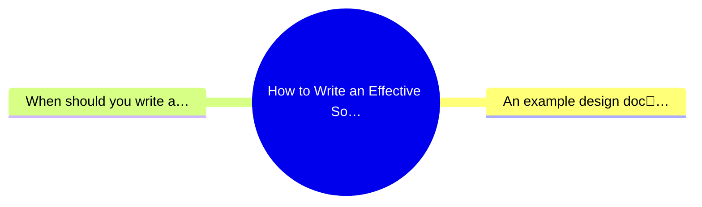
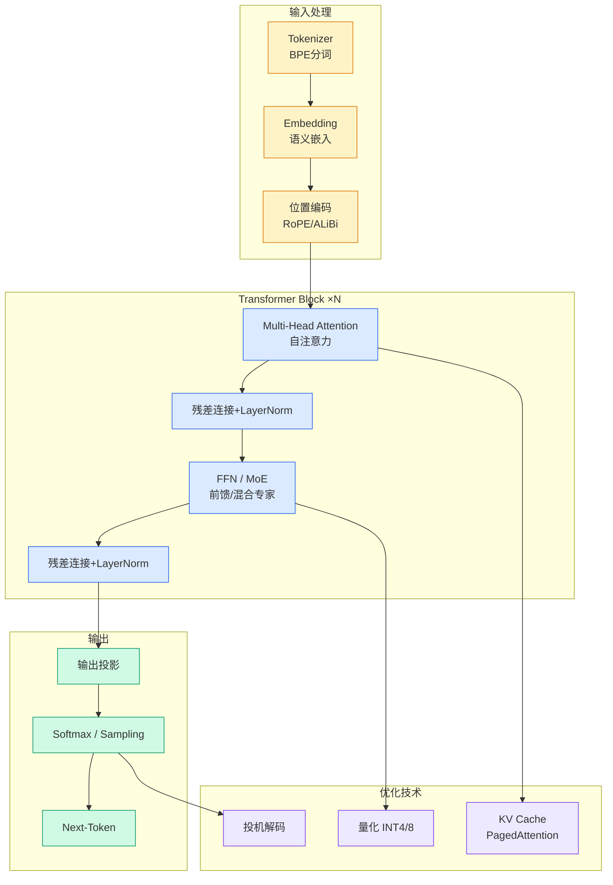

# How to Write an Effective Software Design Document

## Ch01.076 How to Write an Effective Software Design Document

> 📊 Level ⭐ | 7.2KB | `entities/excerpts-write-an-effective-design-doc.md`

# How to Write an Effective Software Design Document

> **来源**: [How to Write an Effective Software Design Document](https://refactoringenglish.com/excerpts/write-an-effective-design-doc/)

Published Time: 2026-06-24T00:00:00+00:00

Markdown Content:
A good design doc can save you years of development time. Writing a design doc forces you to think through important decisions before you waste time on the wrong implementation or paint yourself into a corner. It’s also the best way to coordinate design decisions among teammates and partner teams.

I’ve written design docs as a developer at Google, Microsoft, and within [my own companies](https://mtlynch.io/projects/). The specifics vary, but the underlying principles remain the same. A design doc should articulate the hard problems you’re solving and help your teammates give you feedback.

Below, I share my approach to creating effective design docs and explain what belongs in a design doc and what does not.

*   [An example design doc](http://refactoringenglish.com/excerpts/write-an-effective-design-doc/#an-example-design-doc)
*   [When should you write a design doc?](http://refactoringenglish.com/excerpts/write-an-effective-design-doc/#when-should-you-write-a-design-doc)
*   [How much should you invest into your design doc?](http://refactoringenglish.com/excerpts/write-an-effective-design-doc/#how-much-should-you-invest-into-your-design-doc)
*   [What belongs in a design doc?](http://refactoringenglish.com/excerpts/write-an-effective-design-doc/#what-belongs-in-a-design-doc)
    *   [What’s the cost of getting it wrong?](http://refactoringenglish.com/excerpts/write-an-effective-design-doc/#whats-the-cost-of-getting-it-wrong)

*   [Components of a design doc](http://refactoringenglish.com/excerpts/write-an-effective-design-doc/#components-of-a-design-doc)
    *   [Title](http://refactoringenglish.com/excerpts/write-an-effective-design-doc/#title)
    *   [Metadata](http://refactoringenglish.com/excerpts/write-an-effective-design-doc/#metadata)
    *   [Objective](http://refactoringenglish.com/excerpts/write-an-effective-design-doc/#objective)
    *   [Background](http://refactoringenglish.com/excerpts/write-an-effective-design-doc/#background)
    *   [Related documents](http://refactoringenglish.com/excerpts/write-an-effective-design-doc/#related-documents)
    *   [Goals](http://refactoringenglish.com/excerpts/write-an-effective-design-doc/#goals)
    *   [Non-goals](http://refactoringenglish.com/excerpts/write-an-effective-design-doc/#non-goals)
    *   [Scenarios](http://refactoringenglish.com/excerpts/write-an-effective-design-doc/#scenarios)
    *   [Diagrams](http://refactoringenglish.com/excerpts/write-an-effective-design-doc/#diagrams)
    *   [Glossary](http://refactoringenglish.com/excerpts/write-an-effective-design-doc/#glossary)
    *   [Constraints](http://refactoringenglish.com/excerpts/write-an-effective-design-doc/#constraints)
    *   [Service level objectives (SLOs)](http://refactoringenglish.com/excerpts/write-an-effective-design-doc/#service-level-objectives-slos)
    *   [Monitoring / alerting](http://refactoringenglish.com/excerpts/write-an-effective-design-doc/#monitoring--alerting)
    *   [Timeline](http://refactoringenglish.com/excerpts/write-an-effective-design-doc/#timeline)
    *   [Interfaces](http://refactoringenglish.com/excerpts/write-an-effective-design-doc/#interfaces)
    *   [Dependencies / infrastructure](http://refactoringenglish.com/excerpts/write-an-effective-design-doc/#dependencies--infrastructure)
    *   [Security](http://refactoringenglish.com/excerpts/write-an-effective-design-doc/#security)
    *   [Privacy](http://refactoringenglish.com/excerpts/write-an-effective-design-doc/#privacy)
    *   [Legal considerations](http://refactoringenglish.com/excerpts/write-an-effective-design-doc/#legal-considerations)
    *   [Logging](http://refactoringenglish.com/excerpts/write-an-effective-design-doc/#logging)
    *   [Open issues](http://refactoringenglish.com/excerpts/write-an-effective-design-doc/#open-issues)
    *   [Resolved issues](http://refactoringenglish.com/excerpts/write-an-effective-design-doc/#resolved-issues)
    *   [Alternatives considered](http://refactoringenglish.com/excerpts/write-an-effective-design-doc/#alternatives-considered)

*   [Driving Your Design Doc through Review](http://refactoringenglish.com/excerpts/write-an-effective-design-doc/#driving-your-design-doc-through-review)

## 概念导图

## An example design doc[🔗](http://refactoringenglish.com/excerpts/write-an-effective-design-doc/#an-example-design-doc)

The most common question I get about design docs is where to find a good one. I’ve never seen a public design doc that I consider high-quality. All of mine are hidden away at the companies that paid me to write them.

So, I wrote [a design doc from scratch](https://refactoringenglish.com/excerpts/write-an-effective-design-doc/little-moments-design-doc/) based on the principles I’m sharing here. It lays out the design for [a real web app I’m building](https://codeberg.org/mtlynch/little-moments).

[Video 3](https://refactoringenglish.com/excerpts/write-an-effective-design-doc/little-moments-demo.mp4)
I created the design doc before writing any code, and I’m adhering to the design [as I implement the app](https://codeberg.org/mtlynch/little-moments#status).

*   [Little Moments Design Doc](https://refactoringenglish.com/excerpts/write-an-effective-design-doc/little-moments-design-doc/)

The design is more exhaustive than what I’d normally write for a solo hobby project, but this is roughly the length and depth of a design doc I’d create if I were coordinating work with other people on a professional project.

## When should you write a design doc?[🔗](http://refactoringenglish.com/excerpts/write-an-effective-design-doc/#when-should-you-write-a-design-doc)

The more complex or risky the project, the more valuable it is to write a design doc.

Consider these questions:

*   Will multiple people coordinate work to implement the design?
*   Will the project take more than three months of full-time dev work?
*   Will the implementation run in production for several years?
*

→ [原文存档](https://github.com/QianJinGuo/wiki-book/tree/main/docs/raw/articles/excerpts-write-an-effective-design-doc.md)

---
## 关联
- 相关概念: [Harness Engineering](https://github.com/QianJinGuo/wiki/blob/main/concepts/harness-engineering-framework.md)

---

