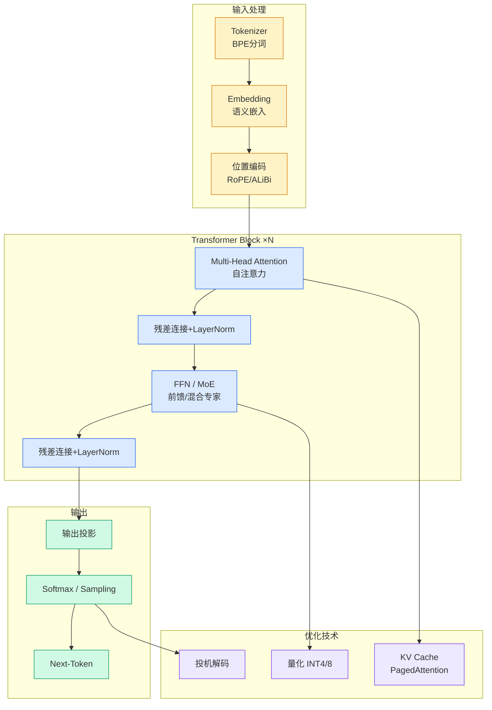

# 腾讯员工公寓曝光，竟是这样的布置！

## Ch01.1006 腾讯员工公寓曝光，竟是这样的布置！

> 📊 Level ⭐⭐ | 4.3KB | `entities/腾讯员工公寓曝光-竟是这样的布置.md`

## 核心要点

- AIGC产业峰会嘉宾阵容报道
- 量子位公众号发布

## 深度分析

**1. 员工公寓福利成为科技大厂人才竞争的重要砝码**

从文章中多位腾讯员工的访谈可以发现，"企鹅公寓"已成为腾讯最具代表性的员工福利之一。在深圳这样生活节奏快、压力大的城市，能够以优惠价格租住面朝大海的公寓，显著提升了员工的幸福感和归属感。这反映了科技大厂在人才竞争中的福利博弈已从薪资延伸至生活品质层面。

**2. 个性化居住空间成为年轻人自我表达与身份认同的载体**

从采访结果看，每位员工的公寓布置都呈现出鲜明的个人风格：leii偏爱自然松弛、舒适治愈的风格，充分利用海景视野；mittens作为极繁主义者，通过精心设计的收纳系统最大化利用有限空间；zhanlin打造了电竞风格的小窝，用灯带和智能音响营造氛围。这表明当代年轻职场人将居住空间视为个性表达和生活态度的重要载体。

**3. "青年"概念在职场语境下被重新定义**

受访者普遍将"青年"与"无限可能"、"敢想敢做"、"不断试错"等特质联系在一起。值得注意的是，多位采访对象（yeley、harwin）都提到跨越专业边界的大胆转型经历，将"青年"定义为一种精神状态而非年龄限制。

**4. 工作与生活的物理空间边界日益模糊**

多位员工提到公寓的便利性（如"上床就睡觉下床就上班"），反映出科技行业工作时间长、强度大的现实。同时，公寓内多样化的兴趣爱好空间（健身、电竞、摄影、音乐）也成为释放压力、维持工作生活平衡的重要出口。

## 实践启示

**1. 企业可将员工公寓等福利作为雇主品牌建设的叙事素材**

腾讯通过员工真实居住故事的展示，实现了福利的软性传播。这种"员工故事"的传播方式比硬性福利公告更具可信度和感染力，是雇主品牌建设的有效路径。

**2. 跨专业转型在科技行业已常态化，应提前规划能力迁移路径**

yeley从工程力学转向游戏策划数值方向、harwin从经济学转向游戏行业、mittens从原专业转向游戏美术——这些案例表明，在快速变化的行业中，跨领域能力迁移比单一专业深度更具长期价值。建议职场人主动培养可迁移的核心能力（如问题分析、创意设计、跨团队协作）。

**3. 智能化家居设施成为提升员工满意度的高性价比投资**

zhanlin通过小爱音响实现全屋智能控制，这类智能化改造成本低但体验提升显著。对于提供员工公寓的企业，预装智能家居基础设施（如语音控制、灯光系统）可作为低成本高回报的福利升级方案。

**4. 社区运营是员工公寓价值的延伸**

多位员工提到鹅厂福利的"润物细无声"特质，如健身房、鹅民公社、周末免费食堂等配套设施。员工公寓的价值不仅在于住房本身，更在于围绕其形成的完整生活社区。

## 相关实体
- [快来 和Ai实战派一起Ai Aigc峰会最新嘉宾阵容来了](../ch04/492-ai-ai.html)
- [Aiaigc Summit Guest Lineup](../ch04/528-aiaigc.html)
- [语音输入喊了这么多年千问电脑版一出手就把键盘卷没了](https://github.com/QianJinGuo/wiki/blob/main/entities/语音输入喊了这么多年千问电脑版一出手就把键盘卷没了.md)
- [快手首个打工人Agent来了工作秒变桌面软件零代码不烧Token](../ch03/035-agent.html)
- [Chatgpt 官宣 26 位未来之星他们是穿墙少年街头摊贩盲童的朋友](ch01/738-chatgpt.html)

→ [原文存档](https://github.com/QianJinGuo/wiki-book/tree/main/docs/raw/articles/腾讯员工公寓曝光-竟是这样的布置.md)

---

