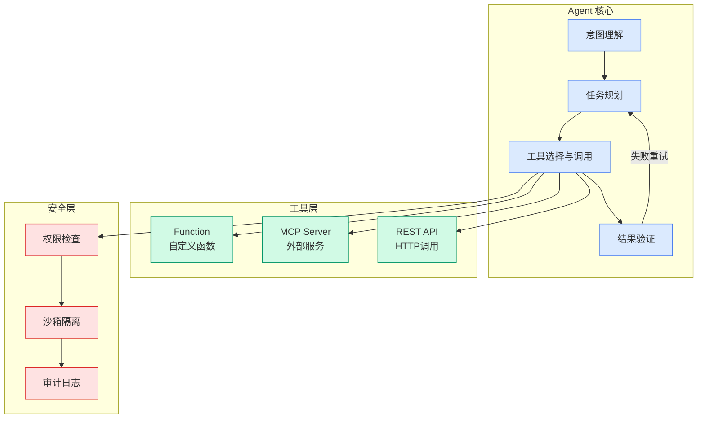

# 3.3万个Skills，为什么大多数都死在“安装”这一步？

## Ch01.1011 3.3万个Skills，为什么大多数都死在“安装”这一步？

> 📊 Level ⭐⭐ | 4.3KB | `entities/33万个skills为什么大多数都死在安装这一步.md`

# 3.3万个Skills，为什么大多数都死在“安装”这一步？

**来源**: 腾讯技术工程

**发布日期**: 2026-04-01

**原文链接**: https://mp.weixin.qq.com/s/ykOW66YzyPHveKpxNuY1ow

---

作者： Rambo，sherry ，laven

谁先成为入口，谁才配留在桌面上。

我们拆了2026年3月24日的一份Clawhub公开数据快照，样本共33,760个skills。

这个市场的问题，不是供给不足，而是 大部分供给没有穿过安装这道门 。

下一阶段真正会赢的，不是功能最多的，也不是概念最大的，而是那些能让用户迅速完成一个动作、迅速看到结果、迅速形成依赖的 skill。

这意味着Clawhub已经不缺供给，缺的是能真正形成安装的供给。
很多skill完成了曝光，没有完成安装，而安装，已经明显向头部集中。

## 概念导图

## 一、问题不在供给，在安装

先看这份 2026 年 3 月 24 日核心数据

📦33,760  Skills 总量
⬇️23,269,103  总下载次数

📥185,212  总安装次数
⭐41,357  总点赞数

下载
量看起来很壮观，但继续往下拆，问题就暴露了

中位数真相：下载中位数 198｜安装中位数 0｜点赞中位数 0大多数 skill 有下载，但没有安装，也没有点赞。

指标
数值
说明

零安装占比
57.5%
超过一半的 skill 从未被安装

零点赞占比
75.2%
四分之三的 skill 从未被点赞

Top100 安装占比
50.4%
头部集中效应显著

这意味着Clawhub已经不缺供给。缺的是能真正形成安装的供给。
很多skill完成了曝光，没有完成安装。而安装，已经明显向头部集中。

## 二、先成立的是工作流，不是概念

按供给规模，Clawhub 上排名前 10 的类别是

0

2,500

5,000

7,500

10,000+

开发/编程

10,103

自动化/工作流

5,428

搜索/研究

4,057

图像/音视频

2,147

办公/文档

1,761

系统/安全

1,704

金融/分析

1,576

电商/营销

529

本地生活

378

教育/学习

218

数据来源：Clawhub 公开数据快照 2026-03-24，样本 33,760 skills

这组分布说明，Clawhub先长出来的，不是娱乐型需求，也不是人格型需求。而是工作流型需求。 用户优先安装的，仍然是能直接接进现有任务链的工具。

代码、搜索、文档、浏览器、数据库、摘要、转写、导出、同步 ， 这些都属于同一类需求： 不是重新发明流程，而是缩短原有流程。

三、看安装效率，不看热度

看类别强弱，不能只看有多少skill。更有解释力的指标，是 每千次下载对应多少安装 。

类别
安装效率（%）
备注

开发/编程
9.99
主航道，供给大安装也强

自动化/工作流
7.99
稳定装机层

办公/文档
6.98
稳定装机层

搜索/研究
6.65
稳定装机层

图像/音视频
6.51
稳定装机层

弱档 — 安装效率偏低：

类别
安装效率（%）
备注

电商/营销
3.80
安装承接弱

本地生活
3.01
安装承接弱

教育/学习
2.69
安装承接最弱

这组数据给出的结论很直接：开发/编程仍然是主航道。不是“供给多所以卷死了”，而是“供给大，安装也强”。办公/文档、搜索/研究、图像/音视频已

→ [原文存档](https://github.com/QianJinGuo/wiki-book/tree/main/docs/raw/articles/33万个skills为什么大多数都死在安装这一步.md)

---
## 关联
- 相关概念: [Harness Engineering](https://github.com/QianJinGuo/wiki/blob/main/concepts/harness-engineering-framework.md)

---

