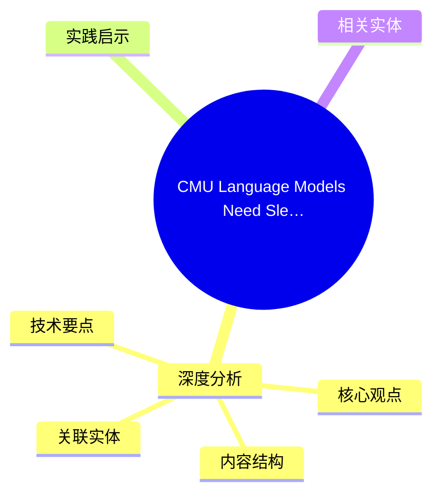
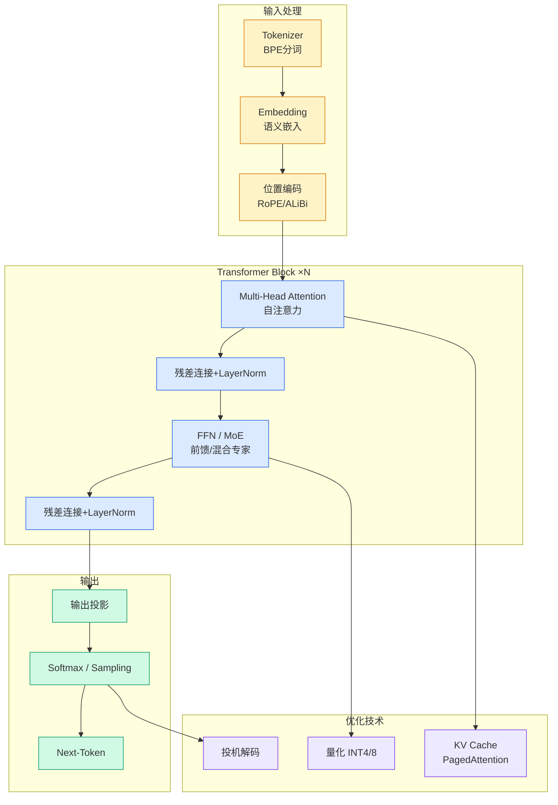

# CMU Language Models Need Sleep (arxiv 2605.26099)：SSM-Attention 睡眠巩固机制

## Ch01.1012 CMU Language Models Need Sleep (arxiv 2605.26099)：SSM-Attention 睡眠巩固机制

> 📊 Level ⭐⭐ | 4.3KB | `entities/arxiv-2605-26099-ssm-attention-sleep-consolidation-cmu.md`

# CMU Language Models Need Sleep (arxiv 2605.26099)：SSM-Attention 睡眠巩固机制

→ [原文存档](https://github.com/QianJinGuo/wiki-book/tree/main/docs/raw/articles/arxiv-2605-26099-ssm-attention-sleep-consolidation-cmu.md)

## 概念导图

## 深度分析

CMU Language Models Need Sleep (arxiv 2605.26099)：SSM-Attention 睡眠巩固机制 涉及agent领域的核心技术议题。
### 核心观点
1. # CMU Language Models Need Sleep (arxiv 2605.
2. 26099)：SSM-Attention 睡眠巩固机制
> 来源：机器之心编辑部 · CMU + 马里兰大学
> 论文地址：https://arxiv.
3. 26099
很长一段时间，「长上下文」一直是各大模型厂商军备竞赛的焦点，从 128K 到 1M，再到更长的上下文窗口，业界已然形成一个固有认知，只要窗口足够大，模型就能记住更多内容，也就能处理更长、更复杂的任务。
4. 但问题也随之而来：上下文越长，KV Cache 越臃肿，不仅导致显存瞬间被「吃光」，推理速度愈发缓慢，成本也迅速上升。
5. 更关键的是，把更多 token 放进窗口，并不等于模型真的把这些信息转化成了可推理的长期记忆，结果是，榜单分数越刷越高，可在一些需要「深度脑暴」的复杂推理任务中，模型常常因为「记不住细节」，频频翻车……
面对这一两难问题，近日，卡内基梅隆大学（CMU）联合马里兰大学等在一篇新论文中提出了有意思的视角：
既然人类连续工作久了会变笨，大模型也一样，既然如此为什么不让 LLM 睡一觉呢？

### 内容结构
- CMU Language Models Need Sleep (arxiv 2605.26099)：SSM-Attention 睡眠巩固机制
- 核心创新
- 从动物睡眠中获得启发
- 「醒着」与「睡眠」两阶段
- 架构详解
- 实验：睡得越久，推理越强？
- 局限性：效果明显，代价同样明显
- 参考链接

### 技术要点

- **agent架构**: 本文在agent方向提出的设计理念与实现路径
- **工程挑战**: 实际落地中面临的关键问题与应对策略
- **architecture趋势**: 相关技术演进方向与新兴范式
### 关联实体

- [Openclaw 完全指南这可能是全网最新最全的系统化教程了32W字建议收藏 V2](../ch11/235-openclaw.html)
- [Karpathy 最新访谈从 Vibe Coding 到 Agentic Engineering](../ch04/237-agentic.html)
- [Openclaw 完全指南这可能是全网最新最全的系统化教程了32W字建议收藏](../ch11/235-openclaw.html)
- [Ethan He Cosmos Grok Imagine Latent Space Video Agent 20260606](../ch03/035-agent.html)
- [Karpathy Vibe Coding Agentic Engineering](../ch04/126-karpathy-vibe-coding-agentic-engineering.html)
- [Agentops Operationalize Agentic Ai At Scale With Amazon Bedr](../ch04/299-agentops-operationalize-agentic-ai-at-scale-with-amazon-bed.html)

## 实践启示

1. **工程落地**: agent领域方案需关注可观测性、可维护性和成本效率
2. **技术选型**: 根据场景选择合适的技术栈，避免过度设计或盲目追新
3. **持续迭代**: 建立数据驱动的反馈闭环，持续优化系统表现
4. **风险管控**: 引入新技术需评估对现有系统稳定性的影响，做好降级预案

## 相关实体

- [MOC](https://github.com/QianJinGuo/wiki/blob/main/moc/mlops-training-inference.md)

---

