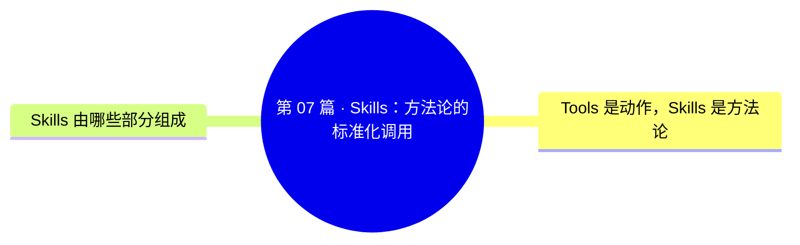
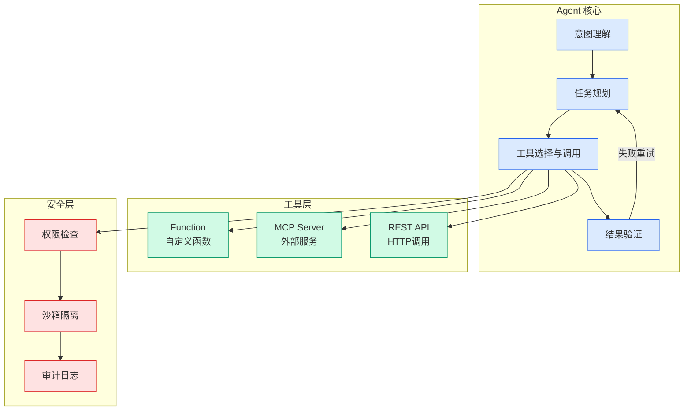

# 第 07 篇 · Skills：方法论的标准化调用

## Ch01.1014 第 07 篇 · Skills：方法论的标准化调用

> 📊 Level ⭐⭐ | 4.3KB | `entities/第-07-篇-skills方法论的标准化调用.md`

# 第 07 篇 · Skills：方法论的标准化调用

**来源**: 叶小钗

**发布日期**: 2026-06-27

**原文链接**: https://mp.weixin.qq.com/s/9L7MXM2aNMbJ0UkcVI-uwg

---

额外资料领取： 

前面我们开发的Agent已经可以动态配置工具，使用工具完成任务。

如果我们想让它做一个拥有固定流程或者固定格式的任务，比如：

帮我写一份今天的日报。

它会怎么做？模型大概率需要你提供基础的数据，然后根据它已有的知识模版，给你一个回复。

它不会自动来问你 "今天做了什么、有哪些进展、遇到什么困难"，也不会有一个固定的格式。

每次让它写日报，结果都可能不太一样。

这可不是模型不够聪明，是模型 不知道你心目中的日报长什么样 。

写日报，其实我们可以归纳为一段流程：

先列出本日完成的工作、未完成正在进行的、有没有什么问题/卡点、最后是明日计划。

每一项都有固定的写法，如果有人给过你模版，基本上就是照着填空。

模型其实也是一样的，你把这个模版 写出来给它，它就能按着做。

我们把这种做某件事的固定流程和规则总结出来，就是 Skills（技能）。

## 概念导图

## Tools 是动作，Skills 是方法论

工具和技能容易被搞混，我们后面在实现技能调用的时候，我们把技能也当成工具，它们都是通过 function calling 这种模式交给模型来使用。但其加载和使用机制完全不同

工具是一个 原子动作 ：读一个文件、发一个 HTTP 请求、查一下天气。它的实现是我们写好的工具代码。

技能是一段 做某件事的方法论或者说是SOP，WorkFlow ：怎么写日报、怎么爬一个网页、怎么做一次代码 review。它的实现不是代码，它是 给模型的一段指令 。

我们简单对比一下：

Tool
Skill

实现形式
Python 函数
Markdown 文档

输入
JSON 参数
一句自由文本（query）

输出
工具执行结果
一段方法论指令

谁来执行
程序代码
模型自己（按指令）

改动成本
改代码
改文档

## Skills 由哪些部分组成

一个skill就是一个文件夹，如下图所示，图中的每一个文件夹 就是一个技能。

一个完整的 Skill 包通常包含：

- SKILL.md  ，技能的主文件，描述技能是什么、什么时候使用、怎么执行，步骤是什么。

- scripts/  ，这个不是必须，当技能需要使用脚本执行来完成任务的时候，需要将脚本放到这个目录下

- assets/  ，这个不是必须，存放模板、配置、示例等静态资源

- references/  ，这个不是必须，参看文档，详细规范、手册、最佳实践等

我们以写日报 这个 Skill 为例：

- SKILL.md  里面要写清楚：这个技能是帮助用户写日报的，它的执行步骤是什么，先做什么，后做什么，最后用什么格式输出

- assets/  可以放一个日报的模板文件，让AI参考

- scripts/  如果有需要，可以放一个自动汇总今日 Git 提交记录或日历事件的脚本，获取当日完成的事情

这个里面 assets 和 scripts 都不是必须的，可以没有，只有SKILL.md 是必须要有的，这样我们仔细琢磨下，技能不就是一份提示词吗？。

确实没错，大多数技能本质上就是一段提示词，它用来指导模型完成任务。

它和提示词最大的区别就是 它是按需注入的 ，如果你把"怎么写日报"这段方法论塞到系统提示词里，

→ [原文存档](https://github.com/QianJinGuo/wiki-book/tree/main/docs/raw/articles/第-07-篇-skills方法论的标准化调用.md)

---
## 关联
- 相关概念: [Harness Engineering](https://github.com/QianJinGuo/wiki/blob/main/concepts/harness-engineering-framework.md)

---

