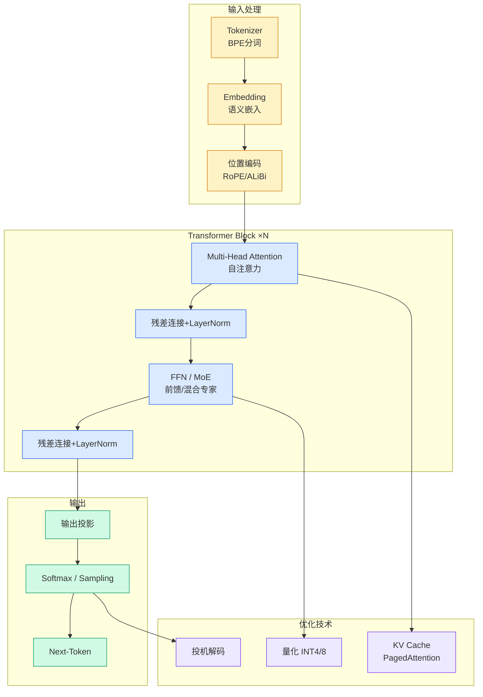

# 大模型可控新突破：Steering 机制、评估体系与开源落地

## Ch01.1019 大模型可控新突破：Steering 机制、评估体系与开源落地

> 📊 Level ⭐⭐ | 4.2KB | `entities/steering-mechanism-evaluation-easyedit2-zju-alibaba.md`

# 大模型可控新突破：Steering 机制、评估体系与开源落地

→ [原文存档](https://github.com/QianJinGuo/wiki-book/tree/main/docs/raw/articles/steering-mechanism-evaluation-easyedit2-zju-alibaba.md)

## 深度分析

大模型可控新突破：Steering 机制、评估体系与开源落地 涉及code领域的核心技术议题。
### 核心观点
1. # 大模型可控新突破：Steering 机制、评估体系与开源落地
**来源：** 机器之心 (转载于数据派THU)
**发布日期：** 2026年6月1日
**作者介绍：** 徐子文，浙江大学人工智能专业硕士二年级，阿里安全AGI实验室御风大模型团队实习。
2. 第一作者发表ACL 2026、EMNLP等论文。
3. 本文介绍了浙大联合阿里在大模型 Steering 方向的两项系统性工作与一个开源框架：1) 统一机理解释——揭示不同 Steering 方法的共性机制（动态权重更新→三阶段规律→激活流形假设），提出 SPLIT 方法扩展可控区间；2) 首个多维度多粒度评估框架 SteerEval——发现"控制衰减"现象；3) 开源工具 EasyEdit2。
4. 近期《Science》发表的研究《Toward universal steering and monitoring of AI models》表明，通过解析 AI 内部表征，可实现对模型行为的通用引导与监控。
5. 浙大联合阿里的两篇 ACL 2026 主会论文，从运行机理、系统评估两大维度全面揭示了 Steering 的工作原理与能力边界。

### 内容结构
- 大模型可控新突破：Steering 机制、评估体系与开源落地
- 什么是 Steering
- 第一篇论文：为什么 Steering 能起作用？统一的机理解释
- 核心发现一：统一视角——殊途同归的动态权重更新
- 核心发现二：三阶段规律——Steering 不是越强越好
- 核心发现三：激活流形假设——揭示深层机理
- SPLIT 方法
- 第二篇论文：大模型到底有多可控？首个 Steering 系统评估框架

### 技术要点

- **code架构**: 本文在code方向提出的设计理念与实现路径
- **工程挑战**: 实际落地中面临的关键问题与应对策略
- **data趋势**: 相关技术演进方向与新兴范式
### 关联实体

- [Openclaw 完全指南这可能是全网最新最全的系统化教程了32W字建议收藏 V2](../ch11/235-openclaw.html)
- [Karpathy 最新访谈从 Vibe Coding 到 Agentic Engineering](../ch04/237-agentic.html)
- [Openclaw 完全指南这可能是全网最新最全的系统化教程了32W字建议收藏](../ch11/235-openclaw.html)
- [Karpathy Vibe Coding Agentic Engineering](../ch04/126-karpathy-vibe-coding-agentic-engineering.html)
- [Agentops Operationalize Agentic Ai At Scale With Amazon Bedr](../ch04/299-agentops-operationalize-agentic-ai-at-scale-with-amazon-bed.html)
- [你不知道的 Agent原理架构与工程实践 V2](../ch03/035-agent.html)

## 实践启示

1. **工程落地**: code领域方案需关注可观测性、可维护性和成本效率
2. **技术选型**: 根据场景选择合适的技术栈，避免过度设计或盲目追新
3. **持续迭代**: 建立数据驱动的反馈闭环，持续优化系统表现
4. **风险管控**: 引入新技术需评估对现有系统稳定性的影响，做好降级预案

---

