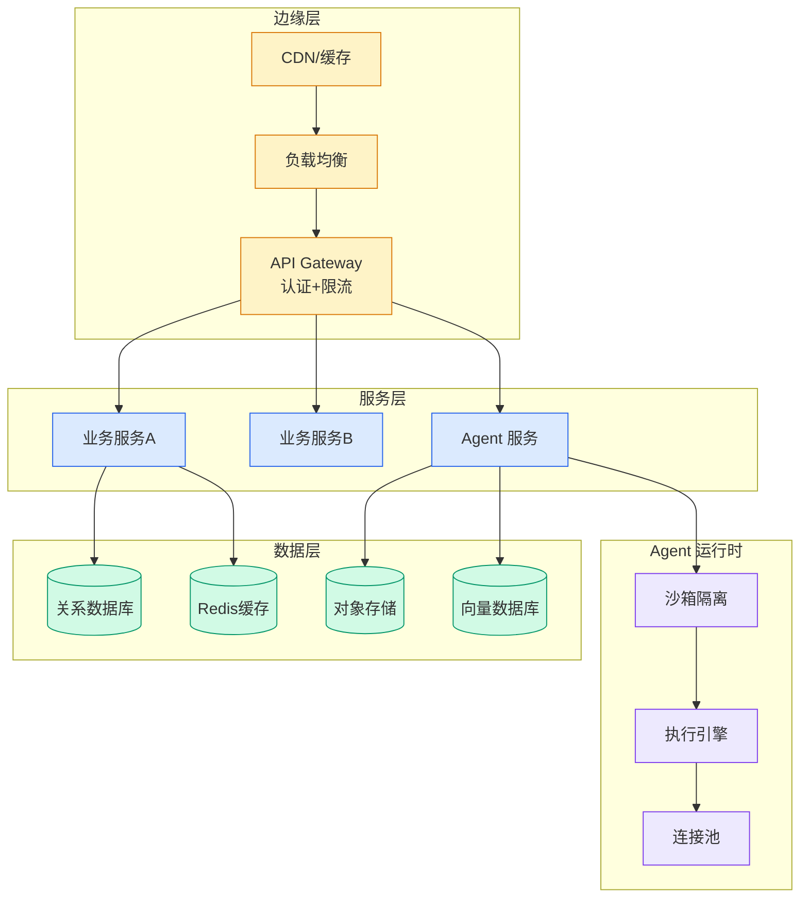

# Qoder Skills 完全指南：从零开始，让 AI 按你的标准执行

## Ch01.1020 Qoder Skills 完全指南：从零开始，让 AI 按你的标准执行

> 📊 Level ⭐⭐ | 4.2KB | `entities/qoder-skills-完全指南从零开始让-ai-按你的标准执行.md`

# Qoder Skills 完全指南：从零开始，让 AI 按你的标准执行

→ [原文存档](https://github.com/QianJinGuo/wiki-book/tree/main/docs/raw/articles/qoder-skills-完全指南从零开始让-ai-按你的标准执行.md)

## 深度分析

Qoder Skills 完全指南：从零开始，让 AI 按你的标准执行 涉及agent领域的核心技术议题。
### 核心观点
1. # Qoder Skills 完全指南：从零开始，让 AI 按你的标准执行
文章内容基于作者个人技术实践与独立思考，旨在分享经验，仅代表个人观点。
2. 在 AI 原生工作流加速普及的今天，掌握 Skill 已不再是开发者的专属能力，而是产品、运营、设计乃至技术管理者提升人机协同效能的核心职业素养。
3. 它直接决定你能否把模糊需求转化为稳定、可复用、可协作的 AI 执行单元，从而在项目交付中显著提升质量一致性、降低沟通成本、规避重复试错。
4. 一、理解 Skill 的本质：菜单与菜谱的比喻
** 没有菜单的餐馆，会发生什么？
5. **
想象你走进一家餐馆，直接对厨师说："帮我做一道红烧肉。

### 内容结构
- Qoder Skills 完全指南：从零开始，让 AI 按你的标准执行
- 整个 AI 工具生态的类比映射
- 场景一：文档与资产创建（Document & Asset Creation）
- 场景二：工作流自动化（Workflow Automation）
- 场景三：MCP 能力增强（MCP Enhancement）
- 场景 A：用 Skill 制作产品宣传视频（适合运营/产品）
- 场景 B：有 Skill 与无 Skill 的前端设计对比（适合所有人）
- 场景 C：规范化 Java 工程的 API 开发（适合开发/技术管理）

### 技术要点

- **agent架构**: 本文在agent方向提出的设计理念与实现路径
- **工程挑战**: 实际落地中面临的关键问题与应对策略
- **code趋势**: 相关技术演进方向与新兴范式
### 关联实体

- [存之有序治之有矩Agent 记忆系统的工程实践与演进](../ch03/035-agent.html)
- [你不知道的 Agent原理架构与工程实践 V2](../ch03/035-agent.html)
- [龙虾装上了可以用来干啥分享下我的 Openclaw 多智能体团队搭建经验 V2](../ch11/235-openclaw.html)
- [Openclaw 完全指南这可能是全网最新最全的系统化教程了32W字建议收藏 V2](../ch11/235-openclaw.html)
- [Karpathy 最新访谈从 Vibe Coding 到 Agentic Engineering](../ch04/237-agentic.html)
- [Openclaw 完全指南这可能是全网最新最全的系统化教程了32W字建议收藏](../ch11/235-openclaw.html)

## 实践启示

1. **工程落地**: agent领域方案需关注可观测性、可维护性和成本效率
2. **技术选型**: 根据场景选择合适的技术栈，避免过度设计或盲目追新
3. **持续迭代**: 建立数据驱动的反馈闭环，持续优化系统表现
4. **风险管控**: 引入新技术需评估对现有系统稳定性的影响，做好降级预案

---

