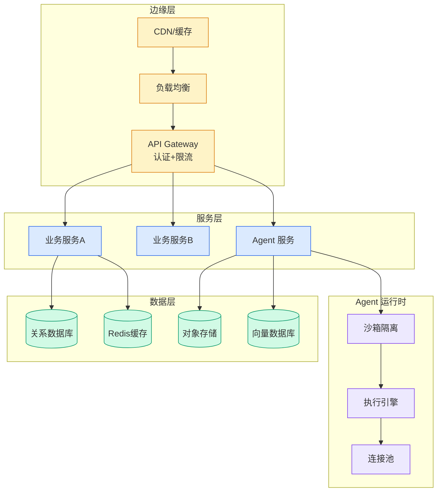

# 一个 Mission 跑 16 天、烧 7.78 亿 Token：Factory 公开了多 Agent 系统的构建哲学

## Ch01.1021 一个 Mission 跑 16 天、烧 7.78 亿 Token：Factory 公开了多 Agent 系统的构建哲学

> 📊 Level ⭐⭐ | 4.2KB | `entities/factory-missions-multi-agent-shipping-for-days-luke.md`

# 一个 Mission 跑 16 天、烧 7.78 亿 Token：Factory 公开了多 Agent 系统的构建哲学

→ [原文存档](https://github.com/QianJinGuo/wiki-book/tree/main/docs/raw/articles/factory-missions-multi-agent-shipping-for-days-luke.md)

## 深度分析

一个 Mission 跑 16 天、烧 7.78 亿 Token：Factory 公开了多 Agent 系统的构建哲学 涉及agent领域的核心技术议题。
### 核心观点
1. # 一个 Mission 跑 16 天、烧 7.
2. 78 亿 Token：Factory 公开了多 Agent 系统的构建哲学
> 整理自：Luke Alvoeiro @ AI Engineer Europe 2026-05
> 原文：Multi-Agent Systems / Missions That Ship for Days
> Factory 官方：https://factory.
3. ai/news/missions-architecture
## TL;DR

Factory 核心 agent 基础设施负责人 Luke Alvoeiro 的核心论点：**人类的注意力带宽已经成为软件工程的瓶颈**——前沿模型已经能并行处理 50 个任务，但即便最强的工程师同时也只能盯住 3-4 个 thread。
4. Missions 是 Factory 针对这一不对称设计的多 agent 系统，目标是把工程师从「写代码」彻底搬到「项目管理 50 个 droid」。
5. **值得抄作业的技术设计**：
- 多 agent 通信归纳为 5 种基本模式，只用 4 种（不用 direct communication）
- Orchestrator + Worker + Validator 三角色
- Validation contract 在写代码之前产出
- 串行写、并行读
- Droid whispering：不同角色用不同 LLM
**真实数据**：Slack 克隆 mission，16.

### 内容结构
- 一个 Mission 跑 16 天、烧 7.78 亿 Token：Factory 公开了多 Agent 系统的构建哲学
- TL;DR
- Luke Alvoeiro 的背景
- 多 Agent 通信的 5 种模式
- Orchestrator / Worker / Validator：三角色架构
- Self-Evaluation Bias
- Validation Contract：把"正确"写在"实现"之前
- VAL-AUTH-001: Successful login

### 技术要点

- **agent架构**: 本文在agent方向提出的设计理念与实现路径
- **工程挑战**: 实际落地中面临的关键问题与应对策略
- **architecture趋势**: 相关技术演进方向与新兴范式
### 关联实体

- [你不知道的 Agent原理架构与工程实践 V2](../ch03/035-agent.html)
- [龙虾装上了可以用来干啥分享下我的 Openclaw 多智能体团队搭建经验 V2](../ch11/235-openclaw.html)
- [Openclaw 完全指南这可能是全网最新最全的系统化教程了32W字建议收藏 V2](../ch11/235-openclaw.html)
- [Karpathy 最新访谈从 Vibe Coding 到 Agentic Engineering](../ch04/237-agentic.html)
- [构建基于多智能体架构的深度思考交易系统 V2](https://github.com/QianJinGuo/wiki/blob/main/entities/构建基于多智能体架构的深度思考交易系统-v2.md)
- [Openclaw 完全指南这可能是全网最新最全的系统化教程了32W字建议收藏](../ch11/235-openclaw.html)

## 实践启示
1. **工程落地**: agent领域方案需关注可观测性、可维护性和成本效率
2. **技术选型**: 根据场景选择合适的技术栈，避免过度设计或盲目追新
3. **持续迭代**: 建立数据驱动的反馈闭环，持续优化系统表现
4. **风险管控**: 引入新技术需评估对现有系统稳定性的影响，做好降级预案

## 相关实体

- [MOC](https://github.com/QianJinGuo/wiki/blob/main/moc/multi-agent-coordination.md)

---

