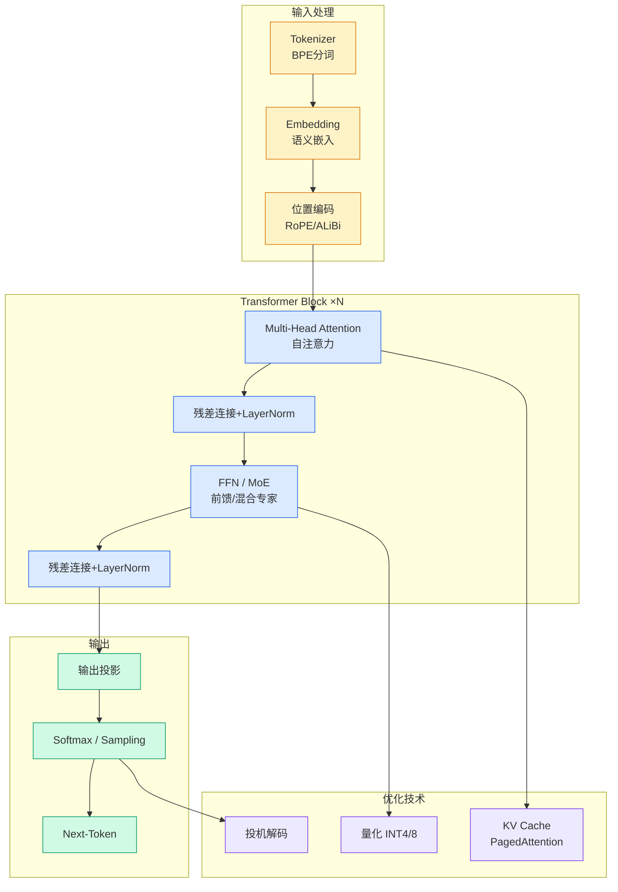

# model half-life

## Ch01.1024 model half-life

> 📊 Level ⭐⭐ | 4.2KB | `entities/model-half-life-aifoc.md`

## 核心要点

- AI 模型的性能随时间衰减（model half-life 现象）
- 探讨 LLM 在生产环境中随时间退化的机制
- 模型发布节奏加速，但"半衰期"概念被过度炒作

## 深度分析

**"Model Half-Life"的概念批判**

"Model half-life"是近期 AI 行业的高频热词，指的是新一代模型发布的时间间隔不断缩短的现象。支持者认为这一间隔正从数年压缩至数月，并暗示未来将进一步加速。然而，当作者真正梳理了 2022 年底至今主要美国前沿实验室（OpenAI、Anthropic、Google、xAI、Meta、Mistral）和中国实验室（DeepSeek、Qwen、Zhipu、MiniMax、Moonshot、ByteDance）的所有重磅模型发布数据后，得出一个反直觉的结论：**"model half-life"本质上是一个缺乏数据支撑的营销概念**。

**数据揭示的真相**

从作者绘制的发布时间线来看，发布节奏确实有所加快，但远未达到"每 6 个月减半"的程度。GPT 系列从每年一更变为半年一更，Claude 系列也呈现类似趋势，但这种加速是温和的而非指数级的。更关键的是，中国实验室的发布节奏与美国前沿实验室的节奏并不同步——DeepSeek 和 Qwen 有自己的发布周期，而非简单复制 OpenAI 的路线图。

**预测方法的局限性**

作者采用了一种相当朴素的预测方法：取最近三次发布的间隔天数中位数，加上最近一次发布的时间，得出预测的下一次发布。问题在于：

1. 当一个系列只有 1-2 次发布记录时，预测几乎无意义
2. 突发事件（如同周内两次发布，或长期意外停滞）会扭曲中位数
3. 用历史趋势预测非线性发展的 AI 领域，本质上是刻舟求剑

作者自己也承认，这种预测"pretty weak"，GPT OSS 在 2027 年底发布的预测更多是噱头而非可靠判断。

**真正的启示**

Model half-life 讨论背后反映的是 AI 行业的高度竞争焦虑。各实验室争相证明自己"跟上节奏"，但这种节奏的本质是商业决策而非技术突破的必然周期。一个更有意义的指标可能是：模型在基准测试上的性能提升速率，而非发布的时间间隔。

## 实践启示

**对于 AI 工程师和开发者**

- **不要被发布节奏绑架决策**：当新模型发布时，评估它是否真正解决你现有系统的痛点，而非盲目追逐最新
- **建立内部评估基准**：在采用新模型前，用你的实际工作负载测试，而非仅依赖公开基准
- **关注模型稳定性**：发布节奏加快意味着生产环境中的模型切换更频繁，需要完善的 A/B 测试和回滚机制

**对于 AI 研究者和投资者**

- **警惕"半衰期缩短"的叙事**：它可能掩盖了一个事实——大部分模型迭代是增量改进而非范式突破
- **追踪中国实验室的独特节奏**：DeepSeek、Qwen 等中国实验室的发布周期与西方不同步，这意味着全球 AI 发展比单一叙事更复杂
- **理解"预测下一次发布"的无效性**：除非有大量数据点，否则用历史发布时间预测未来毫无意义

**对于企业 AI 策略制定者**

- **制定长期的模型采购策略**：不要围绕单一供应商的发布日历规划技术路线
- **投资于评估基础设施**：随着模型选择增多，拥有快速、低成本评估新模型的能力将成为竞争优势
- **区分"模型发布"和"能力提升"**：有时一个模型的微调版本比全新的模型家族更有价值

## 相关实体
- [Rag技术框架的演进方向](ch01/223-rag.html)
- [Cloudflare Glasswing Mythos Security](../ch12/030-mythos.html)
- [Yidian Tianxia Context Engineering Agentic Ai Qcon](../ch04/258-yidian-tianxia-context-engineering-agentic-ai.html)
- [Llm Raiders Private Ai Server](ch01/1274-llm.html)
- [Langgraph State Machine Under The Hood](../ch04/201-langgraph.html)

→ [原文存档](https://github.com/QianJinGuo/wiki-book/tree/main/docs/raw/articles/model-half-life-aifoc.md)

---

