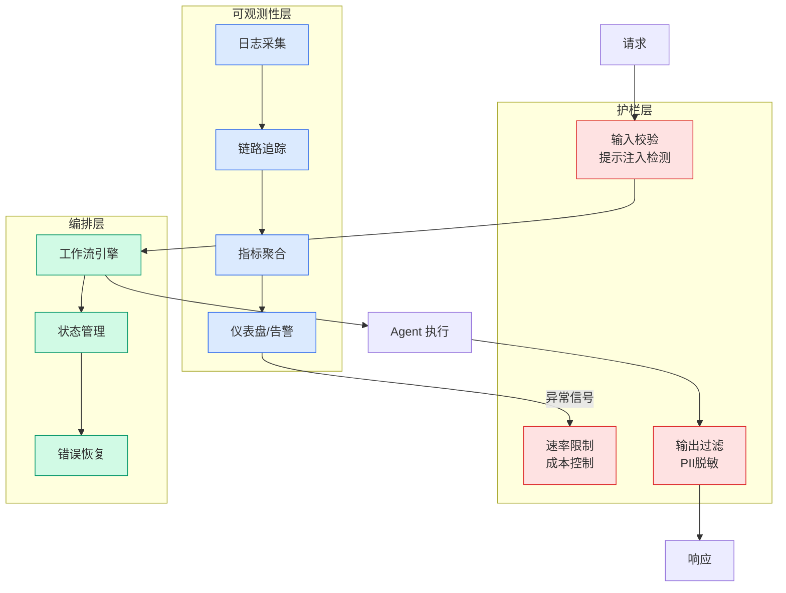

# ACL 2026｜世界模型能让智能体「预知未来」？这篇新范式研究给了一个反直觉的答案

## Ch01.1028 ACL 2026｜世界模型能让智能体「预知未来」？这篇新范式研究给了一个反直觉的答案

> 📊 Level ⭐⭐ | 4.2KB | `entities/acl-2026世界模型能让智能体预知未来这篇新范式研究给了一个反直觉的答案.md`

# ACL 2026｜世界模型能让智能体「预知未来」？这篇新范式研究给了一个反直觉的答案

**来源**: 机器之心

**发布日期**: 2026-05-04

**原文链接**: https://mp.weixin.qq.com/s/8x1idbXkktPRxsuztuthNg

---

本文主要由伊利诺伊大学香槟分校的钱成博士牵头合作完成。钱成目前为二年级博士生，其主要研究方向为大模型驱动智能体，包括智能体推理，交互以及物理智能等。导师为季姮教授。

2025 年是 Agent（智能体）技术落地元年，而如今到了 2026年，World Model（世界模型）也随之有了更广泛的技术突破。我们一边拥抱着五花八门的智能体应用给生活带来切实的便利，另一方面，我们也在加强世界模型的可信度与真实性，希望着它们在未来能够赋能智能体，让智能体能够真正像人类辨别物理空间，思考物理规律，从而更加高效且精准的做出推理与决策。

这二者的相继爆火并非偶然。如果从更本质的视角来看待世界模型和智能体的关系，便会发现：世界模型的本质在于接收当下对于环境的动作或扰动，在物理规律或环境限制的调控下，进而预测下一步的环境状态；而智能体则是根据当前环境状态，在任务目标的调控下，输出下一步应该做出的反应或动作。

从这个角度看， 世界模型和智能体其实是一个天生互补的闭环， 而这也正是世界模型能够理论上赋能智能体决策的基础。

从智能体的角度来看， 世界模型对其的赋能叫做 Foresight（前瞻）。世界模型能够在智能体并没有做出任何动作前便模拟出可能的后果，就像人类会「脑补」假如做了某件事之后可能会产生的影响，从而避免危害，提高效率，更加理性的在当下进行决策。只不过，人类更像是智能体和世界模型的结合体，因为既拥有前瞻能力，也是任务的执行者。

但是当下智能体和世界模型往往是按照两个完全不同的范式分开训练，那么便再换一种更加简单的思路： 从智能体的角度，如果世界模型就是用来提供前瞻性的工具或第三方模块，那么后者在当下能够成功赋能智能体决策吗？

来自 伊利诺伊大学香槟分校、清华大学、约翰霍普金斯大学以及哥伦比亚大学的研究人员 在反复试验后，却得出来一个与我们的直觉有点相反的结论： 大多数当下智能体并不能稳定、有效地把世界模型当作前瞻工具。

这个工作也点出了在当下智能体与世界模型交接之年热潮背后真正
## 相关链接

- [Agent 规划推理](https://github.com/QianJinGuo/wiki/blob/main/concepts/agent-planning-reasoning.md)
- [Agent 自进化循环](https://github.com/QianJinGuo/wiki/blob/main/concepts/agent-self-improvement-loops.md)

---

