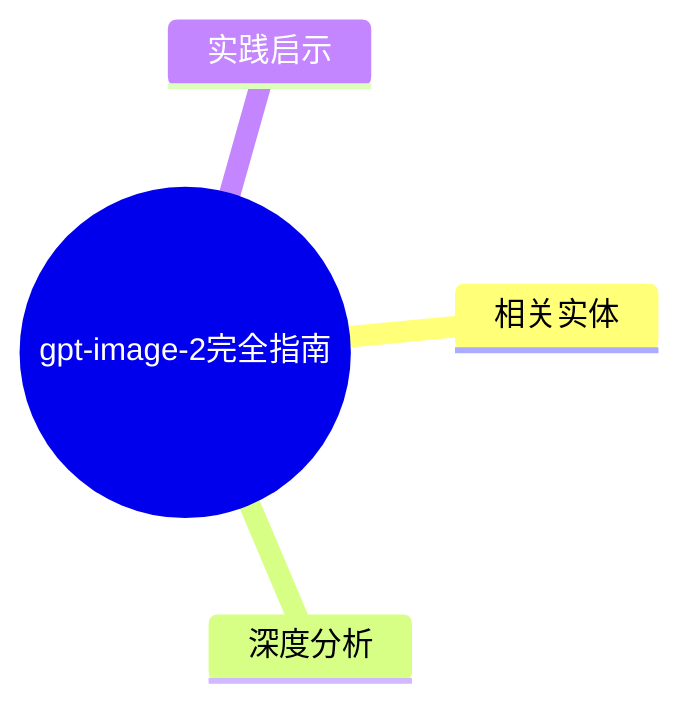
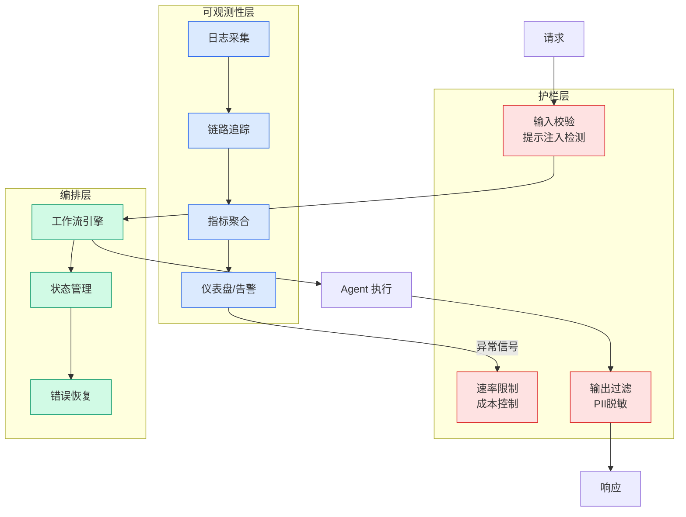

# gpt-image-2完全指南

## Ch01.1030 gpt-image-2完全指南

> 📊 Level ⭐⭐ | 4.2KB | `entities/gpt-image-2完全指南.md`

## 概念导图

## 相关实体
- [GPT-Image-2 完全指南！附大量玩法案例，顺便开源我的生图 Skill ～](ch01/1258-gpt-image-2.html)

- [agent 开发范式演进：从环境工程出发](../ch03/035-agent.html)

- [MOC](https://github.com/QianJinGuo/wiki/blob/main/moc/ai-skill-design.md)
## 深度分析

GPT-Image-2 在 Arena.AI Text-to-Image 排行榜以 1512 分登顶，领先第二名谷歌 Nano-Banana-2 共 242 分，是迄今为止最强大的图像生成模型。
**核心能力矩阵：**

- **文字渲染**：GPT-Image-2 把多语言文字渲染作为核心能力，海报、封面、菜单、招牌、PPT风格图、UI标签、信息图均可稳定输出，中文等多语言场景明显优于 Nano-Banana。
- **指令遵循**：支持非常具体的构图指令（主体位置、背景、文案排版、风格、禁用元素），接近"按 brief 出图"的效果，虽然无法达到 Figma 像素级可控，但比上一代显著提升。
- **编辑能力**：支持图像输入和编辑，以高保真方式处理输入图片，适合产品换背景、局部替换、风格统一、Logo/包装保留、物体参考图延展。
**使用渠道对比：**
| 渠道 | 类型 | 适用场景 |
|---|---|---|
| ChatGPT (Plus/Pro/Business) | 官方对话框 | 直接对话式生图 |
| OpenAI Codex | 官方 IDE 集成 | 开发时生成 UI 界面、游戏贴图、应用图标 |
| Lovart / ChatCanvas | 第三方设计平台 | AI 设计协作画布，多模型串联 |
| OpenAI Images API | 官方 API | 接入营销工具、电商后台、设计平台 |
| OpenRouter | 模型路由平台 | 统一 API 格式、自动负载均衡、多模型切换 |
| 302.AI | 国内平台 | 按用量付费，无需订阅，小白友好 |
**与 Skill 体系的结合价值：**
作者开源的 gpt-image-2 Skill 覆盖 18 大类、79 个结构化模板，配合三种运行模式（Mode A 本地 API、Mode B Host 委托、Mode C Advisor 纯 prompt 顾问），可在 Claude Code、Cursor、Codex 等 Agent 环境中实现"说一句话就出图"的全流程自动化。

## 实践启示
**1. 拥抱长 prompt 工程化**
案例的共同特点是 prompt 长且结构化程度高。直接说"帮我画个海报"效果远不如结构化 prompt。建议积累自己的模板库，按视觉类型（UI样机/海报/信息图/学术配图/技术架构图等）分类管理。
**2. 优先在 Codex 生态中使用**
Codex 已整合 GPT-Image-2 图像生成能力，安装 Skill 后即可在写代码同时用自然语言生成 UI 界面图、游戏贴图等视觉资产，推荐作为首选集成环境。
**3. 按场景选择 API 渠道**

- 有技术团队、需深度集成 → OpenAI Images API / OpenRouter
- 国内开发者、小白用户 → 302.AI（按用量付费，支付简单）
- 设计协作场景 → Lovart ChatCanvas（多模型串联画布）
**4. 善用案例网站快速启动**
作者案例网站 https://gpt-image2.mmh1.top/ 不是简单图库，每张图附完整可复现 prompt、对应模板、可自定义字段，建议优先在此找到接近自己需求的案例作为起点再微调。
**5. 18 个高价值应用方向可重点探索**
学术配图（pipeline/架构图）、信息图与数据可视化、UI 样机、海报与品牌视觉、技术架构图、头像与贴纸、漫画与角色序列 — 这 7 类是 GPT-Image-2 相比其他模型优势最明显的场景。

---

