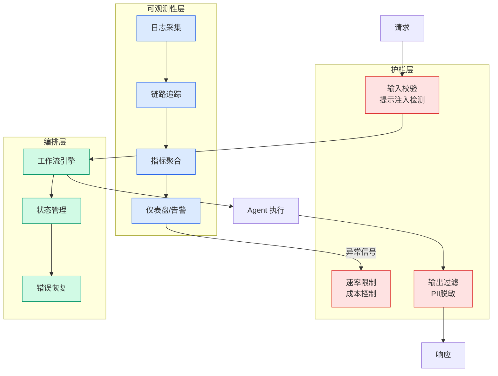

# ICSE 2026杰出论文 | 突破代码模型真实工程落地瓶颈，北大团队提出SEAlign对齐框架：显著提升软件工程智能体决策质量

## Ch01.1031 ICSE 2026杰出论文 | 突破代码模型真实工程落地瓶颈，北大团队提出SEAlign对齐框架：显著提升软件工程智能体决策质量

> 📊 Level ⭐⭐ | 4.2KB | `entities/icse-2026杰出论文-突破代码模型真实工程落地瓶颈北大团队提出sealign对齐框架显著提升软件工程智能体决策质量.md`

# ICSE 2026杰出论文 | 突破代码模型真实工程落地瓶颈，北大团队提出SEAlign对齐框架：显著提升软件工程智能体决策质量

**来源**: 机器之心

**发布日期**: 2026-05-07

**原文链接**: https://mp.weixin.qq.com/s/xK2DmpaI0-cTB49pfWdKAQ

---

本文的通讯作者是北京大学计算机学院金芝教授和李戈教授。第一作者为课题组博士生张克驰，本科毕业于北京大学信息科学技术学院，研究方向为代码智能体和代码大模型。他曾以第一作者在自然语言处理、软件工程等领域的国际会议上发表多篇论文，其代表工作 CodeAgent 发表于 ACL2024，是较早提出代码智能体概念并开展系统研究的工作。一作论文先后获得 2023 年 ACM 杰出论文奖（ACM SIGSOFT Distinguished Paper Award in ICPC）和 2026 年 ACM 杰出论文奖（ACM SIGSOFT Distinguished Paper Award in ICSE）。

在代码大模型和代码智能体技术快速发展的今天，一个日益凸显的现象是：能够在经典代码生成基准上取得优异成绩的模型，一旦被放入真实软件工程环境中，表现却往往大幅下滑。

这种落差的根源在于，真实软件工程并不是一道孤立的编程题，而是一个长时程、强上下文持续交互、反复验证与修正的复杂过程。

模型不仅要会写代码，还要能够正确理解需求、在仓库中定位文件、在合适时机调用工具、解释测试反馈、修正先前错误，并在必要时及时停止。

这意味着，在评测基准上表现出色的代码模型，其评价体系与训练模式通常更侧重于单一任务的代码生成，并不天然适用于现实世界中复杂的软件工程任务。

围绕这一问题， 北京大学金芝教授和李戈教授团队 提出了一套 软件工程智能体对齐框架 SEAlign ，通过对智能体轨迹中的关键决策点进行识别与对齐，显著提升模型在真实工程任务中的表现。实验证明，经过 SEAlign 优化后的 14B 参数开源模型，在 SWE-bench 等真实场景中表现出明显领先同体量模型、甚至媲美顶级闭源模型的能力。相关成果发表于软件工程顶会 ICSE 2026，并荣获 ACM SIGSOFT Distinguished Paper Award （杰出论文奖）。

ICS
## 相关链接

- [Agent 评测基准](https://github.com/QianJinGuo/wiki/blob/main/concepts/agent-evaluation-benchmarks.md)
- [生产级 Agent 工程](https://github.com/QianJinGuo/wiki/blob/main/concepts/production-agent-engineering.md)

---

