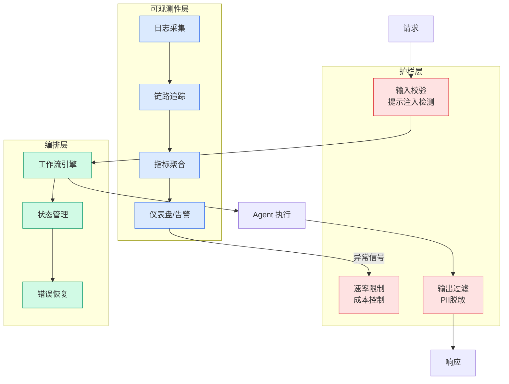

# Google brings local AI agents to laptops with Gemma 4 12B

## Ch01.1033 Google brings local AI agents to laptops with Gemma 4 12B

> 📊 Level ⭐⭐ | 4.2KB | `entities/google-brings-local-ai-agents-to-laptops-with-gemma-4-12b-20260606.md`

# Google brings local AI agents to laptops with Gemma 4 12B

## 相关实体

- [interconnects ai p open and closed models are on different](../ch05/094-ai.html)
- [llmshare: using shared chatbot pages to distribute malware](ch01/1179-llmshare-using-shared-chatbot-pages-to-distribute-malware.html)
- [zapocalypse: the attack chain that could have hijacked zapie](../ch11/241-zapocalypse-the-attack-chain-that-could-have-hijacked-zapie.html)
→ [原文存档](https://github.com/QianJinGuo/wiki-book/tree/main/docs/raw/articles/google-brings-local-ai-agents-to-laptops-with-gemma-4-12b-20260606.md)

- [MOC](https://github.com/QianJinGuo/wiki/blob/main/moc/data-infrastructure.md)
## 深度分析

Google brings local AI agents to laptops with Gemma 4 12B 涉及agent领域的核心技术议题。
### 核心观点
1. Google has released new tools that allow developers to run agentic AI workflows locally using Gemma 4 12B, a 12-billion-parameter model from Google DeepMind.
2. In a blog post, the company said the model, combined with the Google AI Edge stack, can be used to build and test applications on everyday machines.
3. The model-runtime combination supports capabilities such as autonomous data processing, visual insight generation, webpage creation, and tool use.
4. The release includes Google AI Edge Gallery for macOS, where developers can use Gemma 4 12B to generate and run scripts for tasks such as data analysis.
5. Google also said its Eloquent voice dictation and editing app now runs fully on-device on macOS, with support for local transcription and voice-driven text editing.

### 内容结构
- Challenges to overcome
- The cost tradeoff
- Complementing cloud AI
- From our editors straight to your inbox

### 技术要点

- **agent架构**: 本文在agent方向提出的设计理念与实现路径
- **工程挑战**: 实际落地中面临的关键问题与应对策略
- **article趋势**: 相关技术演进方向与新兴范式
### 关联实体

- [Openclaw 完全指南这可能是全网最新最全的系统化教程了32W字建议收藏](../ch11/235-openclaw.html)
- [Openclaw 完全指南这可能是全网最新最全的系统化教程了32W字建议收藏 V2](../ch11/235-openclaw.html)
- [Karpathy 最新访谈从 Vibe Coding 到 Agentic Engineering](../ch04/237-agentic.html)
- [一文带你弄懂 Ai 圈爆火的新概念Harness Engineering](../ch05/120-harness-engineering.html)
- [Karpathy Vibe Coding Agentic Engineering](../ch04/126-karpathy-vibe-coding-agentic-engineering.html)
- [你不知道的 Agent原理架构与工程实践 V2](../ch03/035-agent.html)

## 实践启示
1. **工程落地**: agent领域方案需关注可观测性、可维护性和成本效率
2. **技术选型**: 根据场景选择合适的技术栈，避免过度设计或盲目追新
3. **持续迭代**: 建立数据驱动的反馈闭环，持续优化系统表现
4. **风险管控**: 引入新技术需评估对现有系统稳定性的影响，做好降级预案

---

