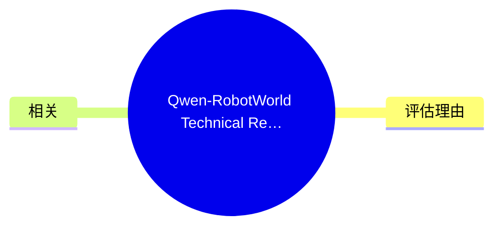
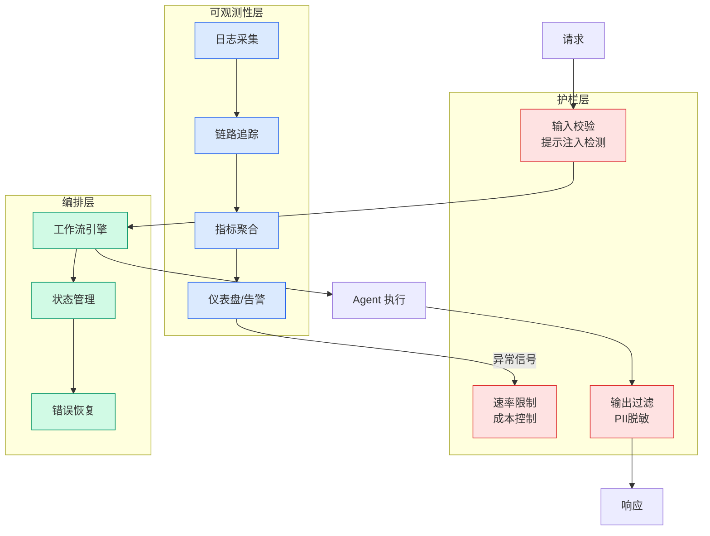

# Qwen-RobotWorld Technical Report: Unifying Embodied World Modeling through Langu

## Ch01.1038 Qwen-RobotWorld Technical Report: Unifying Embodied World Modeling through Langu

> 📊 Level ⭐⭐ | 4.1KB | `entities/arxiv-2606.17030.md`

# Qwen-RobotWorld Technical Report: Unifying Embodied World Modeling through Language-Conditioned Video Generation

> **背景**：从 newsletter candidates 提取，2026-06-18 v×c=24 stars=4 通过评分门槛。
> URL: https://arxiv.org/abs/2606.17030

## 概念导图

## 核心要点

Published Time: Wed, 17 Jun 2026 01:07:18 GMT

Markdown Content:
Authors:[Jie Zhang](https://arxiv.org/search/cs?searchtype=author&query=Zhang,+J), [Xiaoyue Chen](https://arxiv.org/search/cs?searchtype=author&query=Chen,+X), [Anzhe Chen](https://arxiv.org/search/cs?searchtype=author&query=Chen,+A), [Deqing Li](https://arxiv.org/search/cs?searchtype=author&query=Li,+D), [Gengze Zhou](https://arxiv.org/search/cs?searchtype=author&query=Zhou,+G), [Hale Yin](https://arxiv.org/search/cs?searchtype=author&query=Yin,+H), [Haoqi Yuan](https://arxiv.org/search/cs?searchtype=author&query=Yuan,+H), [Haoyang Li](https://arxiv.org/search/cs?searchtype=author&query=Li,+H), [Jiahao Li](https://arxiv.org/search/cs?searchtype=author&query=Li,+J), [Jiazhao Zhang](https://arxiv.org/search/cs?searchtype=author&query=Zhang,+J), [Jingren Zhou](https://arxiv.org/search/cs?searchtype=author&query=Zhou,+J), [Kaiyuan Gao](https://arxiv.org/search/cs?searchtype=author&query=Gao,+K), [Kun Yan](https://arxiv.org/search/cs?searchtype=author&query=Yan,+K), [Lihan Jiang](https://arxiv.org/search/cs?searchtype=author&query=Jiang,+L), [Ningyuan Tang](https://arxiv.org/search/cs?searchtype=author&query=Tang,+N), [Pei Lin](https://arxiv.org/search/cs?searchtype=author&query=Lin,+P), [Qihang Peng](https://arxiv.org/search/cs?searchtype=author&query=Peng,+Q), [Shengming Yin](https://arxiv.org/search/cs?searchtype=author&query=Yin,+S), [Tianhe Wu](https://arxiv.org/search/cs?searchtype=author&query=Wu,+T), [Tianyi Yan](https://arxiv.org/search/cs?searchtype=author&query=Yan,+T), [Xiao Xu](https://arxiv.org/search/cs?searchtype=author&query=Xu,+X), [Yan Shu](https://arxiv.org/search/cs?searchtype=author&query=Shu,+Y), [Yanran Zhang](https://arxiv.org/search/cs?searchtype=author&query=Zhang,+Y), [Ye Wang](https://arxiv.org/search/cs?searchtype=author&query=Wang,+Y), [Yi Wang](https://arxiv.org/search/cs?searchtype=author&query=Wang,+Y), [Yilei Chen](https://arxiv.org/search/cs?searchtype=author&query=Chen,+Y), [Yixian Xu](https://arxiv.org/search/cs?searchtype=author&query=Xu,+Y), [Yiyang Huang](https://arxiv.org/search/cs?searchtype=author&query=Huang,+Y), [Yuxiang Chen](https://arxiv.org/search/cs?searchtype=author&query=Chen,+Y), [Zekai Zhang](https://arxiv.org/search/cs?searchtype=author&query=Zhang,+Z), [Zhendong Wang](https://arxiv.org/search/cs?searchtype=author&query=Wang,+Z), [Zixing Lei](https://arxiv.org/search/cs?searchtype=author&query=Lei,+Z), [Zhixuan Liang](https://arxiv.org/search/cs?searchtype=author&query=Liang,+Z), [Zihao Liu](https://arxiv.org/search/cs?searchtype=author&query=Liu,+Z), [Zikai Zhou](https://arxiv.org/search/cs?searchtype=author&query=Zhou,+Z), [Chenxu Lv](https://arxiv.org/search/cs?searchtype=author&query=Lv,+C), [Xiong-Hui Chen](https://arxiv.org/search/cs?searchtype=author&query=Chen,+X), [Chenfei Wu](https://arxiv.org/search/cs?searchtype=author&query=Wu,+C)

[View PDF](https://arxiv.org/pdf/2606.17030)

> Abstract:We introduce Qwen-RobotWorld, 

## 评估理由

- **value=6**: Arxiv technical report on Qwen-RobotWorld for embodied world modeling via language-conditioned video generation. Strong topic relevance to AI/ML research (multimodal generation, world models, robotics
- **confidence=4**: 详细程度与来源可信度
- **stars=4**: 独特技术洞察评分

## 相关

- [原文存档](https://github.com/QianJinGuo/wiki-book/tree/main/docs/raw/articles/arxiv-2606.17030.md)

---
## 关联
- 相关概念: [Harness Engineering](https://github.com/QianJinGuo/wiki/blob/main/concepts/harness-engineering-framework.md)
- 相关: [Agent 架构](https://github.com/QianJinGuo/wiki/blob/main/concepts/agent-architecture.md)

---

