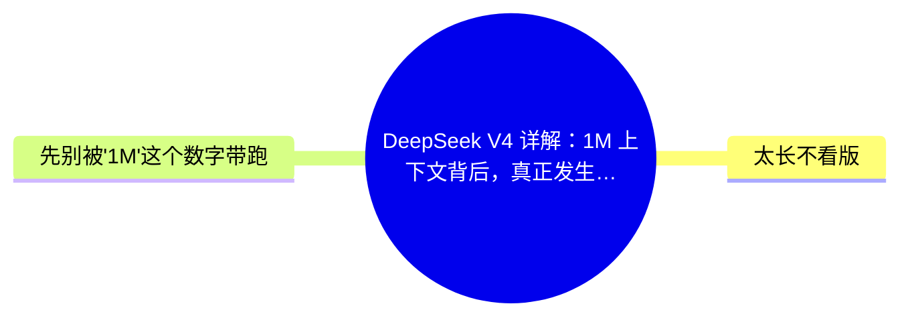
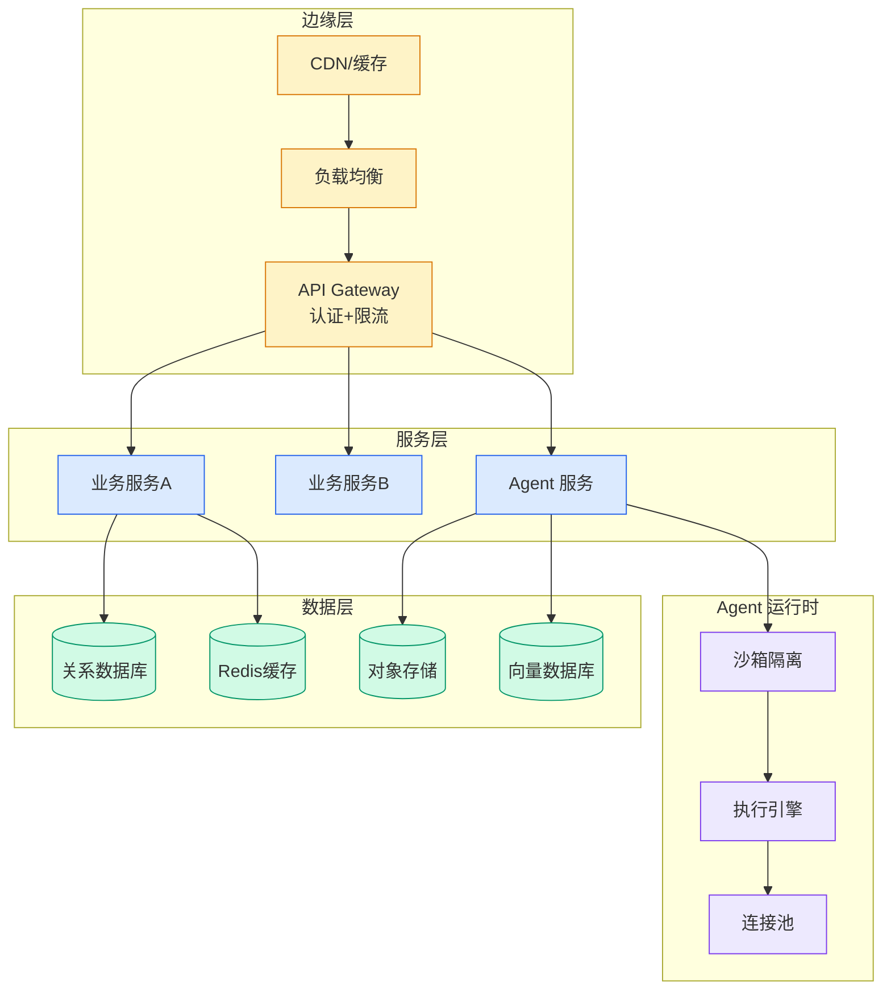

# DeepSeek V4 详解：1M 上下文背后，真正发生了什么

## Ch01.1045 DeepSeek V4 详解：1M 上下文背后，真正发生了什么

> 📊 Level ⭐⭐ | 4.1KB | `entities/deepseek-v4-详解1m-上下文背后真正发生了什么.md`

# DeepSeek V4 详解：1M 上下文背后，真正发生了什么

**来源**: 架构师

**发布日期**: 2026-04-25

**原文链接**: https://mp.weixin.qq.com/s/OkJjRqTwRV2z0Xw9T6Likg

---

架构师（JiaGouX）

我们都是架构师！

架构未来，你来不来？

DeepSeek V4 昨天发了。准确说，是 preview 版本：  DeepSeek-V4-Pro  和  DeepSeek-V4-Flash  ，权重已经挂在 Hugging Face 上，技术报告同步公开。

我自己第一遍看的时候，注意力先被几行字抓住——1.6T 总参、49B 激活、1M 上下文、Pro/Flash 双线开源。再往下翻技术报告，感觉就不太一样了。

它更像 DeepSeek 在认真回答一个工程问题：

当上下文来到 1M token 这一档，模型、推理系统、缓存、搜索、Agent 工作流，要怎么一起变化，才不至于把成本和状态拖到失控。

官方帖子里有句话很扎眼——"Welcome to the era of cost-effective 1M context length"。这其实就是这次发布想立的旗。

今天反复翻 PDF，又顺手把 V3.2 的几条线、  Claude Code 的 Prompt Caching  那篇翻出来对了一遍，越看越觉得：

V4 这次最该细看的，不是窗口大小。是它把"百万上下文够不够便宜"这件事，拆成了一串互相咬合的工程问题。

我们挑几个看起来比较有信息量的事情看看。

## 概念导图

## 太长不看版

- • V4 的 1M 不是单纯把窗口拉大。它把"FLOPs、KV cache、共享前缀复用、推理预算"这些原本散落在不同地方的成本，全收进一张工程图。

- • 在 1M 场景下，V4-Pro 相对 V3.2 的单 token FLOPs 降到 27%，KV cache 降到 10%；V4-Flash 更激进，分别是 10% 和 7%。这是这次发布最硬的一组底层数据。

- • 注意力换成 CSA + HCA 混合，残差换成 mHC，优化器换成 Muon，再叠 FP4/FP8 混合精度——单点都不算颠覆，串起来才是 V4。

- • KV cache 不再被当成"分页存张量"，而是被当成一个有生命周期、有压缩粒度、有命中策略的存储系统在管。on-disk KV cache 是为 Agent 这种"反复共享前缀"的场景留的口子。

- • 推理强度被显式拆成 Non-think / Think High / Think Max 三档，等于把推理成本做成了一个产品接口。

- • 后训练换路了：先养 4 个领域专家，再用 On-Policy Distillation 把它们合到一个模型里，替掉了 V3.2 那套 mixed RL。

- • 白领任务那段调侃 Claude "只会列 bullet points" 很容易被记住，但报告里也老老实实承认：复杂指令和多轮写作上，Claude Opus 4.5 还领先。

- • 真要落到自己做 Agent 的人身上，V4 给的三件事更实在：长上下文成本能压、推理预算可分档、搜索和工具被纳进了模型级工作流。

## 先别被"1M"这个数字带跑

这两年长上下文几乎成了发布会的固定节目。200K、1M、2M、4M，数字越写越大。

但只要真跑过长任务 Agent 的人都知道，窗口大只是第一步。

更难的，其实是这三件事：

-

→ [原文存档](https://github.com/QianJinGuo/wiki-book/tree/main/docs/raw/articles/deepseek-v4-详解1m-上下文背后真正发生了什么.md)

---
## 关联
- 相关概念: [Harness Engineering](https://github.com/QianJinGuo/wiki/blob/main/concepts/harness-engineering-framework.md)

---

