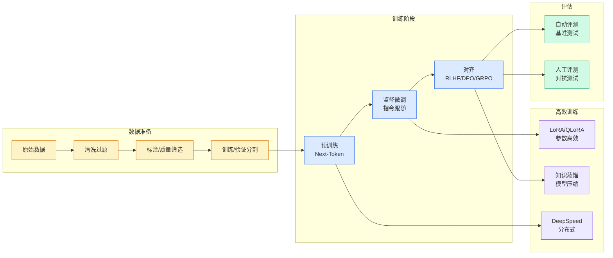

# 2026 年面向 LLM 的 RL 方法总结：从 PPO 到 DPO 到 GRPO，再到多智能体 RL

## Ch01.1049 2026 年面向 LLM 的 RL 方法总结：从 PPO 到 DPO 到 GRPO，再到多智能体 RL

> 📊 Level ⭐⭐ | 4.0KB | `entities/2026-llm-rl-algorithms-deeplog-imba-ppo-dpo-grpo-marl.md`

# 2026 年面向 LLM 的 RL 方法总结：从 PPO 到 DPO 到 GRPO，再到多智能体 RL

## 相关实体

- [让大模型学会「自己教自己」！京东&中科院信工所连发三篇论文定义self-taughtrlvr](ch01/888-self-taught-rlvr.html)
- [the distillation panic](ch01/642-the-distillation-panic.html)
→ [原文存档](https://github.com/QianJinGuo/wiki-book/tree/main/docs/raw/articles/2026-llm-rl-algorithms-deeplog-imba-ppo-dpo-grpo-marl.md)

- [MOC](https://github.com/QianJinGuo/wiki/blob/main/moc/llm-core-technology.md)
## 深度分析

2026 年面向 LLM 的 RL 方法总结：从 PPO 到 DPO 到 GRPO，再到多智能体 RL 涉及agent领域的核心技术议题。
### 核心观点
1. # 2026 年面向 LLM 的 RL 方法总结：从 PPO 到 DPO 到 GRPO，再到多智能体 RL
> 来源：DeepHub IMBA
> 本文约 8500 字，建议阅读 17 分钟
> 本文介绍了大模型 RL 五年迭代历程，解析主流算法优劣、场景与前沿技术栈。
2. 强化学习一直是个执着于游戏、机器人和控制回路的小众子领域，直到 ChatGPT 出现之后它就成了夹在"聪明的"基础模型与"有用的"产品之间的那一层。
3. 到现在差不多已经五年过去，整套流程至少被重写过三次；而被奖励的对象变化的程度甚至比执行奖励的算法本身还要剧烈。
4. 现在训练模型要回答的问题已经不是"要不要用 RL"，而是：哪一种 RL，基于什么信号，配多大的基础设施预算。
5. 会用一点篇幅讲历史，更多篇幅留给 PPO、DPO、GRPO 和 MARL——它们是什么、各自适合什么场景、实际中会在哪里坏掉，以及今天的开源技术栈大概长什么样。

### 内容结构
- 2026 年面向 LLM 的 RL 方法总结：从 PPO 到 DPO 到 GRPO，再到多智能体 RL
- 60 秒历史
- PPO + RLHF：一切的开始
- 它为什么可行
- 实操中为什么会有问题
- 什么场景下仍该用 PPO
- DPO：把奖励模型删掉？
- 跑起来需要三样东西

### 技术要点

- **agent架构**: 本文在agent方向提出的设计理念与实现路径
- **工程挑战**: 实际落地中面临的关键问题与应对策略
- **architecture趋势**: 相关技术演进方向与新兴范式
### 关联实体

- [Scale Robot Reinforcement Learning With Nvidia Isaac Lab On ](ch01/1170-scale-robot-reinforcement-learning-with-nvidia-isaac-lab-on.html)
- [Nvidia Isaac Lab Sagemaker Robot Rl Humanoid](https://github.com/QianJinGuo/wiki/blob/main/entities/nvidia-isaac-lab-sagemaker-robot-rl-humanoid.md)
- [Karpathy 最新访谈从 Vibe Coding 到 Agentic Engineering](../ch04/237-agentic.html)
- [Ethan He Cosmos Grok Imagine Latent Space Video Agent 20260606](../ch03/035-agent.html)
- [Karpathy Vibe Coding Agentic Engineering](../ch04/126-karpathy-vibe-coding-agentic-engineering.html)
- [存之有序治之有矩Agent 记忆系统的工程实践与演进](../ch03/035-agent.html)

## 实践启示
1. **工程落地**: agent领域方案需关注可观测性、可维护性和成本效率
2. **技术选型**: 根据场景选择合适的技术栈，避免过度设计或盲目追新
3. **持续迭代**: 建立数据驱动的反馈闭环，持续优化系统表现
4. **风险管控**: 引入新技术需评估对现有系统稳定性的影响，做好降级预案

---

