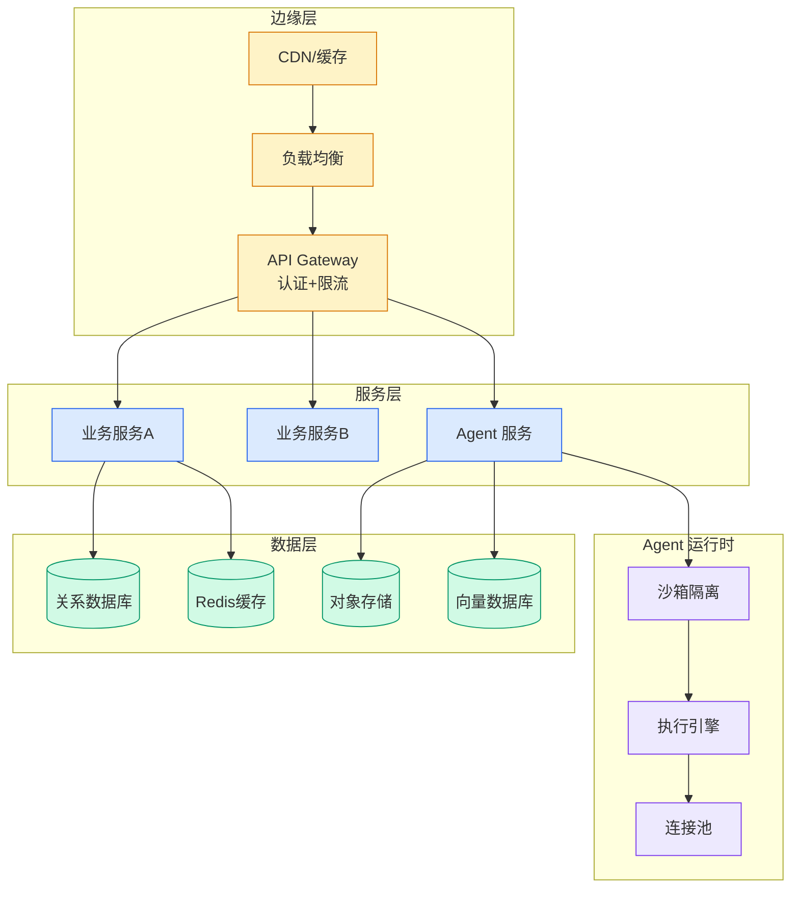

# 阿里重磅开源！OpenSandbox：专为 AI Agent 打造的下一代沙箱

## Ch01.1050 阿里重磅开源！OpenSandbox：专为 AI Agent 打造的下一代沙箱

> 📊 Level ⭐⭐ | 4.0KB | `entities/阿里重磅开源opensandbox专为-ai-agent-打造的下一代沙箱.md`

# 阿里重磅开源！OpenSandbox：专为 AI Agent 打造的下一代沙箱

**来源**: 阿里技术

**发布日期**: 2026-01-29

**原文链接**: https://mp.weixin.qq.com/s/zN8FidEku-a8rZ-DohPveQ

---

这是 2026 年的第 2 篇文章

（ 本文阅读时间：15分钟 ）

01

当 AI 需要执行代码时，我们该怎么办？

想象这样一个日常开发场景： 你正在使用 Claude Code 帮你重构一段清理逻辑，或者让 Gemini 写个自动化脚本处理数据，甚至是一个 LangGraph 驱动的 Agent 正在你的指令下调用系统 API。

你满怀期待地按下运行键，但危险往往就在这一刻： 如果 AI 在处理路径时产生了一个逻辑偏移，将清理范围锁定在了根目录；或者它引入的一个第三方库，在安装瞬间静默扫描了你的
.ssh
目录。

AI 生成的代码是一把双刃剑。
直接在宿主机“裸奔”，无异于将系统权限交给一个可能随时“幻觉”的黑盒。资源隔离、环境依赖、权限越权 —— 这些都是 AI 能力落地到真实环境时绕不开的挑战。

今天，我们正式开源 OpenSandbox —— 一个面向 AI 应用场景设计的「通用沙箱平台」，为大模型相关的能力提供安全、可靠的执行环境。

02

什么是 OpenSandbox？

OpenSandbox 是阿里巴巴开源的通用沙箱基础设施，专门为 AI 应用场景设计。它为大模型相关的能力 —— 命令执行、文件操作、代码执行、浏览器操作、Agent 运行等提供：

- 多语言 SDK
  ：Python、Java/Kotlin、JavaScript/TypeScript；

- 企业级并发调度能力
  ：
  基于 Kubernetes 的池化加速方案；

- 统一沙箱协议
  ：基于 OpenAPI 的标准化接口；

- 灵活运行时
  ：Docker 和 Kubernetes 双支持；

- 丰富沙箱环境
  ：代码解释器、浏览器自动化、远程开发环境。

03

六大核心亮点

3.1 多语言 SDK，开发者友好

无论你使用 Python、Java、Kotlin 还是 JavaScript/TypeScript，OpenSandbox 都提供了统一的 API 设计，跨语言一致性让你无缝切换。

以下为Python SDK示例，更多语言SDK示例请参考github项目空间。

import asynciofrom datetime import timedelta  
from code_interpreter import CodeInterpreter, SupportedLanguagefrom opensandbox import Sandboxfrom opensandbox.models import WriteEntry  
async def main() -> None:    # 1. Create a sandbox    sandbox = await Sandbox.create(        "sandbox-registry.cn-zhangjiakou.cr.aliyuncs.com/opensandbox/code-interpreter:latest",        entrypoint= ["/opt/opensandbox/code-interpreter.sh"],        env={"P

→ [原文存档](https://github.com/QianJinGuo/wiki-book/tree/main/docs/raw/articles/阿里重磅开源opensandbox专为-ai-agent-打造的下一代沙箱.md)

---
## 关联

- 相关概念: [Harness Engineering](https://github.com/QianJinGuo/wiki/blob/main/concepts/harness-engineering-framework.md)

---

