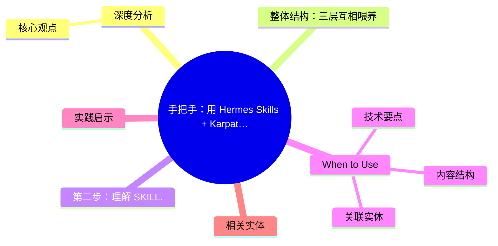
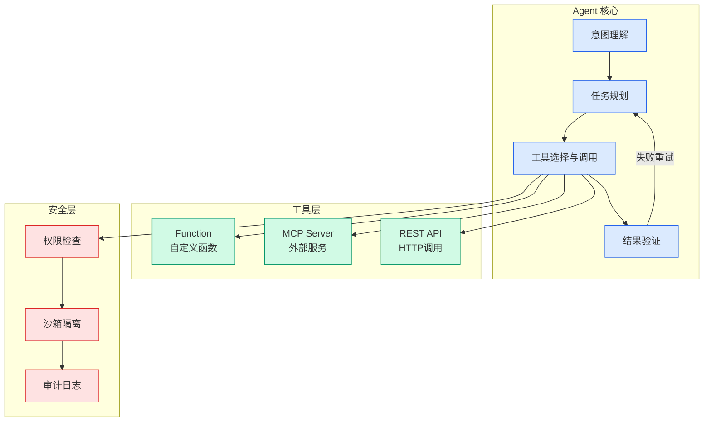

# 手把手：用 Hermes Skills + Karpathy 的 LLM Wiki 让 AI 越用越懂你

## Ch01.1055 手把手：用 Hermes Skills + Karpathy 的 LLM Wiki 让 AI 越用越懂你

> 📊 Level ⭐⭐ | 4.0KB | `entities/hermes-skills-llm-wiki-self-improving-knowledge-system.md`

# 手把手：用 Hermes Skills + Karpathy 的 LLM Wiki 让 AI 越用越懂你

→ [原文存档](https://github.com/QianJinGuo/wiki-book/tree/main/docs/raw/articles/hermes-skills-llm-wiki-self-improving-knowledge-system.md)

## 概念导图

## 深度分析

手把手：用 Hermes Skills + Karpathy 的 LLM Wiki 让 AI 越用越懂你 涉及agent领域的核心技术议题。
### 核心观点
1. # 手把手：用 Hermes Skills + Karpathy 的 LLM Wiki 让 AI 越用越懂你
## 整体结构：三层互相喂养

- **Memory**：记住你是谁（事实类）
- **Skills**：记住怎么干活（方法类）
- **Wiki**：目录把零散知识组织起来（空间+时间维度）
三者互相喂养，越用越厚。
2. ## 第一步：确认 Skills 目录存在
ls ~/.
3. hermes/skills/
# 如果不存在：
mkdir -p ~/.
4. hermes/skills/
## 第二步：理解 SKILL.
5. md 的结构
name: writing-pr-descriptions
description: "按团队规范写 PR 描述"
version: 1
## When to Use
当完成功能开发，准备提交 PR 的时候。

### 内容结构
- 手把手：用 Hermes Skills + Karpathy 的 LLM Wiki 让 AI 越用越懂你
- 整体结构：三层互相喂养
- 第一步：确认 Skills 目录存在
- 如果不存在：
- 第二步：理解 SKILL.md 的结构
- When to Use
- Procedure
- Pitfalls

### 技术要点

- **agent架构**: 本文在agent方向提出的设计理念与实现路径
- **工程挑战**: 实际落地中面临的关键问题与应对策略
- **aws趋势**: 相关技术演进方向与新兴范式
### 关联实体

- [存之有序治之有矩Agent 记忆系统的工程实践与演进](../ch03/035-agent.html)
- [Openclaw 完全指南这可能是全网最新最全的系统化教程了32W字建议收藏 V2](../ch11/235-openclaw.html)
- [Openclaw 完全指南这可能是全网最新最全的系统化教程了32W字建议收藏](../ch11/235-openclaw.html)
- [Scale Robot Reinforcement Learning With Nvidia Isaac Lab On ](ch01/1170-scale-robot-reinforcement-learning-with-nvidia-isaac-lab-on.html)
- [你不知道的 Agent原理架构与工程实践 V2](../ch03/035-agent.html)
- [Nvidia Isaac Lab Sagemaker Robot Rl Humanoid](https://github.com/QianJinGuo/wiki/blob/main/entities/nvidia-isaac-lab-sagemaker-robot-rl-humanoid.md)

## 实践启示
1. **工程落地**: agent领域方案需关注可观测性、可维护性和成本效率
2. **技术选型**: 根据场景选择合适的技术栈，避免过度设计或盲目追新
3. **持续迭代**: 建立数据驱动的反馈闭环，持续优化系统表现
4. **风险管控**: 引入新技术需评估对现有系统稳定性的影响，做好降级预案

## 相关实体

- [MOC](https://github.com/QianJinGuo/wiki/blob/main/moc/data-infrastructure.md)

---

