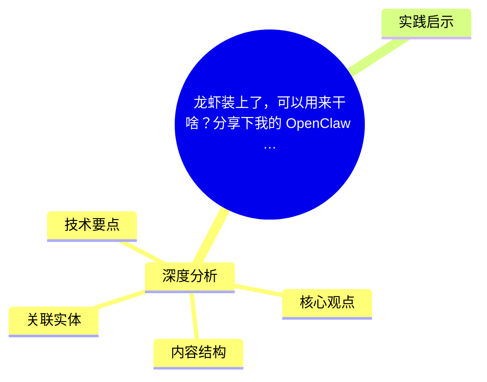
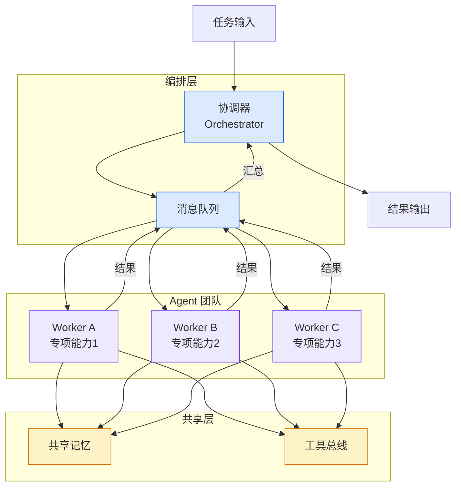

# 龙虾装上了，可以用来干啥？分享下我的 OpenClaw 多智能体团队搭建经验！

## Ch01.1058 龙虾装上了，可以用来干啥？分享下我的 OpenClaw 多智能体团队搭建经验！

> 📊 Level ⭐⭐ | 4.0KB | `entities/龙虾装上了可以用来干啥分享下我的-openclaw-多智能体团队搭建经验-v2.md`

# 龙虾装上了，可以用来干啥？分享下我的 OpenClaw 多智能体团队搭建经验！

→ [原文存档](https://github.com/QianJinGuo/wiki-book/tree/main/docs/raw/articles/龙虾装上了可以用来干啥分享下我的-openclaw-多智能体团队搭建经验-v2.md)

## 概念导图

## 深度分析

分享下我的 OpenClaw 多智能体团队搭建经验！

### 核心观点

1. 大家好，欢迎来到 code秘密花园，我是花园老师（ConardLi）
最近观察到一个有意思的现象。
2. 自从龙虾（OpenClaw）火起来之后，身边越来越多朋友装上了它。
3. 之前我发布的 OpenClaw 完全指南（  OpenClaw 完全指南：这可能是全网最新最全的系统化教程了  ），虽然是一篇技术教程，但居然有 7.
4. 大部分人的使用路径惊人地相似 — 废了好大劲装好了，也能在飞书和它聊天了，然后…… 就没有然后了。
5. 这是很多新用户都会经历的阶段。

### 内容结构

- 龙虾装上了，可以用来干啥？分享下我的 OpenClaw 多智能体团队搭建经验！
- 花园多智能体团队概览
- 花园生图助手
- 花园资讯助手
- 花园开发助手
- 花园投资助手
- 花园社区助手
- 花园写作助手
- 花园智能专家
- 为什么不做一个全能 Agent?

### 技术要点

- **agent架构**: 本文在agent方向提出的设计理念与实现路径
- **工程挑战**: 实际落地中面临的关键问题与应对策略
- **architecture趋势**: 相关技术演进方向与新兴范式

### 关联实体

- [Openclaw 完全指南这可能是全网最新最全的系统化教程了32W字建议收藏 V2](../ch11/235-openclaw.html)
- [Openclaw 完全指南这可能是全网最新最全的系统化教程了32W字建议收藏](../ch11/235-openclaw.html)
- [Aliyun Mse Ai Task Scheduling Agent Sandbox Cost 90 Percent](../ch03/035-agent.html)
- [构建无服务器Kiro调度平台用Kiro Cli Eventbridge Ecs Fargate实现定时Ai任务](../ch05/094-ai.html)
- [Anthropic Institute When Ai Builds Itself Jiagoux Interpretation](ch01/989-anthropic.html)
- [Harness Engineering Core Patterns Claude Code](../ch05/120-harness-engineering.html)

## 实践启示

1. **Agent 设计**: 关注控制流与上下文工程的平衡，Harness 约束比模型能力更影响成功率
2. **可观测性**: Agent 行为调试应优先检查工具定义和上下文质量
3. **渐进式部署**: 从简单 ReAct 循环起步，逐步引入多 Agent 编排
4. **验证优先**: 建立完善的测试验证体系，确保 Agent 行为可预测

---

