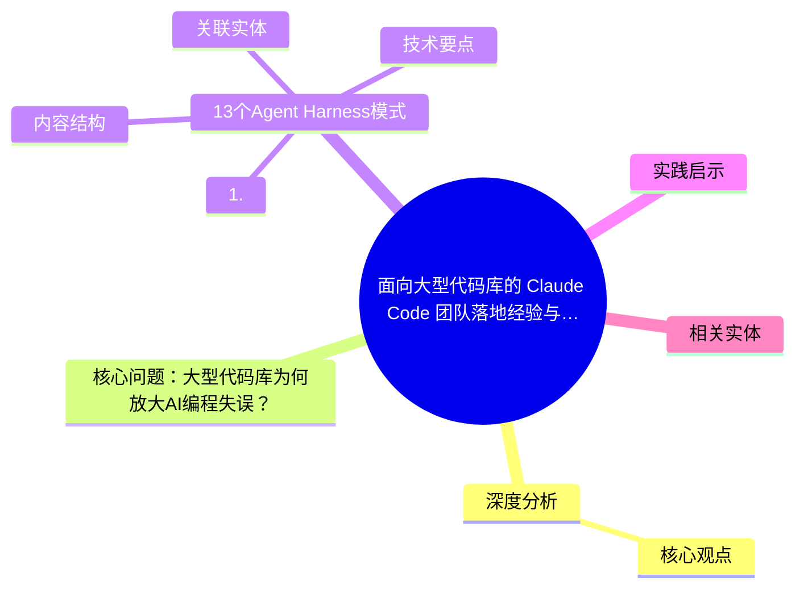
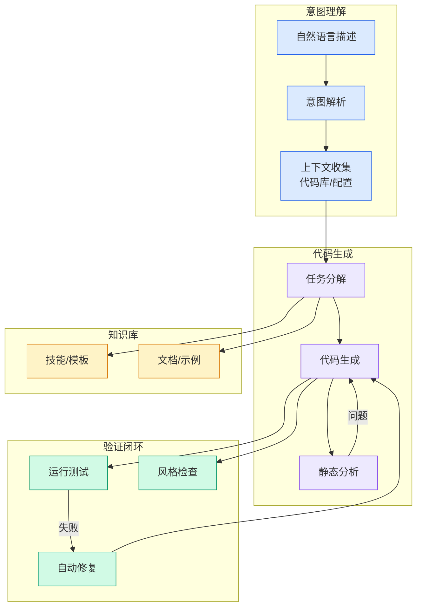

# 面向大型代码库的 Claude Code 团队落地经验与扩展策略（Agent Harness）

## Ch01.1072 面向大型代码库的 Claude Code 团队落地经验与扩展策略（Agent Harness）

> 📊 Level ⭐⭐ | 3.9KB | `entities/claude-code-large-codebase-agent-harness-13-patterns-tuutuiagi.md`

# 面向大型代码库的 Claude Code 团队落地经验与扩展策略（Agent Harness）

→ [原文存档](https://github.com/QianJinGuo/wiki-book/tree/main/docs/raw/articles/claude-code-large-codebase-agent-harness-13-patterns-tuutuiagi.md)

## 概念导图

## 深度分析

面向大型代码库的 Claude Code 团队落地经验与扩展策略（Agent Harness） 涉及agent领域的核心技术议题。
### 核心观点
1. # 面向大型代码库的 Claude Code 团队落地经验与扩展策略（Agent Harness）
## 核心问题：大型代码库为何放大AI编程失误？

2. 先让它找对地方：入口、目录边界、owner、噪音过滤
2.
3. 再让会话保持有效：任务知识、工具调用和自动检查按需加载
3.
4. 最后把个人经验变成团队资产：配置、流程和治理要能复制
## 13个Agent Harness模式
### 1.
5. 上下文级联模式（Context Cascade Pattern）
在不同目录层级放置不同职责的 `CLAUDE.

### 内容结构
- 面向大型代码库的 Claude Code 团队落地经验与扩展策略（Agent Harness）
- 核心问题：大型代码库为何放大AI编程失误？
- 13个Agent Harness模式
- 1. 上下文级联模式（Context Cascade Pattern）
- 2. 仓库地图模式（Repo Map Pattern）
- 3. 噪音过滤模式（Noise Filter Pattern）
- 4. 符号查找模式（Symbol Lookup Pattern）
- 5. 即时加载Skill模式（Just-in-Time Skill Pattern）

### 技术要点

- **agent架构**: 本文在agent方向提出的设计理念与实现路径
- **工程挑战**: 实际落地中面临的关键问题与应对策略
- **claude趋势**: 相关技术演进方向与新兴范式
### 关联实体

- [Openclaw 完全指南这可能是全网最新最全的系统化教程了32W字建议收藏 V2](../ch11/235-openclaw.html)
- [Openclaw 完全指南这可能是全网最新最全的系统化教程了32W字建议收藏](../ch11/235-openclaw.html)
- [深入理解 Claude Code 源码中的 Agent Harness 构建之道](../ch05/058-agent-harness.html)
- [Ethan He Cosmos Grok Imagine Latent Space Video Agent 20260606](../ch03/035-agent.html)
- [一文带你弄懂 Ai 圈爆火的新概念Harness Engineering](../ch05/120-harness-engineering.html)
- [两万字详解Claude Code源码核心机制](../ch03/078-claude-code.html)

## 实践启示
1. **工程落地**: agent领域方案需关注可观测性、可维护性和成本效率
2. **技术选型**: 根据场景选择合适的技术栈，避免过度设计或盲目追新
3. **持续迭代**: 建立数据驱动的反馈闭环，持续优化系统表现
4. **风险管控**: 引入新技术需评估对现有系统稳定性的影响，做好降级预案

## 相关实体

- [MOC](https://github.com/QianJinGuo/wiki/blob/main/moc/memory-context-systems.md)

---

