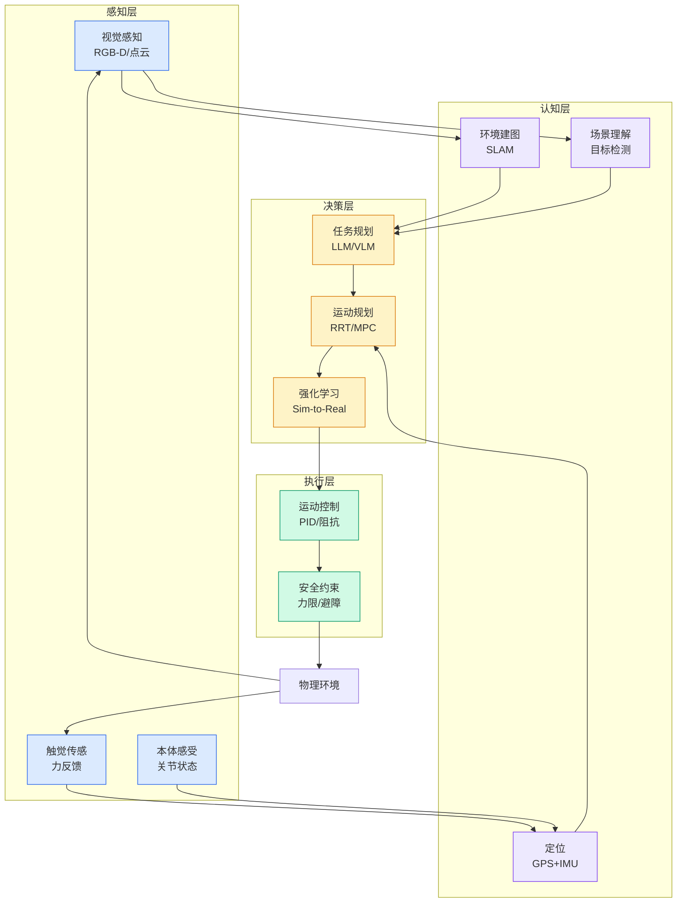

# DeepSeek V4 (Flash & Pro) ：通往百万级上下文与万亿参数推理的新纪元

## Ch01.1073 DeepSeek V4 (Flash & Pro) ：通往百万级上下文与万亿参数推理的新纪元

> 📊 Level ⭐⭐ | 3.9KB | `entities/deepseek-v4-flash-pro-通往百万级上下文与万亿参数推理的新纪元.md`

# DeepSeek V4 (Flash & Pro) ：通往百万级上下文与万亿参数推理的新纪元

## 相关实体

- [读完这篇，你就搞懂 deepseek v4 了](ch01/1151-deepseek-v4.html)
→ [原文存档](https://github.com/QianJinGuo/wiki-book/tree/main/docs/raw/articles/deepseek-v4-flash-pro-通往百万级上下文与万亿参数推理的新纪元.md)

- [MOC](https://github.com/QianJinGuo/wiki/blob/main/moc/observability-monitoring.md)
## 深度分析

DeepSeek V4 (Flash & Pro) ：通往百万级上下文与万亿参数推理的新纪元 涉及agent领域的核心技术议题。
### 核心观点
1. # DeepSeek V4 (Flash & Pro) ：通往百万级上下文与万亿参数推理的新纪元
在 2026 年 4 月 24 日，全球人工智能领域见证了一场具有里程碑意义的发布。
2. DeepSeek 实验室正式推出了其第四代旗舰模型——DeepSeek V4 系列，包含专注于极致推理与长文本理解的 DeepSeek-V4-Pro，以及致力于高吞吐、低延迟性价比的 DeepSeek-V4-Flash。
3. 这一发布不仅是参数规模的又一次飞跃，更是推理经济学（Inference Economics）的一次彻底革命。
4. 通过创新的混合注意力架构（Hybrid Attention Architecture）、流形约束超连接（mHC）以及 Muon 优化器，DeepSeek V4 将百万令牌（1M Tokens）的上下文窗口推向了标准化生产阶段，彻底打破了此前长文本推理在显存占用与计算成本上的双重瓶颈。
5. ##  ** 核心技术突破：“不公平优势”的架构解析  **
DeepSeek V4 的核心突破在于其架构层面的深层革新，这种优势被业界称为“不公平优势”，因为它在保持甚至超越硅谷顶级闭源模型性能的同时，实现了推理成本的数量级下降。

### 内容结构
- DeepSeek V4 (Flash & Pro) ：通往百万级上下文与万亿参数推理的新纪元
- ** 核心技术突破：“不公平优势”的架构解析  **
- ** 混合注意力机制：CSA 与 HCA 的协同逻辑  **
- ** 流形约束超连接（mHC）：万亿规模的稳定性保障  **
- ** Muon 优化器：超越 AdamW 的收敛效率  **
- ** 技术规格与性能基准：量化智能的巅峰  **
- ** 核心参数规格表  **
- ** 性能基准：编码与逻辑推理的统治地位  **

### 技术要点

- **agent架构**: 本文在agent方向提出的设计理念与实现路径
- **工程挑战**: 实际落地中面临的关键问题与应对策略
- **architecture趋势**: 相关技术演进方向与新兴范式
### 关联实体

- [Scale Robot Reinforcement Learning With Nvidia Isaac Lab On ](ch01/1170-scale-robot-reinforcement-learning-with-nvidia-isaac-lab-on.html)
- [Nvidia Isaac Lab Sagemaker Robot Rl Humanoid](https://github.com/QianJinGuo/wiki/blob/main/entities/nvidia-isaac-lab-sagemaker-robot-rl-humanoid.md)
- [Openclaw 完全指南这可能是全网最新最全的系统化教程了32W字建议收藏 V2](../ch11/235-openclaw.html)
- [Openclaw 完全指南这可能是全网最新最全的系统化教程了32W字建议收藏](../ch11/235-openclaw.html)
- [Ethan He Cosmos Grok Imagine Latent Space Video Agent 20260606](../ch03/035-agent.html)
- [存之有序治之有矩Agent 记忆系统的工程实践与演进](../ch03/035-agent.html)

## 实践启示
1. **工程落地**: agent领域方案需关注可观测性、可维护性和成本效率
2. **技术选型**: 根据场景选择合适的技术栈，避免过度设计或盲目追新
3. **持续迭代**: 建立数据驱动的反馈闭环，持续优化系统表现
4. **风险管控**: 引入新技术需评估对现有系统稳定性的影响，做好降级预案

---

