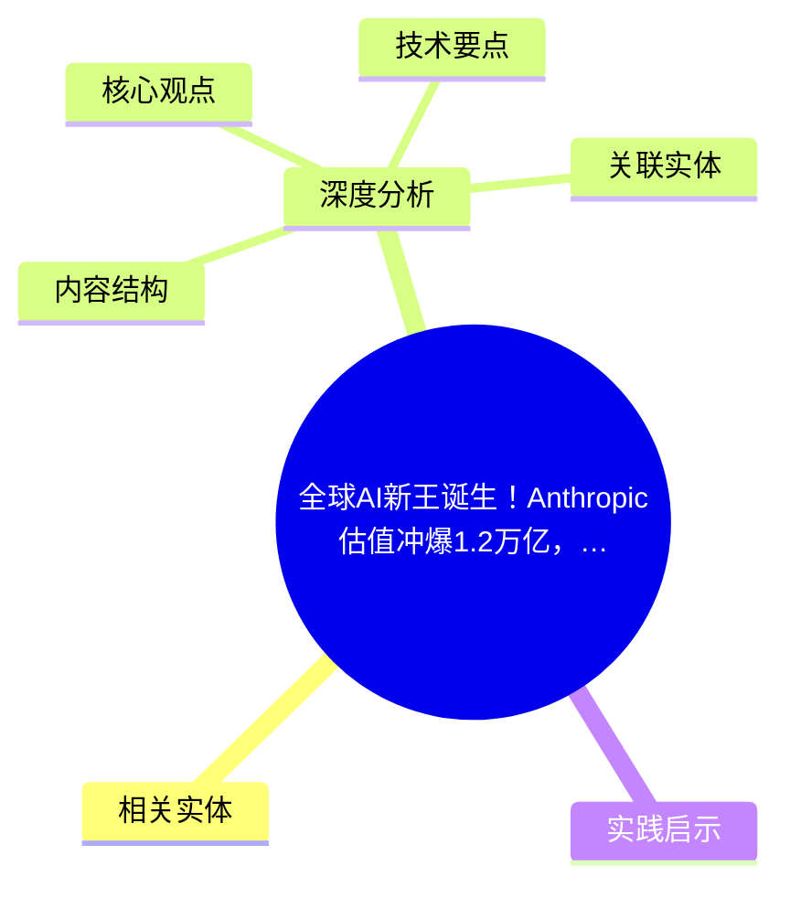
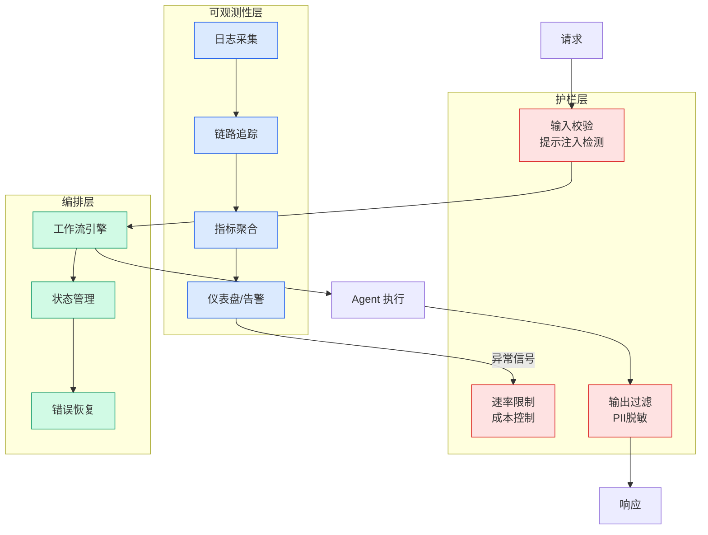

# 全球AI新王诞生！Anthropic估值冲爆1.2万亿，首次反超OpenAI

## Ch01.1075 全球AI新王诞生！Anthropic估值冲爆1.2万亿，首次反超OpenAI

> 📊 Level ⭐⭐ | 3.9KB | `entities/全球ai新王诞生anthropic估值冲爆12万亿首次反超openai.md`

# 全球AI新王诞生！Anthropic估值冲爆1.2万亿，首次反超OpenAI

## 概念导图

## 相关实体

- [被裁了想转 ai agent？先看面试官到底在筛你哪 7 样东西](../ch03/035-agent.html)
- [试用 amazon bedrock 中的新控制台体验：该体验针对兼容 anthropic 和 openai 的 api](../ch11/295-amazon-bedrock.html)
→ [原文存档](https://github.com/QianJinGuo/wiki-book/tree/main/docs/raw/articles/全球ai新王诞生anthropic估值冲爆12万亿首次反超openai.md)

## 深度分析

全球AI新王诞生！Anthropic估值冲爆1.2万亿，首次反超OpenAI 涉及agent领域的核心技术议题。
### 核心观点
1. Anthropic估值冲爆1.
2. 2万亿，首次反超OpenAI
** ** ** 新智元报道  **
编辑：Aeneas
#####  ** 【新智元导读】  1.
3. Anthropic 估值正式反超OpenAI，硅谷局势彻底变了！
4. 手握马斯克的22万张顶级GPU，以及谷歌2000亿美元的长约，这场万亿美金级别的史诗级豪赌，正带我们见证硅谷商业史上最疯狂的「王位更替」。
5. **
就在刚刚，全球AI新王诞生！

### 内容结构
- 全球AI新王诞生！Anthropic估值冲爆1.2万亿，首次反超OpenAI
- ###
- 现在，Anthropic和OpenAI都计划在2029年前上市。商业史上的新神话，仿佛就在眼前。

### 技术要点

- **agent架构**: 本文在agent方向提出的设计理念与实现路径
- **工程挑战**: 实际落地中面临的关键问题与应对策略
- **anthropic趋势**: 相关技术演进方向与新兴范式
### 关联实体

- [Openclaw 完全指南这可能是全网最新最全的系统化教程了32W字建议收藏 V2](../ch11/235-openclaw.html)
- [Karpathy 最新访谈从 Vibe Coding 到 Agentic Engineering](../ch04/237-agentic.html)
- [Openclaw 完全指南这可能是全网最新最全的系统化教程了32W字建议收藏](../ch11/235-openclaw.html)
- [Ethan He Cosmos Grok Imagine Latent Space Video Agent 20260606](../ch03/035-agent.html)
- [Karpathy Vibe Coding Agentic Engineering](../ch04/126-karpathy-vibe-coding-agentic-engineering.html)
- [两万字详解Claude Code源码核心机制](../ch03/078-claude-code.html)

## 实践启示
1. **工程落地**: agent领域方案需关注可观测性、可维护性和成本效率
2. **技术选型**: 根据场景选择合适的技术栈，避免过度设计或盲目追新
3. **持续迭代**: 建立数据驱动的反馈闭环，持续优化系统表现
4. **风险管控**: 引入新技术需评估对现有系统稳定性的影响，做好降级预案

---

