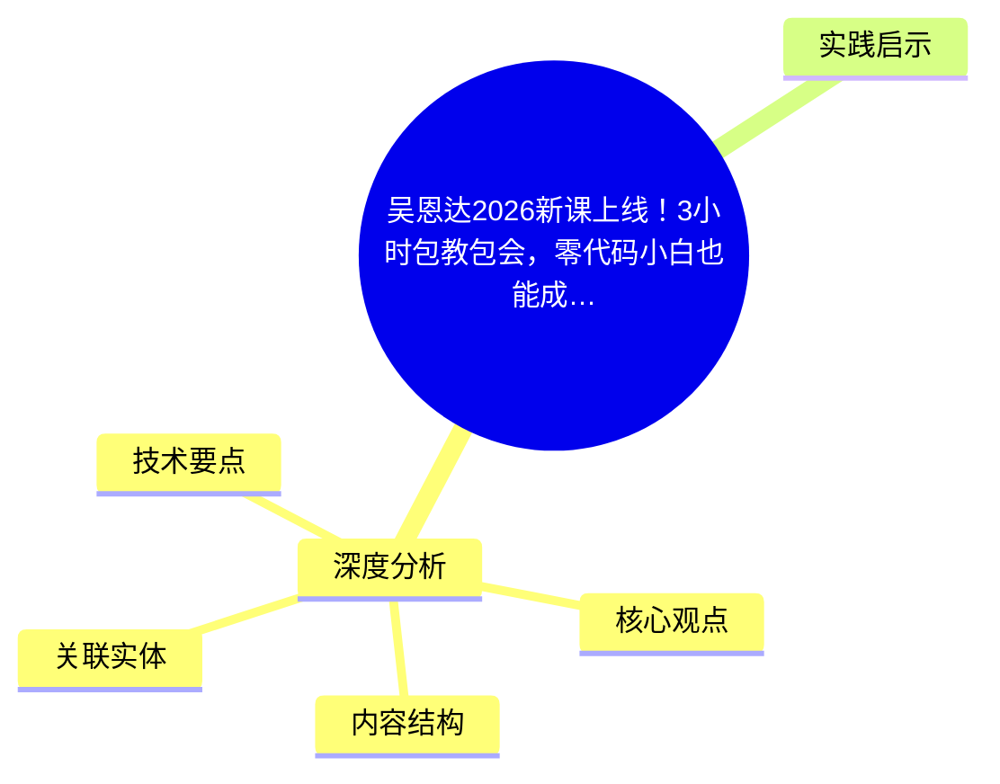
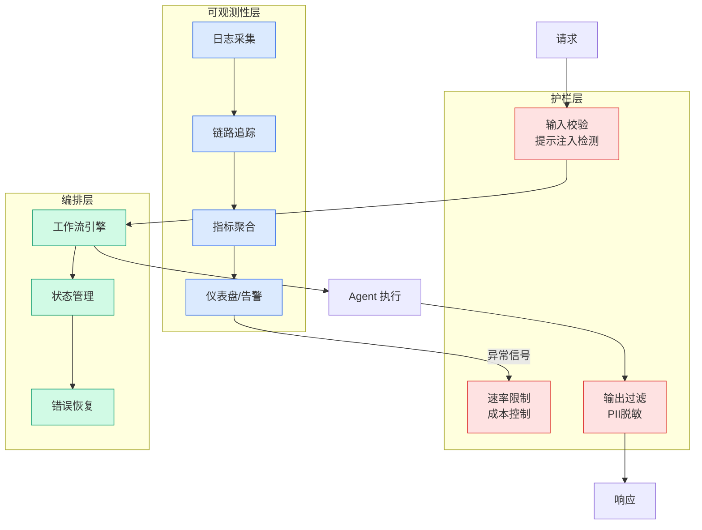

# 吴恩达2026新课上线！3小时包教包会，零代码小白也能成为AI超级玩家

## Ch01.1078 吴恩达2026新课上线！3小时包教包会，零代码小白也能成为AI超级玩家

> 📊 Level ⭐⭐ | 3.9KB | `entities/吴恩达2026新课上线3小时包教包会零代码小白也能成为ai超级玩家.md`

# 吴恩达2026新课上线！3小时包教包会，零代码小白也能成为AI超级玩家

→ [原文存档](https://github.com/QianJinGuo/wiki-book/tree/main/docs/raw/articles/吴恩达2026新课上线3小时包教包会零代码小白也能成为ai超级玩家.md)

## 概念导图

## 深度分析

吴恩达2026新课上线！3小时包教包会，零代码小白也能成为AI超级玩家 涉及code领域的核心技术议题。
### 核心观点
1. 3小时包教包会，零代码小白也能成为AI超级玩家
↑阅读之前记得关注+星标⭐️，😄，每天才能第一时间接收到更新
吴恩达老师又出新课了。
2. 5月1号刚刚上线的
这次教的是提示词。
3. 课程名叫 AI Prompting for Everyone，在 DeepLearning.
4. AI 平台上线，由吴恩达本人主讲，面向所有人，不需要任何技术背景。
5. 他在课程介绍开头说了一句话：2026年我们使用AI的方式，已经和2022年ChatGPT刚出来时大不相同了。

### 内容结构
- 吴恩达2026新课上线！3小时包教包会，零代码小白也能成为AI超级玩家
- 第一个模块：找信息
- 第二个模块：AI作为思维伙伴
- 第三个模块：多媒体与代码

### 技术要点

- **code架构**: 本文在code方向提出的设计理念与实现路径
- **工程挑战**: 实际落地中面临的关键问题与应对策略
- **data趋势**: 相关技术演进方向与新兴范式
### 关联实体

- [Ethan He Cosmos Grok Imagine Latent Space Video Agent 20260606](../ch03/035-agent.html)
- [Karpathy 最新访谈从 Vibe Coding 到 Agentic Engineering](../ch04/237-agentic.html)
- [Karpathy Vibe Coding Agentic Engineering](../ch04/126-karpathy-vibe-coding-agentic-engineering.html)
- [Scale Robot Reinforcement Learning With Nvidia Isaac Lab On ](ch01/1170-scale-robot-reinforcement-learning-with-nvidia-isaac-lab-on.html)
- [你不知道的 Agent原理架构与工程实践 V2](../ch03/035-agent.html)
- [Nvidia Isaac Lab Sagemaker Robot Rl Humanoid](https://github.com/QianJinGuo/wiki/blob/main/entities/nvidia-isaac-lab-sagemaker-robot-rl-humanoid.md)

## 实践启示

1. **工程落地**: code领域方案需关注可观测性、可维护性和成本效率
2. **技术选型**: 根据场景选择合适的技术栈，避免过度设计或盲目追新
3. **持续迭代**: 建立数据驱动的反馈闭环，持续优化系统表现
4. **风险管控**: 引入新技术需评估对现有系统稳定性的影响，做好降级预案

---

