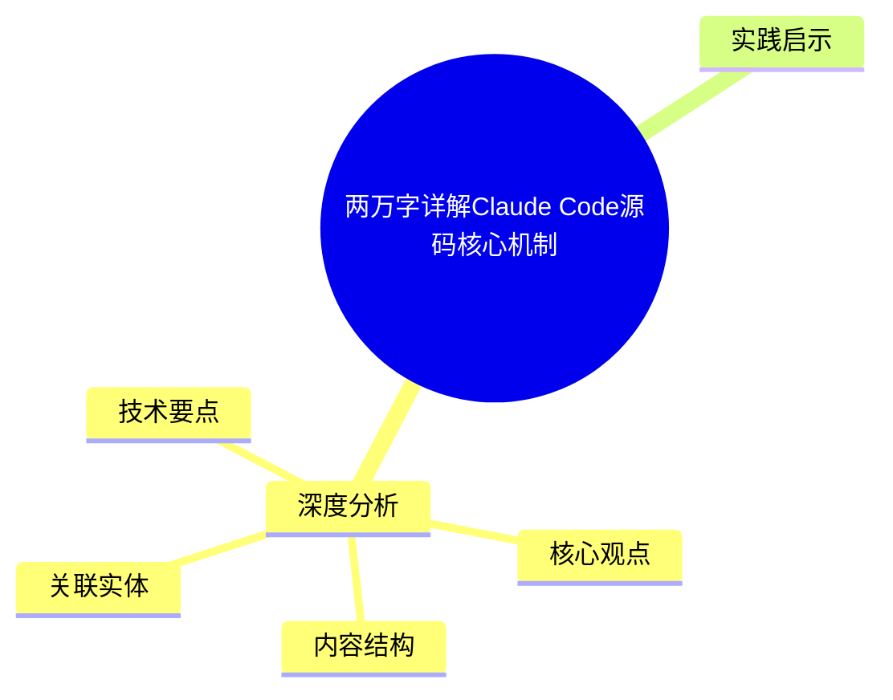
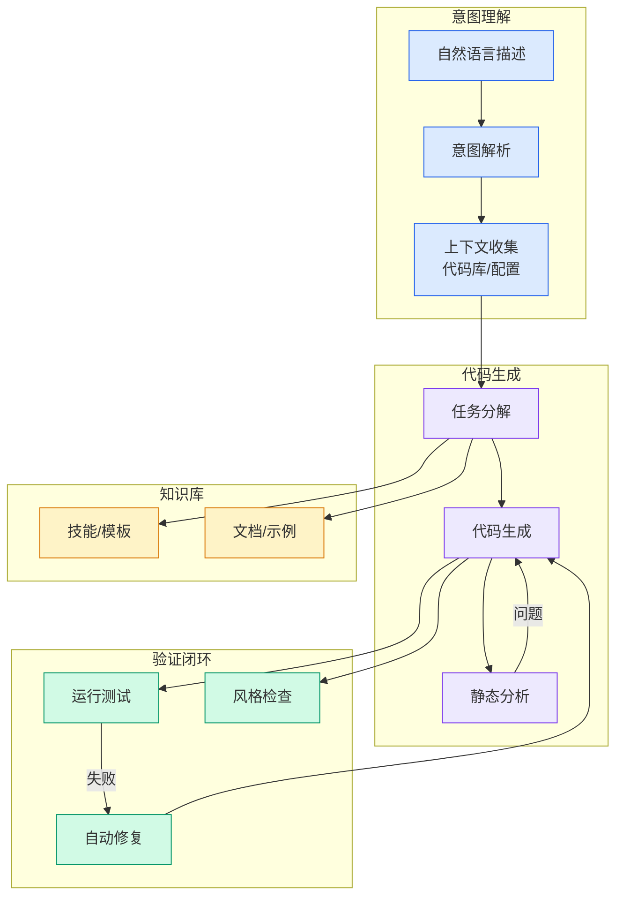

# 两万字详解Claude Code源码核心机制

## Ch01.1082 两万字详解Claude Code源码核心机制

> 📊 Level ⭐⭐ | 3.8KB | `entities/两万字详解claude-code源码核心机制.md`

# 两万字详解Claude Code源码核心机制

→ [原文存档](https://github.com/QianJinGuo/wiki-book/tree/main/docs/raw/articles/两万字详解claude-code源码核心机制.md)

## 概念导图

## 深度分析

source: wechat
source_url: https://mp.

### 核心观点

1. com/s/bMjXlD-OcnFW-wuN1yW8FA
ingested: 2026-05-16
feed_name: 炼钢AI
wechat_mp_fakeid: MP_WXS_3942529661
source_published: 2026-04-01
# 两万字详解Claude Code源码核心机制
本文对Claude Code的核心机制实现上进行详解，包括system prompt、tool、context管理、sub agent、MCP等。
2. 除此之外，在一些模块，会将Claude Code和OpenCode、Gemini-CLI、Codex等其他开源agent脚手架进行横向对比。
3. 总体来讲，Claude Code各种机制处理的细致程度还是要比其他开源框架强不少的。
4. System Prompt
大多数 AI 编程工具的 system prompt 是一段写死的文本，启动时原样注入，整个会话中保持不变。
5. Claude Code 的做法不同——它的 system prompt 是  ** 运行时动态组装  ** 的，每次会话启动时由  ` buildEffectiveSystemPrompt  ` 函数现场构建，最终内容取决于当前环境、工具集、MCP 连接状态，以及用户的配置覆盖。

### 内容结构

- 两万字详解Claude Code源码核心机制
- 1.System Prompt
- 默认 Prompt 写了什么
- 运行时动态注入
- 与其他框架对比
- 2.工具
- 并发调度：isConcurrencySafe
- 延迟加载：shouldDefer + ToolSearch
- 工具结果大小控制
- 权限检查

### 技术要点

- **agent架构**: 本文在agent方向提出的设计理念与实现路径
- **工程挑战**: 实际落地中面临的关键问题与应对策略
- **architecture趋势**: 相关技术演进方向与新兴范式

### 关联实体

- [Hermes Agent V014 Architecture Shugex](../ch03/096-hermes-agent.html)
- [Claude Code Team 10 Tips Boris Data派Thu](../ch03/078-claude-code.html)
- [Hermes Agent Soul Md Personality Shugex](../ch03/096-hermes-agent.html)
- [Imclaw通过微信飞书操控Claudecodecodexgeminiclipi Agent蜂群](../ch04/348-pi-agent.html)
- [深入理解 Claude Code 源码中的 Agent Harness 构建之道](../ch05/058-agent-harness.html)
- [Anthropic Institute When Ai Builds Itself Jiagoux Interpretation](ch01/989-anthropic.html)

## 实践启示

1. **Agent 设计**: 关注控制流与上下文工程的平衡，Harness 约束比模型能力更影响成功率
2. **可观测性**: Agent 行为调试应优先检查工具定义和上下文质量
3. **渐进式部署**: 从简单 ReAct 循环起步，逐步引入多 Agent 编排
4. **验证优先**: 建立完善的测试验证体系，确保 Agent 行为可预测

---

