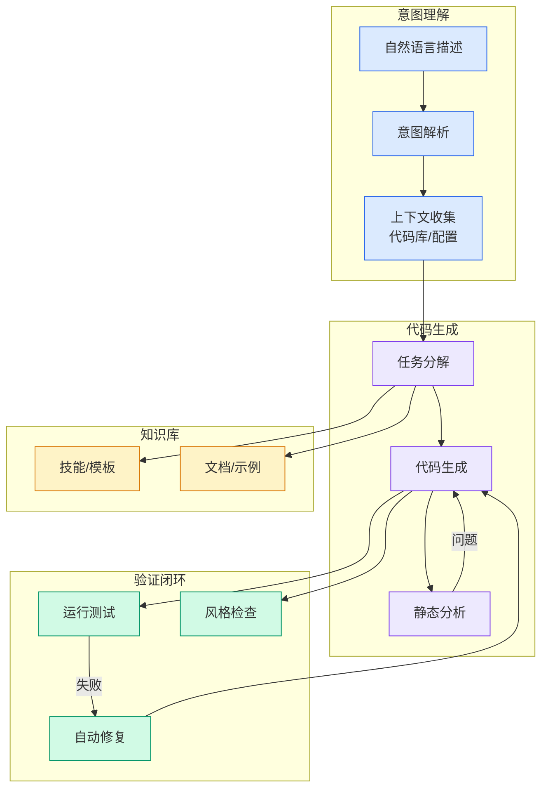

# Building is just the beginning: Introducing Discoverability | Lovable

## Ch01.1083 Building is just the beginning: Introducing Discoverability | Lovable

> 📊 Level ⭐⭐ | 3.8KB | `entities/lovable-building-is-just-the-beginning-introducing-discoverability.md`

# Building is just the beginning: Introducing Discoverability | Lovable

→ [原文存档](https://github.com/QianJinGuo/wiki-book/tree/main/docs/raw/articles/lovable-building-is-just-the-beginning-introducing-discoverability.md)

## 深度分析

Building is just the beginning: Introducing Discoverability | Lovable 涉及code领域的核心技术议题。
### 核心观点
1. Markdown Content:
# Building is just the beginning: Introducing Discoverability | Lovable
Skip to main content

Get started
 never been harder.
4. Today we’re introducing discoverability capabilities directly within the Lovable product experience.
5. Your app now ships with the ability to be read and ranked by search engines, and with Semrush built in, you can see how it's showing up across search.

### 内容结构
- Building is just the beginning: Introducing Discoverability | Lovable
- Building is just the beginning: Introducing Discoverability
- Built to be discovered from day one
- World class search intelligence, built in
- See what's working, fix what's not
- Share this
- Related articles
- Idea to app in seconds

### 技术要点

- **code架构**: 本文在code方向提出的设计理念与实现路径
- **工程挑战**: 实际落地中面临的关键问题与应对策略
- **data趋势**: 相关技术演进方向与新兴范式
### 关联实体

- [Ethan He Cosmos Grok Imagine Latent Space Video Agent 20260606](../ch03/035-agent.html)
- [一文带你弄懂 Ai 圈爆火的新概念Harness Engineering](../ch05/120-harness-engineering.html)
- [两万字详解Claude Code源码核心机制](../ch03/078-claude-code.html)
- [Karpathy 最新访谈从 Vibe Coding 到 Agentic Engineering](../ch04/237-agentic.html)
- [Openclaw 完全指南这可能是全网最新最全的系统化教程了32W字建议收藏](../ch11/235-openclaw.html)
- [Karpathy Vibe Coding Agentic Engineering](../ch04/126-karpathy-vibe-coding-agentic-engineering.html)

## 实践启示

1. **工程落地**: code领域方案需关注可观测性、可维护性和成本效率
2. **技术选型**: 根据场景选择合适的技术栈，避免过度设计或盲目追新
3. **持续迭代**: 建立数据驱动的反馈闭环，持续优化系统表现
4. **风险管控**: 引入新技术需评估对现有系统稳定性的影响，做好降级预案

## 相关实体

- [MOC](https://github.com/QianJinGuo/wiki/blob/main/moc/reinforcement-learning-rlhf.md)

---

