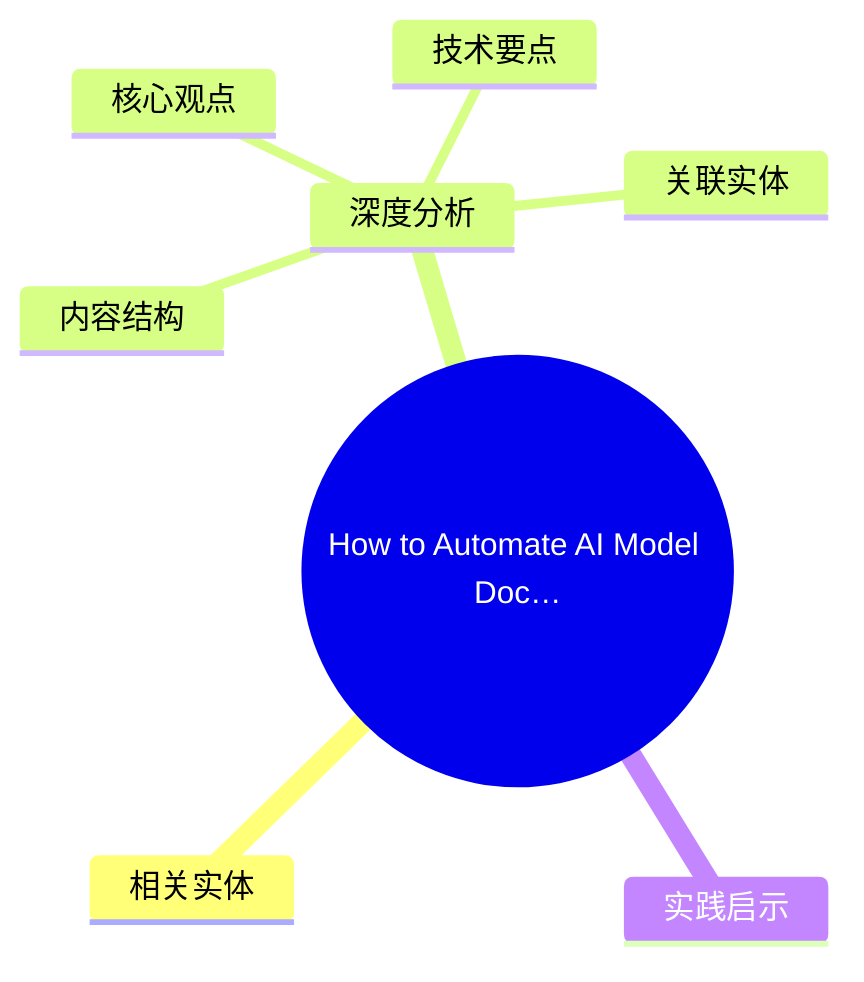
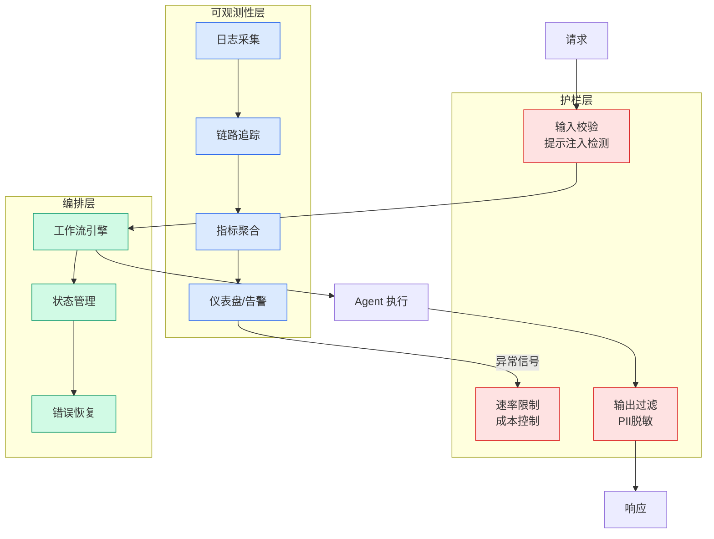

# How to Automate AI Model Documentation with the NVIDIA MCG Toolkit

## Ch01.1084 How to Automate AI Model Documentation with the NVIDIA MCG Toolkit

> 📊 Level ⭐⭐ | 3.8KB | `entities/how-to-automate-ai-model-documentation-with-the-nvidia-mcg-t-806efb.md`

# How to Automate AI Model Documentation with the NVIDIA MCG Toolkit

## 概念导图

## 相关实体

- [stealing passwords via html injection under a strict csp](https://github.com/QianJinGuo/wiki/blob/main/entities/afine-csp-html-injection-password-exfiltration.md)
- [reducing container cold start times using soci index on dlam](ch01/1198-reducing-container-cold-start-times-using-soci-index-on-dlam.html)
- [大模型可控新突破：steering 机制、评估体系与开源落地](ch01/1019-steering.html)
→ [原文存档](https://github.com/QianJinGuo/wiki-book/tree/main/docs/raw/articles/how-to-automate-ai-model-documentation-with-the-nvidia-mcg-t-806efb.md)

- [MOC](https://github.com/QianJinGuo/wiki/blob/main/moc/data-infrastructure.md)
## 深度分析

How to Automate AI Model Documentation with the NVIDIA MCG Toolkit 涉及architecture领域的核心技术议题。
### 核心观点
1. Model cards describe how a model works, its intended use and license, training data, performance, and limitations.
2. They promote transparency and accountability so downstream users—customers, regulators, and affected communities—can make informed decisions when selecting and deploying AI.
3. That audience extends beyond developers: Policymakers, procurement teams, and risk assessors rely on model cards to evaluate fitness for use and compare models across vendors.
4. In practice, creating model cards manually is tedious and slow.
5. Documentation lags behind development, and metadata is often outdated by ship date.

### 内容结构
- How to Automate AI Model Documentation with the NVIDIA MCG Toolkit

### 技术要点

- **architecture架构**: 本文在architecture方向提出的设计理念与实现路径
- **工程挑战**: 实际落地中面临的关键问题与应对策略
- **code趋势**: 相关技术演进方向与新兴范式
### 关联实体

- [Karpathy 最新访谈从 Vibe Coding 到 Agentic Engineering](../ch04/237-agentic.html)
- [Openclaw 完全指南这可能是全网最新最全的系统化教程了32W字建议收藏](../ch11/235-openclaw.html)
- [Karpathy Vibe Coding Agentic Engineering](../ch04/126-karpathy-vibe-coding-agentic-engineering.html)
- [Agentops Operationalize Agentic Ai At Scale With Amazon Bedr](../ch04/299-agentops-operationalize-agentic-ai-at-scale-with-amazon-bed.html)
- [存之有序治之有矩Agent 记忆系统的工程实践与演进](../ch03/035-agent.html)
- [Scale Robot Reinforcement Learning With Nvidia Isaac Lab On ](ch01/1170-scale-robot-reinforcement-learning-with-nvidia-isaac-lab-on.html)

## 实践启示
1. **工程落地**: architecture领域方案需关注可观测性、可维护性和成本效率
2. **技术选型**: 根据场景选择合适的技术栈，避免过度设计或盲目追新
3. **持续迭代**: 建立数据驱动的反馈闭环，持续优化系统表现
4. **风险管控**: 引入新技术需评估对现有系统稳定性的影响，做好降级预案

---

