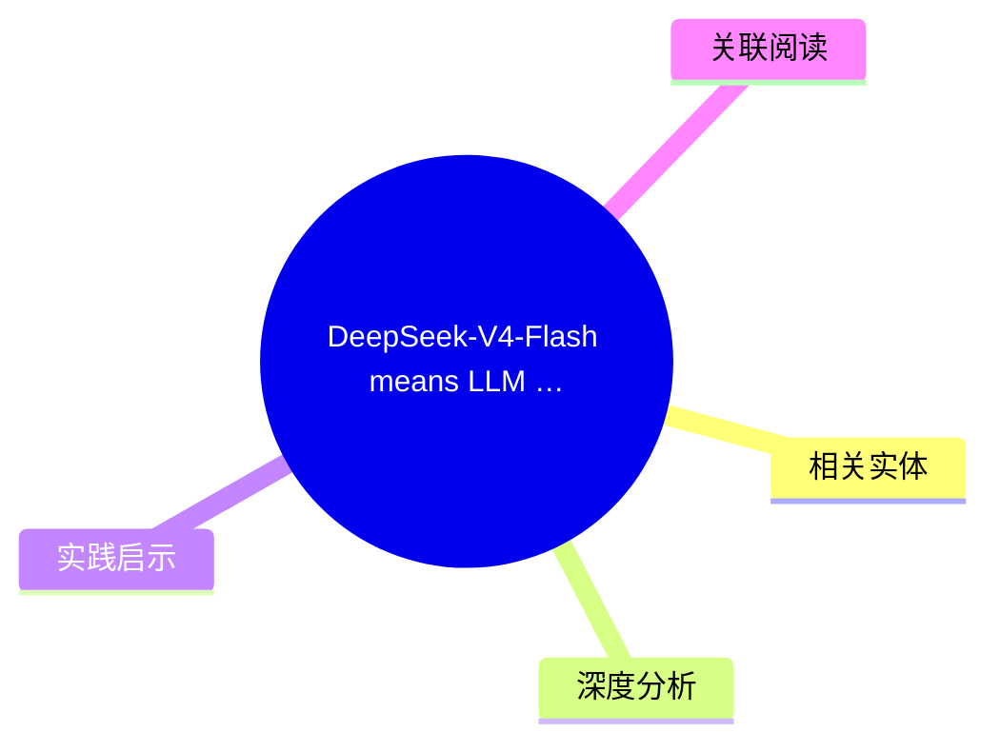
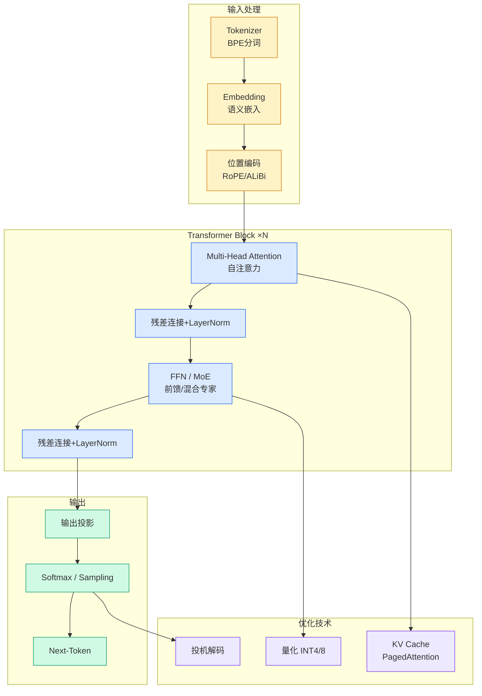

# DeepSeek-V4-Flash means LLM steering is interesting again

## Ch01.1085 DeepSeek-V4-Flash means LLM steering is interesting again

> 📊 Level ⭐⭐ | 3.8KB | `entities/deepseek-v4-flash-means-llm-steering-is-interesting-again.md`

## 概念导图

## 核心要点
- 评分：v=7 × c=8 = 56
- Well-structured technical article explaining steering vectors with good clarity and logical flow. Demonstrates solid understanding of both naive and sophisticated steering approaches, referencing rele
## 相关实体

- [Llm Steering Behavior Guidance](ch01/538-llm-steering.html)
- [Wetesteddeepseekv4Proandflashagainstclau](ch01/1091-deepseek.html)
- [Wetesteddeepseekv4Proandflashagainstclau](ch01/1091-deepseek.html)
- [Deepseek V4 Flash Pro 通往百万级上下文与万亿参数推理的新纪元 V2](ch01/1073-deepseek-v4-flash-pro.html)
- [Deepseek V4 Pro Vs Claude](ch01/1151-deepseek-v4.html)

→ [原文存档](https://github.com/QianJinGuo/wiki-book/tree/main/docs/raw/articles/deepseek-v4-flash-means-llm-steering-is-interesting-again.md)

- [MOC](https://github.com/QianJinGuo/wiki/blob/main/moc/llm-core-technology.md)
## 深度分析
1. **Steering 的核心原理**：通过比较同一 prompt 在有无目标概念时的激活值差异，提取" steering vector"，在推理时注入以影响模型行为
2. **Steering 的"中产阶级"困境**：大型 AI 实验室直接训练模型，不需要这种"脑外科手术"式的干预；普通用户通过 API 调用，无法访问模型权重和激活值
3. **提示工程的局限**：当前模型已将"专家身份"等特征内化，传统提示方式失效；"智能"这类复杂概念的 Steering 向量可能与整个模型权重高度重叠，实际上不可行
4. **社区验证**：HN 评论指出 Steering 能在模型已训练好的行为上做到 prompting 做不到的事——最典型的就是消除 Refusal，且运行时注入比修改权重（LoRA）的能力损失更小
5. **开源基础设施正在成熟**：DwarfStar 4 将 Steering 作为一等公民嵌入，专为 DeepSeek-V4-Flash 优化，意味着本地模型的 Steering 工具链正在完善

## 实践启示
1. **用 DwarfStar 4 跑本地 Steering 实验**：不再受 API 限制，直接在模型激活层操作，对"Verbosity/Terseness"等简单概念尝试提取 steering vector
2. **构建 per-model Steering 库**：每当有新的热门开源模型发布，社区不仅做量化版本，也同步提取 boostable features 集合，形成可复用的 Steering 资产
3. **在本地知识库场景压缩上下文**：尝试将"熟悉我的代码库"这类长 token 序列概念提取为 Steering vector，从 working memory 转移到 implicit memory，减少 context window 占用
4. **用组合式 Steering 代替单一大向量**：复杂的概念（如"代码审查严格模式"）可能需要多个简单向量组合叠加，避免单一向量与整个模型权重高度重叠
5. **Steering 作为 Agent Harness 的条件开关**：在 Agent 系统中根据任务类型动态注入不同的 Steering 向量——例如 coding agent 注入"精确性"向量，闲聊 agent 注入"随和性"向量，无需重新加载模型

## 关联阅读

---

