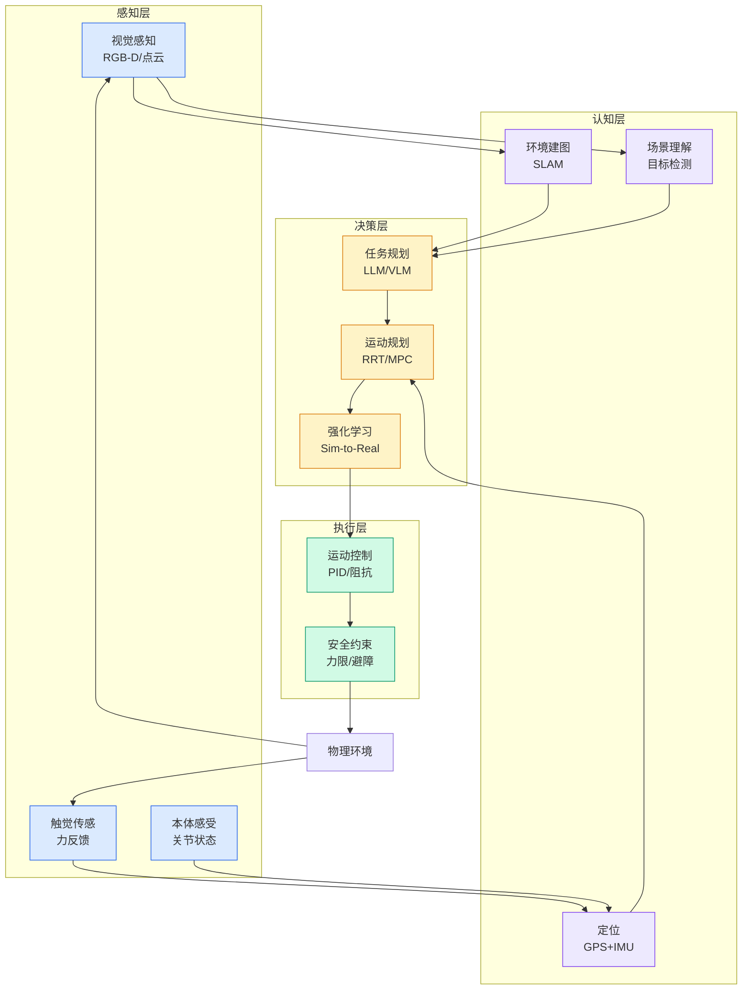

# 突破视觉仿真算力瓶颈！新一代具身智能仿真框架开源：高吞吐并行高保真渲染助力规模化训练

## Ch01.1090 突破视觉仿真算力瓶颈！新一代具身智能仿真框架开源：高吞吐并行高保真渲染助力规模化训练

> 📊 Level ⭐⭐ | 3.8KB | `entities/突破视觉仿真算力瓶颈新一代具身智能仿真框架开源高吞吐并行高保真渲染助力规模化训练.md`

# 突破视觉仿真算力瓶颈！新一代具身智能仿真框架开源：高吞吐并行高保真渲染助力规模化训练

**来源**: 量子位

**发布日期**: 2026-05-01

**原文链接**: https://mp.weixin.qq.com/s/fkW8hX3d_nLG0p_kacsKRQ

---

清华AIR DISCOVER Lab 投稿 量子位 | 公众号 QbitAI

具身人工智能领域，正向着以视觉为中心的感知范式，发生全面而深刻的转型。

作为机器人感知世界时信息密度最高、与自然人机交互最契合的模态，视觉是解锁通用机器人智能、实现仿真到真实无缝迁移的核心密钥。

但当研究者们试图沿着这条路径向前探索时，却始终需要在“看得真”和“训得快”之间做艰难取舍：

高保真视觉渲染带来了巨大计算与内存开销；人工建模总是耗时耗力低效循环；现有平台的兼容性缺陷不断限制着创新边界，严重束缚了具身智能研究的想象力。

为了攻克这些制约具身智能领域发展的核心难题， 清华大学智能产业研究院（AIR）DISCOVER Lab联合 谋先飞技术、原力灵机、 求之科技和地瓜机器人，提出了GS-Playground通用多模态仿真框架。

已关注
关注
重播
分享

赞

关闭
观看更多

更多

退出全屏

切换到竖屏全屏 退出全屏  量子位  已关注  分享视频  ，时长 02:40 

0 / 0

00:00
/
02:40
切换到横屏模式

继续播放

进度条，百分之0

播放
00:00
/
02:40
02:40

全屏
倍速播放中
0.5倍
0.75倍
1.0倍
1.5倍
2.0倍
超清
流畅

继续观看

突破视觉仿真算力瓶颈！新一代具身智能仿真框架开源：高吞吐并行高保真渲染助力规模化训练

观看更多
转载
,
突破视觉仿真算力瓶颈！新一代具身智能仿真框架开源：高吞吐并行高保真渲染助力规模化训练
量子位
已关注

分享

点赞

在看

已同步到看一看
写下你的评论

视频详情

作为一套专为视觉中心的机器人学习打造的新一代仿真基础设施，GS-Playground首次实现了高吞吐量并行物理仿真与高保真视觉渲染的深度融合，在保证物理仿真所需的高精度与强稳定性的同时，提供了大规模视觉驱动策略训练与仿真到现实迁移所需的渲染效率与环境支撑。

该成果已被机器人领域国际顶级学术会议RSS

---
## 关联

- 相关概念: [Harness Engineering](https://github.com/QianJinGuo/wiki/blob/main/concepts/harness-engineering-framework.md)

---

