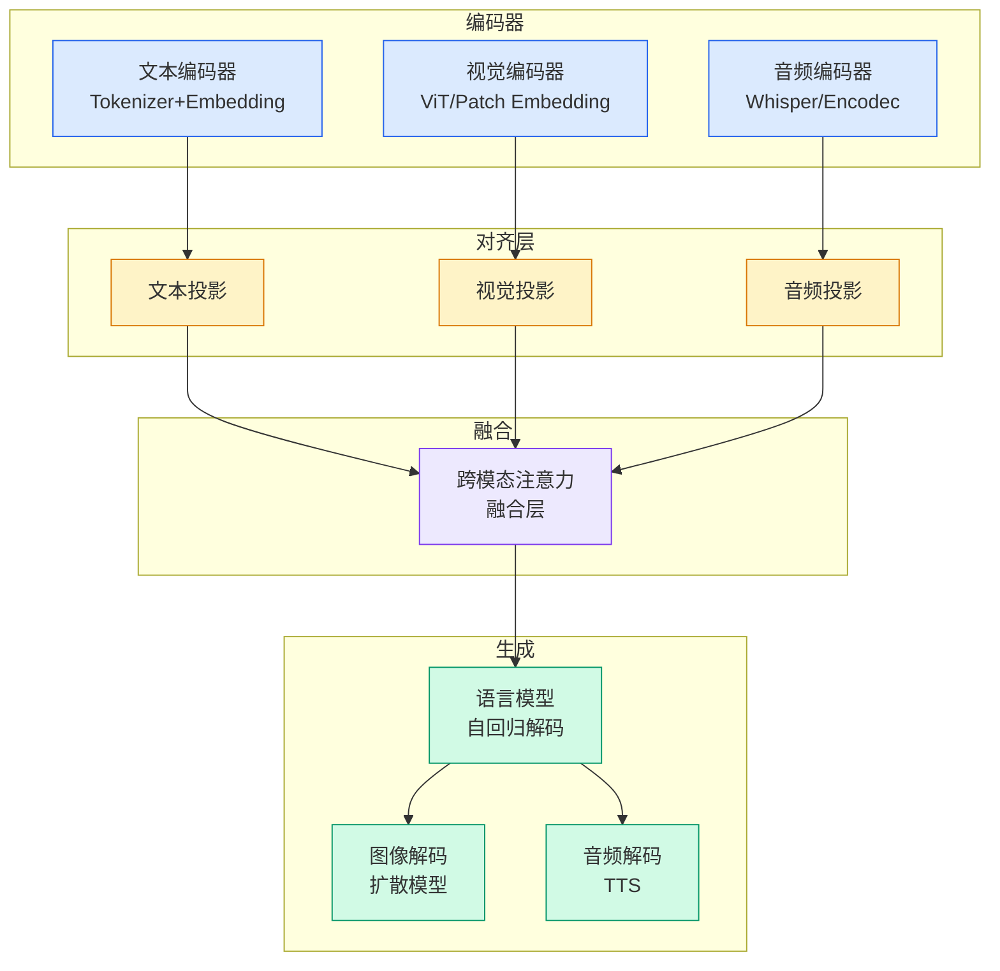

# DeepSeek视觉原语论文：当所有人在堆图像分辨率时，它在堆「指代精度」！

## Ch01.1091 DeepSeek视觉原语论文：当所有人在堆图像分辨率时，它在堆「指代精度」！

> 📊 Level ⭐⭐ | 3.8KB | `entities/deepseek视觉原语论文当所有人在堆图像分辨率时它在堆指代精度-v2.md`

# DeepSeek视觉原语论文：当所有人在堆图像分辨率时，它在堆「指代精度」！

→ [原文存档](https://github.com/QianJinGuo/wiki-book/tree/main/docs/raw/articles/deepseek视觉原语论文当所有人在堆图像分辨率时它在堆指代精度-v2.md)

## 深度分析

DeepSeek视觉原语论文：当所有人在堆图像分辨率时，它在堆「指代精度」！ 涉及agent领域的核心技术议题。
### 核心观点
1. #  DeepSeek视觉原语论文：当所有人在堆图像分辨率时，它在堆「指代精度」！
2. 原创  花叔  花叔   花叔 ;>)
__ _ _ _ _
在小说阅读器读本章
在小说阅读器中沉浸阅读
超长预警，这篇文章总字数9000+，预计阅读时长20分钟。
3. 如果你觉得太长读不下去的话，不用喊元宝了，这是最核心的四条总结：
1、DeepSeek今天（4月30日）发了多模态论文 Thinking with Visual Primitives，离 V4 论文整 6 天。
4. 核心是「视觉原语」：让模型一边推理一边输出坐标，把「点」和「边界框」当作思考的最小单元，相当于让 AI 一边想一边「用手指着图说话」
2、DeepSeek是七大 coding agent 玩家里最后一个把视觉接入主力产品的旗舰（OpenAI、Anthropic、Qwen、Kimi、GLM 都比它早），但补课方式反共识：主流派在堆图像分辨率，DeepSeek 在堆指代精度
3、效率夸张到离谱。
5. 一张 800×800 图，Claude-Sonnet-4.

### 内容结构
- DeepSeek视觉原语论文：当所有人在堆图像分辨率时，它在堆「指代精度」！
- DeepSeek视觉原语论文：当所有人在堆图像分辨率时，它在堆「指代精度」！
- 6天前的预言兑现了
- 为什么 coding agent 必须有视觉
- 主流派在解决「看得清」，DeepSeek 在解决「指得准」
- 视觉原语：让模型一边推理一边「用手指」
- 不堆 token 数，堆指代精度
- 怎么压到这么少的

### 技术要点

- **agent架构**: 本文在agent方向提出的设计理念与实现路径
- **工程挑战**: 实际落地中面临的关键问题与应对策略
- **architecture趋势**: 相关技术演进方向与新兴范式
### 关联实体

- [Scale Robot Reinforcement Learning With Nvidia Isaac Lab On ](ch01/1170-scale-robot-reinforcement-learning-with-nvidia-isaac-lab-on.html)
- [Nvidia Isaac Lab Sagemaker Robot Rl Humanoid](https://github.com/QianJinGuo/wiki/blob/main/entities/nvidia-isaac-lab-sagemaker-robot-rl-humanoid.md)
- [Openclaw 完全指南这可能是全网最新最全的系统化教程了32W字建议收藏 V2](../ch11/235-openclaw.html)
- [Openclaw 完全指南这可能是全网最新最全的系统化教程了32W字建议收藏](../ch11/235-openclaw.html)
- [Ethan He Cosmos Grok Imagine Latent Space Video Agent 20260606](../ch03/035-agent.html)
- [龙虾装上了可以用来干啥分享下我的 Openclaw 多智能体团队搭建经验 V2](../ch11/235-openclaw.html)

## 实践启示

1. **工程落地**: agent领域方案需关注可观测性、可维护性和成本效率
2. **技术选型**: 根据场景选择合适的技术栈，避免过度设计或盲目追新
3. **持续迭代**: 建立数据驱动的反馈闭环，持续优化系统表现
4. **风险管控**: 引入新技术需评估对现有系统稳定性的影响，做好降级预案

## 相关实体

- [MOC](https://github.com/QianJinGuo/wiki/blob/main/moc/observability-monitoring.md)

---

