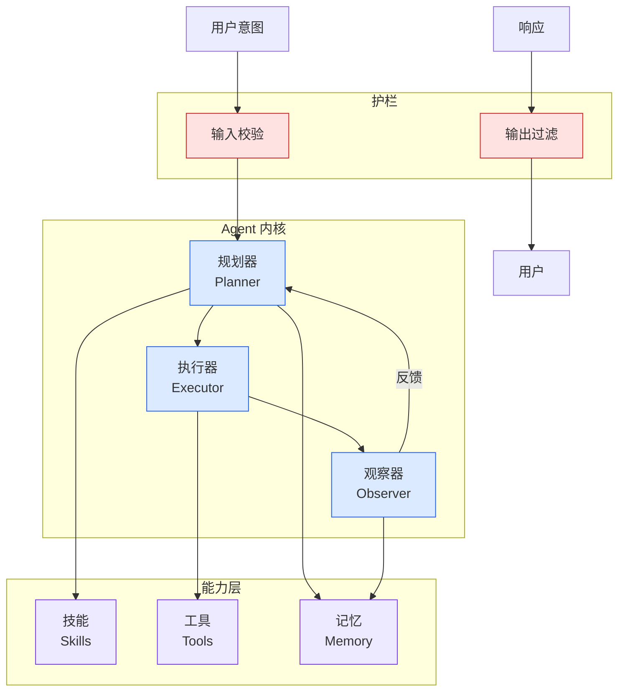

# 从手动到自动化：用AgentEval构建Agent评测体系

## Ch01.1096 从手动到自动化：用AgentEval构建Agent评测体系

> 📊 Level ⭐⭐ | 3.7KB | `entities/agent-eval-wallezhang-yaml-driven-agent-evaluation.md`

# 从手动到自动化：用AgentEval构建Agent评测体系

→ [原文存档](https://github.com/QianJinGuo/wiki-book/tree/main/docs/raw/articles/agent-eval-wallezhang-yaml-driven-agent-evaluation.md)

## 深度分析

从手动到自动化：用AgentEval构建Agent评测体系 涉及agent领域的核心技术议题。
### 核心观点
1. # 从手动到自动化：用AgentEval构建Agent评测体系
> 来源：WalleZhang，2026-03-21
> GitHub：https://github.
2. com/wallezhang/agent-eval | 官网：https://agent-eval.
3. space
## 核心问题

Claude/Agent 评测的核心痛点：
- **非确定性**：同一 prompt 跑两次结果可能不同
- **传播效应**：改一个词可能导致整个行为链路变化，且不可预测
- **上游波动**：模型本身升级，Agent 表现可能波动
传统测试金字塔（单元→集成→E2E）覆盖不了 Agent 的核心质量问题。
4. > "Teams without evals get bogged down in reactive loops — fixing one failure, creating another.
5. " — Anthropic
## pass@k 和 pass^k 指标
- **pass@k**：k 次里至少有一次通过的概率（能力上限）
- **pass^k**：k 次全部通过的概率（可靠性）
两者一起看才有意义。

### 内容结构
- 从手动到自动化：用AgentEval构建Agent评测体系
- 核心问题
- pass@k 和 pass^k 指标
- 评分器体系
- CI/CD 集成
- PR 合并前只跑核心用例
- 日常回归跑全量
- 安全审查单独跑

### 技术要点

- **agent架构**: 本文在agent方向提出的设计理念与实现路径
- **工程挑战**: 实际落地中面临的关键问题与应对策略
- **architecture趋势**: 相关技术演进方向与新兴范式
### 关联实体

- [Karpathy 最新访谈从 Vibe Coding 到 Agentic Engineering](../ch04/237-agentic.html)
- [Karpathy Vibe Coding Agentic Engineering](../ch04/126-karpathy-vibe-coding-agentic-engineering.html)
- [存之有序治之有矩Agent 记忆系统的工程实践与演进](../ch03/035-agent.html)
- [Openclaw 完全指南这可能是全网最新最全的系统化教程了32W字建议收藏](../ch11/235-openclaw.html)
- [两万字详解Claude Code源码核心机制](../ch03/078-claude-code.html)
- [你不知道的 Agent原理架构与工程实践 V2](../ch03/035-agent.html)

## 实践启示
1. **工程落地**: agent领域方案需关注可观测性、可维护性和成本效率
2. **技术选型**: 根据场景选择合适的技术栈，避免过度设计或盲目追新
3. **持续迭代**: 建立数据驱动的反馈闭环，持续优化系统表现
4. **风险管控**: 引入新技术需评估对现有系统稳定性的影响，做好降级预案

## 相关实体

- [MOC](https://github.com/QianJinGuo/wiki/blob/main/moc/evaluation-and-benchmarks.md)

---

