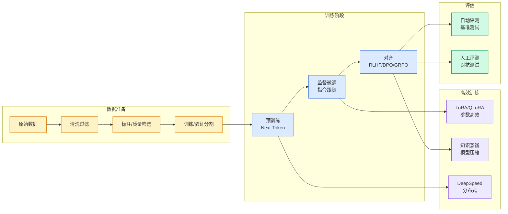

# Latest open artifacts (#20): New orgs! New types of models! With Nemotron Super, Sarvam, Cohere Transcribe, & others

## Ch01.1097 Latest open artifacts (#20): New orgs! New types of models! With Nemotron Super, Sarvam, Cohere Transcribe, & others

> 📊 Level ⭐⭐ | 3.7KB | `entities/latest-open-artifacts-20-new-orgs-new-types-of-models-with-n.md`

# Latest open artifacts (#20): New orgs! New types of models! With Nemotron Super, Sarvam, Cohere Transcribe, & others

## 相关实体

- [deepseek视觉原语论文：当所有人在堆图像分辨率时，它在堆「指代精度」！](ch01/1091-deepseek.html)
- [dynamically splitting wide partitions in cassandra for time](../ch11/026-dynamically-splitting-wide-partitions-in-cassandra-for-time.html)
- [interconnects ai p open and closed models are on different](../ch05/094-ai.html)
- [reducing container cold start times using soci index on dlam](ch01/1198-reducing-container-cold-start-times-using-soci-index-on-dlam.html)
- [state of routing in model serving](../ch11/193-state-of-routing-in-model-serving.html)
- [the distillation panic](ch01/642-the-distillation-panic.html)
- [sft, rl, and on-policy distillation through a distributional](https://github.com/QianJinGuo/wiki/blob/main/entities/untitled-v2.md)
- [直播预约 | 数据引擎：具身智能的下一个决胜局](https://github.com/QianJinGuo/wiki/blob/main/entities/直播预约-数据引擎具身智能的下一个决胜局.md)
→ [原文存档](https://github.com/QianJinGuo/wiki-book/tree/main/docs/raw/articles/latest-open-artifacts-20-new-orgs-new-types-of-models-with-n.md)

- [MOC](https://github.com/QianJinGuo/wiki/blob/main/moc/nvidia-gpu-acceleration.md)
## 深度分析

Latest open artifacts (#20): New orgs! New types of models! With Nemotron Super, Sarvam, Cohere Transcribe, & others 涉及agent领域的核心技术议题。
### 核心观点
1. # Latest open artifacts (#20): New orgs!
2. New types of models!
3. With Nemotron Super, Sarvam, Cohere Transcribe, & others
This Artifacts Log post is unusual in how many diverse, quirky models there are across use-cases and modalities.
4. Normally these model roundups are dominated by big models from the likes of Qwen, DeepSeek, Kimi, etc.
5. There are models for all sorts of different use-cases in this post, from optical character recognition (OCR), RAG search, audio transcription, computer-use, code-editing, math theorem proving, and more.

### 内容结构
- Artifacts Log
- **Our Picks**
- **Models**

### 技术要点

- **agent架构**: 本文在agent方向提出的设计理念与实现路径
- **工程挑战**: 实际落地中面临的关键问题与应对策略
- **architecture趋势**: 相关技术演进方向与新兴范式
### 关联实体

- [Scale Robot Reinforcement Learning With Nvidia Isaac Lab On ](ch01/1170-scale-robot-reinforcement-learning-with-nvidia-isaac-lab-on.html)
- [Nvidia Isaac Lab Sagemaker Robot Rl Humanoid](https://github.com/QianJinGuo/wiki/blob/main/entities/nvidia-isaac-lab-sagemaker-robot-rl-humanoid.md)
- [Openclaw 完全指南这可能是全网最新最全的系统化教程了32W字建议收藏](../ch11/235-openclaw.html)
- [Ethan He Cosmos Grok Imagine Latent Space Video Agent 20260606](../ch03/035-agent.html)
- [Openclaw 完全指南这可能是全网最新最全的系统化教程了32W字建议收藏 V2](../ch11/235-openclaw.html)
- [Karpathy 最新访谈从 Vibe Coding 到 Agentic Engineering](../ch04/237-agentic.html)

## 实践启示
1. **工程落地**: agent领域方案需关注可观测性、可维护性和成本效率
2. **技术选型**: 根据场景选择合适的技术栈，避免过度设计或盲目追新
3. **持续迭代**: 建立数据驱动的反馈闭环，持续优化系统表现
4. **风险管控**: 引入新技术需评估对现有系统稳定性的影响，做好降级预案

---

