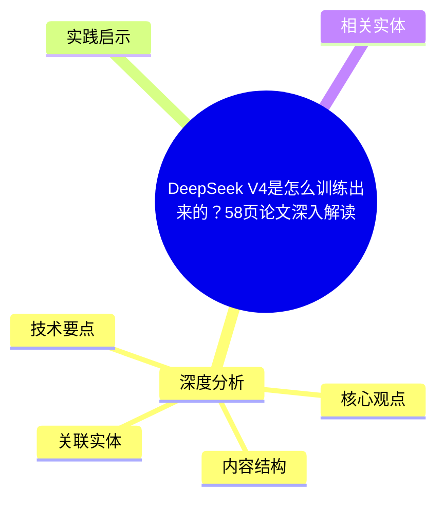
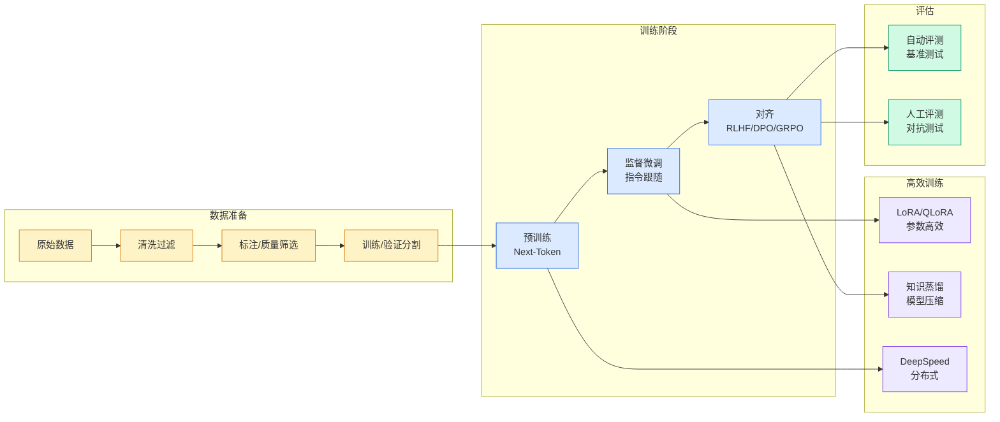

# DeepSeek V4是怎么训练出来的？58页论文深入解读

## Ch01.1102 DeepSeek V4是怎么训练出来的？58页论文深入解读

> 📊 Level ⭐⭐ | 3.7KB | `entities/deepseek-v4-training-58-page-paper-deep-dive.md`

# DeepSeek V4是怎么训练出来的？58页论文深入解读

→ [原文存档](https://github.com/QianJinGuo/wiki-book/tree/main/docs/raw/articles/deepseek-v4-training-58-page-paper-deep-dive.md)

## 概念导图

## 深度分析

DeepSeek V4是怎么训练出来的？58页论文深入解读 涉及agent领域的核心技术议题。
### 核心观点
1. # DeepSeek V4是怎么训练出来的？
2. 58页论文深入解读
劝退提醒：  1、这是一篇很长很长的文章，会深入到DeepSeek V4论文中涉及到的各种细节，如果你不感兴趣，只是想知道模型跑分的话，没必要读  2、我也没那么好的技术能力，这是花了2000万Opus4.
3. 7 tokens读完内容，并做了73页PPT之后形成的理解  3、我多少对DeepSeek有些滤镜，我很喜欢这个公司的做派和风格，所以表达未必客观中立
如果这种情况下，你还愿意一起往下探的话，那我们开始吧！
4. 在我看来，DeepSeek不是一个冲破天花板的SOTA模型。
5. 它真正的价值是把百万上下文、Agent原生能力、能接受的价格这三件事第一次绑在了一起。

### 内容结构
- DeepSeek V4是怎么训练出来的？58页论文深入解读
- 再说结论
- V4-Pro 和 V4-Flash：两个定位不一样的模型
- 架构动了哪些刀
- mHC：给残差连接加一道只准收缩不准放大的护栏
- CSA + HCA：读一本800页的书，先翻目录再精读
- Muon：别每个旋钮单独调，整组一起掰
- 1.6T怎么训稳的：两个他们自己也不懂的trick

### 技术要点

- **agent架构**: 本文在agent方向提出的设计理念与实现路径
- **工程挑战**: 实际落地中面临的关键问题与应对策略
- **architecture趋势**: 相关技术演进方向与新兴范式
### 关联实体

- [Openclaw 完全指南这可能是全网最新最全的系统化教程了32W字建议收藏 V2](../ch11/235-openclaw.html)
- [Openclaw 完全指南这可能是全网最新最全的系统化教程了32W字建议收藏](../ch11/235-openclaw.html)
- [Karpathy 最新访谈从 Vibe Coding 到 Agentic Engineering](../ch04/237-agentic.html)
- [Ethan He Cosmos Grok Imagine Latent Space Video Agent 20260606](../ch03/035-agent.html)
- [Karpathy Vibe Coding Agentic Engineering](../ch04/126-karpathy-vibe-coding-agentic-engineering.html)
- [Agentops Operationalize Agentic Ai At Scale With Amazon Bedr](../ch04/299-agentops-operationalize-agentic-ai-at-scale-with-amazon-bed.html)

## 实践启示

1. **工程落地**: agent领域方案需关注可观测性、可维护性和成本效率
2. **技术选型**: 根据场景选择合适的技术栈，避免过度设计或盲目追新
3. **持续迭代**: 建立数据驱动的反馈闭环，持续优化系统表现
4. **风险管控**: 引入新技术需评估对现有系统稳定性的影响，做好降级预案

## 相关实体

- [MOC](https://github.com/QianJinGuo/wiki/blob/main/moc/llm-core-technology.md)

---

