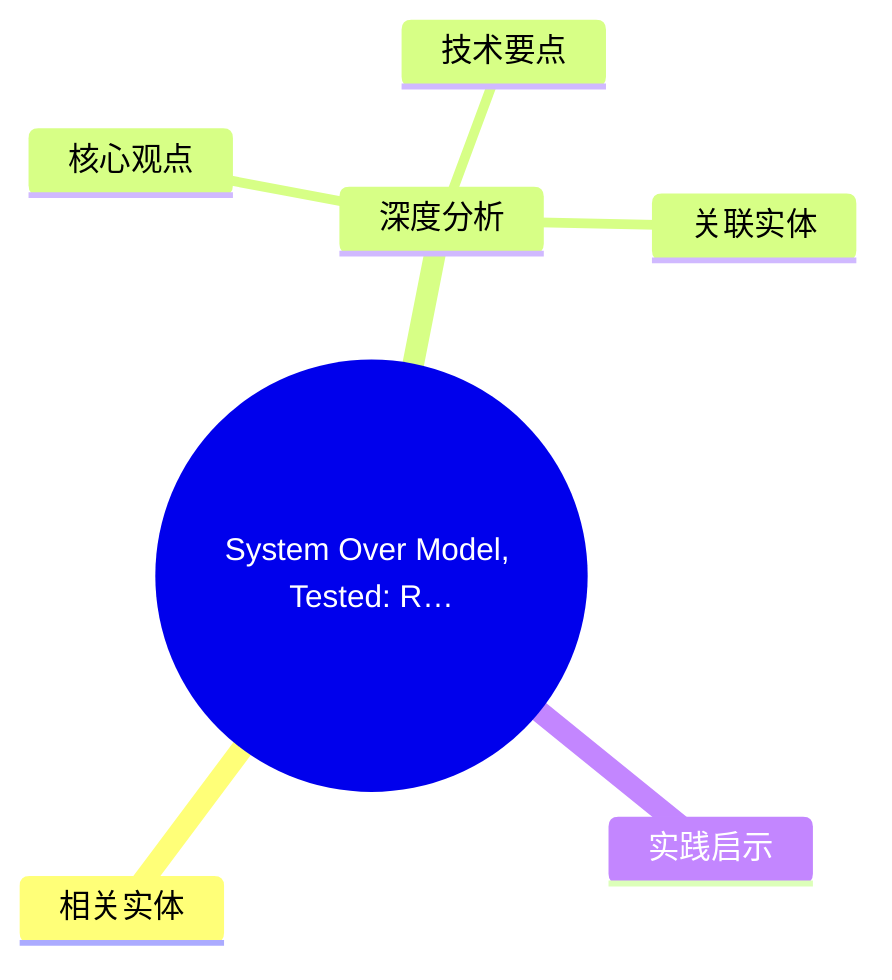
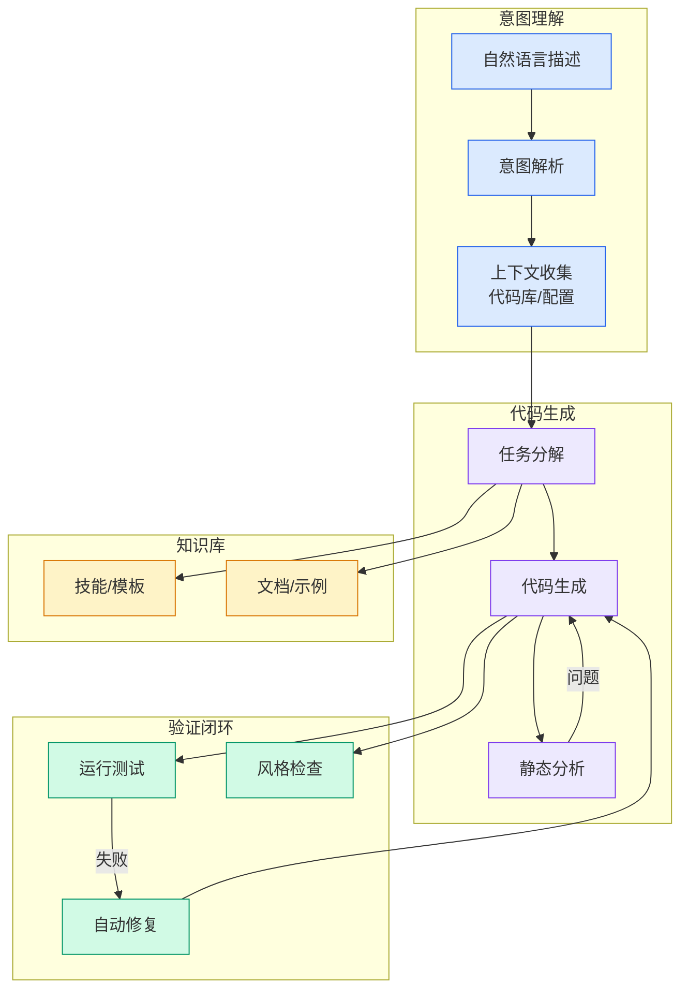

# System Over Model, Tested: Reproducing Mythos’s FreeBSD Find on Local Open-Weight Models

## Ch01.1106 System Over Model, Tested: Reproducing Mythos’s FreeBSD Find on Local Open-Weight Models

> 📊 Level ⭐⭐ | 3.7KB | `entities/system-over-model-tested-reproducing-mythoss-freebsd-find-on-20260606.md`

# System Over Model, Tested: Reproducing Mythos’s FreeBSD Find on Local Open-Weight Models

## 概念导图

## 相关实体
- [unexpected lessons from an ai-assisted prototyping experimen](../ch05/094-ai.html)
→ [原文存档](https://github.com/QianJinGuo/wiki-book/tree/main/docs/raw/articles/system-over-model-tested-reproducing-mythoss-freebsd-find-on-20260606.md)
- [ai gpus probably live longer than three years](../ch05/094-ai.html)
- [ddosing software delivery pipelines](ch01/913-20.html)

## 深度分析

System Over Model, Tested: Reproducing Mythos’s FreeBSD Find on Local Open-Weight Models 涉及article领域的核心技术议题。
### 核心观点
1. A week later, Stanislav Fort at AISLE published a counter-thesis and reproduced the same find with `gpt-5.
2. 4-nano` using their published `nano-analyzer` pipeline for under $100.
3. I wanted to see whether that reproduction works further down the cost curve.
4. So I ran the pipeline at full sub-system scope (~50 files) using two open-weight models, `openai/gpt-oss-20b` and `google/gemma-4-31b-it`.
5. Out of the box it looked like both missed.

### 技术要点

- **article架构**: 本文在article方向提出的设计理念与实现路径
- **工程挑战**: 实际落地中面临的关键问题与应对策略
- **code趋势**: 相关技术演进方向与新兴范式
### 关联实体

- [存之有序治之有矩Agent 记忆系统的工程实践与演进](../ch03/035-agent.html)
- [两万字详解Claude Code源码核心机制](../ch03/078-claude-code.html)
- [你不知道的 Agent原理架构与工程实践 V2](../ch03/035-agent.html)
- [龙虾装上了可以用来干啥分享下我的 Openclaw 多智能体团队搭建经验 V2](../ch11/235-openclaw.html)
- [Karpathy 最新访谈从 Vibe Coding 到 Agentic Engineering](../ch04/237-agentic.html)
- [Karpathy Vibe Coding Agentic Engineering](../ch04/126-karpathy-vibe-coding-agentic-engineering.html)

## 实践启示
1. **工程落地**: article领域方案需关注可观测性、可维护性和成本效率
2. **技术选型**: 根据场景选择合适的技术栈，避免过度设计或盲目追新
3. **持续迭代**: 建立数据驱动的反馈闭环，持续优化系统表现
4. **风险管控**: 引入新技术需评估对现有系统稳定性的影响，做好降级预案

---

