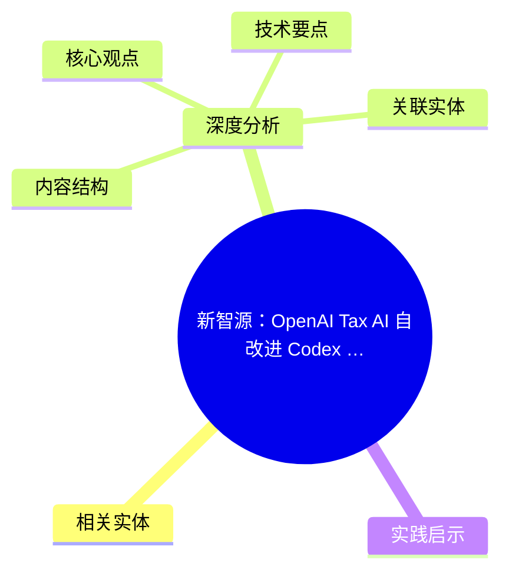
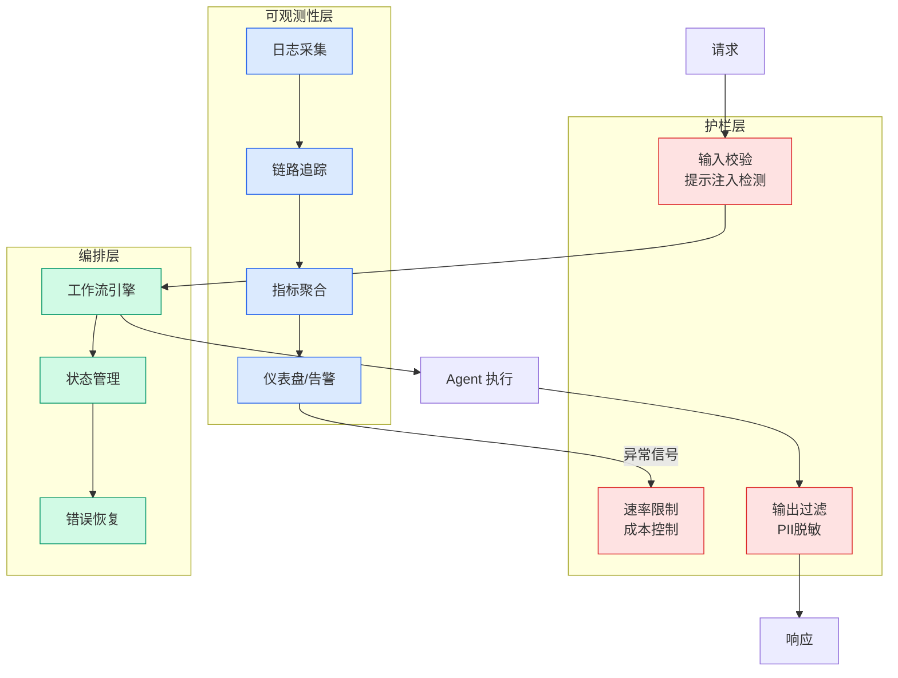

# 新智源：OpenAI Tax AI 自改进 Codex 评估循环

## Ch01.1107 新智源：OpenAI Tax AI 自改进 Codex 评估循环

> 📊 Level ⭐⭐ | 3.6KB | `entities/xinzhiyuan-openai-tax-ai-self-improving-codex-eval-loop-20260606.md`

# Xinzhiyuan Openai Tax Ai Self Improving Codex Eval Loop 20260606

## 概念导图

## 相关实体

- [claude skill 质检工具 skill craft](ch01/976-claude.html)
- [code intelligence – changelog](../ch04/497-code-intelligence-changelog.html)
- [opd revisiting failure modes simple fixes storm](ch01/1116-opd.html)
- [what i’ve been building: atom report, post-training course,](../ch05/094-ai.html)
→ [原文存档](https://github.com/QianJinGuo/wiki-book/tree/main/docs/raw/articles/xinzhiyuan-openai-tax-ai-self-improving-codex-eval-loop-20260606.md)

## 深度分析

Xinzhiyuan Openai Tax Ai Self Improving Codex Eval Loop 20260606 涉及agent领域的核心技术议题。
### 核心观点
1. 【新智元导读】
没人重训模型，没人重写代码，OpenAI的AI系统六周内自己把准确率从25%拉到86%。
2. Codex自己定位bug、写修复、跑测试，AI自我进化已在生产环境跑起来了。
3. 最近，OpenAI悄悄干了一件细思极恐的事。
4. 一个AI系统，没人重新训练模型，没人重写代码，六周内自己把准确率从25%拉到了86%。
5. 在官方博客中，OpenAI把「怎么让AI自己变强」的完整方法论，白纸黑字全写出来了。

### 内容结构
- 元信息

### 技术要点

- **agent架构**: 本文在agent方向提出的设计理念与实现路径
- **工程挑战**: 实际落地中面临的关键问题与应对策略
- **code趋势**: 相关技术演进方向与新兴范式
### 关联实体

- [Karpathy 最新访谈从 Vibe Coding 到 Agentic Engineering](../ch04/237-agentic.html)
- [Karpathy Vibe Coding Agentic Engineering](../ch04/126-karpathy-vibe-coding-agentic-engineering.html)
- [Openclaw 完全指南这可能是全网最新最全的系统化教程了32W字建议收藏](../ch11/235-openclaw.html)
- [Ethan He Cosmos Grok Imagine Latent Space Video Agent 20260606](../ch03/035-agent.html)
- [Agentops Operationalize Agentic Ai At Scale With Amazon Bedr](../ch04/299-agentops-operationalize-agentic-ai-at-scale-with-amazon-bed.html)
- [存之有序治之有矩Agent 记忆系统的工程实践与演进](../ch03/035-agent.html)

## 实践启示
1. **工程落地**: agent领域方案需关注可观测性、可维护性和成本效率
2. **技术选型**: 根据场景选择合适的技术栈，避免过度设计或盲目追新
3. **持续迭代**: 建立数据驱动的反馈闭环，持续优化系统表现
4. **风险管控**: 引入新技术需评估对现有系统稳定性的影响，做好降级预案

---

