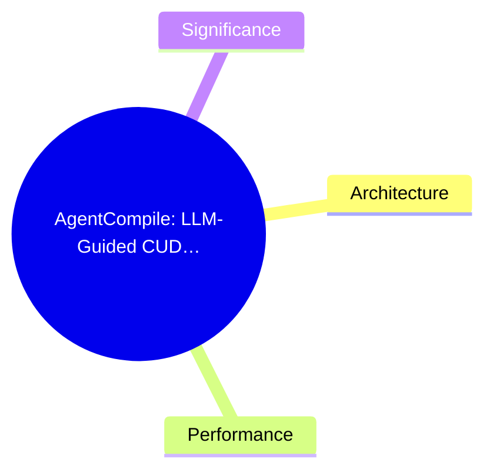
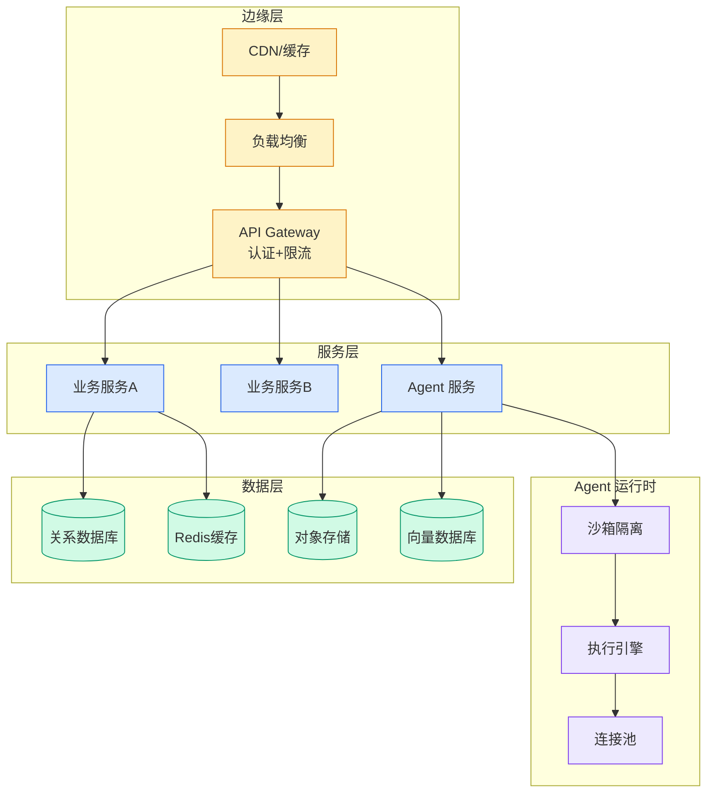

# AgentCompile: LLM-Guided CUDA Compiler for Transformer Inference

## Ch01.1112 AgentCompile: LLM-Guided CUDA Compiler for Transformer Inference

> 📊 Level ⭐⭐ | 3.6KB | `entities/agentcompile-llm-guided-cuda-compiler.md`

# AgentCompile: LLM-Guided CUDA Compiler

AgentCompile is an LLM-guided compilation framework for `Transformer` inference optimization, proposed by researchers at City University of Hong Kong. It places a large language model in the role of "compilation advisor" rather than code generator, achieving an average **5.66× CUDA inference speedup** over PyTorch eager mode.

## 概念导图

## Architecture

AgentCompile's core design principle is to keep the LLM strictly in a semantic decision-making role. The LLM suggests computation pattern recognition, candidate implementation priorities, and risk annotations — but the compiler always controls correctness-critical steps including candidate space construction, template generation, compilation, numerical validation, and fallback.

The pipeline consists of:
1. **Graph Capture** — Extracts the computation graph from PyTorch/HuggingFace models with tensor metadata (shape, dtype, layout, dependencies)
2. **Graph Analysis** — Identifies optimizable regions: GEMM, softmax, normalization, elementwise chains, reduction-pointwise patterns
3. **Planner** — Enumerates fusion strategies, scheduling schemes, memory policies, and parallel parameters within legal compiler constraints
4. **LLM Suggestion** — Receives structured region summaries and bounded candidate spaces; provides semantic labels, template preferences, and parameter risk hints
5. **CUDA Code Generation** — Uses deterministic templates for elementwise, reduction, softmax, LayerNorm/RMSNorm, GEMM, Tensor-Core GEMM, and GEMV kernels
6. **Verification** — Compilation filter, interface check, numerical comparison, structured tests, smoke tests, and end-to-end consistency checks
7. **Selection** — Chooses the fastest validated candidate by measured latency; falls back to original framework if no candidate passes

## Performance

On NVIDIA A800 SXM4 80GB GPUs, testing Qwen3-1.7B, Qwen3-4B, and Llama-3.2-1B-Instruct:

| Comparison | Qwen3-1.7B | Qwen3-4B | Llama-3.2-1B |
|---|---|---|---|
| vs PyTorch eager | 5.66× | 4.05× | 4.26× |
| vs torch.compile | 2.27× | 1.79× | 1.81× |

The framework is especially effective for autoregressive decoding where M=1 GEMV workloads benefit from dedicated kernel paths combined with CUDA Graph replay to reduce Python scheduling and kernel launch overhead.

## Significance

AgentCompile demonstrates a principled separation between LLM advisory capabilities and compiler verification. Rather than asking the LLM to write CUDA directly — which risks index errors, synchronization bugs, and memory violations — the system constrains the LLM's role to pattern recognition and prioritization while keeping all correctness guarantees in the compiler's deterministic pipeline. This "compiler advisor" paradigm points toward a broader `inference optimization` pattern where LLMs augment, rather than replace, traditional compilation systems.

→ [原文存档](https://github.com/QianJinGuo/wiki-book/tree/main/docs/raw/articles/agentcompile让大模型做编译参谋cuda推理平均加速566倍.md)

---

