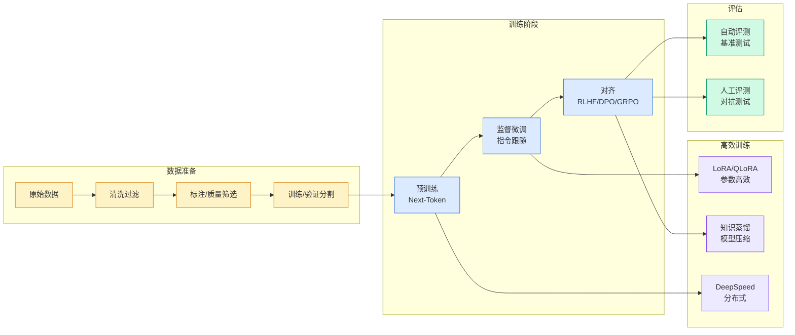

# 强化学习的进化：从PPO到MaxRL，LLM推理训练的算法演进史

## Ch01.1113 强化学习的进化：从PPO到MaxRL，LLM推理训练的算法演进史

> 📊 Level ⭐⭐ | 3.6KB | `entities/强化学习的进化从ppo到maxrlllm推理训练的算法演进史.md`

# 强化学习的进化：从PPO到MaxRL，LLM推理训练的算法演进史

**来源**: 机器之心

**发布日期**: 2026-05-01

**原文链接**: https://mp.weixin.qq.com/s/cUKD-Ke4yd-K1d-zGS1aZQ

---

机器之心编译

强化学习已成为 LLM 后训练技术栈中最重要的技术之一。它是促成 GPT-3 向 InstructGPT 转变的关键要素。此后，它也成为当前这波推理能力提升浪潮的核心。

第一代针对 LLM 的强化学习以 PPO为主导。该方法最初为雅达利游戏和机器人等传统强化学习场景开发，后来极其成功地适配到了 RLHF 中。

在提升推理能力这一目标的驱动下，第二代方法带来了新一轮的算法演进。短时间内涌现了大量变体。多数变体与前代方法只有微小差异，但这些差异却产生了深远的影响。

本文简明扼要地概述了 用于推理 LLM 的强化学习 （2024 至 2026 年）的主要进展。文章将从基础知识（REINFORCE 和 PPO）讲起，随后探讨 GRPO 及其后续的改进与优化方法。

- 原文地址：aweers.de/blog/2026/rl-for-llms/

- 作者：Alexander Weers

强化学习简介

在标准强化学习设定中， 智 能 体 观察 状态 s_t，根据 策略  选择 动作 a_t，再根据 环境动态  转移到新状态 s_{t+1}，并获得 奖励 r_t。

举个具体的例子，机器人在房间内导航：状态是其当前位置和传感器读数，动作是移动指令，状态转移的动力学由物理规律决定（如车轮可能会打滑），而奖励则反映了其向目标推进的程度。

这个循环会持续 T 个 时间步 。智能体的目标是最大化期望的折扣回报

其中 折扣因子  控制着未来奖励的折算程度。

其策略通常由参数 θ 表示。许多强化学习算法中的一个核心概念是 价值函数

它衡量了在策略 π 下处于状态 s 的好坏程度。由此，我们可以推导出 优势 ，用于评估某个具体动作比预期更好还是更差。

对于 LLM 而言，这个设定通常被大幅简化。我们有一个参数化的 模型 π_θ。给定数据集中采样的 提示词  ，模型会采样生成 回复  。然后我们会用一个标量 奖励 r(x, y) 来对其进行评分。目标函数变为：

人们依然可以对该环境进行
## 相关链接

- [LLM RL 算法演进](https://github.com/QianJinGuo/wiki/blob/main/concepts/llm-rl-algorithms-ppo-dpo-grpo-marl-evolution-2026.md)
- [RLVR 强化学习验证推理](https://github.com/QianJinGuo/wiki/blob/main/concepts/rlvr-reinforcement-learning-verified-reasoning.md)

---

