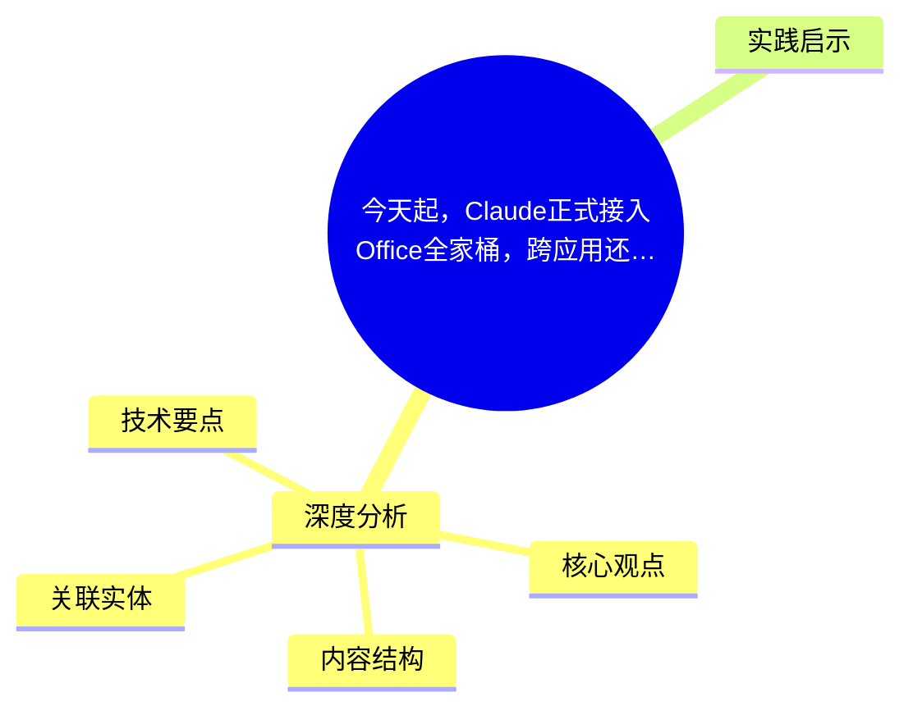
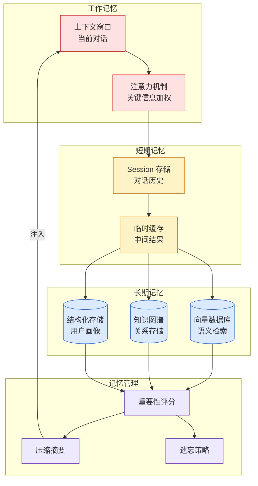

# 今天起，Claude正式接入Office全家桶，跨应用还能共享记忆

## Ch01.1117 今天起，Claude正式接入Office全家桶，跨应用还能共享记忆

> 📊 Level ⭐⭐ | 3.6KB | `entities/今天起claude正式接入office全家桶跨应用还能共享记忆.md`

# 今天起，Claude正式接入Office全家桶，跨应用还能共享记忆

→ [原文存档](https://github.com/QianJinGuo/wiki-book/tree/main/docs/raw/articles/今天起claude正式接入office全家桶跨应用还能共享记忆.md)

## 概念导图

## 深度分析

今天起，Claude正式接入Office全家桶，跨应用还能共享记忆 涉及claude领域的核心技术议题。
### 核心观点
1. # 今天起，Claude正式接入Office全家桶，跨应用还能共享记忆
机器之心编辑部
「每次 Claude 有更新的时候，现在大家就会疯狂刷这个梗。
2. 」
几乎每隔几天，Claude 就给用户带来惊喜。
3. 今天凌晨，Claude 官方宣布  正式接入微软 Excel、PowerPoint 和 Word，并在 Outlook 中开放了公测版  。
4. 无论你在微软的哪个应用中使用 Claude，它都能记住你之前的完整对话内容，跨应用操作更加顺畅。
5. 从此以后，用户可以直接在 Word 文档、Excel 表格、PPT 幻灯片或 Outlook 邮箱中调用 Claude，不需要切换到网页版操作了。

### 内容结构
- 今天起，Claude正式接入Office全家桶，跨应用还能共享记忆

### 技术要点

- **claude架构**: 本文在claude方向提出的设计理念与实现路径
- **工程挑战**: 实际落地中面临的关键问题与应对策略
- **data趋势**: 相关技术演进方向与新兴范式
### 关联实体

- [两万字详解Claude Code源码核心机制](../ch03/078-claude-code.html)
- [你不知道的 Agent原理架构与工程实践 V2](../ch03/035-agent.html)
- [龙虾装上了可以用来干啥分享下我的 Openclaw 多智能体团队搭建经验 V2](../ch11/235-openclaw.html)
- [Karpathy 最新访谈从 Vibe Coding 到 Agentic Engineering](../ch04/237-agentic.html)
- [深入理解 Claude Code 源码中的 Agent Harness 构建之道](../ch05/058-agent-harness.html)
- [Ethan He Cosmos Grok Imagine Latent Space Video Agent 20260606](../ch03/035-agent.html)

## 实践启示

1. **工程落地**: claude领域方案需关注可观测性、可维护性和成本效率
2. **技术选型**: 根据场景选择合适的技术栈，避免过度设计或盲目追新
3. **持续迭代**: 建立数据驱动的反馈闭环，持续优化系统表现
4. **风险管控**: 引入新技术需评估对现有系统稳定性的影响，做好降级预案

---

