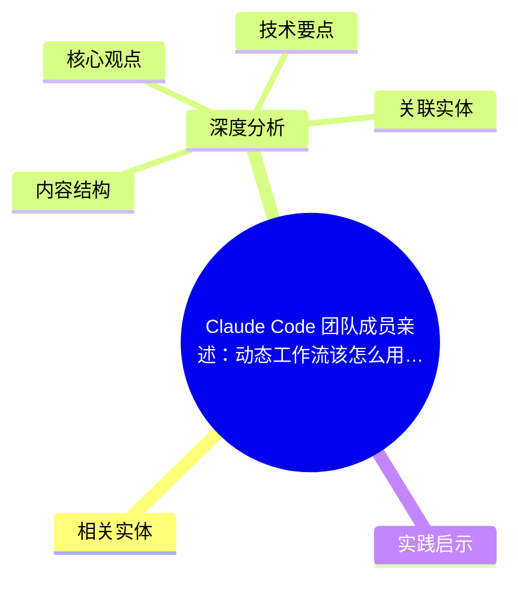
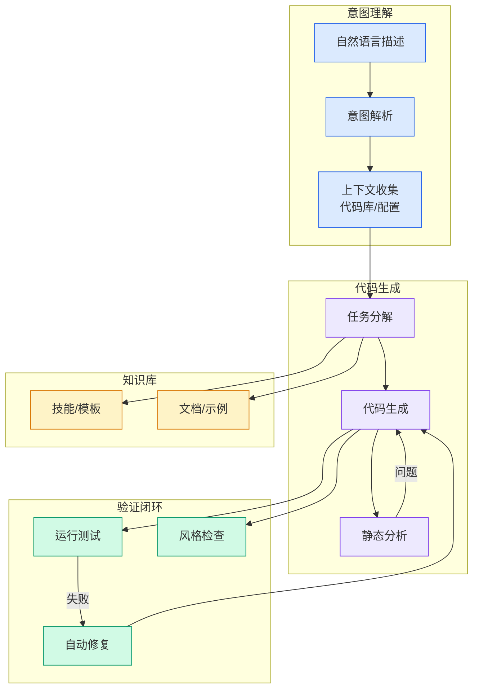

# Claude Code 团队成员亲述：动态工作流该怎么用（机器之心译本）

## Ch01.1118 Claude Code 团队成员亲述：动态工作流该怎么用（机器之心译本）

> 📊 Level ⭐⭐ | 3.6KB | `entities/claude-code-dynamic-workflows-jiqizhixin-9th-translation.md`

# Claude Code 团队成员亲述：动态工作流该怎么用（机器之心译本）

## 概念导图

## 相关实体

- [现在如何使用 ai：一份快速指南（ethan mollick）](../ch05/094-ai.html)
→ [原文存档](https://github.com/QianJinGuo/wiki-book/tree/main/docs/raw/articles/claude-code-dynamic-workflows-jiqizhixin-9th-translation.md)

- [MOC](https://github.com/QianJinGuo/wiki/blob/main/moc/memory-context-systems.md)
## 深度分析

Claude Code 团队成员亲述：动态工作流该怎么用（机器之心译本） 涉及agent领域的核心技术议题。
### 核心观点
1. # Claude Code 团队成员亲述：动态工作流该怎么用（机器之心译本）
> 原文作者：Thariq Shihipar（@trq212, Anthropic Claude Code 团队）
> 原文地址：https://x.
2. com/trq212/status/2061907337154367865
> 机器之心译本地址：https://mp.
3. com/s/YJFC1uk_dxsNQd3Jr7kOeA
> 发布时间：2026-06-05
> 机器之心导读：上周 Claude Code 发布了一个新能力"动态工作流"。
4. 该功能允许 Claude 根据具体任务即时编写定制化执行框架，协调多个子 Agent 并行工作，解决大规模、高并行、对抗性任务中的系统性失效问题。
5. 近日 Anthropic 工程师 Thariq 发了篇长文分享经验心得。

### 内容结构
- Claude Code 团队成员亲述：动态工作流该怎么用（机器之心译本）
- 译本特色
- 核心机制（一句话）
- 三大失败模式
- 六大常用模式
- 十大使用场景（机器之心版完整保留 Thariq 原文）
- Token 使用预算
- 保存与分享

### 技术要点

- **agent架构**: 本文在agent方向提出的设计理念与实现路径
- **工程挑战**: 实际落地中面临的关键问题与应对策略
- **claude趋势**: 相关技术演进方向与新兴范式
### 关联实体

- [两万字详解Claude Code源码核心机制](../ch03/078-claude-code.html)
- [你不知道的 Agent原理架构与工程实践 V2](../ch03/035-agent.html)
- [Karpathy 最新访谈从 Vibe Coding 到 Agentic Engineering](../ch04/237-agentic.html)
- [深入理解 Claude Code 源码中的 Agent Harness 构建之道](../ch05/058-agent-harness.html)
- [Karpathy Vibe Coding Agentic Engineering](../ch04/126-karpathy-vibe-coding-agentic-engineering.html)
- [龙虾装上了可以用来干啥分享下我的 Openclaw 多智能体团队搭建经验 V2](../ch11/235-openclaw.html)

## 实践启示
1. **工程落地**: agent领域方案需关注可观测性、可维护性和成本效率
2. **技术选型**: 根据场景选择合适的技术栈，避免过度设计或盲目追新
3. **持续迭代**: 建立数据驱动的反馈闭环，持续优化系统表现
4. **风险管控**: 引入新技术需评估对现有系统稳定性的影响，做好降级预案

---

