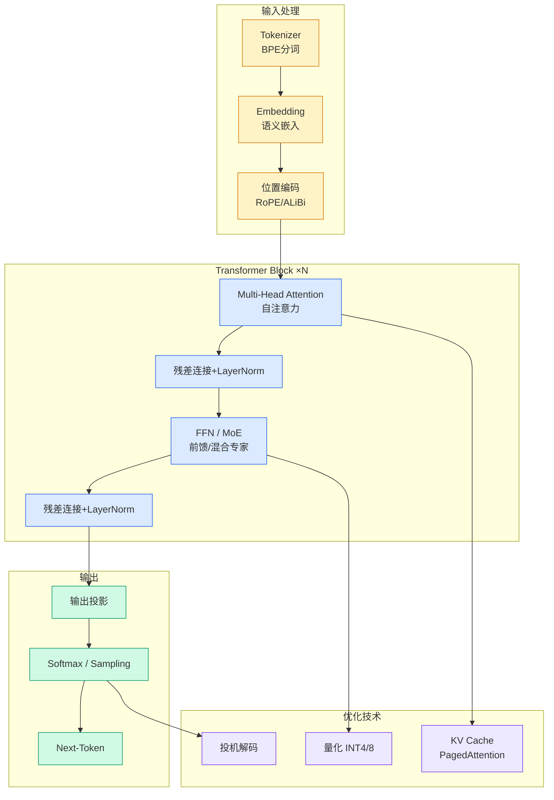

# LLM-as-a-Verifier: A General-Purpose Verification Framework

## Ch01.1120 LLM-as-a-Verifier: A General-Purpose Verification Framework

> 📊 Level ⭐⭐ | 3.6KB | `entities/llm-as-a-verifier-a-general-purpose-verification-framework.md`

> -> [原文存档](https://github.com/QianJinGuo/wiki-book/tree/main/docs/raw/articles/llm-as-a-verifier-a-general-purpose-verification-framework.md)

## 核心要点
- LLM-as-a-Verifier: A General-Purpose Verification Framework
- v×c=56 分
→ [原文存档](https://github.com/QianJinGuo/wiki-book/tree/main/docs/raw/articles/llm-as-a-verifier-a-general-purpose-verification-framework.md)

## 相关实体

- [LLM-as-a-Verifier: A General-Purpose Verification](ch01/1071-llm-as-a-verifier-a-general-purpose-verification.html)
- [LLM-as-a-Verifier: A General-Purpose Verification Framework](ch01/1274-llm.html)

- [MOC](https://github.com/QianJinGuo/wiki/blob/main/moc/llm-research-frontiers.md)
- [MOC](https://github.com/QianJinGuo/wiki/blob/main/moc/evaluation-and-benchmarks.md)
## 深度分析
LLM-as-a-Verifier 从根本上重新定义了 LLM-as-a-Judge 范式。传统方法将评分压缩为离散token（如1-8分），导致 27% 的平局率，无法区分复杂轨迹的细微差异。该框架通过三个维度实现细粒度反馈：
1. **评分粒度扩展**：将离散评分改为概率分布，利用 top-K logprobs 近似连续奖励
2. **重复验证集成**：通过 K 次独立验证的平均结果消除单次评分的噪声和偏差
3. **标准分解**：将轨迹验证分解为 Specification、Output、Errors 三个互补维度
核心公式 R(t,τ) = (1/CK) Σ p_θ(v_g|t,c,τ)·φ(v_g) 揭示了验证的本质——将离散的 tokenizer 空间映射为连续的奖励信号。在 Terminal-Bench 2.0 上实现 86.4% 成功率（SOTA），关键在于验证器作为 test-time scaling 的 reward model，能够在推理时选择最优轨迹而非依赖模型自身的生成质量。
研究团队来自 Stanford AI Lab、UC Berkeley Sky Computing Lab 和 NVIDIA，说明这是学术界与工业界在 agent 验证领域的联合突破。ForgeCode、Terminus-Kira、Terminus 2 三个不同 harness 均可从该方法中获益，证明了其 plug-and-play 的泛化能力。

## 实践启示
**对于 Agent 系统开发者：**

- 在构建生产级 agent 时，将验证器作为独立模块而非嵌入到生成模型中
- 利用 round-robin tournament 选择最优轨迹，特别适合多方案比较场景（如代码生成、任务规划）
- 标准分解策略（Spec/Output/Errors）可直接迁移到自定义 agent 的评估体系
**对于 test-time scaling 研究者：**

- 该框架验证了"验证优于生成"的 scaling 假设——在推理时投入计算资源用于轨迹选择比单纯增大模型更高效
- Gemini 2.5 Flash 作为 verifier 即超越 GPT-5.4 和 Claude Opus 4.6，说明 verifier 的选择比模型规模更重要
- 未来的 PRM（Process Reward Model）和 ORM（Outcome Reward Model）可在此框架下统一建模
**对于 AI infra 团队：**

- 78.9% pairwise verification accuracy 且零平局，意味着可以自动化大量人工 review 工作
- 代码已开源（GitHub: llm-as-a-verifier），可集成到现有 CI/CD 流程中做 code review agent 的质量评估
- 16 次重复验证仍能保持 7% 以上的准确率优势，说明该方法在计算成本上具有性价比
→ [原文存档](https://github.com/QianJinGuo/wiki-book/tree/main/docs/raw/articles/llm-as-a-verifier-a-general-purpose-verification-framework.md)

---

