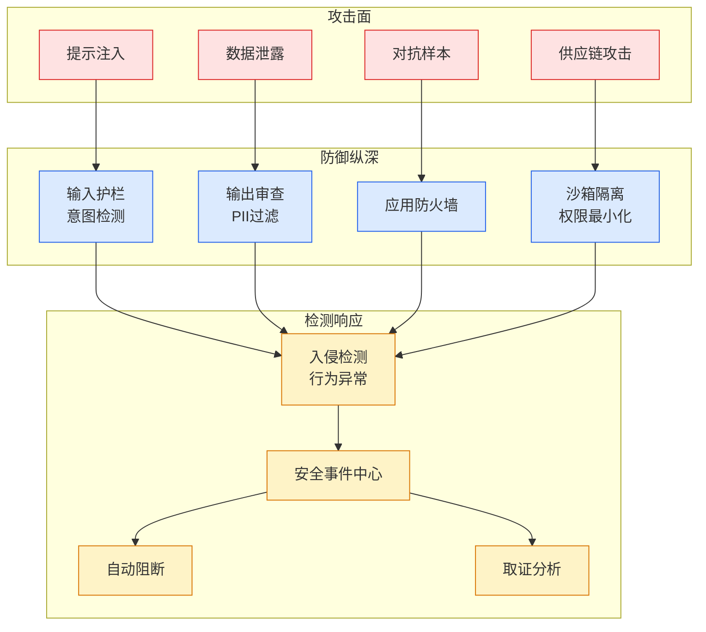

# 一文了解｜SkillScan 智能体技能安全扫描最佳实践

## Ch01.1123 一文了解｜SkillScan 智能体技能安全扫描最佳实践

> 📊 Level ⭐⭐ | 3.6KB | `entities/一文了解skillscan-智能体技能安全扫描最佳实践.md`

# 一文了解｜SkillScan 智能体技能安全扫描最佳实践

#  一文了解｜SkillScan 智能体技能安全扫描最佳实践

原创  火山引擎 AI 安全  火山引擎 AI 安全  [ 字节跳动技术团队 ](<javascript:void\(0\);>)

__ _ _ _ _

在小说阅读器读本章

去阅读

在小说阅读器中沉浸阅读

** 一、引言  **

随着 AI Agent 技能（Skills）生态的迅速发展，社区开发者贡献的技能数量与日俱增。然而，这些技能来源多样、质量参差不齐，其安全性缺乏有效保障。攻击者可能借机发布恶意技能，对用户设备进行攻击或窃取数据。SkillScan 作为面向智能体技能包的全链路安全检测方案，为技能生态提供全面的安全保障。

本文将从  ** 风险全景、检测能力、场景实践、接入方案、开发规范  ** 五个维度，全面梳理技能安全的核心挑战，详细阐述 SkillScan 的安全检测体系与保障方案，为业务接入与开发者提供完整的实践指南。

技能安全风险贯穿于技能包的整个生命周期，从文件结构、声明配置到代码实现，再到依赖管理和运行时行为，每个环节都可能存在安全隐患。SkillScan 将技能安全风险归纳为五大类，形成完整风险视图：

** 1.1 包体文件合规风险  **

** 风险描述：  ** 技能包通常以压缩包形式分发，解压后可能包含各种类型的文件。攻击者可能在包体内植入可执行二进制文件、硬编码密钥、超大文件、隐藏文件或恶意符号链接，构成基础安全隐患。此外，包体内容还可能存在涉政涉敏等内容安全风险。

* ** 攻击向量：  **

** ° 恶意文件植入：  ** 攻击者在技能包中植入可执行文件或二进制后门，在技能运行时触发恶意行为。

** ° 硬编码凭证：  ** 将 API Key、内网密码、Token 等敏感信息直接写入配置文件或代码中，一旦泄露可被攻击  者利用。

** ° 资源耗尽攻击：  ** 在包体中放置异常大的文件或高压缩比文件，导致解压或解析时发生拒绝服务。

** ° 目录穿越：  ** 恶意构造的压缩包成员路径包含  ../  等穿越字符，解压时可能覆盖系统关键文件。

* ** 潜在影响：  ** 本地文件包含漏洞、敏感信息泄露、系统资源耗尽、目录穿越导致的任意文件写入、内容合规风险。

*
## 相关链接

- [Agent 安全架构](https://github.com/QianJinGuo/wiki/blob/main/concepts/agent-security-architecture.md)
- [Skill 工程原则](https://github.com/QianJinGuo/wiki/blob/main/concepts/skill-engineering-principles.md)

---

