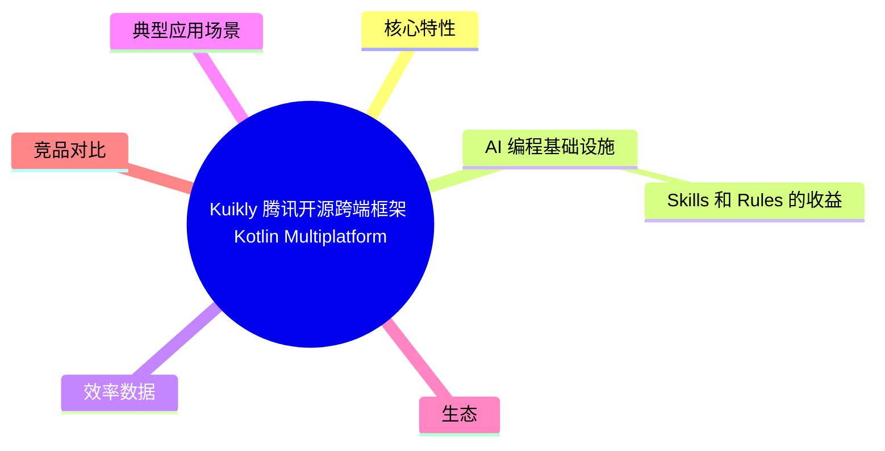
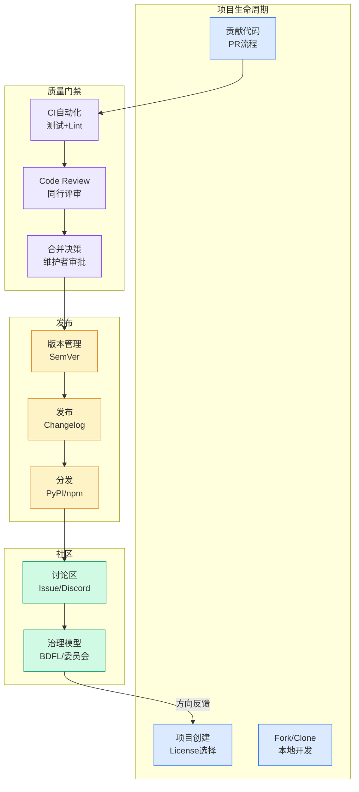

# Kuikly — 腾讯开源跨端框架（Kotlin Multiplatform）

## Ch01.1124 Kuikly — 腾讯开源跨端框架（Kotlin Multiplatform）

> 📊 Level ⭐⭐ | 3.6KB | `entities/kuikly-tencent-cross-platform-kotlin-multiplatform.md`

# Kuikly — 腾讯开源跨端框架（Kotlin Multiplatform）

> Kuikly 是腾讯开源的高性能跨端框架，基于 Kotlin Multiplatform 技术，覆盖 Android、iOS、HarmonyOS、H5、微信小程序、Mac 六大平台，支撑业务日活用户超 5 亿。


## 概念导图



## 核心特性

- **一码多端**：一套 Kotlin 代码覆盖 Android、iOS、HarmonyOS、H5、微信小程序、Mac
- **Kotlin Multiplatform 基座**：共享业务逻辑层，各端 native 桥接
- **Kuikly DSL**：专有声明式 UI 框架，类似 Compose 的响应式范式
- **Kuikly AI 编程支持**：通过 Skills 和 Rules 将框架知识注入 AI 模型，让 AI 像资深 Kuikly 开发者一样工作

## AI 编程基础设施




Kuikly AI 编程的核心是 **Skills 和 Rules** 机制:

```bash
npx skills add Tencent-TDS/KuiklyUI-AI/skills
```

安装后 AI 获得以下技能：
- `kuikly-expand-api` — 扩展原生 API / 自定义 Module（commonMain 接口定义 + 三端 native 桥接）
- `kuikly-ui-framework` — Kuikly DSL 页面结构和组件用法
- `kuikly-reactive-observer` — 响应式状态绑定（observable 数据绑定）

### Skills 和 Rules 的收益

1. **AI 知道什么时候不该写** — 调研后知道 KuiklyChatUI 的 AiMessageText 已覆盖 Markdown 渲染，不再重复造轮子
2. **自定义 Module 写得很地道** — 结构和官方 Module 如出一辙，无需人工纠正
3. **DSL 和响应式理解到位** — 用 observable 把数据和 UI 绑起来，贴合 Kuikly 范式
4. **知道如何调试** — 能自己加日志、用 logcat + adb 定位到 ImageAdapter 层的 content:// URI 问题

## 效率数据

| 方案 | 工时 | 倍数 |
|------|:----:|:----:|
| 传统三端原生（iOS + Android + 鸿蒙各一人） | 30 人天 | 1x |
| Kuikly 手写 | 7.5 人天 | 4x |
| AI + Kuikly | 7.5 小时 | ~32x |

数据来源：一次 28 轮对话、740 字自然语言、生成约 3500 行代码交付三端多模态 AI 聊天 App 的实测。

## 典型应用场景

- 跨端 AI 聊天应用（SSE 长连接、多模态图文理解、流式 Markdown）
- 企业内部工具（快速三端覆盖）
- 需要同时覆盖 Android + iOS + 鸿蒙的 C 端产品

## 生态

- GitHub 仓库：https://github.com/Tencent-TDS/KuiklyUI
- 腾讯端服务联盟（TDS）：https://tds.qq.com
- 已开源，社区组件丰富（KuiklyChatUI、KuiklyMarkdown、KuiklyAlbum、KuiklyCamera、KuiklySQLite、KuiklyWebview 等）

## 竞品对比

与 Flutter、React Native、Taro 等跨端框架相比，Kuikly 的核心差异化在于：
- **Kotlin 原生**：对 Android/鸿蒙开发者零学习成本
- **腾讯内部验证**：支撑日活超 5 亿的业务
- **AI 编程深度集成**：Skills 和 Rules 机制是框架级设计，非第三方插件

→ [原文存档](https://github.com/QianJinGuo/wiki-book/tree/main/docs/raw/articles/kuikly-ai-coding-28-rounds-7-hours-triple-platform.md)

---
## 关联
- 相关概念: [Harness Engineering](https://github.com/QianJinGuo/wiki/blob/main/concepts/harness-engineering-framework.md)

---

