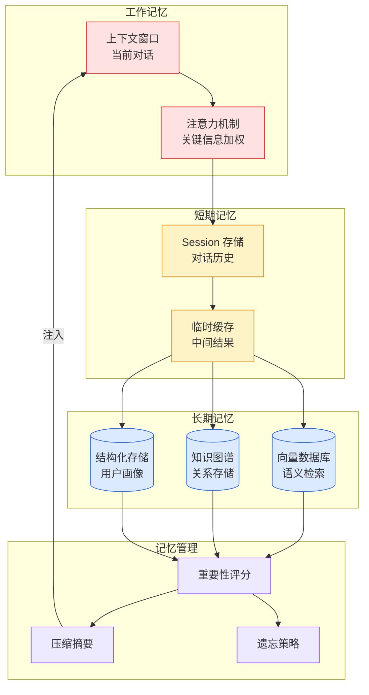

# ChatGPT 的'失忆症'终于被治好了！Dreaming V3 让大模型拥有长期记忆

## Ch01.1125 ChatGPT 的'失忆症'终于被治好了！Dreaming V3 让大模型拥有长期记忆

> 📊 Level ⭐⭐ | 3.6KB | `entities/chatgpt-dreaming-v3-long-term-memory-openai.md`

# ChatGPT 的'失忆症'终于被治好了！Dreaming V3 让大模型拥有长期记忆

→ [原文存档](https://github.com/QianJinGuo/wiki-book/tree/main/docs/raw/articles/chatgpt-dreaming-v3-long-term-memory-openai.md)

## 深度分析

ChatGPT 的'失忆症'终于被治好了！Dreaming V3 让大模型拥有长期记忆 涉及agent领域的核心技术议题。
### 核心观点
1. # ChatGPT 的"失忆症"终于被治好了！
2. Dreaming V3 让大模型拥有长期记忆
> 作者：大石（51CTO技术栈） · 发布：2026-06-05
> 北京时间 6 月 5 日凌晨，OpenAI 正式推出全新的记忆架构 **Dreaming V3**。
3. ChatGPT 终于有了真正意义上的长期记忆——一次架构级重构，把大模型从只有短期记忆的对话工具，往有长期记忆的个人助手方向推了一大步。
4. ## 一、记忆进化三步走
### 1.
5. 1 2024-04：保存记忆（V1）— 手写便签时代
**逻辑**：你明确告诉它记住什么，它写进一张便签，下次对话翻出来用。

### 内容结构
- ChatGPT 的"失忆症"终于被治好了！Dreaming V3 让大模型拥有长期记忆
- 一、记忆进化三步走
- 1.1 2024-04：保存记忆（V1）— 手写便签时代
- 1.2 2025-04：Dreaming V0 — 自动提取
- 1.3 2026-06-05：Dreaming V3 — 架构级重构
- 二、时效性修正 — 记忆系统最隐蔽的坑
- 2.1 经典失败案例
- 2.2 V3 时效性自动感知

### 技术要点

- **agent架构**: 本文在agent方向提出的设计理念与实现路径
- **工程挑战**: 实际落地中面临的关键问题与应对策略
- **architecture趋势**: 相关技术演进方向与新兴范式
### 关联实体

- [你不知道的 Agent原理架构与工程实践 V2](../ch03/035-agent.html)
- [Openclaw 完全指南这可能是全网最新最全的系统化教程了32W字建议收藏 V2](../ch11/235-openclaw.html)
- [Karpathy 最新访谈从 Vibe Coding 到 Agentic Engineering](../ch04/237-agentic.html)
- [Openclaw 完全指南这可能是全网最新最全的系统化教程了32W字建议收藏](../ch11/235-openclaw.html)
- [Ethan He Cosmos Grok Imagine Latent Space Video Agent 20260606](../ch03/035-agent.html)
- [一文带你弄懂 Ai 圈爆火的新概念Harness Engineering](../ch05/120-harness-engineering.html)

## 实践启示

1. **工程落地**: agent领域方案需关注可观测性、可维护性和成本效率
2. **技术选型**: 根据场景选择合适的技术栈，避免过度设计或盲目追新
3. **持续迭代**: 建立数据驱动的反馈闭环，持续优化系统表现
4. **风险管控**: 引入新技术需评估对现有系统稳定性的影响，做好降级预案

## 相关实体

- [MOC](https://github.com/QianJinGuo/wiki/blob/main/moc/memory-context-systems.md)

---

