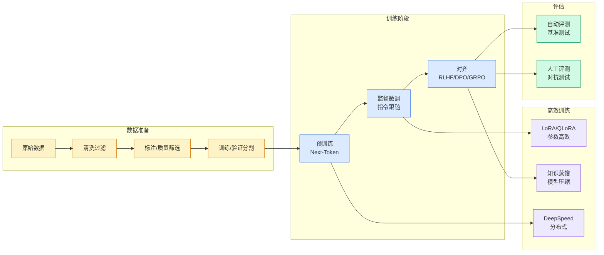

# SkillOpt：把 Agent 技能文档变成可训练对象

## Ch01.1126 SkillOpt：把 Agent 技能文档变成可训练对象

> 📊 Level ⭐⭐ | 3.6KB | `entities/skillopt-skill-document-training-microsoft-sjtu.md`

# SkillOpt：把 Agent 技能文档变成可训练对象

→ [原文存档](https://github.com/QianJinGuo/wiki-book/tree/main/docs/raw/articles/skillopt-skill-document-training-microsoft-sjtu.md)

## 深度分析

SkillOpt：把 Agent 技能文档变成可训练对象 涉及agent领域的核心技术议题。
### 核心观点
1. # SkillOpt：把 Agent 技能文档变成可训练对象
> 整理自 VibeCoder 团队对 SkillOpt 论文的中文报道
> 原文：https://mp.
2. com/s/l5ZtF-TPtttCtjyLiiGYUQ
> 论文：Microsoft × 上海交大 × 同济 × 复旦
> 推特点评：Rohan Paul「像训练小程序一样训练 agent 技能」
## 一句话定位

**SkillOpt = 冻结模型参数，把 agent 外部技能文档当作可训练对象，用验证集门控每一次编辑。
3. ** 部署阶段零额外模型调用（optimizer 只在训练阶段参与）。
4. > 类比：LoRA 冻结模型主体、只训练一个小参数适配层；**SkillOpt 冻结全部模型参数、只训练一份外挂 skill 文件** —— 社区直接称"LoRA for skills"。
5. ## 解决的工程盲区
三种主流 skill 生产方式，同一个问题：**没有验证机制**。

### 内容结构
- SkillOpt：把 Agent 技能文档变成可训练对象
- 一句话定位
- 解决的工程盲区
- 四步训练循环
- 实验规模
- 关键能力：迁移性
- 工程意义：Agent 时代的新型资产
- 局限性（距离生产标配的几步路）

### 技术要点

- **agent架构**: 本文在agent方向提出的设计理念与实现路径
- **工程挑战**: 实际落地中面临的关键问题与应对策略
- **code趋势**: 相关技术演进方向与新兴范式
### 关联实体

- [Karpathy 最新访谈从 Vibe Coding 到 Agentic Engineering](../ch04/237-agentic.html)
- [Ethan He Cosmos Grok Imagine Latent Space Video Agent 20260606](../ch03/035-agent.html)
- [Karpathy Vibe Coding Agentic Engineering](../ch04/126-karpathy-vibe-coding-agentic-engineering.html)
- [你不知道的 Agent原理架构与工程实践 V2](../ch03/035-agent.html)
- [龙虾装上了可以用来干啥分享下我的 Openclaw 多智能体团队搭建经验 V2](../ch11/235-openclaw.html)
- [Openclaw 完全指南这可能是全网最新最全的系统化教程了32W字建议收藏 V2](../ch11/235-openclaw.html)

## 实践启示
1. **工程落地**: agent领域方案需关注可观测性、可维护性和成本效率
2. **技术选型**: 根据场景选择合适的技术栈，避免过度设计或盲目追新
3. **持续迭代**: 建立数据驱动的反馈闭环，持续优化系统表现
4. **风险管控**: 引入新技术需评估对现有系统稳定性的影响，做好降级预案

---

