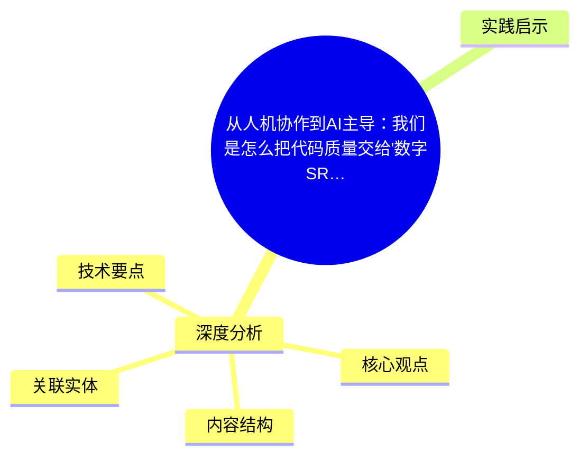
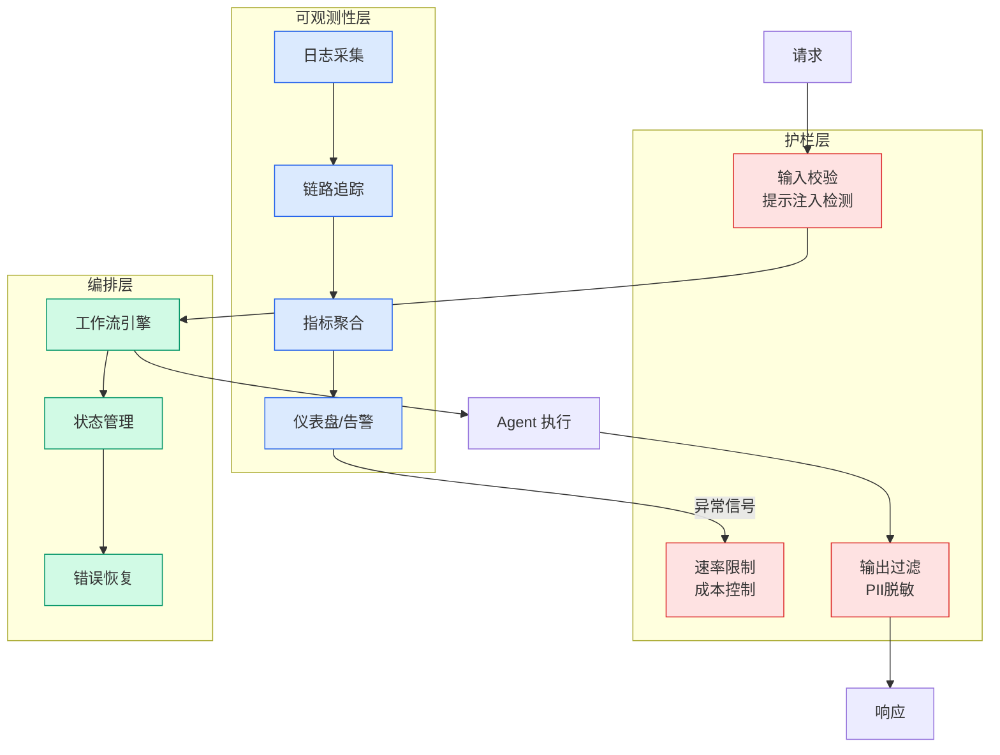

# 从人机协作到AI主导：我们是怎么把代码质量交给'数字SRE'的？

## Ch01.1127 从人机协作到AI主导：我们是怎么把代码质量交给'数字SRE'的？

> 📊 Level ⭐⭐ | 3.6KB | `entities/taobao-ai-sre-digital-employee-code-quality-governance.md`

# 从人机协作到AI主导：我们是怎么把代码质量交给'数字SRE'的？

→ [原文存档](https://github.com/QianJinGuo/wiki-book/tree/main/docs/raw/articles/taobao-ai-sre-digital-employee-code-quality-governance.md)

## 概念导图

## 深度分析

从人机协作到AI主导：我们是怎么把代码质量交给'数字SRE'的？ 涉及agent领域的核心技术议题。
### 核心观点
1. # 从人机协作到AI主导：我们是怎么把代码质量交给"数字SRE"的？
2. ## 背景：AI参与开发模式的四个阶段
1.
3. **AI初步介入**：答疑解惑，设计和决策完全由人主导
2.
4. **AI辅助开发**：IDE插件全流程辅助（Copilot、通义灵码）
3.
5. **AI协作开发**：AI-Native IDE + Agent模式（Cursor、Claude Code），多文件跨仓库编辑，任务自主拆解
4.

### 内容结构
- 从人机协作到AI主导：我们是怎么把代码质量交给"数字SRE"的？
- 背景：AI参与开发模式的四个阶段
- 问题背景：传统代码质量治理的三大挑战
- 方案：AI主导+人类兜底的治理体系
- 能力一：基于浏览器自动化的全局巡检与任务路由
- 能力二：端到端全自动修复
- 能力三：透明化闭环与人机协同修正
- 落地成效

### 技术要点

- **agent架构**: 本文在agent方向提出的设计理念与实现路径
- **工程挑战**: 实际落地中面临的关键问题与应对策略
- **code趋势**: 相关技术演进方向与新兴范式
### 关联实体

- [Karpathy 最新访谈从 Vibe Coding 到 Agentic Engineering](../ch04/237-agentic.html)
- [Karpathy Vibe Coding Agentic Engineering](../ch04/126-karpathy-vibe-coding-agentic-engineering.html)
- [两万字详解Claude Code源码核心机制](../ch03/078-claude-code.html)
- [你不知道的 Agent原理架构与工程实践 V2](../ch03/035-agent.html)
- [龙虾装上了可以用来干啥分享下我的 Openclaw 多智能体团队搭建经验 V2](../ch11/235-openclaw.html)
- [构建基于多智能体架构的深度思考交易系统 V2](https://github.com/QianJinGuo/wiki/blob/main/entities/构建基于多智能体架构的深度思考交易系统-v2.md)

## 实践启示

1. **工程落地**: agent领域方案需关注可观测性、可维护性和成本效率
2. **技术选型**: 根据场景选择合适的技术栈，避免过度设计或盲目追新
3. **持续迭代**: 建立数据驱动的反馈闭环，持续优化系统表现
4. **风险管控**: 引入新技术需评估对现有系统稳定性的影响，做好降级预案

---

