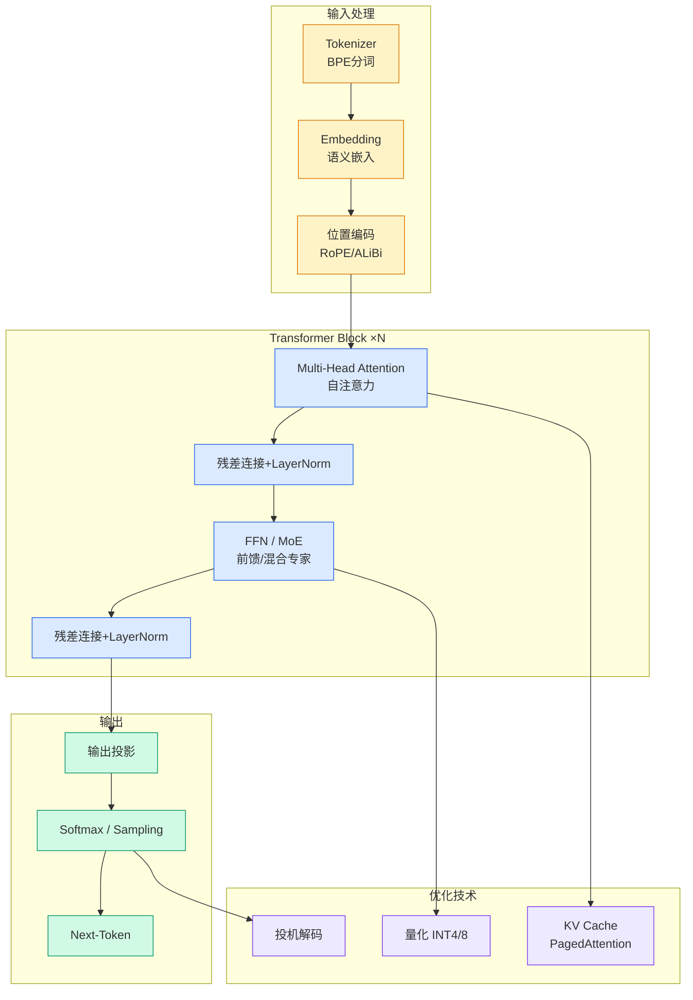

# 5亿视频炼出全球最大GUI开源数据集、推理Token省71%小模型反超大模型——小米AI团队多篇论文入选ICML 2026

## Ch01.1128 5亿视频炼出全球最大GUI开源数据集、推理Token省71%小模型反超大模型——小米AI团队多篇论文入选ICML 2026

> 📊 Level ⭐⭐ | 3.6KB | `entities/xiaomi-icml-2026-11papers-da769794d77c.md`

# 5亿视频炼出全球最大GUI开源数据集、推理Token省71%小模型反超大模型——小米AI团队多篇论文入选ICML 2026

→ [原文存档](https://github.com/QianJinGuo/wiki-book/tree/main/docs/raw/articles/xiaomi-icml-2026-11papers-da769794d77c.md)

## 深度分析

5亿视频炼出全球最大GUI开源数据集、推理Token省71%小模型反超大模型——小米AI团队多篇论文入选ICML 2026 涉及agent领域的核心技术议题。
### 核心观点
1. "元信息粗筛+视频内容细筛"两阶段流水线
2.
2. 从5亿条视频 → 420万条高质量教程
3.
3. Gemini-3-Pro 转为带任务指令、动作时间戳、屏幕坐标的结构化轨迹
**产出**：WildGUI — 全球最大开源 GUI 预训练数据集
- 1270万条轨迹
- 1.
4. 245亿张截图
- 覆盖1500+应用与网站、五大平台
**效果**：MiMo-VL-7B 预训练后，OSWorld-G 达67.
5. 6分（超越 Qwen3-VL-32B 与 Seed1.

### 内容结构
- 5亿视频炼出全球最大GUI开源数据集、推理Token省71%小模型反超大模型——小米AI团队多篇论文入选ICML 2026
- 01 GUI Agent
- Video2GUI：5亿视频→全球最大开源 GUI 数据集
- GUIEvalKit：GUI Agent 统一评测框架
- CoME：Channel-of-Mobile-Experts
- 02 推理增强
- LED：恢复 RL 训练后推理模型的探索多样性
- VeriTime：时序推理 Token 省71%

### 技术要点

- **agent架构**: 本文在agent方向提出的设计理念与实现路径
- **工程挑战**: 实际落地中面临的关键问题与应对策略
- **architecture趋势**: 相关技术演进方向与新兴范式
### 关联实体

- [Karpathy 最新访谈从 Vibe Coding 到 Agentic Engineering](../ch04/237-agentic.html)
- [Karpathy Vibe Coding Agentic Engineering](../ch04/126-karpathy-vibe-coding-agentic-engineering.html)
- [存之有序治之有矩Agent 记忆系统的工程实践与演进](../ch03/035-agent.html)
- [Scale Robot Reinforcement Learning With Nvidia Isaac Lab On ](ch01/1170-scale-robot-reinforcement-learning-with-nvidia-isaac-lab-on.html)
- [Nvidia Isaac Lab Sagemaker Robot Rl Humanoid](https://github.com/QianJinGuo/wiki/blob/main/entities/nvidia-isaac-lab-sagemaker-robot-rl-humanoid.md)
- [Openclaw 完全指南这可能是全网最新最全的系统化教程了32W字建议收藏](../ch11/235-openclaw.html)

## 实践启示

1. **工程落地**: agent领域方案需关注可观测性、可维护性和成本效率
2. **技术选型**: 根据场景选择合适的技术栈，避免过度设计或盲目追新
3. **持续迭代**: 建立数据驱动的反馈闭环，持续优化系统表现
4. **风险管控**: 引入新技术需评估对现有系统稳定性的影响，做好降级预案

---

