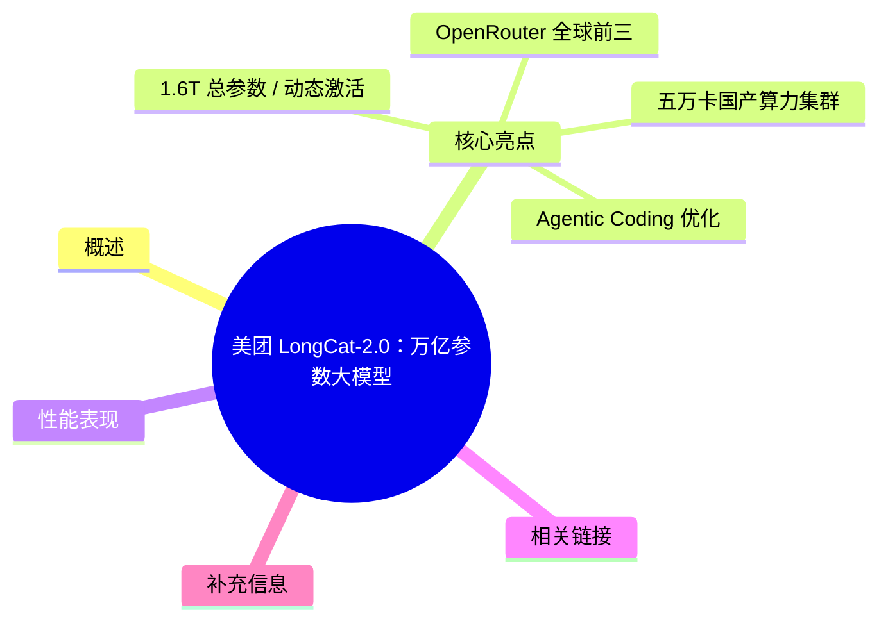
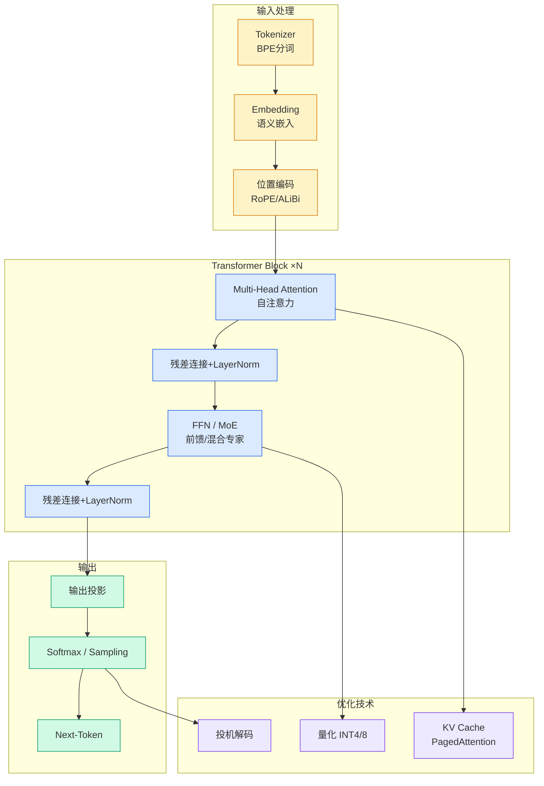

# 美团 LongCat-2.0：万亿参数大模型

## Ch01.1132 美团 LongCat-2.0：万亿参数大模型

> 📊 Level ⭐⭐ | 3.5KB | `entities/meituan-longcat-2-trillion-parameter.md`

# 美团 LongCat-2.0：万亿参数大模型

> **Background**：本文基于美团技术团队公众号报道 [Meituan Longcat 2 0 Official Release Wechat 2026](https://github.com/QianJinGuo/wiki-book/tree/main/docs/raw/articles/meituan-longcat-2-0-official-release-wechat-2026.md) 整理。美团于 2026 年 6 月 30 日正式发布新一代万亿参数大模型 LongCat-2.0，并对外开源。

## 概念导图

## 概述

美团 LongCat-2.0 是业界首个在 **五万卡国产算力集群**上完成全流程训练与推理的万亿参数模型，**总参数 1.6T**，平均激活约 48B（动态范围 33B~56B），从零开始预训练，原生支持 1M 超长上下文。

## 核心亮点

### 1.6T 总参数 / 动态激活
LongCat-2.0 采用 MoE 架构，总参数达 **1.6T**，通过零计算专家 + ScMoE 实现 token 级动态激活（33B~56B），简单 token 不消耗算力，复杂 token 自动获得更多计算资源。

### 五万卡国产算力集群
团队从 2023 年起从千卡起步，逐步攻克算子适配、通信优化、分布式稳定性等基础难题，最终在 **五万卡国产算力集群**上完成万亿参数模型的全流程训练与推理。预训练数据规模超过 30T tokens，稳态日吞吐超过 1T tokens/day。

### OpenRouter 全球前三
正式版发布前，LongCat-2.0 预览版本已通过 OpenRouter 平台面向全球开发者开放调用，截至目前已跻身 **OpenRouter 全球大模型调用量前三**。月调用量在 Hermes、Claude Code 和 OpenClaw 分列全球第一、第二和第三位，成为最受全球 Agent 开发者欢迎的模型之一。

### Agentic Coding 优化
LongCat-2.0 的架构设计围绕一个核心目标：让模型在真实的 **Agentic Coding 任务**中更高效、更稳定地完成代码理解、生成与执行。采用 LongCat Sparse Attention（LSA）稀疏注意力机制支持 1M 超长上下文，MOPD 多专家融合架构（Agent Experts + Reasoning Experts + Interaction Experts）。

### 开源
LongCat-2.0 正式对外开源，推动国产大模型生态发展。

## 性能表现

- **SWE-bench Pro**: 59.5（领先 Gemini 3.1 Pro、GPT-5.5、Claude Opus 4.6）
- **SWE-bench Multilingual**: 77.3（与 Claude Opus 4.6 持平）
- **Terminal-Bench 2.1**: 70.8（真实运维与开发终端任务）
- **RWSearch**: 78.8（搜索智能体评测）
- **FORTE**: 73.2（生产力场景评测）
- **BrowseComp**: 79.9（浏览能力评测）

## 相关链接

- API 平台：https://longcat.chat/platform/product
- 原文存档：→ [原文存档](https://github.com/QianJinGuo/wiki-book/tree/main/docs/raw/articles/meituan-longcat-2-0-official-release-wechat-2026.md)

## 补充信息

该文章还介绍了 LongCat-2.0 在真实工作场景中的应用，包括 AI SQL Agent 搭建、代码库迁移、完整应用开发等三个实战案例，展示其在企业级 Agent 落地中的实际效果。

---
## 关联
- 相关概念: [Harness Engineering](https://github.com/QianJinGuo/wiki/blob/main/concepts/harness-engineering-framework.md)
- 相关: [Agent 架构](https://github.com/QianJinGuo/wiki/blob/main/concepts/agent-architecture.md)

---

