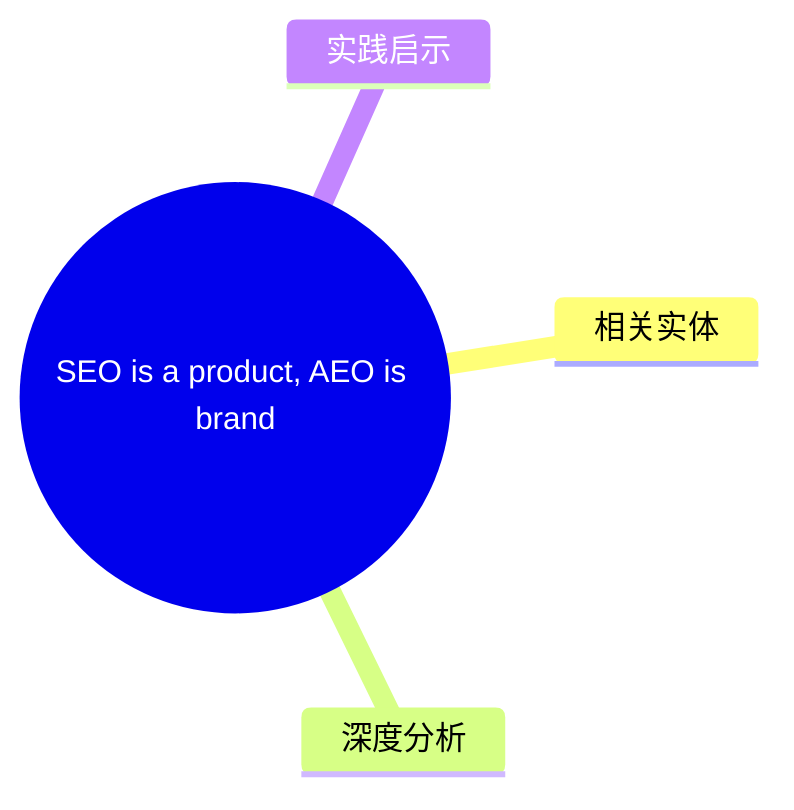
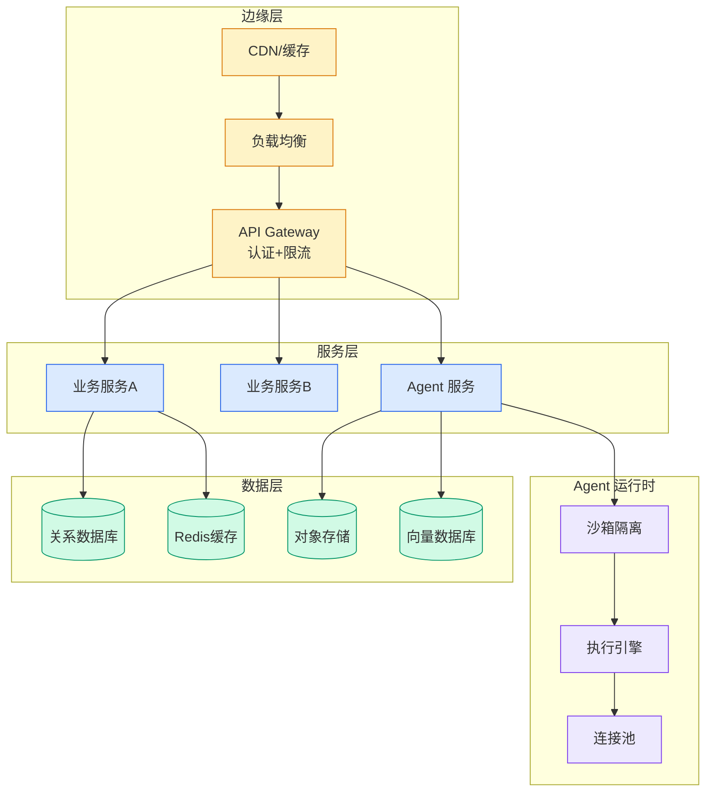

# SEO is a product, AEO is brand

## Ch01.1134 SEO is a product, AEO is brand

> 📊 Level ⭐⭐ | 3.5KB | `entities/p-seo-is-a-product-aeo-is-brand.md`

## 概念导图

## 核心要点
- ...
→ [原文存档](https://github.com/QianJinGuo/wiki-book/tree/main/docs/raw/articles/p-seo-is-a-product-aeo-is-brand.md)

## 相关实体

- [SEO is a product, AEO is brand](https://github.com/QianJinGuo/wiki/blob/main/entities/seo-product-aeo-brand-productledseo.md)

- [Spotify Logo Gets A Makeover Turns Into A Disco Ball](../ch03/129-spotify-logo-gets-a-makeover-turns-into-a-disco-ball.html)
## 深度分析
Eli Schwartz 的核心论点是"SEO is a product, AEO is brand"——这是一个组织结构和预算分配的问题，而非技术问题。
**SEO 作为产品的本质：** SEO manager 应该像 PM 一样运作，需要 cross-functional 的软技能而非技术实现能力。SEO 的问题从来不在于"怎么做"，而在于"谁能决定资源分配"。当 SEO 归市场部门时，它只能请求工程团队协助，而这些请求不是 requirements——这解释了为什么大多数 SEO 计划死在 committee 里。
**AEO 作为品牌的本质：** LLM 不依赖 meta tags 和 listicles，它像人类一样根据"整个互联网上对这个品牌的讨论"形成判断。两个 B2B 工具公司对比：一个技术基础好、内容好、外链购买充分；另一个创始人出席大会、定位被行业报告引用、高管被记者采访——后者在 LLM 中完胜，因为**品牌是集体共识，无法在自有网站上伪造**。
**预算政治：** 当前大多数组织从 SEO 预算支付 AEO 工具和咨询费，但 AEO 的真正驱动因素（PR、 partnerships、community events）属于品牌预算。如果不重新分配预算和责任，AEO 会同时毁掉 SEO 的资源基础和品牌团队的执行意愿。

## 实践启示
**对于 SEO 从业者：**

- 如果你在市场营销部门，你的首要任务不是学习 AEO 技术，而是争取成为独立的产品团队
- SEO 成功需要工程师直接参与，而非通过 ticket 请求——这是组织问题，技术方案解决不了
- 不要从 SEO 预算购买 AEO 工具，这只会同时伤害两个渠道
**对于品牌营销团队：**

- AEO 的 KPI 属于你们：品牌提及、行业引用、PR 覆盖、conference presence
- AEO 无法通过买外链或发 listicle 实现——它需要真正建立市场影响力，这没有捷径
- 资金充足的创业公司想在 AEO 垂直领域获胜基本不可能，因为金钱买不到 LLM 对品牌的认知
**对于 AEO/AI 搜索优化从业者：**

- 核心任务是"让 AI 知道你的品牌存在且被信任"，而非"优化你的网站让 AI 读取"
- Wikipedia、新闻报道、行业报告、社交媒体讨论都是 LLM 的训练信号——这些是 AEO 的"外链"
- Reddit spam 正在被 SEO 团队当作外链农场，但这样做是在教 LLM"这个品牌发 spam"，信号极难逆转
**对于 CEO/CXO：**

- 不要把 CEO 打开 ChatGPT 看到不利结果当作 SEO 团队的问题来交办——这是品牌问题
- 如果你想在 AI 搜索中获胜，预算需要流向 PR、events、partnerships，而非更多 SEO 工具订阅
- 重新分配 AEO 责任和预算时，需要同时转移，否则注定失败
→ [原文存档](https://github.com/QianJinGuo/wiki-book/tree/main/docs/raw/articles/p-seo-is-a-product-aeo-is-brand.md)

---

